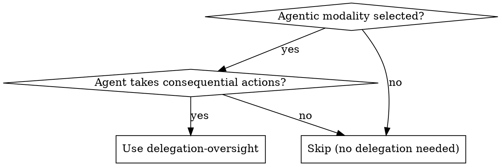

# Delegation & Oversight

## Overview

Design when agents ask vs. act, and how control transfers between human and AI.

**Core principle:** Systems that know when to ask, preserve context across handoffs, make oversight feel like partnership.

**Announce at start:** "I'm using the delegation-oversight skill to design handoff patterns."

## When to Use



## Five Capability Domains

### 1. Checkpoint Design
When should agent pause for input?

**Calibration problem:** Too frequent → approval fatigue. Too rare → missed catches.

**Principle:** Trigger on agent uncertainty, not fixed stages. If you pause, make it worth it.

### 2. Escalation Triggers
What conditions surface to human attention?

| Category | Example |
|----------|---------|
| Uncertainty | "Found conflicting information" |
| Stakes | Financial commitment, external communication |
| Policy ambiguity | Edge case not covered by preferences |
| Preference-sensitivity | Multiple valid approaches |
| Novelty | First encounter with task type |
| Conflict | Agent reasoning contradicts user intent |

### 3. Autonomy Gradients
How users configure oversight level.

**Start coarse:** "Check everything" / "Check important" / "Act autonomously"

**Learn from use:** When user overrides, treat as preference signal.

**Allow domain-specific:** "For calendar, act autonomously. For purchases over $X, always ask."

### 4. Context Preservation
What humans need when taking over mid-task.

**Handoff document:**
1. Current state (what's done)
2. Goal context (what we're achieving)
3. Decision point (why handoff)
4. Options (paths forward with tradeoffs)
5. Resumption path (how to return control)

### 5. Re-delegation
How human hands control back after intervention.

**Pattern:** User says "Continue from here" → Agent confirms understanding → Agent updates model from intervention.

## Output

Document delegation design in requirements:

```markdown
## Delegation Design

### Checkpoints
- [When agent pauses]

### Escalation Triggers
- [What surfaces to human]

### Default Autonomy
- [Starting oversight level]

### Handoff Content
- [What human sees when taking over]
```

## Integration

**Called by:** ux-design-agent (when agentic modality selected)

**Hands off to:**
- **approval-confirmation** - Design the approval UI itself
- **trust-calibration** - Confidence framing in communications
- **failure-choreography** - When handoff fails (timeout, rejection)

## Anti-Patterns

**Approval theater:** Checkpoints without context to evaluate.

**Autonomy cliff:** Binary full-control vs. full-autonomy with no middle.

**Context amnesia:** Agent forgets what happened during human intervention.

**Escalation flooding:** Every uncertainty triggers attention → users ignore all.

## References

- `references/foundations.md` - Research foundations
- `references/checkpoint-patterns.md` - Checkpoint calibration
- `references/escalation-taxonomy.md` - Category definitions
- `references/autonomy-gradients.md` - Configuration UX
- `references/handoff-protocols.md` - Context serialization
- `references/re-delegation.md` - Return-of-control patterns
- `references/adjacent-domains.md` - Lessons from other fields
