# Flowchart Diagram Guide

> **SKILL QUICK REF**: `flowchart LR|TB|BT|RL` • Shapes: `[]` `()` `{}` `[()]` `[()]` • Links: `-->` `---` `-.->` `==>` • Style: `classDef name fill:,stroke:` then `Node:::name`

## When to Use

- Process flows and decision trees
- System architecture diagrams
- Knowledge graphs (Cagle style with ELK + LR)
- Algorithm visualization
- Any node-and-edge relationship

## Overview

Flowcharts are the most versatile diagram type in Mermaid, used for visualizing processes, decision trees, algorithms, and semantic graphs. Kurt Cagle extensively uses flowcharts for RDF/knowledge graph visualization.

## Basic Syntax


## Flow Directions

| Direction | Meaning | Use Case |
|-----------|---------|----------|
| `TB` / `TD` | Top to Bottom | Hierarchies, org charts |
| `BT` | Bottom to Top | Dependency trees |
| `LR` | Left to Right | Processes, semantic graphs (Cagle's preference) |
| `RL` | Right to Left | Reverse flows |

### Cagle's Preference: LR for Semantic Graphs


This mirrors the Subject-Predicate-Object structure of RDF triples.

## ELK Layout Configuration

For complex diagrams, use the ELK (Eclipse Layout Kernel) renderer. ELK provides superior layout for knowledge graphs, complex architectures, and diagrams with many crossing edges.

### Basic ELK Usage


### Complete ELK Configuration


### ELK Configuration Options

| Option | Values | Default | Description |
|--------|--------|---------|-------------|
| `mergeEdges` | `true`, `false` | `false` | Merge multiple edges between same nodes |
| `nodePlacementStrategy` | See below | `BRANDES_KOEPF` | Algorithm for placing nodes |
| `cycleBreakingStrategy` | See below | `GREEDY` | How to handle cycles in graph |
| `forceNodeModelOrder` | `true`, `false` | `false` | Force node order from model |
| `considerModelOrder` | See below | `NONE` | How to consider model order |

#### Node Placement Strategies

| Strategy | Best For |
|----------|----------|
| `SIMPLE` | Basic layouts, fastest |
| `NETWORK_SIMPLEX` | Balanced node distribution |
| `LINEAR_SEGMENTS` | Minimizing edge bends |
| `BRANDES_KOEPF` | **Recommended** - Best balance of quality and speed |

#### Cycle Breaking Strategies

| Strategy | Description |
|----------|-------------|
| `GREEDY` | Fast heuristic approach |
| `GREEDY_MODEL_ORDER` | Respects model order when breaking cycles |
| `DEPTH_FIRST` | Depth-first traversal approach |
| `INTERACTIVE` | Preserves existing edge directions |

#### Consider Model Order Options

| Option | Effect |
|--------|--------|
| `NONE` | Ignore model order |
| `NODES_AND_EDGES` | Consider order for both nodes and edges |
| `NODES_ONLY` | Consider order for nodes only |

### Alternative Syntax (Init Directive)


## Node Shapes

### Standard Shapes


### Shape Reference Table

| Syntax | Shape | Use Case |
|--------|-------|----------|
| `[text]` | Rectangle | Standard process |
| `(text)` | Rounded Rectangle | Soft process |
| `([text])` | Stadium | Terminal/endpoint |
| `[[text]]` | Subroutine | Sub-process |
| `[(text)]` | Cylinder | Database |
| `((text))` | Circle | Connector |
| `{text}` | Diamond | Decision |
| `{{text}}` | Hexagon | Preparation |
| `[/text/]` | Parallelogram | Input/Output |
| `(((text)))` | Double Circle | Important node |

### Modern Shape Syntax (v11.3.0+)


## Link Types

### Arrow Styles


| Syntax | Description |
|--------|-------------|
| `-->` | Arrow |
| `---` | Open link |
| `-.->` | Dotted arrow |
| `==>` | Thick arrow |
| `--o` | Circle end |
| `--x` | Cross end |
| `<-->` | Bidirectional |
| `o--o` | Double circle |
| `x--x` | Double cross |

### Link Labels


### Link Length


More dashes = longer link (only affects rendering, not actual length control).

## Styling with classDef

### Basic Class Definition


### Cagle's Semantic Color Scheme

```mermaid
flowchart LR
    %% Kurt Cagle's entity type coloring
    classDef company fill:#90EE90,stroke:#000,stroke-width:2px
    classDef person fill:#ADD8E6,stroke:#000,stroke-width:2px
    classDef literal fill:#FFFACD,stroke:#000,stroke-width:2px
    classDef class fill:#DDA0DD,stroke:#000,stroke-width:2px

    SmallCo[SmallCo Inc]:::company
    Jane[Jane Doe]:::person
    Date[2024-01-15]:::literal

    SmallCo -->|employs| Jane
    Jane -->|joinDate| Date
```

### Applying Classes


## Subgraphs

### Basic Subgraph


### Nested Subgraphs


### Subgraph Direction


### Linking to Subgraphs


## Advanced Features

### HTML in Labels


### Markdown in Labels (v10.9.0+)

```mermaid
flowchart LR
    A["`**Bold** and *italic*`"]
    B["`Code: \`example\``"]
```

### Unicode Characters

```mermaid
flowchart LR
    A["🚀 Launch"]
    B["✅ Complete"]
    C["⚠️ Warning"]
    A --> B --> C
```



### Comments

```mermaid
flowchart LR
    %% This is a comment
    A --> B
    %% Comments can document namespace prefixes (Cagle technique)
    %% @prefix ex: <http://example.org/>
```

## Interaction (Click Events)

```mermaid
flowchart LR
    A[Node A]
    B[Node B]
    click A "https://example.com" "Open link"
    click B callback "Tooltip text"
    A --> B
```

## Knowledge Graph Pattern (Cagle Style)

```mermaid
---
config:
  layout: elk
---
flowchart LR
    %% Namespace declarations
    %% @prefix company: <http://example.org/company#>
    %% @prefix person: <http://example.org/person#>

    classDef company fill:#90EE90,stroke:#000,stroke-width:2px
    classDef person fill:#ADD8E6,stroke:#000,stroke-width:2px
    classDef literal fill:#FFFACD,stroke:#000,stroke-width:2px
    classDef property fill:#FFB6C1,stroke:#000,stroke-width:2px

    subgraph CompanyData["Company Knowledge Graph"]
        SmallCo["<b>Company</b>\nSmallCo Inc"]:::company
        Jane["<b>Person</b>\nJane Doe"]:::person
        John["<b>Person</b>\nJohn Smith"]:::person
        JoinDate1["2024-01-15"]:::literal
        JoinDate2["2023-06-20"]:::literal
    end

    SmallCo -->|employs| Jane
    SmallCo -->|employs| John
    Jane -->|joinDate| JoinDate1
    John -->|joinDate| JoinDate2
    Jane -->|reportsTo| John
```

## Styling Entire Diagram

```mermaid
%%{init: {
  "theme": "base",
  "themeVariables": {
    "primaryColor": "#e1f5fe",
    "primaryTextColor": "#01579b",
    "primaryBorderColor": "#0288d1",
    "lineColor": "#0288d1",
    "secondaryColor": "#f3e5f5",
    "tertiaryColor": "#fff3e0"
  }
}}%%
flowchart TD
    A[Step 1] --> B[Step 2]
    B --> C[Step 3]
    C --> D{Decision}
    D -->|Yes| E[End A]
    D -->|No| F[End B]
```

## Flowchart Configuration Options

### Complete Configuration Block

```mermaid
---
config:
  layout: elk
  flowchart:
    titleTopMargin: 25
    subGraphTitleMargin:
      top: 10
      bottom: 10
    diagramPadding: 8
    nodeSpacing: 50
    rankSpacing: 50
    curve: basis
    padding: 15
    wrappingWidth: 200
    htmlLabels: true
    useMaxWidth: true
---
flowchart LR
    A[Long text that will wrap based on wrappingWidth setting] --> B
```

### Configuration Options Reference

| Option | Type | Default | Description |
|--------|------|---------|-------------|
| `titleTopMargin` | number | 25 | Margin above diagram title |
| `subGraphTitleMargin` | object | `{top:0,bottom:0}` | Margins for subgraph titles |
| `diagramPadding` | number | 8 | Padding around entire diagram |
| `nodeSpacing` | number | 50 | Horizontal spacing between nodes |
| `rankSpacing` | number | 50 | Vertical spacing between ranks |
| `curve` | string | `basis` | Edge curve style (see below) |
| `padding` | number | 15 | Padding inside nodes |
| `wrappingWidth` | number | 200 | Max width before text wraps |
| `htmlLabels` | boolean | true | Allow HTML in labels |
| `useMaxWidth` | boolean | true | Use max width for diagram |
| `defaultRenderer` | string | `dagre` | Layout engine (`dagre` or `elk`) |

### Curve Types

Mermaid supports 12 different curve types for edges:

| Curve | Description | Best For |
|-------|-------------|----------|
| `basis` | Smooth B-spline curve | **Default** - General use |
| `bumpX` | Horizontal bump curve | Horizontal flows |
| `bumpY` | Vertical bump curve | Vertical flows |
| `cardinal` | Cardinal spline | Smooth flowing lines |
| `catmullRom` | Catmull-Rom spline | Natural-looking curves |
| `linear` | Straight lines with corners | Sharp, technical diagrams |
| `monotoneX` | Monotonic in X | Data visualization |
| `monotoneY` | Monotonic in Y | Data visualization |
| `natural` | Natural cubic spline | Organic-looking flows |
| `step` | Step function (midpoint) | State machines |
| `stepAfter` | Step function (after) | Timeline flows |
| `stepBefore` | Step function (before) | Decision trees |

### Curve Examples

```mermaid
%%{init: {"flowchart": {"curve": "linear"}} }%%
flowchart LR
    A --> B --> C
```

```mermaid
%%{init: {"flowchart": {"curve": "stepAfter"}} }%%
flowchart LR
    A --> B --> C
```

```mermaid
%%{init: {"flowchart": {"curve": "cardinal"}} }%%
flowchart LR
    A --> B --> C
```

---

## Best Practices

1. **Use ELK for complex graphs** - Especially for knowledge graphs with many relationships
2. **Color-code by entity type** - Use classDef consistently (Cagle technique)
3. **Prefer LR for semantic graphs** - Mirrors Subject-Predicate-Object structure
4. **Use subgraphs for logical grouping** - Improves readability
5. **Document namespaces in comments** - Preserves semantic context
6. **Keep labels concise** - Use tooltips for details
7. **Consistent stroke colors** - Black works universally
8. **Choose appropriate curve type** - `basis` for general, `step` for state machines
9. **Adjust spacing for readability** - Use `nodeSpacing` and `rankSpacing`

## Common Patterns

### Decision Tree
```mermaid
flowchart TD
    A[Start] --> B{Condition 1?}
    B -->|Yes| C{Condition 2?}
    B -->|No| D[Action B]
    C -->|Yes| E[Action A]
    C -->|No| F[Action C]
```

### Process Flow
```mermaid
flowchart LR
    A[Input] --> B[Process] --> C[Output]
    B --> D[(Store)]
```

### System Architecture
```mermaid
flowchart TB
    subgraph Client
        A[Browser]
        B[Mobile]
    end
    subgraph Server
        C[Load Balancer]
        D[API Gateway]
        E[Services]
    end
    subgraph Data
        F[(Database)]
        G[(Cache)]
    end
    Client --> C --> D --> E
    E --> F
    E --> G
```
