# Sequence Diagram Guide

> **SKILL QUICK REF**: `sequenceDiagram` • `participant A as Alias` • `actor U as User` • Messages: `->>` `-->>` `-)` `-x` • Blocks: `loop` `alt/else` `opt` `par/and` `critical`

## When to Use

- REST/GraphQL API request-response flows
- Microservice communication patterns
- Authentication/authorization flows
- WebSocket/real-time interactions
- Any time-ordered interaction between systems

## Overview

Sequence diagrams show interactions between actors/systems over time. They're essential for documenting API calls, microservice communications, and user workflows.

## Basic Syntax

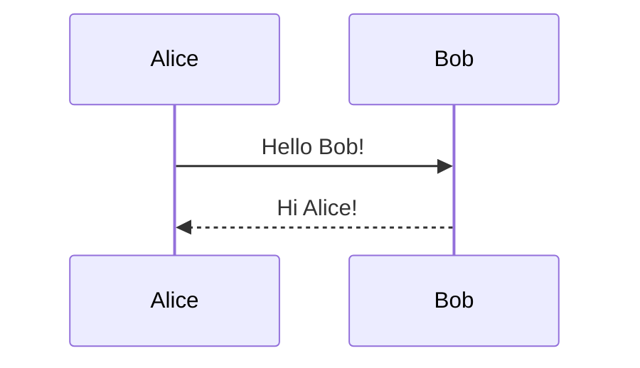
```mermaid
sequenceDiagram
    participant A as Alice
    participant B as Bob
    A->>B: Hello Bob!
    B-->>A: Hi Alice!
```

## Participants and Actors

### Declaring Participants

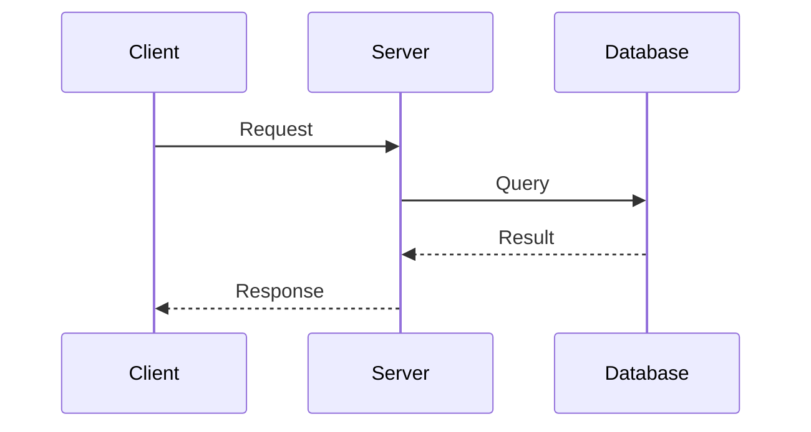
```mermaid
sequenceDiagram
    participant C as Client
    participant S as Server
    participant DB as Database

    C->>S: Request
    S->>DB: Query
    DB-->>S: Result
    S-->>C: Response
```

### Using Actor Symbol (Human)

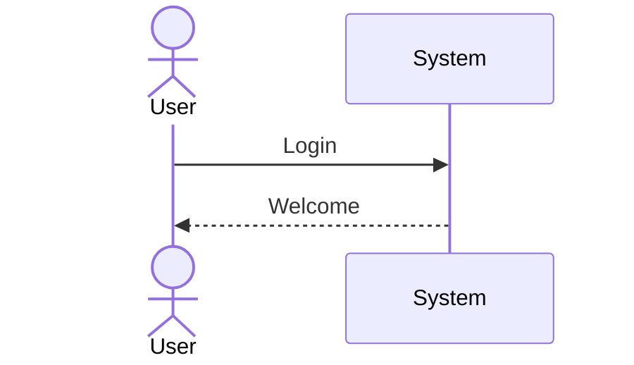
```mermaid
sequenceDiagram
    actor U as User
    participant S as System
    U->>S: Login
    S-->>U: Welcome
```

### Implicit Declaration

Participants are created in order of first appearance if not explicitly declared.

## Message Types

### Arrow Styles

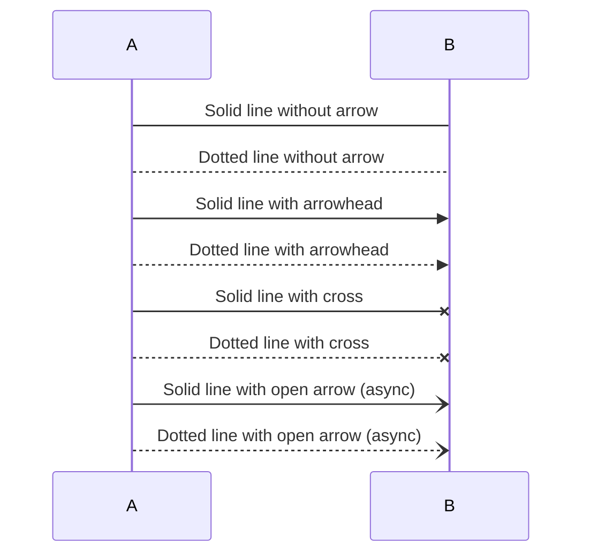
```mermaid
sequenceDiagram
    participant A
    participant B

    A->B: Solid line without arrow
    A-->B: Dotted line without arrow
    A->>B: Solid line with arrowhead
    A-->>B: Dotted line with arrowhead
    A-xB: Solid line with cross
    A--xB: Dotted line with cross
    A-)B: Solid line with open arrow (async)
    A--)B: Dotted line with open arrow (async)
```

| Syntax | Type | Use Case |
|--------|------|----------|
| `->` | Solid, no arrow | Simple message |
| `-->` | Dotted, no arrow | Return without emphasis |
| `->>` | Solid with arrow | Synchronous call |
| `-->>` | Dotted with arrow | Synchronous return |
| `-x` | Solid with cross | Failed/rejected |
| `--x` | Dotted with cross | Async failure |
| `-)` | Solid, open arrow | Async message |
| `--)` | Dotted, open arrow | Async return |

## Activation and Deactivation

### Explicit Activation

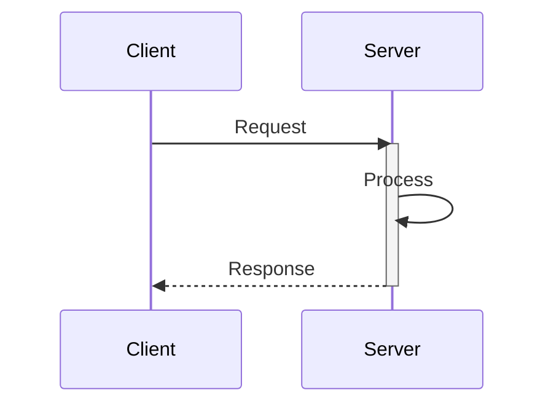
```mermaid
sequenceDiagram
    participant C as Client
    participant S as Server

    C->>S: Request
    activate S
    S->>S: Process
    S-->>C: Response
    deactivate S
```

### Shorthand Syntax

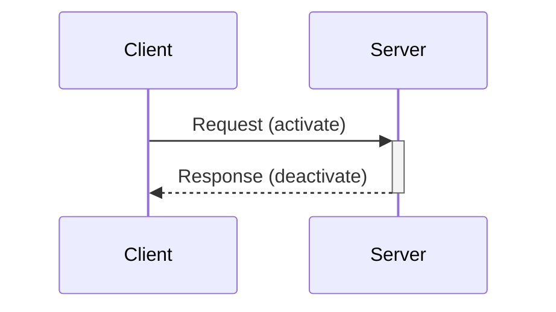
```mermaid
sequenceDiagram
    participant C as Client
    participant S as Server

    C->>+S: Request (activate)
    S-->>-C: Response (deactivate)
```

### Nested Activation

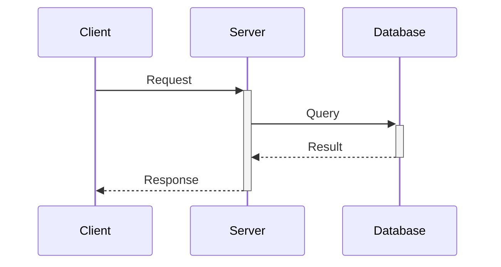
```mermaid
sequenceDiagram
    participant C as Client
    participant S as Server
    participant DB as Database

    C->>+S: Request
    S->>+DB: Query
    DB-->>-S: Result
    S-->>-C: Response
```

## Notes

### Note Positioning

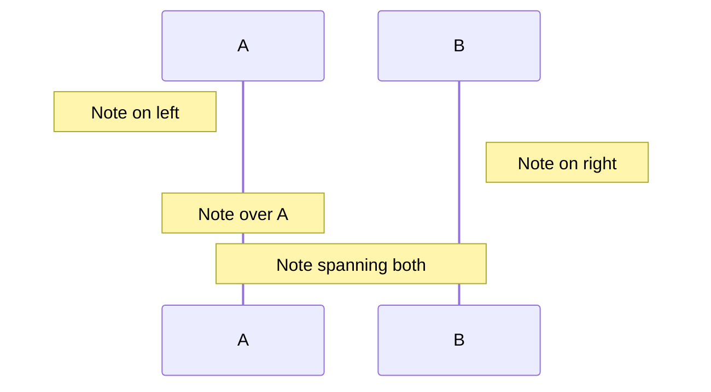
```mermaid
sequenceDiagram
    participant A
    participant B

    Note left of A: Note on left
    Note right of B: Note on right
    Note over A: Note over A
    Note over A,B: Note spanning both
```

### Multi-line Notes

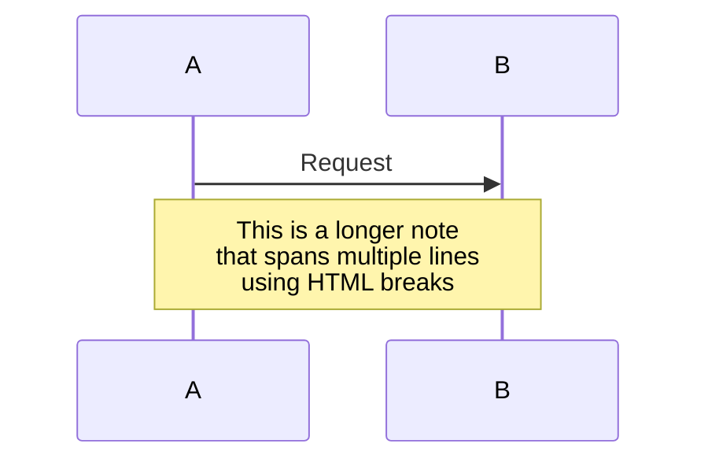
```mermaid
sequenceDiagram
    participant A
    participant B

    A->>B: Request
    Note over A,B: This is a longer note<br/>that spans multiple lines<br/>using HTML breaks
```

## Control Flow

### Loops

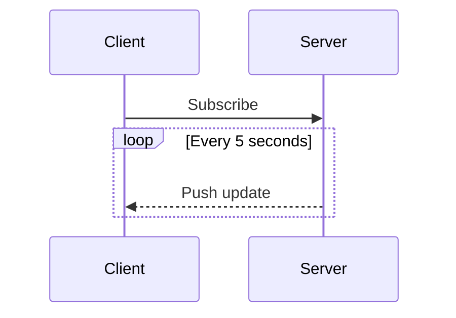
```mermaid
sequenceDiagram
    participant C as Client
    participant S as Server

    C->>S: Subscribe
    loop Every 5 seconds
        S-->>C: Push update
    end
```

### Alternative Paths (Alt/Else)

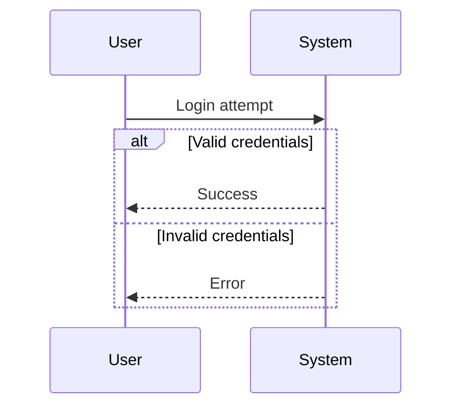
```mermaid
sequenceDiagram
    participant U as User
    participant S as System

    U->>S: Login attempt
    alt Valid credentials
        S-->>U: Success
    else Invalid credentials
        S-->>U: Error
    end
```

### Optional Path (Opt)

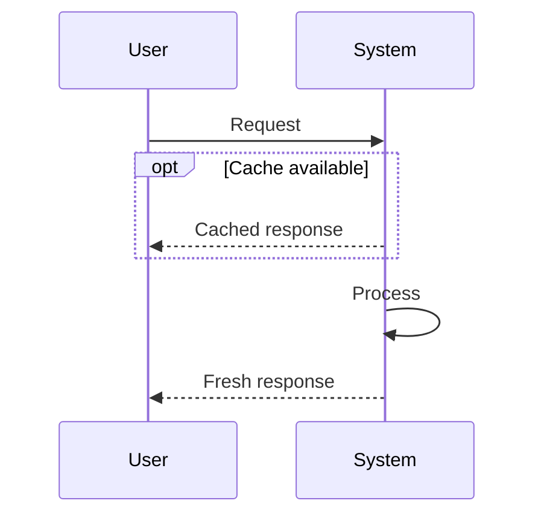
```mermaid
sequenceDiagram
    participant U as User
    participant S as System

    U->>S: Request
    opt Cache available
        S-->>U: Cached response
    end
    S->>S: Process
    S-->>U: Fresh response
```

### Parallel Execution (Par)

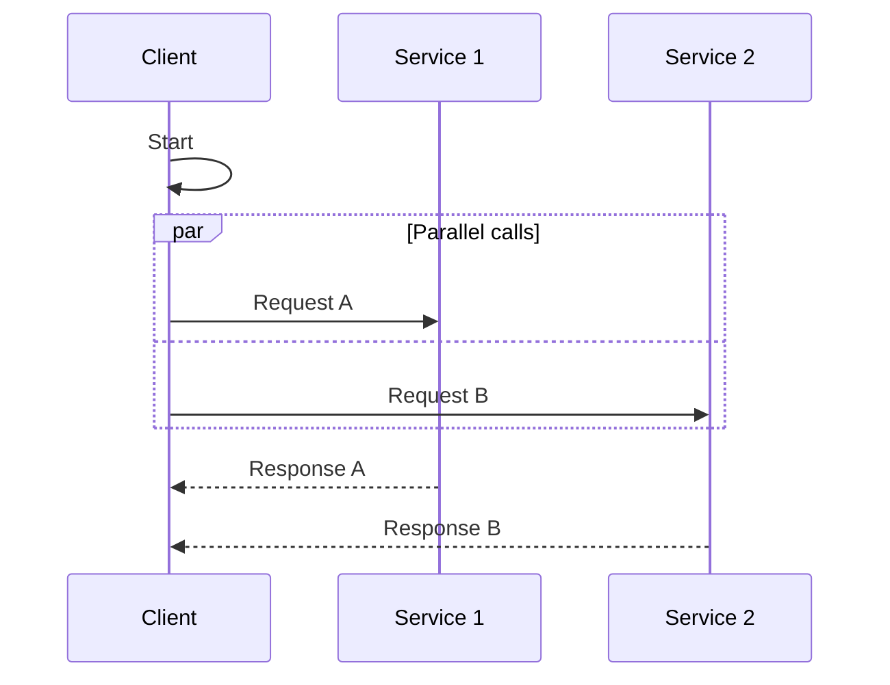
```mermaid
sequenceDiagram
    participant C as Client
    participant S1 as Service 1
    participant S2 as Service 2

    C->>C: Start

    par Parallel calls
        C->>S1: Request A
    and
        C->>S2: Request B
    end

    S1-->>C: Response A
    S2-->>C: Response B
```

### Critical Region

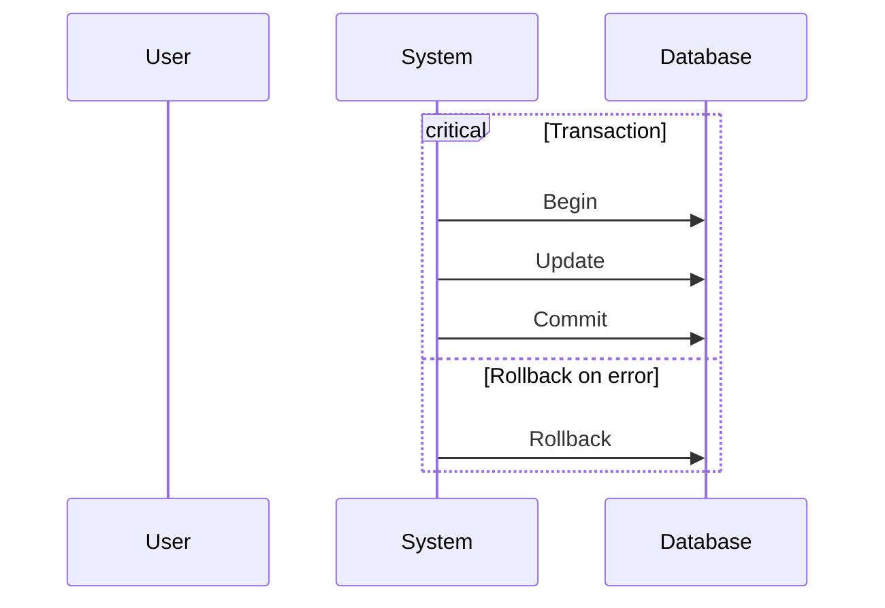
```mermaid
sequenceDiagram
    participant U as User
    participant S as System
    participant DB as Database

    critical Transaction
        S->>DB: Begin
        S->>DB: Update
        S->>DB: Commit
    option Rollback on error
        S->>DB: Rollback
    end
```

### Break (Early Exit)

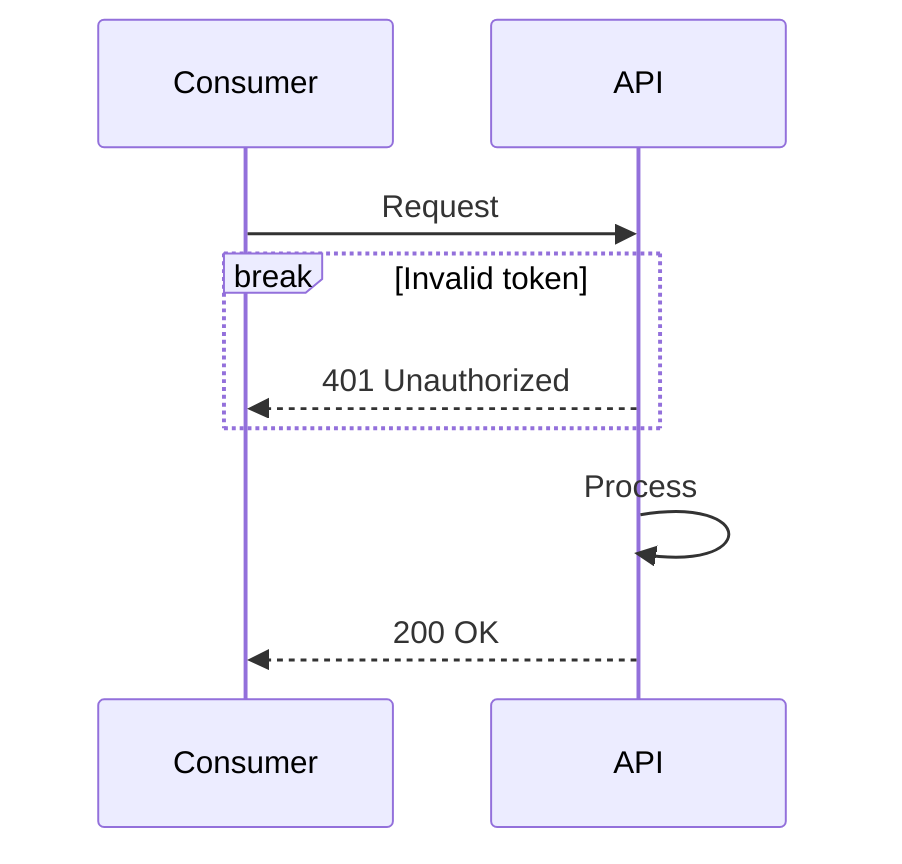
```mermaid
sequenceDiagram
    participant C as Consumer
    participant API as API

    C->>API: Request

    break Invalid token
        API-->>C: 401 Unauthorized
    end

    API->>API: Process
    API-->>C: 200 OK
```

## Grouping with Boxes

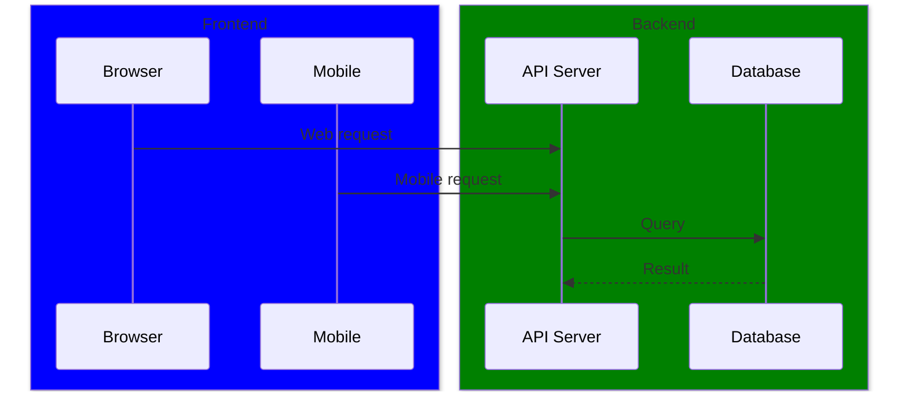
```mermaid
sequenceDiagram
    box Blue Frontend
        participant B as Browser
        participant M as Mobile
    end
    box Green Backend
        participant API as API Server
        participant DB as Database
    end

    B->>API: Web request
    M->>API: Mobile request
    API->>DB: Query
    DB-->>API: Result
```

## Creating and Destroying Participants

```mermaid
sequenceDiagram
    participant A as Main
    participant B as Worker

    A->>B: Start task

    create participant C as Temp Process
    B->>C: Spawn

    C->>C: Execute
    C-->>B: Result

    destroy C
    B-->>A: Complete
```

## Sequence Numbers

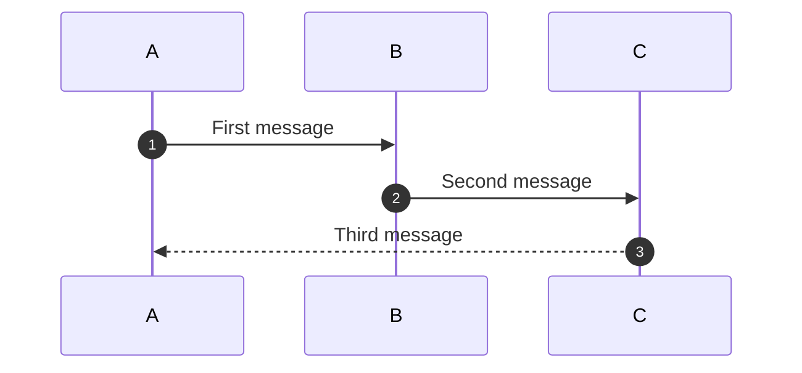
```mermaid
sequenceDiagram
    autonumber
    participant A
    participant B
    participant C

    A->>B: First message
    B->>C: Second message
    C-->>A: Third message
```

## Styling

### Custom Participant Colors

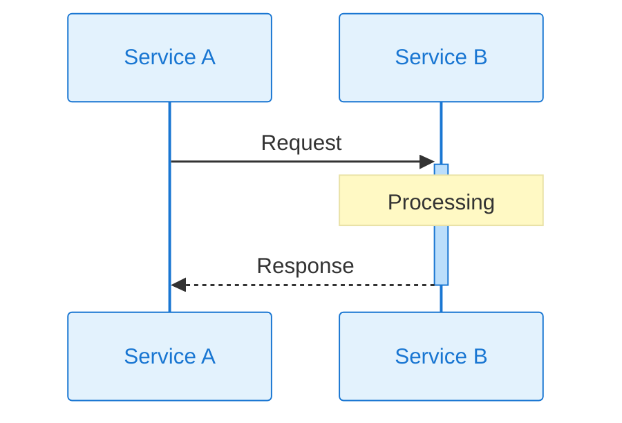
```mermaid
%%{init: {
  "theme": "base",
  "themeVariables": {
    "actorBkg": "#e3f2fd",
    "actorBorder": "#1976d2",
    "actorTextColor": "#1976d2",
    "signalColor": "#333",
    "signalTextColor": "#333",
    "noteBkgColor": "#fff9c4",
    "noteTextColor": "#333",
    "activationBkgColor": "#bbdefb",
    "activationBorderColor": "#1976d2"
  }
}}%%
sequenceDiagram
    participant A as Service A
    participant B as Service B

    A->>+B: Request
    Note over B: Processing
    B-->>-A: Response
```

## Common Patterns

### REST API Call

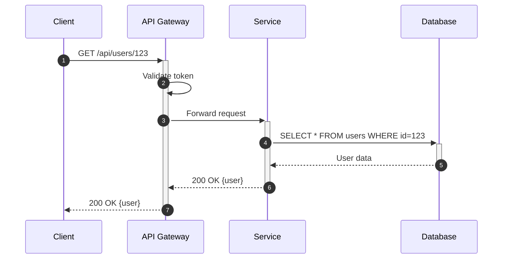
```mermaid
sequenceDiagram
    autonumber
    participant C as Client
    participant GW as API Gateway
    participant S as Service
    participant DB as Database

    C->>+GW: GET /api/users/123
    GW->>GW: Validate token
    GW->>+S: Forward request
    S->>+DB: SELECT * FROM users WHERE id=123
    DB-->>-S: User data
    S-->>-GW: 200 OK {user}
    GW-->>-C: 200 OK {user}
```

### Authentication Flow

```mermaid
sequenceDiagram
    actor U as User
    participant App as Application
    participant Auth as Auth Server
    participant API as API Server

    U->>App: Click Login
    App->>Auth: Redirect to login
    Auth-->>U: Login form
    U->>Auth: Credentials
    Auth->>Auth: Validate

    alt Valid
        Auth-->>App: Auth code
        App->>Auth: Exchange for token
        Auth-->>App: Access token
        App->>API: Request + token
        API-->>App: Protected data
    else Invalid
        Auth-->>U: Error message
    end
```

### Microservice Communication

```mermaid
sequenceDiagram
    participant GW as Gateway
    participant US as User Service
    participant OS as Order Service
    participant PS as Payment Service
    participant NS as Notification

    GW->>+US: Get user
    US-->>-GW: User data

    GW->>+OS: Create order
    OS->>+PS: Process payment
    PS-->>-OS: Payment confirmed
    OS-->>-GW: Order created

    par Async notifications
        OS-)NS: Order email
    and
        PS-)NS: Payment receipt
    end
```

### Websocket Communication

```mermaid
sequenceDiagram
    participant C as Client
    participant S as Server

    C->>S: HTTP Upgrade request
    S-->>C: 101 Switching Protocols

    loop Connected
        C-)S: Send message
        S-)C: Broadcast
    end

    C-xS: Close connection
```

## Configuration Options

### Complete Configuration Block

```mermaid
---
config:
  sequence:
    diagramMarginX: 50
    diagramMarginY: 10
    actorMargin: 50
    width: 150
    height: 65
    boxMargin: 10
    boxTextMargin: 5
    noteMargin: 10
    messageMargin: 35
    mirrorActors: true
    bottomMarginAdj: 1
    useMaxWidth: true
    rightAngles: false
    showSequenceNumbers: false
    actorFontSize: 14
    actorFontFamily: Open Sans
    actorFontWeight: 400
    noteFontSize: 14
    noteFontFamily: trebuchet ms
    noteFontWeight: 400
    messageFontSize: 16
    messageFontFamily: trebuchet ms
    messageFontWeight: 400
    wrap: false
    wrapPadding: 10
    labelBoxWidth: 50
    labelBoxHeight: 20
    hideUnusedParticipants: false
---
sequenceDiagram
    participant A
    participant B
    A->>B: Hello
```

### Configuration Options Reference

#### Layout Options

| Option | Type | Default | Description |
|--------|------|---------|-------------|
| `diagramMarginX` | number | 50 | Horizontal margin around diagram |
| `diagramMarginY` | number | 10 | Vertical margin around diagram |
| `actorMargin` | number | 50 | Margin between actors |
| `width` | number | 150 | Width of actor boxes |
| `height` | number | 65 | Height of actor boxes |
| `boxMargin` | number | 10 | Margin around boxes |
| `boxTextMargin` | number | 5 | Margin for text in boxes |
| `noteMargin` | number | 10 | Margin around notes |
| `messageMargin` | number | 35 | Vertical margin between messages |
| `activationWidth` | number | 10 | Width of activation bars |

#### Display Options

| Option | Type | Default | Description |
|--------|------|---------|-------------|
| `mirrorActors` | boolean | true | Show actors at bottom |
| `bottomMarginAdj` | number | 1 | Bottom margin adjustment |
| `useMaxWidth` | boolean | true | Use maximum width |
| `rightAngles` | boolean | false | Use right angles for lines |
| `showSequenceNumbers` | boolean | false | Auto-number messages |
| `hideUnusedParticipants` | boolean | false | Hide declared but unused participants |

#### Font Options

| Option | Type | Default | Description |
|--------|------|---------|-------------|
| `actorFontSize` | number | 14 | Actor label font size |
| `actorFontFamily` | string | Open Sans | Actor label font |
| `actorFontWeight` | number | 400 | Actor label font weight |
| `noteFontSize` | number | 14 | Note font size |
| `noteFontFamily` | string | trebuchet ms | Note font |
| `noteFontWeight` | number | 400 | Note font weight |
| `messageFontSize` | number | 16 | Message font size |
| `messageFontFamily` | string | trebuchet ms | Message font |
| `messageFontWeight` | number | 400 | Message font weight |

#### Text Wrapping Options

| Option | Type | Default | Description |
|--------|------|---------|-------------|
| `wrap` | boolean | false | Enable text wrapping |
| `wrapPadding` | number | 10 | Padding when wrapping |
| `labelBoxWidth` | number | 50 | Width of label boxes |
| `labelBoxHeight` | number | 20 | Height of label boxes |

### Configuration Examples

#### Compact Diagram

```mermaid
%%{init: {
  "sequence": {
    "diagramMarginX": 20,
    "diagramMarginY": 5,
    "actorMargin": 30,
    "messageMargin": 25
  }
}}%%
sequenceDiagram
    A->>B: Request
    B-->>A: Response
```

#### With Autonumbering

```mermaid
%%{init: {"sequence": {"showSequenceNumbers": true}} }%%
sequenceDiagram
    A->>B: First
    B->>C: Second
    C-->>A: Third
```

#### Hide Unused Participants

```mermaid
%%{init: {"sequence": {"hideUnusedParticipants": true}} }%%
sequenceDiagram
    participant A
    participant B
    participant C
    A->>B: Only A and B interact
```

---

## Best Practices

1. **Declare participants explicitly** - Controls ordering and naming
2. **Use actors for humans** - Visual distinction
3. **Group related services** - Use boxes for clarity
4. **Show activation bars** - Visualizes processing time
5. **Use autonumber for complex flows** - Easier reference
6. **Add notes for context** - Explain non-obvious behavior
7. **Use appropriate arrow types** - Sync vs async matters
8. **Keep diagrams focused** - One flow per diagram
9. **Configure margins for density** - Adjust `actorMargin` and `messageMargin`
10. **Use `hideUnusedParticipants`** - Clean up diagrams with conditional paths

## Common Issues

### Reserved Word "end"

The word "end" can break diagrams. Wrap in quotes or brackets:

```mermaid
sequenceDiagram
    A->>B: This is the (end) of message
    B-->>A: Using "end" in quotes
```
