# Class Diagram Guide

> **SKILL QUICK REF**: `classDiagram` • Visibility: `+` `-` `#` `~` • Relations: `<|--` `*--` `o--` `<--` `<..` `<|..` • `class Name { +attr: Type }` • `<<interface>>` `<<abstract>>`

## When to Use

- Object-oriented design documentation
- API/SDK class structure
- Design pattern visualization
- Domain model documentation
- Interface/inheritance hierarchies

## Overview

Class diagrams model object-oriented structure, showing classes, their attributes, methods, and relationships. Essential for software design documentation and API modeling.

## Basic Syntax

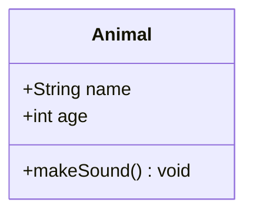

## Class Definition

### Attributes and Methods

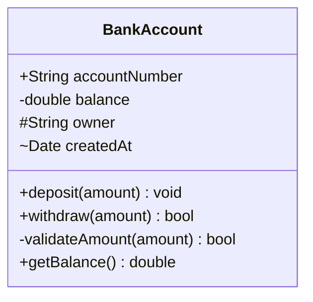

### Visibility Modifiers

| Symbol | Visibility | Meaning |
|--------|------------|---------|
| `+` | Public | Accessible from anywhere |
| `-` | Private | Accessible only within class |
| `#` | Protected | Accessible within class and subclasses |
| `~` | Package/Internal | Accessible within package |

### Method Syntax

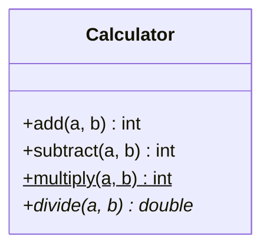

| Syntax | Meaning |
|--------|---------|
| `method()` | No return type |
| `method() returnType` | With return type |
| `method()$` | Static method |
| `method()*` | Abstract method |

### Generic Types

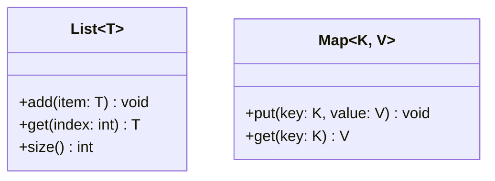

## Annotations (Stereotypes)

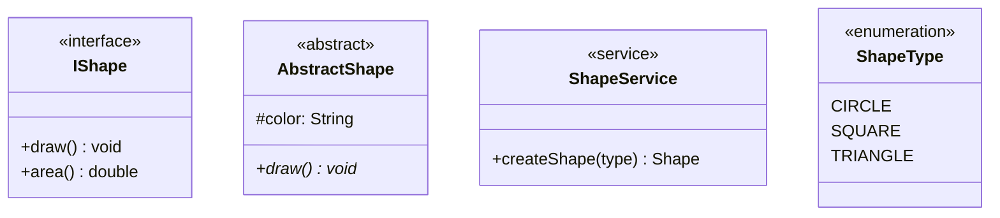

### Common Annotations

| Annotation | Use Case |
|------------|----------|
| `<<interface>>` | Interface definition |
| `<<abstract>>` | Abstract class |
| `<<service>>` | Service class |
| `<<enumeration>>` | Enum type |
| `<<entity>>` | Domain entity |
| `<<repository>>` | Data repository |
| `<<controller>>` | Controller class |

## Relationships

### Relationship Types

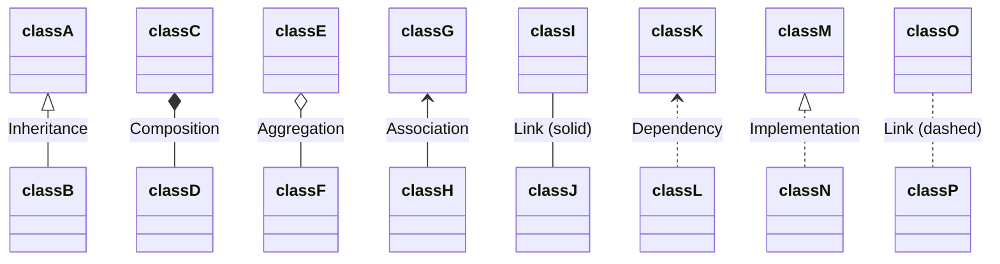

### Relationship Reference

| Syntax | Type | Description |
|--------|------|-------------|
| `<\|--` | Inheritance | "is-a" relationship |
| `*--` | Composition | Strong "has-a" (lifecycle dependent) |
| `o--` | Aggregation | Weak "has-a" (independent lifecycle) |
| `<--` | Association | "uses" relationship |
| `--` | Link | Basic connection |
| `<..` | Dependency | "depends on" |
| `<\|..` | Implementation | Implements interface |
| `..` | Dashed link | Weak connection |

### Cardinality (Multiplicity)

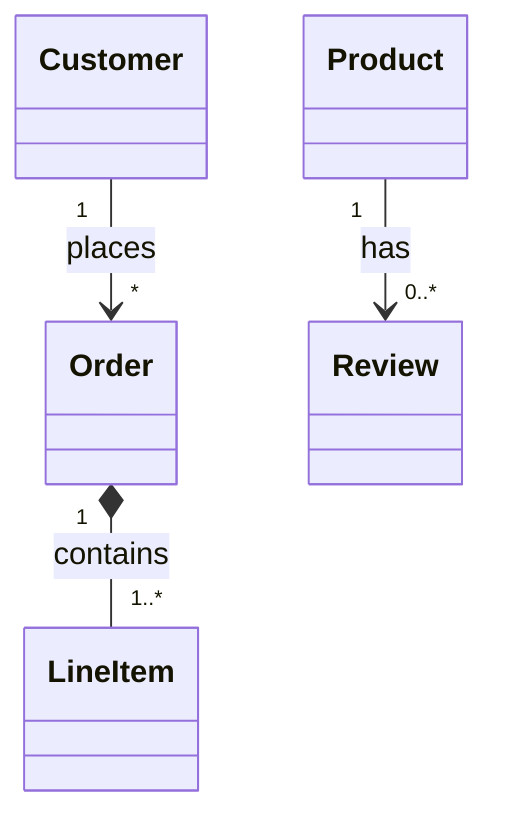

| Notation | Meaning |
|----------|---------|
| `1` | Exactly one |
| `0..1` | Zero or one |
| `*` | Zero or more |
| `1..*` | One or more |
| `n..m` | Range (n to m) |

### Two-Way Relationships

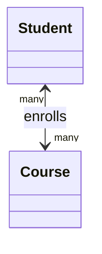

## Labels and Notes

### Relationship Labels

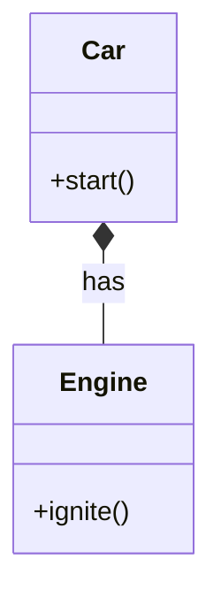

### Notes

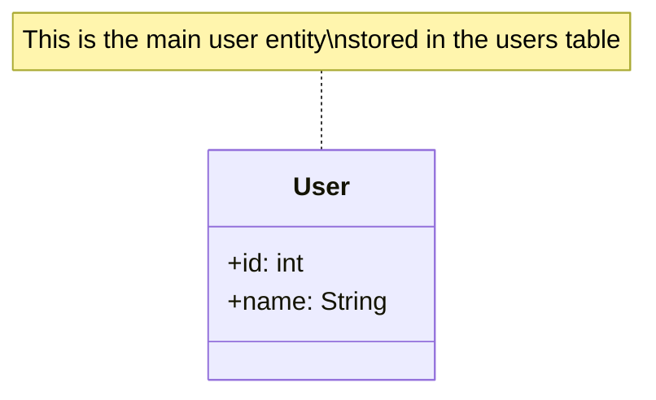

## Namespaces (v10.6.0+)

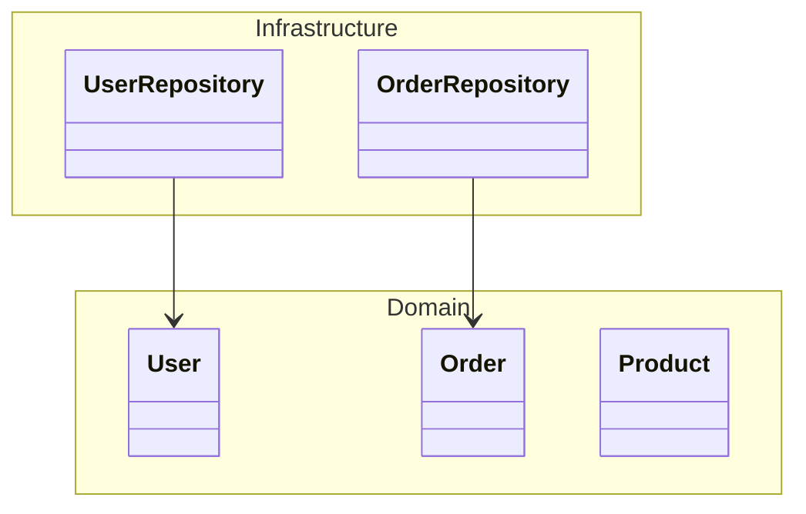

## Styling

### Class Styling with CSS

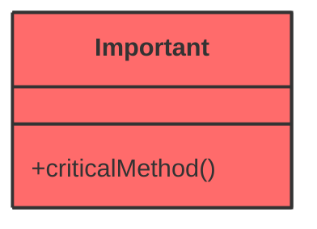

### Direction

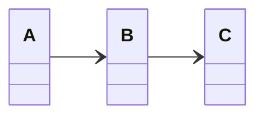

Directions: `TB` (top-bottom), `BT`, `LR` (left-right), `RL`

## Common Patterns

### Inheritance Hierarchy

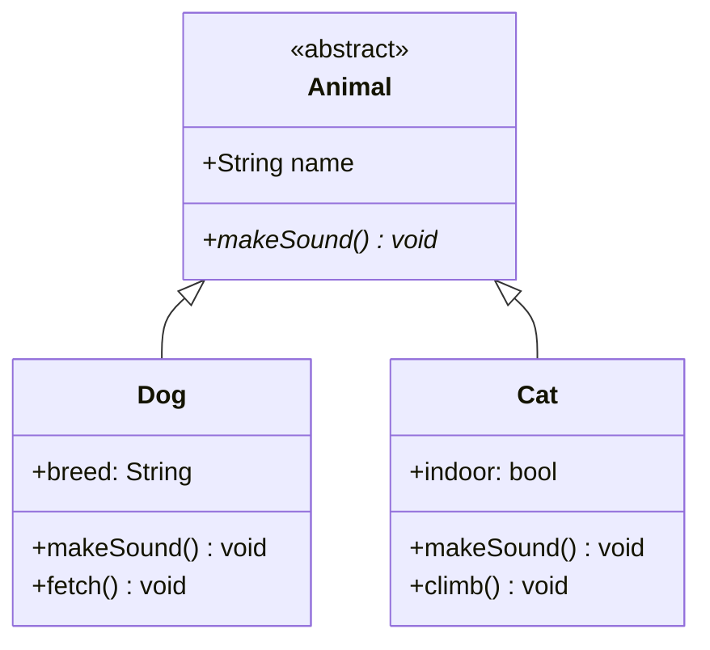

### Interface Implementation

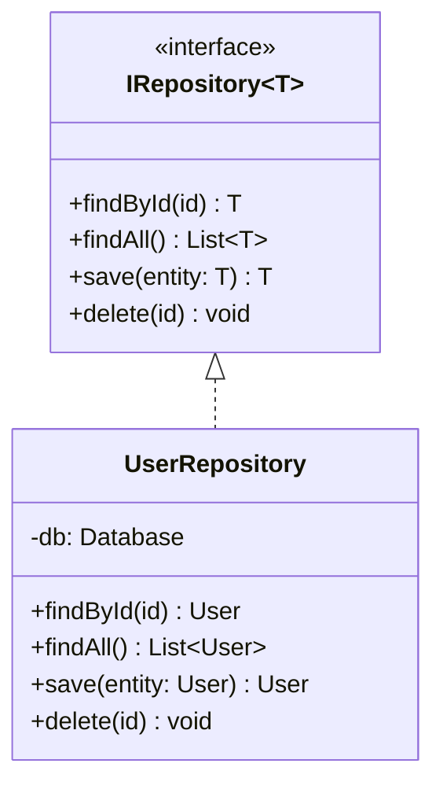

### Design Pattern: Factory

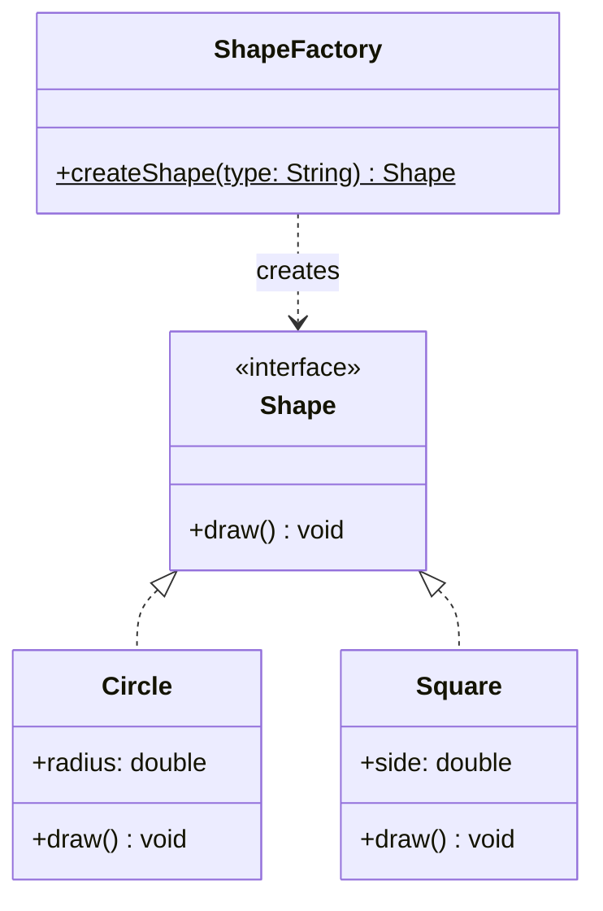

### Design Pattern: Repository

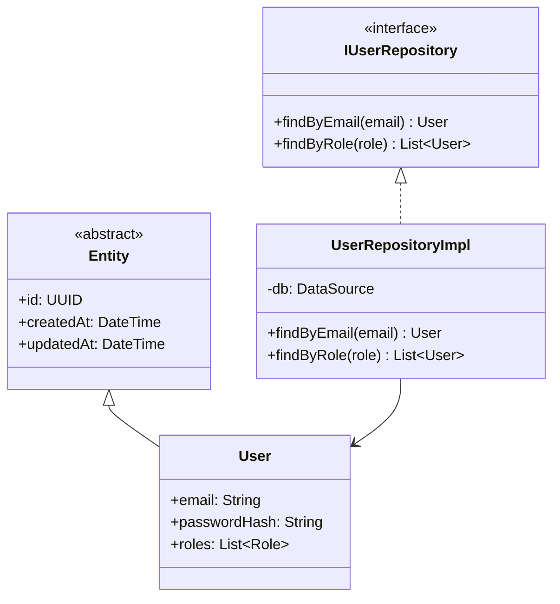

### Microservice Domain Model

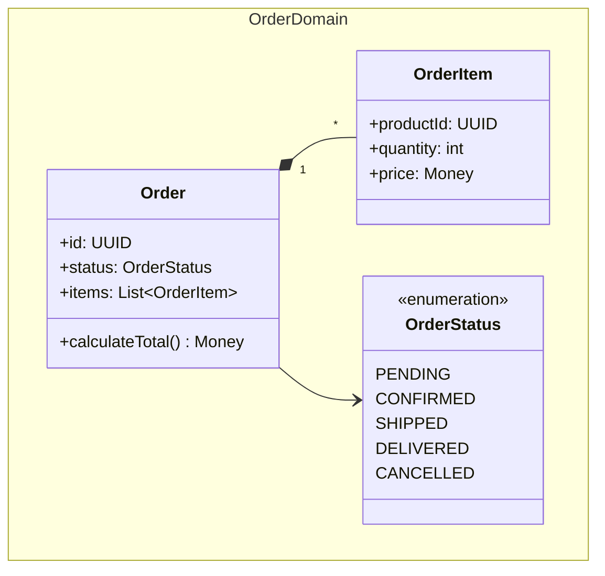

### ORM Entity Mapping

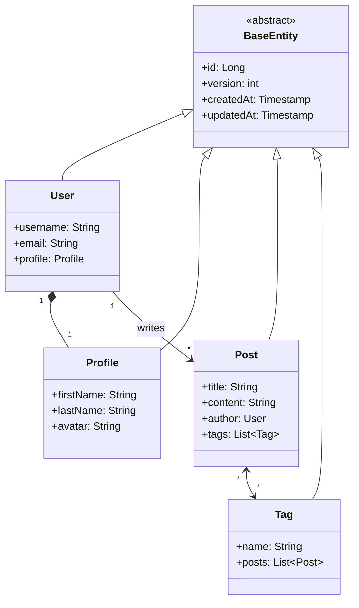

## Configuration Options

### Complete Configuration Block

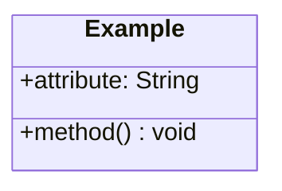

### Configuration Options Reference

| Option | Type | Default | Description |
|--------|------|---------|-------------|
| `titleTopMargin` | number | 25 | Margin above diagram title |
| `arrowMarkerAbsolute` | boolean | false | Use absolute arrow markers |
| `dividerMargin` | number | 10 | Margin around dividers |
| `padding` | number | 5 | Padding inside class boxes |
| `textHeight` | number | 10 | Height of text lines |
| `useMaxWidth` | boolean | true | Use maximum width |
| `defaultRenderer` | string | dagre | Layout renderer |
| `htmlLabels` | boolean | false | Allow HTML in labels |
| `hideEmptyMembersBox` | boolean | false | Hide empty attribute/method sections |

### Configuration Examples

#### Hide Empty Member Sections

```mermaid
%%{init: {"class": {"hideEmptyMembersBox": true}} }%%
classDiagram
    class OnlyMethods {
        +doSomething() void
        +doMore() void
    }
    class OnlyAttributes {
        +name: String
        +age: int
    }
```

#### Compact Diagram with Reduced Padding

```mermaid
%%{init: {
  "class": {
    "padding": 3,
    "dividerMargin": 5,
    "textHeight": 8
  }
}}%%
classDiagram
    class Compact {
        +attr: String
        +method() void
    }
```

---

## Best Practices

1. **Use visibility modifiers consistently** - Shows encapsulation
2. **Apply annotations for clarity** - `<<interface>>`, `<<abstract>>`, etc.
3. **Show cardinality** - Critical for data modeling
4. **Group with namespaces** - Organizes large diagrams
5. **Use direction wisely** - LR for wide, TB for tall diagrams
6. **Label relationships** - Makes intent clear
7. **Keep diagrams focused** - One domain per diagram
8. **Include key methods only** - Don't show everything
9. **Use `hideEmptyMembersBox`** - Clean up interfaces and partial classes

## Kurt Cagle's Approach

For ontology/class visualization, Cagle would style this similarly to his semantic graphs:

```mermaid
classDiagram
    class Animal {
        <<abstract>>
        +name: String
        +makeSound()* void
    }

    class Dog {
        +breed: String
        +makeSound() void
    }

    class Cat {
        +indoor: bool
        +makeSound() void
    }

    Animal <|-- Dog
    Animal <|-- Cat

    style Animal fill:#DDA0DD,stroke:#000
    style Dog fill:#ADD8E6,stroke:#000
    style Cat fill:#ADD8E6,stroke:#000
```
