# State Diagram Guide

> **SKILL QUICK REF**: `stateDiagram-v2` • `[*]` start/end • `State1 --> State2 : event` • Nested: `state Parent { }` • `<<choice>>` `<<fork>>` `<<join>>` • Parallel: `--`

## When to Use

- Finite state machines
- Order/transaction lifecycles
- User session states
- Document workflow states
- Game state logic
- Connection state management

## Overview

State diagrams model system behavior through states, transitions, and triggering events. Essential for finite state machines, workflow modeling, and behavioral documentation.

## Basic Syntax

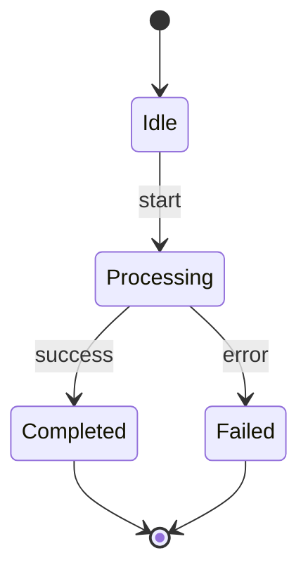

## Special States

### Start and End States

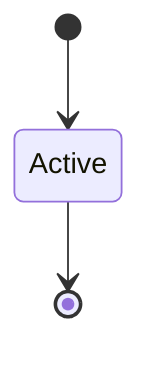

- `[*]` at the beginning = Start state
- `[*]` at the end = End state

### Multiple End States

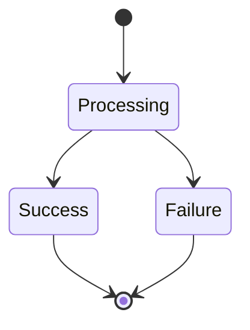

## Transitions

### Basic Transitions

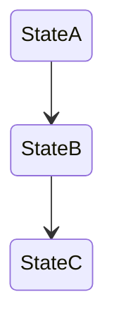

### Labeled Transitions

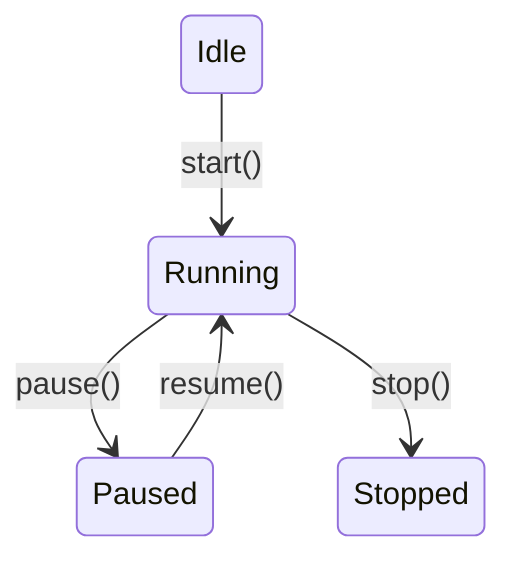

### Self-Transitions

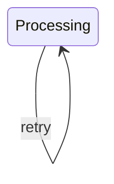

## State Descriptions

### State with Description

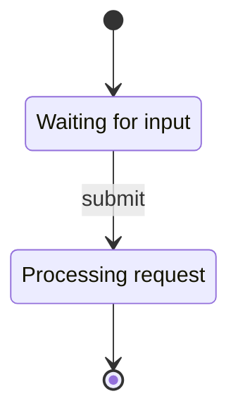

### State Notes

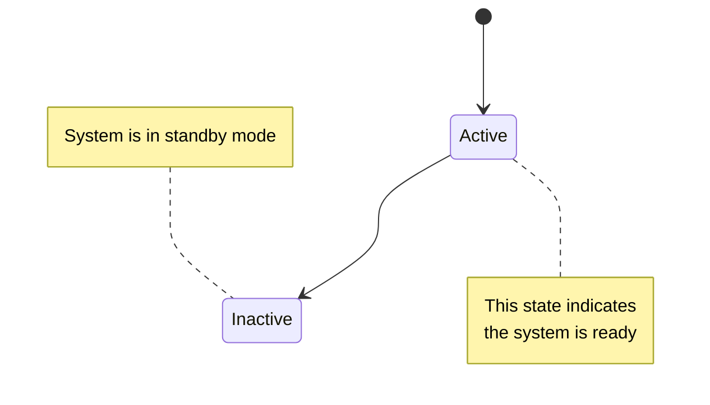

## Composite (Nested) States

### Basic Nested State

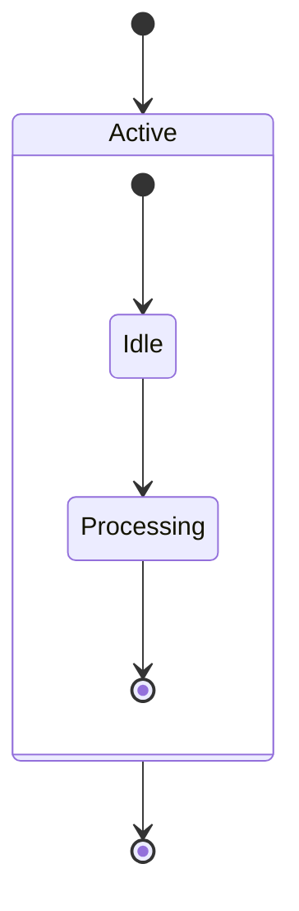

### Multi-Level Nesting

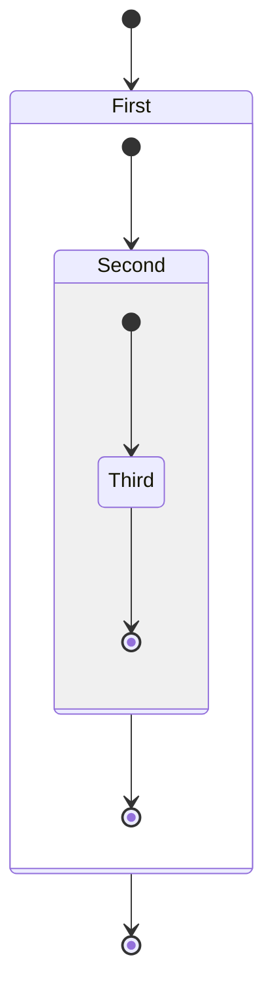

### Parallel States (Regions)

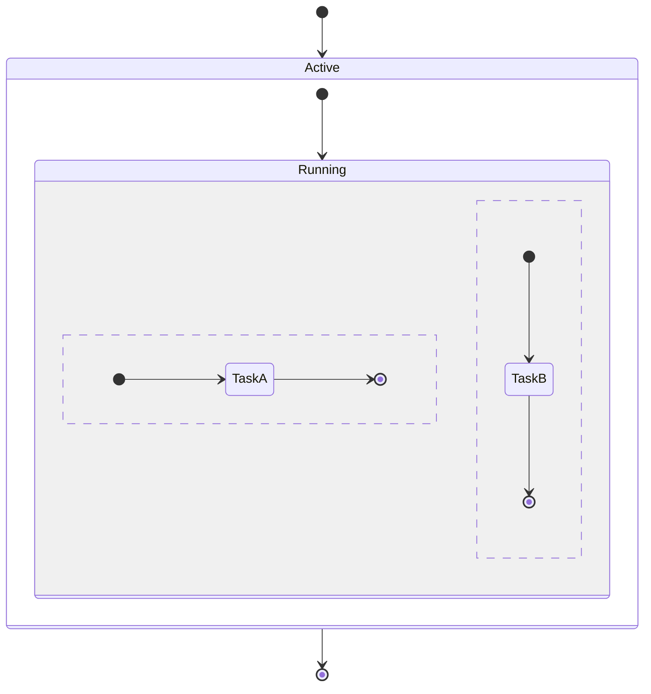

The `--` separator creates parallel regions.

## Choice (Conditional) States

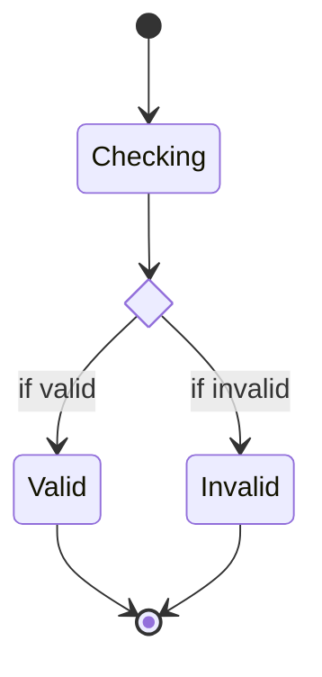

## Fork and Join (Parallel Execution)

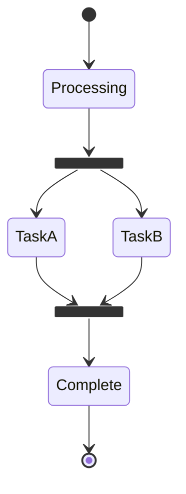

## Direction

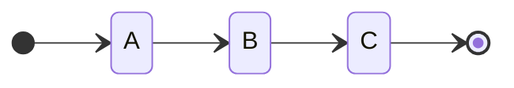

Directions: `TB` (default), `LR`, `BT`, `RL`

## Styling

### Using classDef

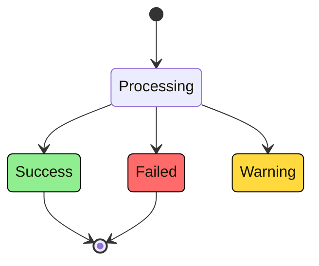

### Theme Configuration

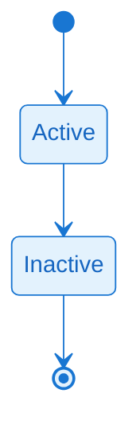

## ELK Layout for Complex State Diagrams

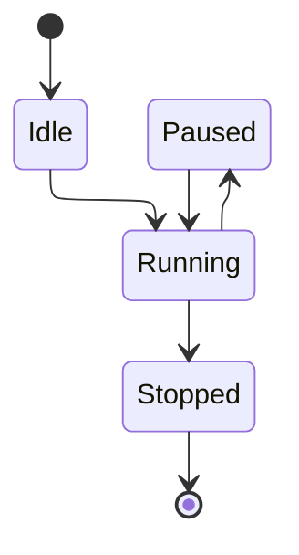

## Common Patterns

### Order State Machine

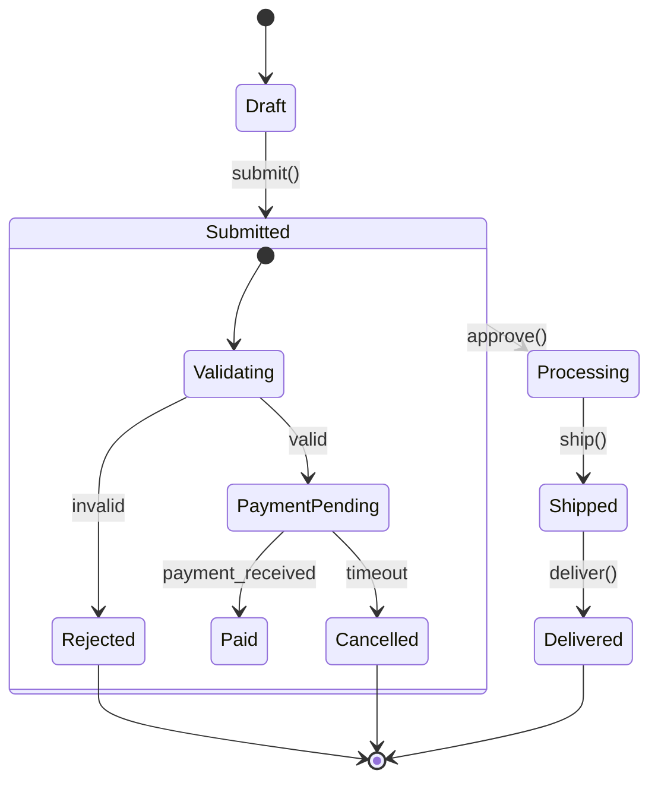

### User Session State

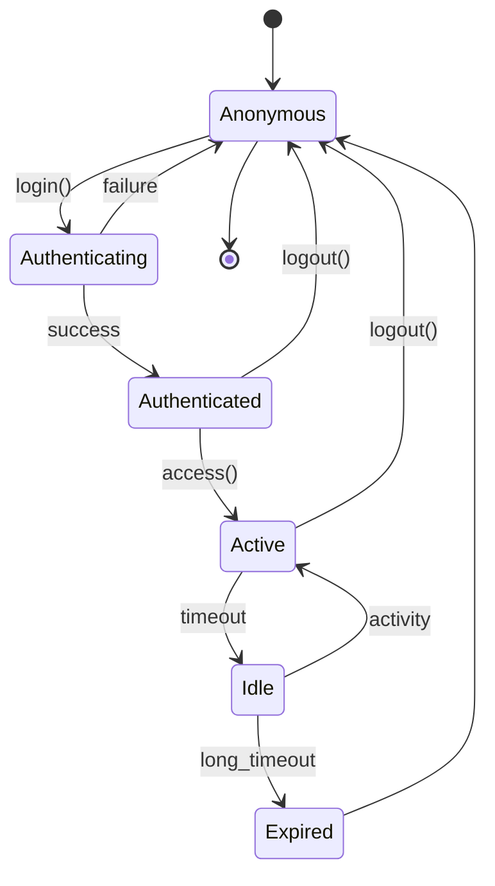

### Connection State

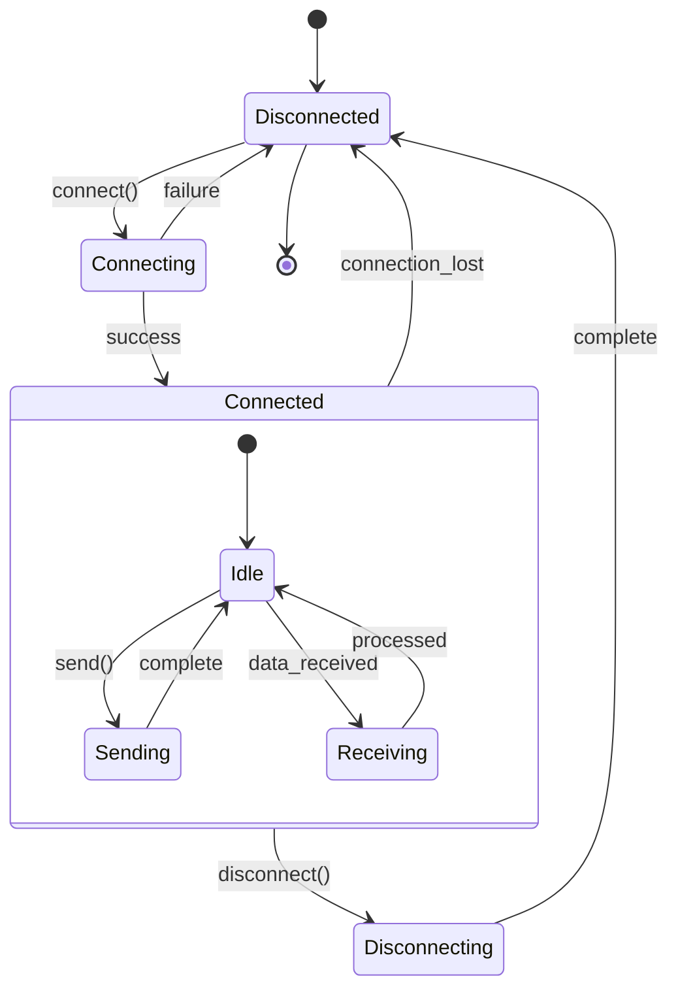

### Document Workflow

```mermaid
stateDiagram-v2
    [*] --> Draft

    state Draft {
        [*] --> Editing
        Editing --> Reviewing : submit_for_review
    }

    state Review {
        [*] --> PendingReview
        PendingReview --> ChangesRequested : request_changes
        PendingReview --> Approved : approve
        ChangesRequested --> PendingReview : resubmit
    }

    state Published {
        [*] --> Live
        Live --> Archived : archive
    }

    Draft --> Review : submit
    Review --> Draft : reject
    Review --> Published : publish
    Published --> Draft : unpublish

    Published --> [*]
```

### Build Pipeline

```mermaid
stateDiagram-v2
    direction LR

    [*] --> Queued

    Queued --> Building : start

    state Building {
        [*] --> Checkout
        Checkout --> Compile
        Compile --> Test
        Test --> Package
        Package --> [*]
    }

    Building --> Success : pass
    Building --> Failed : fail

    state fork_deploy <<fork>>
    Success --> fork_deploy
    fork_deploy --> DeployStaging
    fork_deploy --> DeployProd

    state join_complete <<join>>
    DeployStaging --> join_complete
    DeployProd --> join_complete
    join_complete --> Complete

    Failed --> [*]
    Complete --> [*]
```

### Game State Machine

```mermaid
stateDiagram-v2
    [*] --> MainMenu

    MainMenu --> Loading : start_game
    Loading --> Playing : loaded

    state Playing {
        [*] --> Exploring
        Exploring --> Combat : enemy_encounter
        Combat --> Exploring : victory
        Combat --> GameOver : defeat
        Exploring --> Paused : pause
        Paused --> Exploring : resume
        Paused --> MainMenu : quit
    }

    GameOver --> MainMenu : restart
    Playing --> MainMenu : quit

    MainMenu --> [*]
```

## Configuration Options

### Complete Configuration Block

```mermaid
---
config:
  layout: elk
  state:
    titleTopMargin: 25
    arrowMarkerAbsolute: false
    dividerMargin: 10
    sizeUnit: 5
    padding: 8
    textHeight: 10
    titleShift: -15
    noteMargin: 10
    forkWidth: 70
    forkHeight: 7
    miniPadding: 2
    fontSizeFactor: 5.02
    fontSize: 24
    labelHeight: 16
    edgeLengthFactor: 20
    compositTitleSize: 35
    radius: 5
    defaultRenderer: dagre
---
stateDiagram-v2
    [*] --> Active
    Active --> [*]
```

### Configuration Options Reference

| Option | Type | Default | Description |
|--------|------|---------|-------------|
| `titleTopMargin` | number | 25 | Margin above diagram title |
| `arrowMarkerAbsolute` | boolean | false | Use absolute arrow markers |
| `dividerMargin` | number | 10 | Margin around region dividers |
| `sizeUnit` | number | 5 | Base size unit for calculations |
| `padding` | number | 8 | Padding inside state boxes |
| `textHeight` | number | 10 | Height of text lines |
| `titleShift` | number | -15 | Vertical shift for titles |
| `noteMargin` | number | 10 | Margin around notes |
| `forkWidth` | number | 70 | Width of fork/join bars |
| `forkHeight` | number | 7 | Height of fork/join bars |
| `miniPadding` | number | 2 | Minimum padding |
| `fontSizeFactor` | number | 5.02 | Font size multiplier |
| `fontSize` | number | 24 | Base font size |
| `labelHeight` | number | 16 | Height of labels |
| `edgeLengthFactor` | number | 20 | Factor for edge length |
| `compositTitleSize` | number | 35 | Font size for composite state titles |
| `radius` | number | 5 | Corner radius for state boxes |
| `defaultRenderer` | string | dagre | Layout renderer (`dagre` or `elk`) |

### Configuration Examples

#### Wider Fork/Join Bars

```mermaid
%%{init: {
  "state": {
    "forkWidth": 100,
    "forkHeight": 10
  }
}}%%
stateDiagram-v2
    [*] --> Start
    state fork_state <<fork>>
    Start --> fork_state
    fork_state --> TaskA
    fork_state --> TaskB

    state join_state <<join>>
    TaskA --> join_state
    TaskB --> join_state
    join_state --> End
    End --> [*]
```

#### Larger State Boxes with Rounded Corners

```mermaid
%%{init: {
  "state": {
    "padding": 15,
    "radius": 10,
    "fontSize": 16
  }
}}%%
stateDiagram-v2
    [*] --> Active
    Active --> Processing
    Processing --> Complete
    Complete --> [*]
```

#### Compact Nested States

```mermaid
%%{init: {
  "state": {
    "padding": 4,
    "dividerMargin": 5,
    "compositTitleSize": 20
  }
}}%%
stateDiagram-v2
    state Parent {
        [*] --> Child1
        Child1 --> Child2
        Child2 --> [*]
    }
```

---

## Best Practices

1. **Use meaningful state names** - Reflect the business domain
2. **Label transitions with triggers** - Shows what causes the change
3. **Use nested states for complexity** - Reduces visual clutter
4. **Apply choice states for conditions** - Makes logic explicit
5. **Use fork/join for parallelism** - Documents concurrent behavior
6. **Style states by category** - Success/error/warning colors
7. **Add notes for context** - Explains non-obvious states
8. **Consider ELK for complex diagrams** - Better layout
9. **Adjust `forkWidth`/`forkHeight`** - For better fork/join visibility
10. **Use `radius` for softer appearance** - Rounded corners improve aesthetics

## Kurt Cagle's Approach

For ontology-related state diagrams, apply semantic coloring:

```mermaid
stateDiagram-v2
    classDef active fill:#90EE90,stroke:#000
    classDef pending fill:#FFFACD,stroke:#000
    classDef error fill:#FFB6C1,stroke:#000
    classDef complete fill:#ADD8E6,stroke:#000

    [*] --> Pending
    Pending --> Active : validate
    Active --> Complete : process
    Active --> Error : fail
    Error --> Pending : retry
    Complete --> [*]

    class Pending pending
    class Active active
    class Complete complete
    class Error error
```
