# Entity Relationship Diagram Guide

> **SKILL QUICK REF**: `erDiagram` • `ENTITY { type attr PK|FK|UK }` • Cardinality: `||--||` `||--o{` `}o--o{` • `|` one `o` zero `{` many • Solid `--` identifying, dotted `..` non-identifying

## When to Use

- Database schema design
- Data model documentation
- ORM entity relationships
- System data architecture
- API resource modeling

## Overview

Entity Relationship (ER) diagrams model database schemas and data relationships. Essential for database design, data modeling, and system architecture documentation.

## Basic Syntax

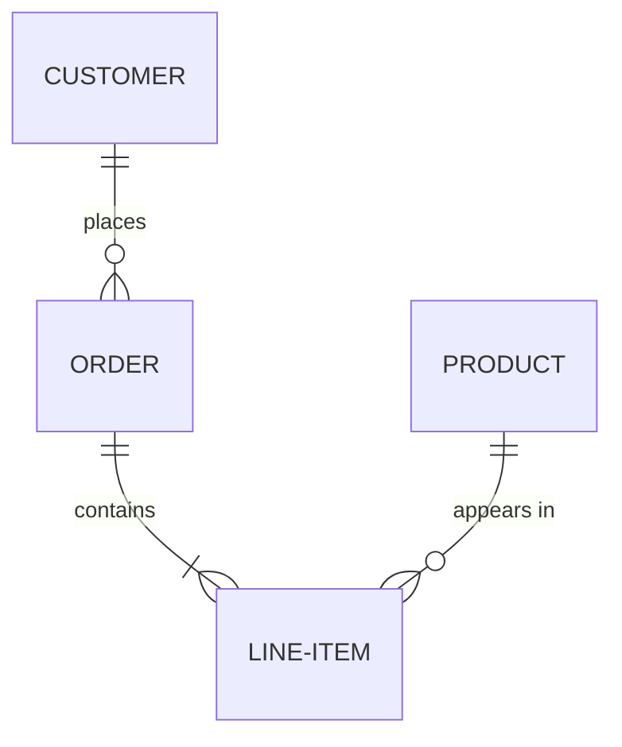

## Entity Definition

### Basic Entity

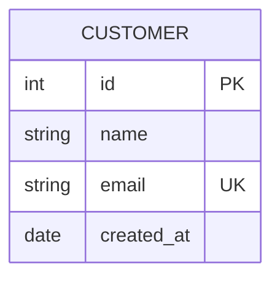

### Attribute Types

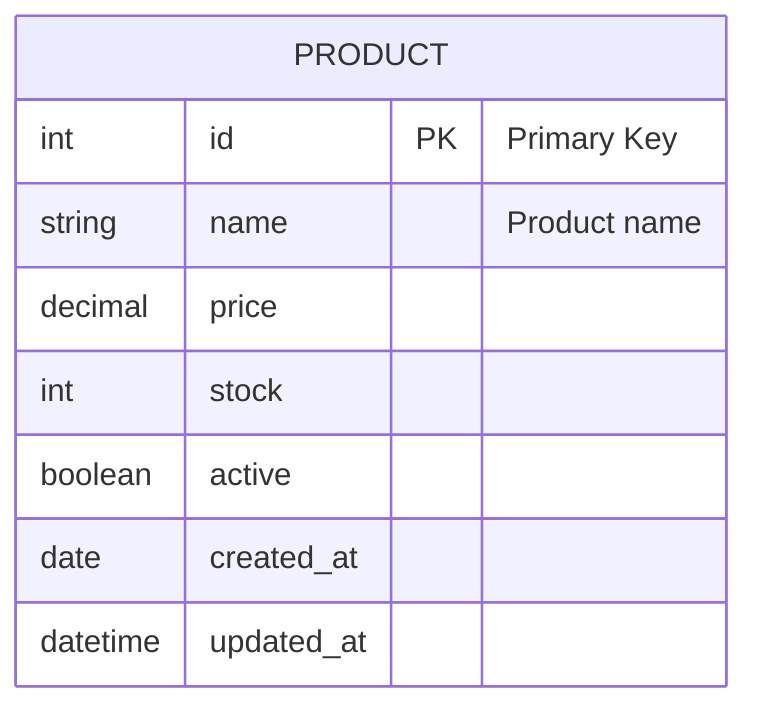

### Key Constraints

| Constraint | Meaning |
|------------|---------|
| `PK` | Primary Key |
| `FK` | Foreign Key |
| `UK` | Unique Key |

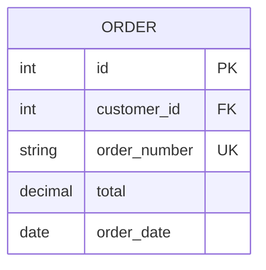

## Relationships

### Cardinality Notation (Crow's Foot)

Mermaid uses crow's foot notation with two characters:
- **Outer character**: Maximum value
- **Inner character**: Minimum value

| Symbol | Meaning |
|--------|---------|
| `\|` | One |
| `o` | Zero |
| `{` | Many |

### Relationship Patterns

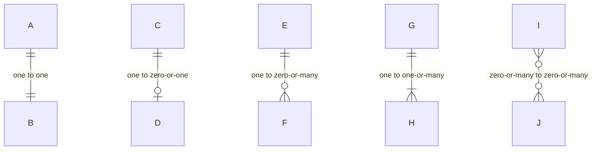

### Relationship Reference Table

| Syntax | Left | Right | Description |
|--------|------|-------|-------------|
| `\|\|--\|\|` | One | One | One-to-one (mandatory) |
| `\|\|--o\|` | One | Zero or one | One-to-optional |
| `\|o--o\|` | Zero or one | Zero or one | Optional-to-optional |
| `\|\|--o{` | One | Zero or many | One-to-many (optional) |
| `\|\|--\|{` | One | One or many | One-to-many (required) |
| `}o--o{` | Many | Many | Many-to-many |

### Identifying vs Non-Identifying

- **Solid line** (`--`): Identifying relationship (dependent entity)
- **Dotted line** (`.`): Non-identifying relationship (independent entity)

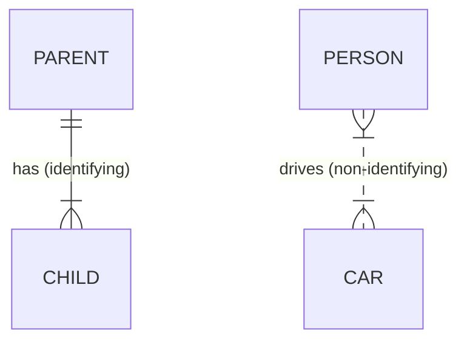

## Relationship Labels

Labels describe the relationship from the first entity's perspective:

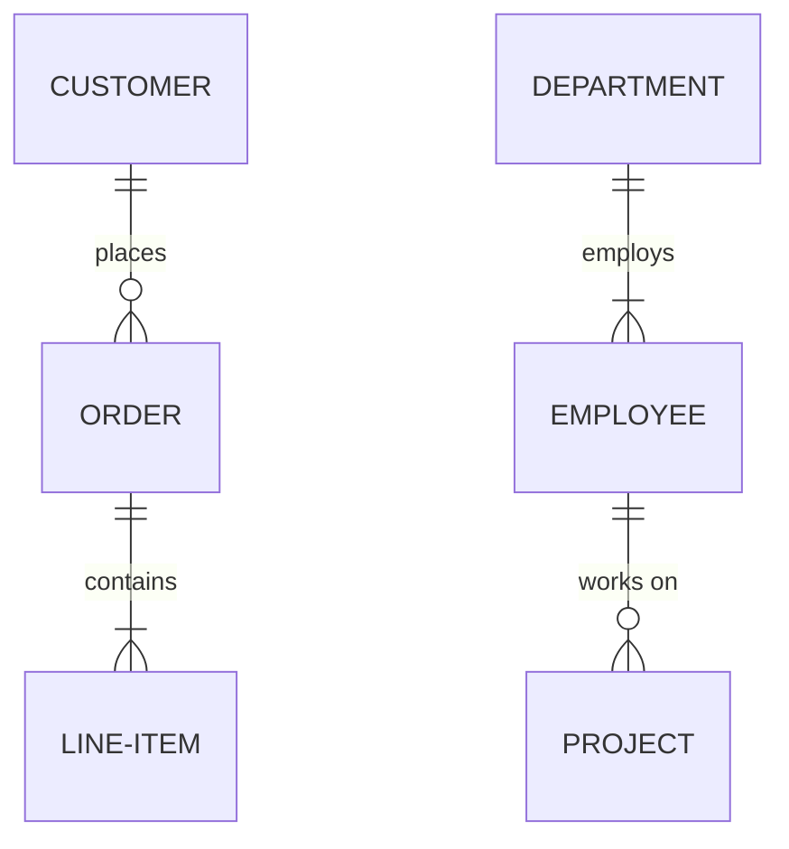

## Common Patterns

### E-Commerce Schema

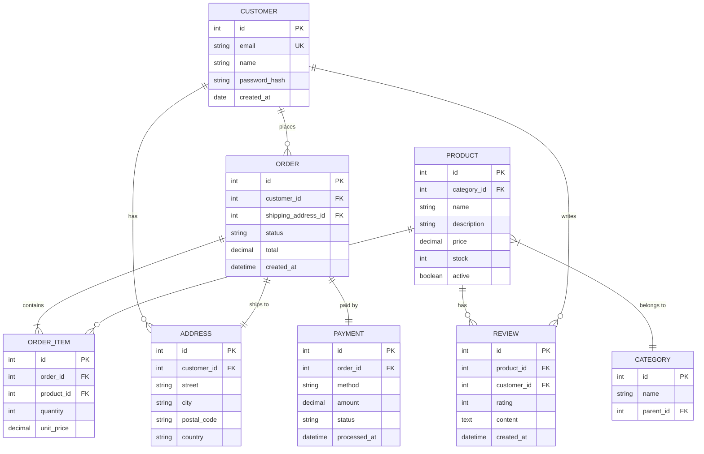

### User Authentication System

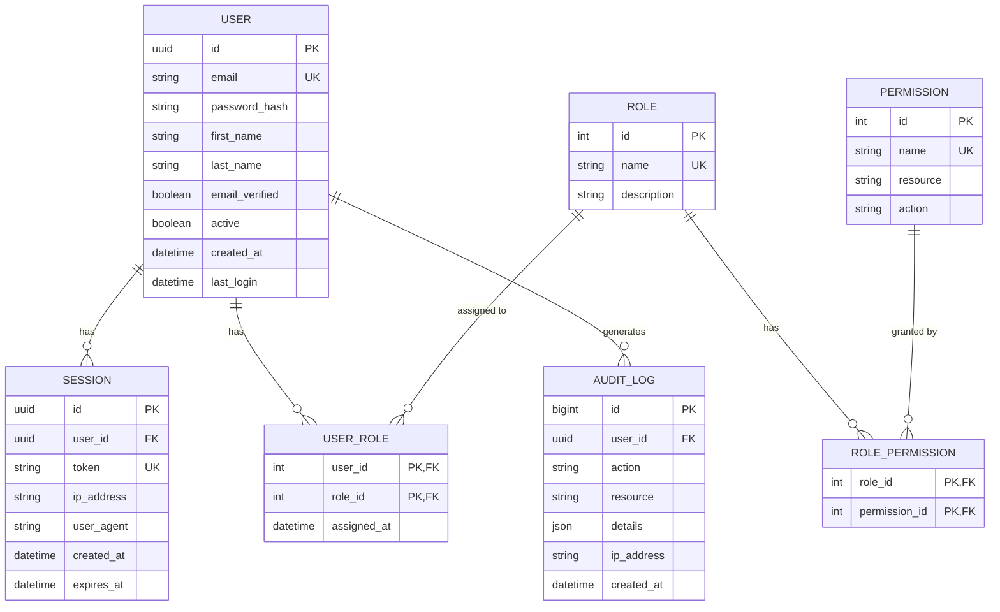

### Content Management System

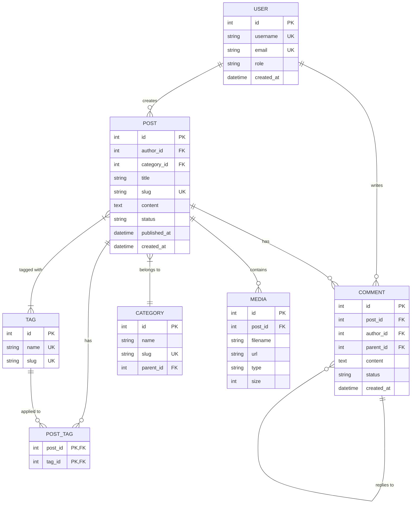

### Multi-Tenant SaaS

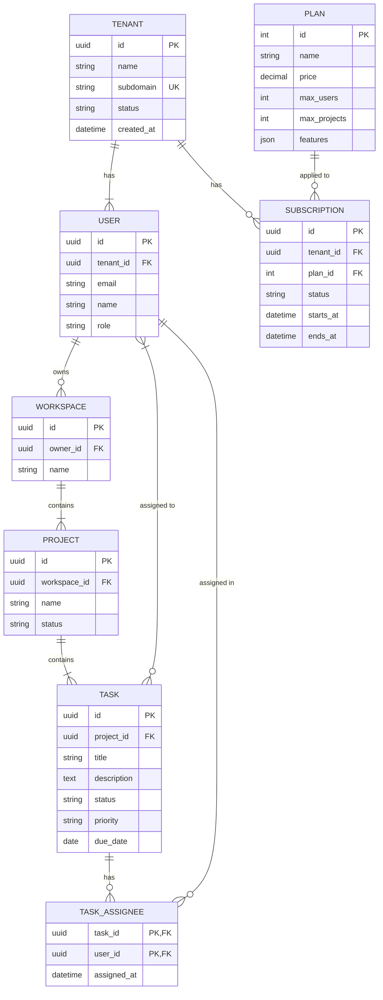

### Knowledge Graph Entity Model (Cagle Style)

```mermaid
erDiagram
    ENTITY ||--o{ TRIPLE : "is subject of"
    ENTITY ||--o{ TRIPLE : "is object of"
    PREDICATE ||--o{ TRIPLE : "relates"
    ENTITY }|--|| CLASS : "instance of"
    CLASS ||--o{ CLASS : "subclass of"
    GRAPH ||--o{ TRIPLE : contains
    NAMESPACE ||--o{ ENTITY : defines
    NAMESPACE ||--o{ PREDICATE : defines

    ENTITY {
        uri id PK
        string local_name
        uri namespace FK
        uri class_uri FK
        json labels
    }

    CLASS {
        uri id PK
        string local_name
        uri parent_class FK
        json labels
    }

    PREDICATE {
        uri id PK
        string local_name
        uri namespace FK
        uri domain
        uri range
    }

    TRIPLE {
        bigint id PK
        uri subject FK
        uri predicate FK
        uri object FK
        uri graph FK
        datetime created_at
    }

    GRAPH {
        uri id PK
        string name
        datetime created_at
    }

    NAMESPACE {
        uri prefix PK
        uri uri UK
        string description
    }
```

## Styling

### Theme Configuration

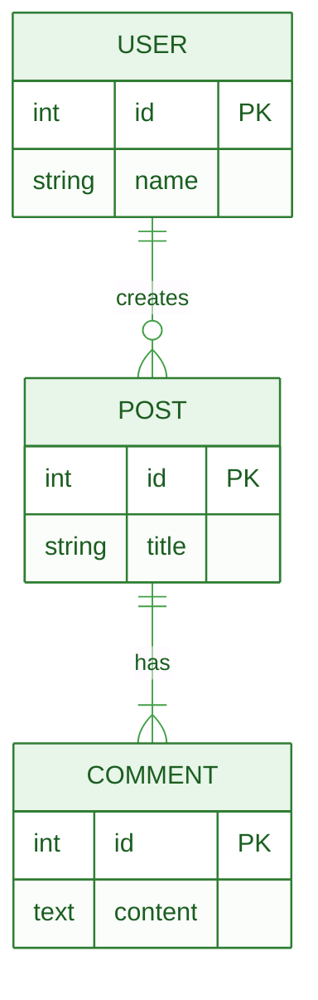

## Configuration Options

### Complete Configuration Block

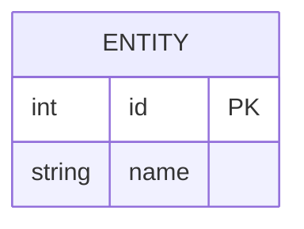

### Configuration Options Reference

| Option | Type | Default | Description |
|--------|------|---------|-------------|
| `titleTopMargin` | number | 25 | Margin above diagram title |
| `diagramPadding` | number | 20 | Padding around entire diagram |
| `layoutDirection` | string | TB | Layout direction: `TB`, `BT`, `LR`, `RL` |
| `minEntityWidth` | number | 100 | Minimum width of entity boxes |
| `minEntityHeight` | number | 75 | Minimum height of entity boxes |
| `entityPadding` | number | 15 | Padding inside entity boxes |
| `stroke` | string | gray | Border color of entities |
| `fill` | string | honeydew | Background fill color |
| `fontSize` | number | 12 | Font size for text |
| `useMaxWidth` | boolean | true | Use maximum available width |

### Layout Direction Examples

#### Left-to-Right Layout

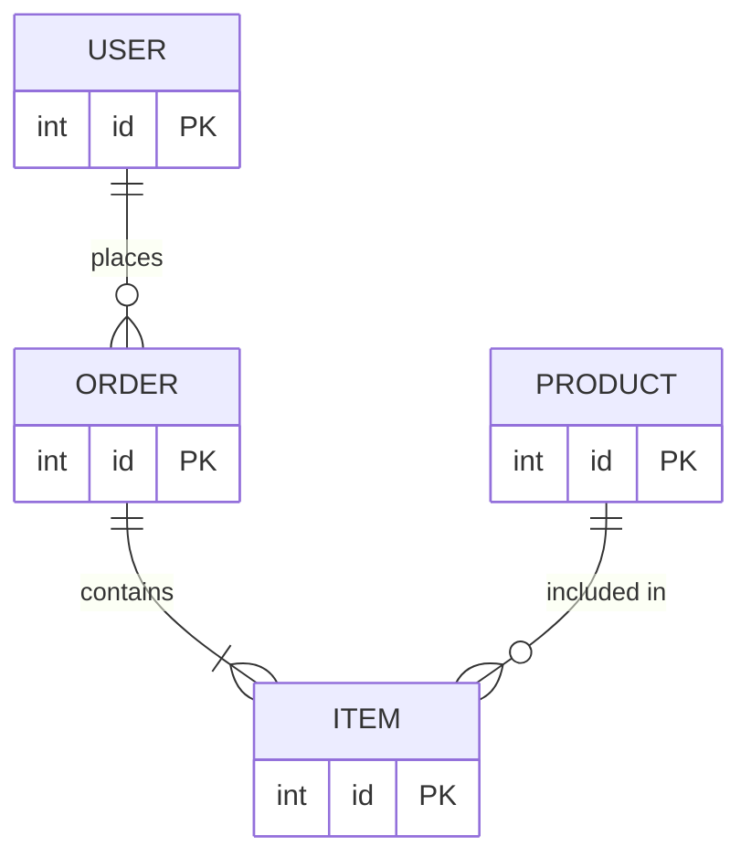

#### Bottom-to-Top Layout

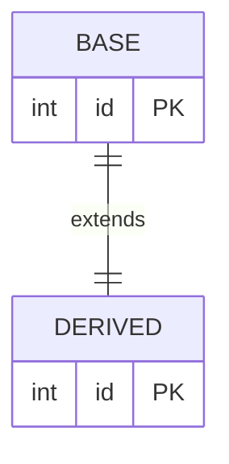

### Entity Sizing Examples

#### Wider Entity Boxes

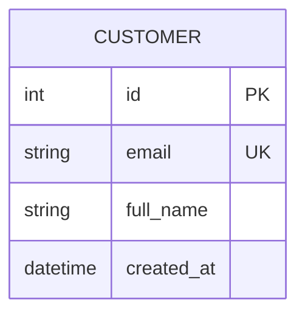

#### Compact Entities

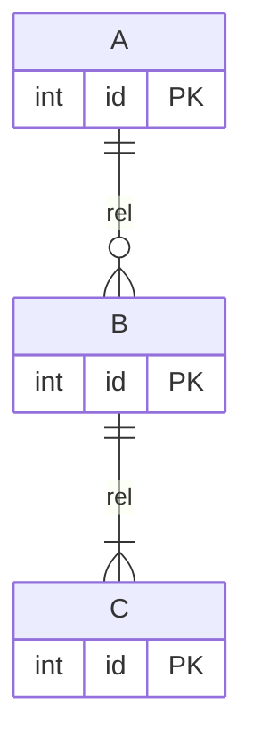

### Custom Colors

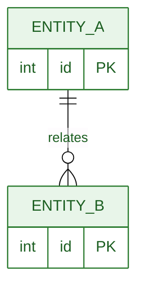

---

## Best Practices

1. **Use consistent naming conventions** - UPPER_CASE for entities, snake_case for attributes
2. **Include all key constraints** - PK, FK, UK for clarity
3. **Label relationships clearly** - Use verbs that describe the relationship
4. **Choose correct cardinality** - Be precise about min/max
5. **Use identifying vs non-identifying appropriately** - Shows dependency
6. **Group related entities** - Organize logically
7. **Add attribute comments** - Explain non-obvious fields
8. **Keep diagrams focused** - One domain per diagram
9. **Use `layoutDirection: LR`** - For wide schemas with many relationships
10. **Adjust `minEntityWidth`** - For entities with long attribute names

## Cardinality Quick Reference

| Relationship | Syntax | Example |
|--------------|--------|---------|
| One-to-One | `\|\|--\|\|` | User has Profile |
| One-to-Many | `\|\|--o{` | User places Orders |
| Many-to-Many | `}o--o{` | Students enroll in Courses |
| Optional One | `\|o--o\|` | Employee has Parking Spot |
| Required Many | `\|\|--\|{` | Order contains Items |
