# Gantt Chart Guide

> **SKILL QUICK REF**: `gantt` • `dateFormat YYYY-MM-DD` • `Task :id, date, duration` • Tags: `done` `active` `crit` `milestone` • `after id` dependencies • `excludes weekends`

## When to Use

- Project timelines and schedules
- Sprint planning
- Release roadmaps
- Resource allocation visualization
- Milestone tracking
- Dependency management

## Overview

Gantt charts visualize project timelines, task dependencies, and milestones. Essential for project planning, scheduling, and tracking progress.

## Basic Syntax

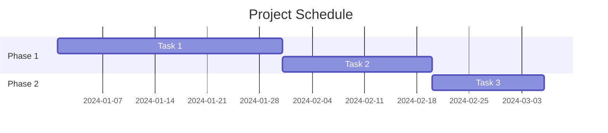

## Configuration

### Date Formats

```mermaid
gantt
    dateFormat YYYY-MM-DD
    title My Project
```

| Format | Example | Description |
|--------|---------|-------------|
| `YYYY-MM-DD` | 2024-01-15 | ISO format (recommended) |
| `DD-MM-YYYY` | 15-01-2024 | European format |
| `MM-DD-YYYY` | 01-15-2024 | US format |
| `YYYY-MM-DD HH:mm` | 2024-01-15 09:00 | With time |

### Axis Format

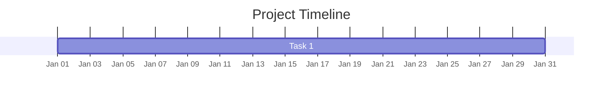

Common axis formats:
- `%Y-%m-%d` - 2024-01-15
- `%b %d` - Jan 15
- `%d %b` - 15 Jan
- `%b %Y` - Jan 2024
- `%W` - Week number

### Title and Today Marker

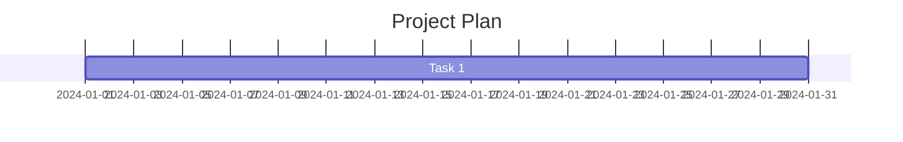

## Sections

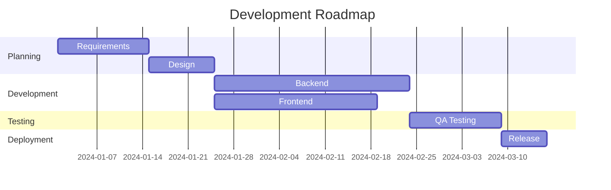

## Task Syntax

### Basic Task Definition

```
Task name : [tag], [id], [start], [end/duration]
```

### Duration Formats

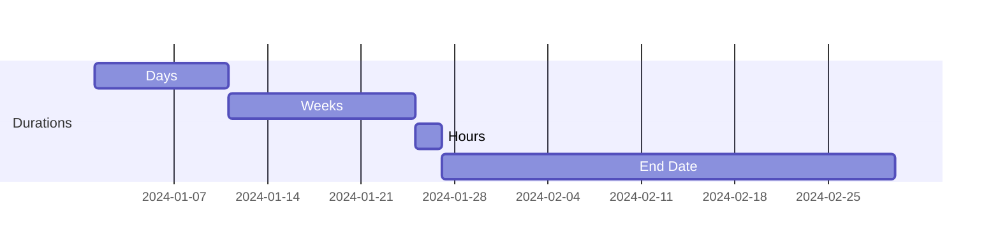

| Unit | Syntax | Example |
|------|--------|---------|
| Days | `d` | `10d` |
| Weeks | `w` | `2w` |
| Hours | `h` | `48h` |
| Minutes | `m` | `120m` |
| Specific date | Date | `2024-03-01` |

### Task Tags

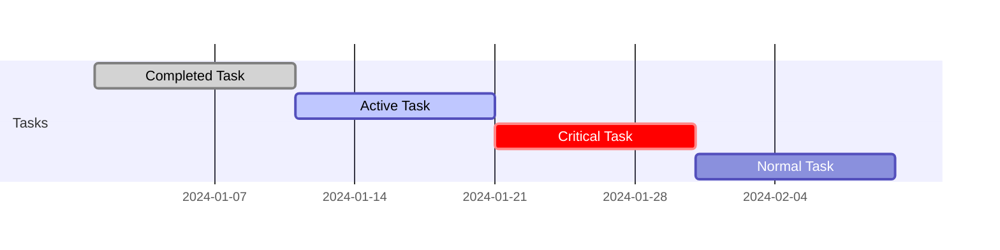

| Tag | Appearance | Use Case |
|-----|------------|----------|
| `done` | Filled/grayed | Completed tasks |
| `active` | Highlighted | Currently working |
| `crit` | Red/emphasized | Critical path items |
| `milestone` | Diamond marker | Key deliverables |

### Combining Tags

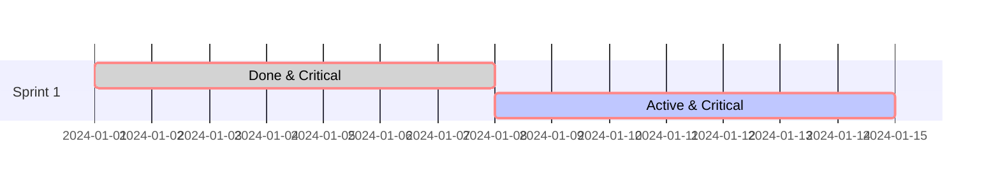

## Milestones

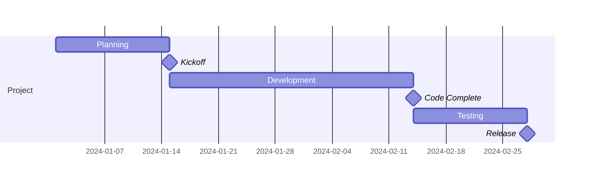

Note: Milestones use `0d` duration and are positioned at `start + duration/2`.

## Dependencies

### After Syntax

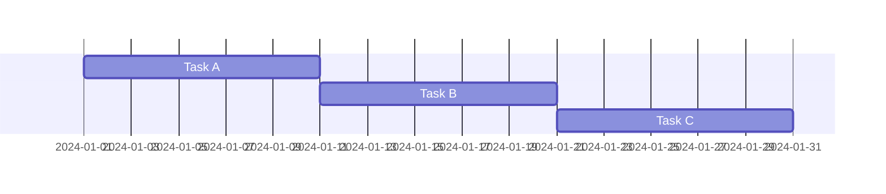

### Multiple Dependencies

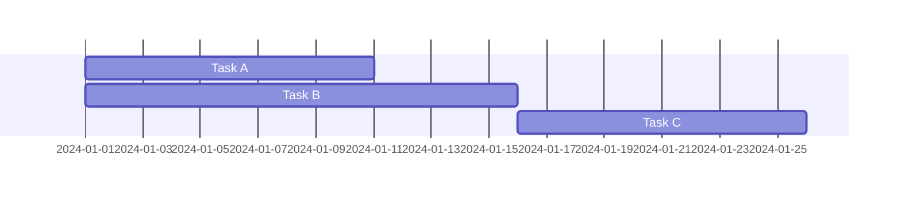

Task C starts after both A and B complete.

### Until Syntax (v10.9.0+)

```mermaid
gantt
    dateFormat YYYY-MM-DD

    section Dependencies
    Setup             :setup, 2024-01-01, 5d
    Waiting           :wait, after setup, until main, 0d
    Main Task         :main, 2024-01-20, 10d
```

## Exclusions

### Excluding Days

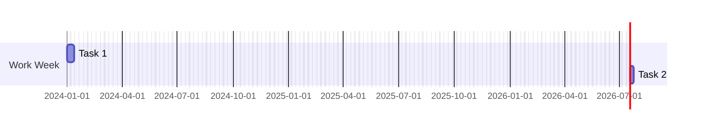

### Exclusion Options

| Exclusion | Effect |
|-----------|--------|
| `weekends` | Excludes Saturday and Sunday |
| `sunday` | Excludes all Sundays |
| `saturday` | Excludes all Saturdays |
| `2024-01-15` | Excludes specific date |
| `monday` | Excludes all Mondays |

### Multiple Exclusions

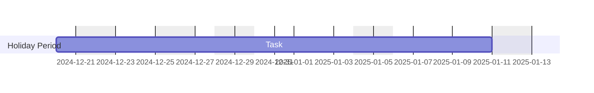

## Vertical Markers

```mermaid
gantt
    dateFormat YYYY-MM-DD
    vert 2024-02-01, 2024-02-15

    section Tasks
    Task 1 :2024-01-15, 30d
    Task 2 :after a, 20d
```

Useful for highlighting deadlines, events, or checkpoints.

## Tick Intervals


Options: `1day`, `1week`, `1month`, etc.

## Week Start Day

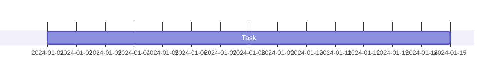

Options: `sunday` (default), `monday`, etc.

## Common Patterns

### Software Development Sprint

```mermaid
gantt
    title Sprint 24.1
    dateFormat YYYY-MM-DD
    excludes weekends

    section Planning
    Sprint Planning       :done, sp, 2024-01-08, 1d
    Backlog Refinement    :done, br, 2024-01-09, 1d

    section Development
    Feature: Auth         :done, auth, 2024-01-10, 4d
    Feature: Dashboard    :active, dash, 2024-01-10, 6d
    Feature: Reports      :crit, rep, after auth, 4d
    Bug Fixes             :bugs, 2024-01-15, 3d

    section Testing
    Unit Tests            :ut, after auth dash, 2d
    Integration Tests     :it, after rep, 2d

    section Milestones
    Code Freeze           :milestone, cf, 2024-01-22, 0d
    Sprint Review         :milestone, sr, 2024-01-23, 0d
    Retrospective         :milestone, retro, 2024-01-23, 0d
```

### Product Launch Timeline

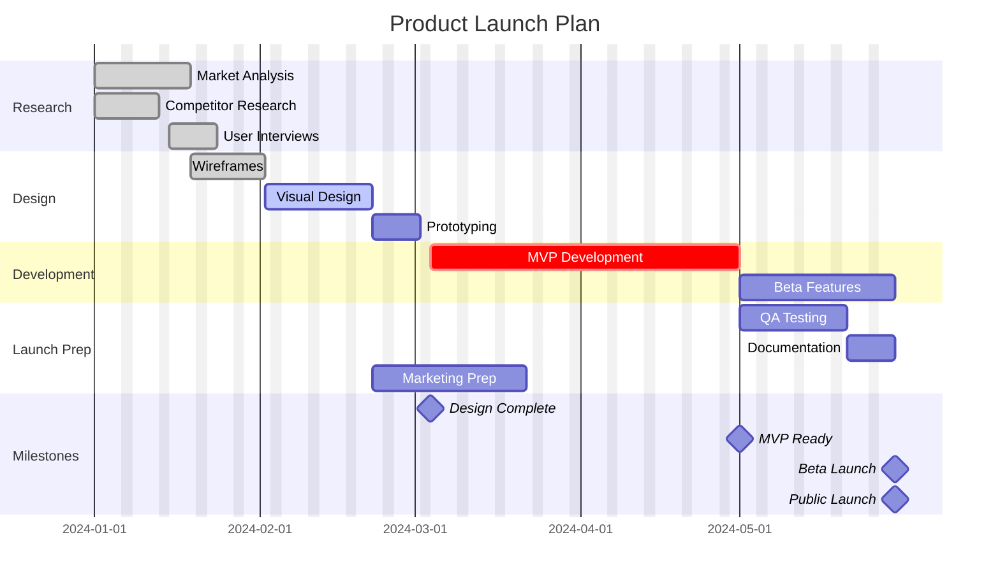

### Construction Project

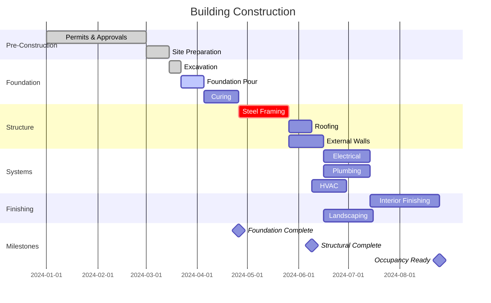

### Event Planning

```mermaid
gantt
    title Conference Planning
    dateFormat YYYY-MM-DD

    section Venue & Logistics
    Venue Selection       :done, venue, 2024-01-15, 14d
    Vendor Contracts      :done, vendors, after venue, 10d
    AV Setup Plan         :av, after vendors, 7d

    section Content
    Call for Speakers     :done, cfp, 2024-01-15, 30d
    Speaker Selection     :active, sel, after cfp, 14d
    Schedule Finalization :sched, after sel, 7d

    section Marketing
    Website Launch        :done, web, 2024-01-20, 10d
    Early Bird Tickets    :early, after web, 30d
    Regular Tickets       :reg, after early, 45d
    Final Push            :push, after reg, 14d

    section Pre-Event
    Speaker Prep          :prep, after sched, 21d
    Final Walkthrough     :walk, 2024-05-13, 1d
    Setup Day             :setup, 2024-05-14, 1d

    section Event
    Day 1                 :crit, d1, 2024-05-15, 1d
    Day 2                 :crit, d2, 2024-05-16, 1d

    section Milestones
    Registration Opens    :milestone, m1, after web, 0d
    Speakers Confirmed    :milestone, m2, after sel, 0d
    Event Start           :milestone, m3, 2024-05-15, 0d
```

## Styling

### Theme Configuration

```mermaid
%%{init: {
  "theme": "base",
  "themeVariables": {
    "primaryColor": "#4a90d9",
    "primaryTextColor": "#fff",
    "primaryBorderColor": "#2c5282",
    "lineColor": "#718096",
    "secondaryColor": "#90cdf4",
    "tertiaryColor": "#e2e8f0"
  }
}}%%
gantt
    title Styled Gantt
    dateFormat YYYY-MM-DD

    section Phase 1
    Task A :a, 2024-01-01, 14d
    Task B :b, after a, 10d

    section Phase 2
    Task C :crit, c, after b, 14d
```

## Best Practices

1. **Use meaningful task IDs** - Makes dependencies clearer
2. **Group related tasks in sections** - Improves readability
3. **Mark critical path items** - Highlights key dependencies
4. **Include milestones** - Shows key deliverables
5. **Exclude non-working days** - More accurate timelines
6. **Use consistent date formats** - Prevents confusion
7. **Add vertical markers for deadlines** - Visual emphasis
8. **Keep charts focused** - Don't overcrowd

## Quick Reference

### Task Tags
- `done` - Completed
- `active` - In progress
- `crit` - Critical path
- `milestone` - Key point (0d duration)

### Duration Units
- `d` - Days
- `w` - Weeks
- `h` - Hours

### Dependencies
- `after taskId` - Sequential dependency
- `after task1 task2` - Multiple dependencies
- `until taskId` - Run until another task starts
