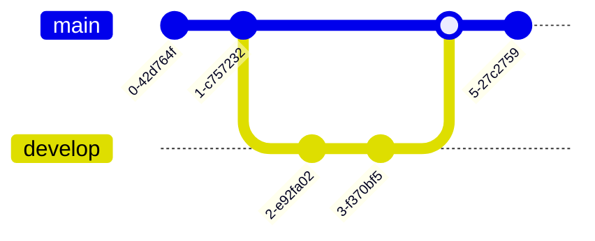

# Other Mermaid Diagram Types Guide

> **SKILL QUICK REF**: `pie` `mindmap` `journey` `timeline` `quadrantChart` `gitGraph` `C4Context` `sankey-beta` `xychart-beta` `requirementDiagram` `block-beta` `kanban`

## Diagram Types in This Guide

| Type | Declaration | Use Case |
|------|-------------|----------|
| Pie Chart | `pie` | Proportions, distributions |
| Mind Map | `mindmap` | Brainstorming, hierarchies |
| User Journey | `journey` | UX mapping, customer experience |
| Timeline | `timeline` | History, milestones |
| Quadrant | `quadrantChart` | Priority matrices, analysis |
| GitGraph | `gitGraph` | Git branching visualization |
| C4 | `C4Context/Container/Component` | Software architecture |
| Sankey | `sankey-beta` | Flow quantities, budgets |
| XY Chart | `xychart-beta` | Trends, bar/line charts |

## Overview

This guide covers additional Mermaid diagram types beyond the core flowchart, sequence, class, state, ER, and Gantt diagrams.

---

## Pie Charts

### Basic Syntax


### With Show Data


### Themed Pie Chart


---

## Mind Maps

### Basic Syntax


### Node Shapes


### With Icons


### Markdown Strings

```mermaid
mindmap
    root(("`**Main Topic**`"))
        ("`*Italic Branch*`")
            Leaf 1
            Leaf 2
        ["`Code: \`example\``"]
            Detail A
            Detail B
```

---

## User Journey Maps

### Basic Syntax


### Multi-Actor Journey


Score: 1 (negative) to 5 (positive)

---

## Timeline Diagrams

### Basic Syntax


### With Sections


### Multiple Events Per Period


---

## Quadrant Charts

### Basic Syntax


### Eisenhower Matrix


---

## GitGraph

### Basic Syntax



### Feature Branch Workflow


### With Custom Styling


---

## C4 Architecture Diagrams

### System Context (C4Context)


### Container Diagram (C4Container)


### Component Diagram (C4Component)


---

## Sankey Diagrams

### Basic Syntax

```mermaid
sankey-beta

Revenue,Expenses,70
Revenue,Profit,30
Expenses,Salaries,40
Expenses,Operations,20
Expenses,Marketing,10
Profit,Reinvestment,20
Profit,Dividends,10
```

### Energy Flow Example

```mermaid
sankey-beta

Solar,Electricity,100
Wind,Electricity,80
Natural Gas,Electricity,150
Electricity,Residential,120
Electricity,Commercial,100
Electricity,Industrial,80
Electricity,Losses,30
```

---

## XY Charts

### Line Chart

```mermaid
xychart-beta
    title "Monthly Sales 2024"
    x-axis [Jan, Feb, Mar, Apr, May, Jun]
    y-axis "Revenue (K)" 0 --> 100
    line [30, 45, 60, 55, 70, 85]
```

### Bar Chart

```mermaid
xychart-beta
    title "Quarterly Performance"
    x-axis [Q1, Q2, Q3, Q4]
    y-axis "Units Sold" 0 --> 500
    bar [250, 320, 280, 450]
```

### Combined Chart

```mermaid
xychart-beta
    title "Sales vs Target"
    x-axis [Jan, Feb, Mar, Apr, May]
    y-axis "Amount" 0 --> 100
    bar [40, 55, 45, 60, 75]
    line [50, 50, 50, 50, 50]
```

---

## Requirement Diagrams

### Basic Syntax

```mermaid
requirementDiagram

    requirement user_auth {
        id: 1
        text: Users must be able to authenticate
        risk: high
        verifymethod: test
    }

    requirement data_encryption {
        id: 2
        text: All data must be encrypted at rest
        risk: high
        verifymethod: inspection
    }

    element auth_module {
        type: module
    }

    auth_module - satisfies -> user_auth
    data_encryption - derives -> user_auth
```

---

## Block Diagrams (Beta)

### Basic Syntax

```mermaid
block-beta
    columns 3

    a["Frontend"]:1
    b["API"]:1
    c["Database"]:1

    a --> b --> c
```

### System Architecture

```mermaid
block-beta
    columns 4

    block:client
        columns 1
        Web["Web App"]
        Mobile["Mobile App"]
    end

    space

    block:backend
        columns 1
        LB["Load Balancer"]
        API["API Servers"]
        Worker["Workers"]
    end

    block:data
        columns 1
        DB[("Database")]
        Cache[("Cache")]
        Queue[("Queue")]
    end

    client --> LB
    LB --> API
    API --> DB
    API --> Cache
    API --> Queue
    Worker --> Queue
```

---

## Kanban (Experimental)

```mermaid
kanban
    column1[Todo]
        task1[Design review]
        task2[Write tests]
    column2[In Progress]
        task3[API development]
    column3[Done]
        task4[Requirements]
        task5[Database schema]
```

---

## Best Practices by Diagram Type

| Diagram | Best For | Key Tip |
|---------|----------|---------|
| **Pie** | Proportions, distributions | Keep under 7 segments |
| **Mindmap** | Brainstorming, hierarchies | Use shapes for emphasis |
| **Journey** | UX mapping, experiences | Include pain point scores |
| **Timeline** | History, roadmaps | Group related events |
| **Quadrant** | Prioritization, analysis | Label quadrants clearly |
| **GitGraph** | Version control visualization | Show key branches |
| **C4** | Architecture documentation | Start with Context, drill down |
| **Sankey** | Flow quantities, budgets | Ensure data sums correctly |
| **XY** | Trends, comparisons | Combine bar + line when useful |
| **Requirement** | Traceability | Link to implementation elements |
