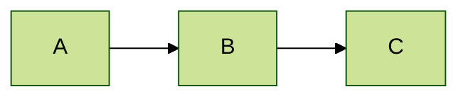
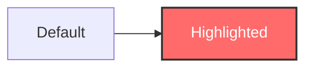
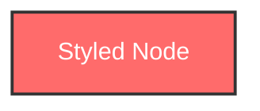
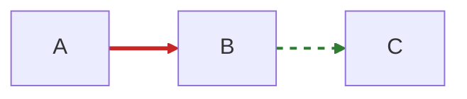
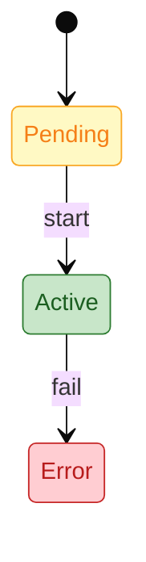
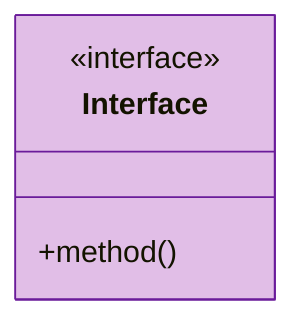

# Styling Guide

> **SKILL QUICK REF**: `theme: base` required | Cagle palette: Infrastructure `#E3F2FD/#1565C0` | Service `#E8F5E9/#2E7D32` | Data `#FFF8E1/#F57F17` | `classDef name fill:,stroke:,color:` | Only hex colors work

## When to Use

- Applying semantic colors to diagrams
- Custom branding and color schemes
- WCAG-compliant accessible diagrams
- Knowledge graph and ontology visualization
- Status indicators (success/warning/error)

---

## The Cagle Color System

Based on Kurt Cagle's work on SVG visualization and semantic data representation. Designed for professional diagrams with WCAG AA compliance.

### Core Principles

1. **Semantic Consistency** - Colors carry meaning across all diagrams
2. **High Legibility** - WCAG AA contrast ratios minimum
3. **Accessibility** - Distinguishable for color vision deficiency
4. **Professional Aesthetic** - Soft backgrounds, strong strokes

---

## Primary Semantic Colors

| Semantic Type | Fill | Stroke | Text | Use Case |
|---------------|------|--------|------|----------|
| **Infrastructure** | `#E3F2FD` | `#1565C0` | `#0D47A1` | Cloud, clusters, platforms, networks |
| **Service** | `#E8F5E9` | `#2E7D32` | `#1B5E20` | APIs, microservices, components |
| **Data** | `#FFF8E1` | `#F57F17` | `#E65100` | Databases, storage, files, queues |
| **User/Actor** | `#F3E5F5` | `#7B1FA2` | `#4A148C` | People, roles, external actors |
| **Process** | `#E1F5FE` | `#0277BD` | `#01579B` | Workflows, actions, operations |
| **Security** | `#E0F2F1` | `#00695C` | `#004D40` | Auth, encryption, access control |
| **External** | `#ECEFF1` | `#455A64` | `#263238` | Third-party, external systems |

### Status Colors

| Status | Fill | Stroke | Use Case |
|--------|------|--------|----------|
| **Success** | `#C8E6C9` | `#2E7D32` | Complete, passed, healthy |
| **Warning** | `#FFF9C4` | `#F9A825` | Attention, pending, caution |
| **Error** | `#FFCDD2` | `#C62828` | Failed, critical, blocked |
| **Info** | `#BBDEFB` | `#1565C0` | Active, in-progress, informational |
| **Neutral** | `#F5F5F5` | `#757575` | Inactive, disabled, default |

### Knowledge Graph Colors (Semantic)

For RDF/ontology visualization:

| Entity Type | Fill | Stroke | Use Case |
|-------------|------|--------|----------|
| **Class/Type** | `#E1BEE7` | `#6A1B9A` | Ontology classes, schemas |
| **Instance** | `#B3E5FC` | `#0277BD` | Data instances, records |
| **Property** | `#F8BBD9` | `#AD1457` | Relationships, predicates |
| **Literal** | `#FFF9C4` | `#F57F17` | Values, text, numbers, dates |
| **Namespace** | `#D7CCC8` | `#5D4037` | Prefixes, URIs |

---

## Copy-Paste classDef Blocks

### Architecture Diagrams

```
%% Cagle Color System - Architecture
classDef infra fill:#E3F2FD,stroke:#1565C0,stroke-width:2px,color:#0D47A1
classDef service fill:#E8F5E9,stroke:#2E7D32,stroke-width:2px,color:#1B5E20
classDef data fill:#FFF8E1,stroke:#F57F17,stroke-width:2px,color:#E65100
classDef user fill:#F3E5F5,stroke:#7B1FA2,stroke-width:2px,color:#4A148C
classDef process fill:#E1F5FE,stroke:#0277BD,stroke-width:2px,color:#01579B
classDef security fill:#E0F2F1,stroke:#00695C,stroke-width:2px,color:#004D40
classDef external fill:#ECEFF1,stroke:#455A64,stroke-width:2px,color:#263238
```

### Status Indicators

```
%% Status Colors
classDef success fill:#C8E6C9,stroke:#2E7D32,stroke-width:2px,color:#1B5E20
classDef warning fill:#FFF9C4,stroke:#F9A825,stroke-width:2px,color:#F57F17
classDef error fill:#FFCDD2,stroke:#C62828,stroke-width:2px,color:#B71C1C
classDef info fill:#BBDEFB,stroke:#1565C0,stroke-width:2px,color:#0D47A1
classDef neutral fill:#F5F5F5,stroke:#757575,stroke-width:2px,color:#424242
```

### Knowledge Graphs

```
%% Knowledge Graph Colors
classDef class fill:#E1BEE7,stroke:#6A1B9A,stroke-width:2px,color:#4A148C
classDef instance fill:#B3E5FC,stroke:#0277BD,stroke-width:2px,color:#01579B
classDef property fill:#F8BBD9,stroke:#AD1457,stroke-width:2px,color:#880E4F
classDef literal fill:#FFF9C4,stroke:#F57F17,stroke-width:2px,color:#E65100
```

---

## Built-in Themes

### Available Themes

| Theme | Description | Best For |
|-------|-------------|----------|
| `default` | Standard blue/gray palette | General use |
| `neutral` | Black and white | Printing, formal docs |
| `dark` | Dark background | Dark mode UIs |
| `forest` | Green palette | Nature-themed |
| `base` | Customizable foundation | **Custom branding** |

> **CRITICAL**: Only `base` theme supports customization via themeVariables.

### Applying Themes



---

## Theme Variables (base theme only)

### Critical Requirements

1. **Only the `base` theme supports customization** - Other themes ignore `themeVariables`
2. **Only hex colors work** - Named colors like `red`, `blue` will fail
3. **Use 6-character hex codes** - e.g., `#FF6B6B`, not `#F00`

### Core Variables

```yaml
%%{init: {
  "theme": "base",
  "themeVariables": {
    "primaryColor": "#E3F2FD",
    "primaryTextColor": "#0D47A1",
    "primaryBorderColor": "#1565C0",
    "secondaryColor": "#E8F5E9",
    "tertiaryColor": "#FFF8E1",
    "lineColor": "#37474F",
    "textColor": "#263238",
    "background": "#FFFFFF",
    "fontFamily": "Inter, sans-serif",
    "fontSize": "14px"
  }
}}%%
```

### Variable Reference

| Variable | Description |
|----------|-------------|
| `primaryColor` | Main node background |
| `primaryTextColor` | Text on primary elements |
| `primaryBorderColor` | Border on primary nodes |
| `secondaryColor` | Secondary elements |
| `tertiaryColor` | Tertiary elements |
| `lineColor` | Connection lines |
| `textColor` | General text |
| `background` | Diagram background |
| `fontFamily` | Font family |
| `fontSize` | Base font size |

---

## classDef Syntax

### Basic Usage



### Available Properties

| Property | Example | Description |
|----------|---------|-------------|
| `fill` | `#E3F2FD` | Background color |
| `stroke` | `#1565C0` | Border color |
| `stroke-width` | `2px` | Border thickness |
| `color` | `#0D47A1` | Text color |
| `stroke-dasharray` | `5,5` | Dashed border |
| `font-weight` | `bold` | Text weight |

### Inline Style (Single Node)



### Link Styling



---

## Diagram-Specific Styling

### Sequence Diagram

```yaml
%%{init: {
  "theme": "base",
  "themeVariables": {
    "actorBkg": "#F3E5F5",
    "actorBorder": "#7B1FA2",
    "actorTextColor": "#4A148C",
    "signalColor": "#37474F",
    "signalTextColor": "#263238",
    "noteBkgColor": "#FFF8E1",
    "noteTextColor": "#E65100",
    "noteBorderColor": "#F57F17",
    "activationBkgColor": "#E8F5E9",
    "activationBorderColor": "#2E7D32"
  }
}}%%
```

### State Diagram



### Class Diagram



### Gantt Chart

```yaml
%%{init: {
  "theme": "base",
  "themeVariables": {
    "gridColor": "#ECEFF1",
    "doneTaskBkgColor": "#C8E6C9",
    "doneTaskBorderColor": "#2E7D32",
    "activeTaskBkgColor": "#BBDEFB",
    "activeTaskBorderColor": "#1565C0",
    "critBkgColor": "#FFCDD2",
    "critBorderColor": "#C62828",
    "todayLineColor": "#C62828"
  }
}}%%
```

### Pie Chart

```yaml
%%{init: {
  "theme": "base",
  "themeVariables": {
    "pie1": "#E3F2FD",
    "pie2": "#E8F5E9",
    "pie3": "#FFF8E1",
    "pie4": "#F3E5F5",
    "pie5": "#E1F5FE",
    "pieStrokeColor": "#37474F",
    "pieStrokeWidth": "2px"
  }
}}%%
```

---

## WCAG Accessibility Compliance

### Contrast Ratios

All Cagle palette combinations meet WCAG AA standards (4.5:1 minimum):

| Combination | Ratio | Level |
|-------------|-------|-------|
| Infrastructure: `#0D47A1` on `#E3F2FD` | 7.2:1 | AAA |
| Service: `#1B5E20` on `#E8F5E9` | 6.8:1 | AAA |
| Data: `#E65100` on `#FFF8E1` | 4.9:1 | AA |
| User: `#4A148C` on `#F3E5F5` | 8.1:1 | AAA |
| Error: `#B71C1C` on `#FFCDD2` | 5.2:1 | AA |

### Color Blindness Considerations

The palette is designed to be distinguishable for:

- **Deuteranopia** (red-green) - Uses blue/yellow differentiation
- **Protanopia** (red-green) - Avoids pure red/green adjacency
- **Tritanopia** (blue-yellow) - Uses saturation differences

### Non-Color Indicators

Always combine color with:

- **Shape** - Different node shapes for different types
- **Labels** - Clear text labels on all elements
- **Patterns** - Dashed vs solid lines (`stroke-dasharray: 5,5`)

---

## Quick Reference

### Hex Color Quick Reference

```
Infrastructure: #E3F2FD / #1565C0 / #0D47A1
Service:        #E8F5E9 / #2E7D32 / #1B5E20
Data:           #FFF8E1 / #F57F17 / #E65100
User:           #F3E5F5 / #7B1FA2 / #4A148C
Process:        #E1F5FE / #0277BD / #01579B
Security:       #E0F2F1 / #00695C / #004D40
External:       #ECEFF1 / #455A64 / #263238
Success:        #C8E6C9 / #2E7D32
Warning:        #FFF9C4 / #F9A825
Error:          #FFCDD2 / #C62828
Info:           #BBDEFB / #1565C0
Neutral:        #F5F5F5 / #757575
```

### Best Practices

1. **Use `base` theme** for any customization
2. **Only hex colors** - named colors don't work
3. **Maintain contrast** - use Cagle palette for guaranteed WCAG compliance
4. **Be consistent** - same colors = same meanings across diagrams
5. **Combine color with shape** - for accessibility
6. **Use classDef** for reusability - define once, apply many times

---

## References

- Cagle, Kurt & Bellamy-Royds, Amelia. *SVG Colors, Patterns & Gradients*. O'Reilly Media.
- [Mermaid Theming Documentation](https://mermaid.js.org/config/theming.html)
- [WCAG 2.1 Contrast Guidelines](https://www.w3.org/WAI/WCAG21/Understanding/contrast-minimum.html)
