# Use Case Scenarios - Diagram Type Selection Guide

> **SKILL QUICK REF**: Database→`erDiagram` | API calls→`sequenceDiagram` | States→`stateDiagram-v2` | Classes→`classDiagram` | Schedule→`gantt` | Architecture→`flowchart+ELK` | Semantic→`flowchart LR`

## When to Use

- Choosing the right diagram type for a use case
- Understanding diagram type strengths and trade-offs
- Mapping domains to visualization approaches

## Overview

This guide maps common diagramming scenarios to their optimal Mermaid diagram types, helping you choose the right visualization for your needs.

---

## Quick Reference Matrix

### By Domain

| Domain | Primary Diagram Types | Secondary Options |
|--------|----------------------|-------------------|
| **Software Architecture** | C4, Flowchart, Class | Sequence, ER |
| **Database Design** | ER Diagram | Class Diagram |
| **API Documentation** | Sequence | Flowchart |
| **Project Management** | Gantt | Timeline, Kanban |
| **Business Process** | Flowchart | State, User Journey |
| **UX/CX Design** | User Journey | Flowchart, Mindmap |
| **Data Analysis** | Pie, XY Chart, Sankey | Quadrant |
| **Knowledge Management** | Mindmap | Flowchart (Cagle style) |
| **DevOps/CI-CD** | Flowchart, GitGraph | Sequence |
| **Requirements** | Requirement Diagram | Mindmap |

---

## Software Development Scenarios

### 1. System Architecture Overview

**Best Choice: C4 Context Diagram**

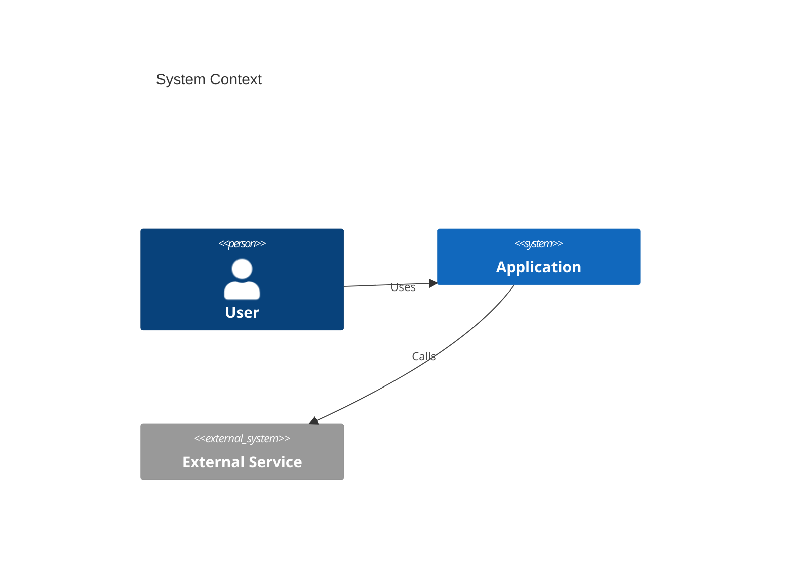

**When to use:**
- High-level system documentation
- Stakeholder presentations
- Architecture decision records

**Alternatives:**
- Flowchart with subgraphs for simpler systems
- Block diagram for infrastructure focus

---

### 2. API Request/Response Flow

**Best Choice: Sequence Diagram**

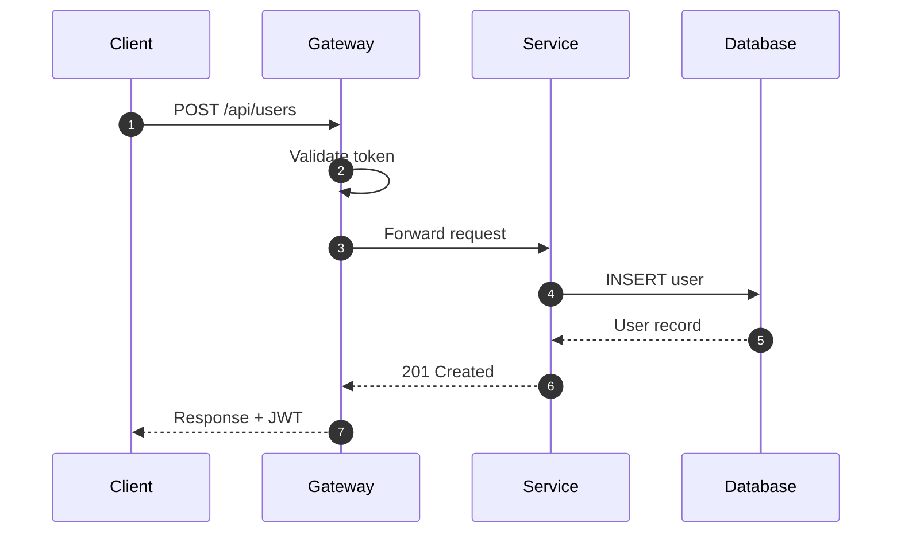

**When to use:**
- REST/GraphQL API documentation
- Authentication flows
- Microservice interactions
- Debugging communication issues

---

### 3. Database Schema Design

**Best Choice: ER Diagram**

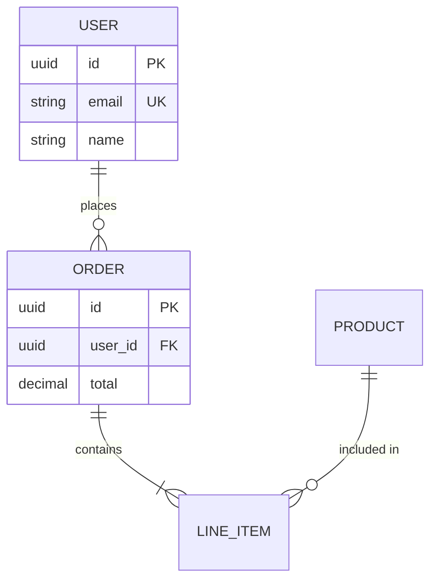

**When to use:**
- Database design documentation
- Data model reviews
- ORM/migration planning

---

### 4. Object-Oriented Design

**Best Choice: Class Diagram**

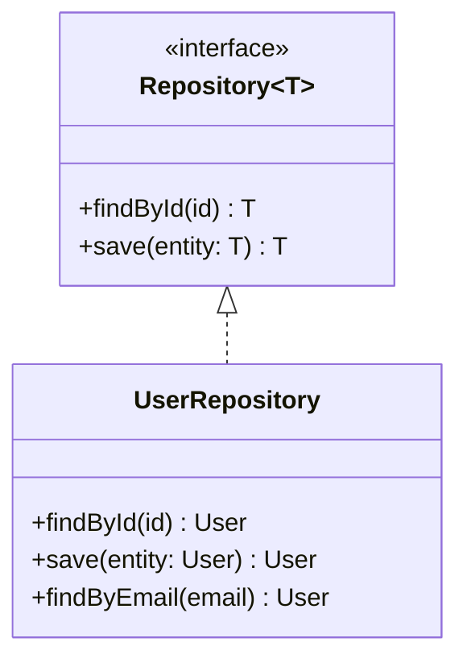

**When to use:**
- Design pattern documentation
- Code architecture planning
- API/SDK design
- Inheritance/interface relationships

---

### 5. Application State Management

**Best Choice: State Diagram**

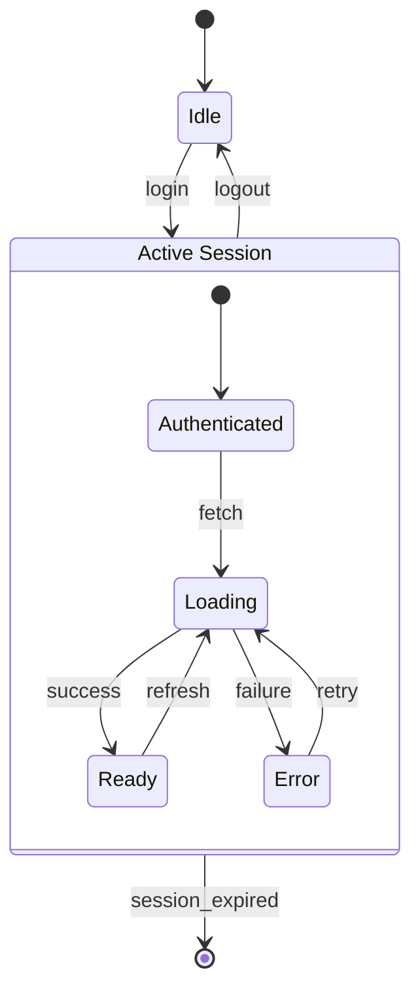

**When to use:**
- UI component states
- Workflow/process states
- Game logic
- Order/transaction lifecycles

---

### 6. Git Workflow Documentation

**Best Choice: GitGraph**

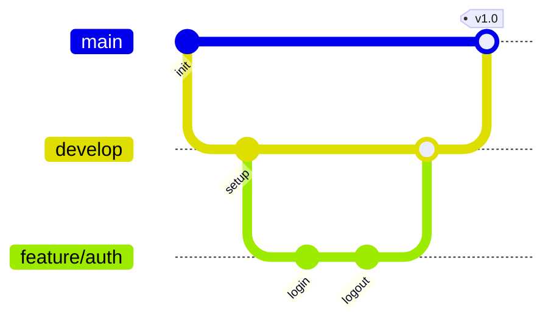

**When to use:**
- Branching strategy documentation
- Release planning
- Training materials
- PR/merge visualization

---

### 7. CI/CD Pipeline

**Best Choice: Flowchart**

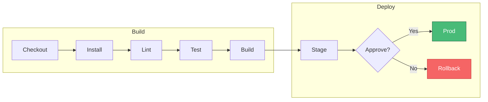

**When to use:**
- Pipeline documentation
- DevOps onboarding
- Automation design

---

## Project Management Scenarios

### 8. Project Timeline & Scheduling

**Best Choice: Gantt Chart**

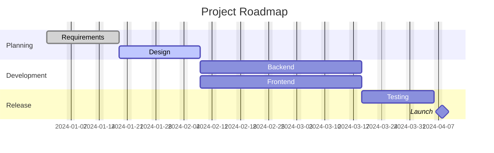

**When to use:**
- Sprint planning
- Release roadmaps
- Resource allocation
- Deadline tracking

---

### 9. Task Prioritization

**Best Choice: Quadrant Chart**

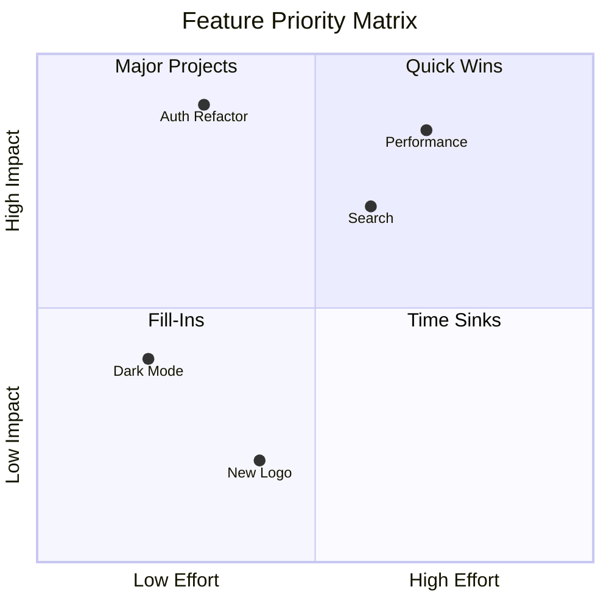

**When to use:**
- Backlog prioritization
- Technical debt assessment
- Risk/impact analysis
- Feature triage

---

### 10. Historical Timeline

**Best Choice: Timeline Diagram**

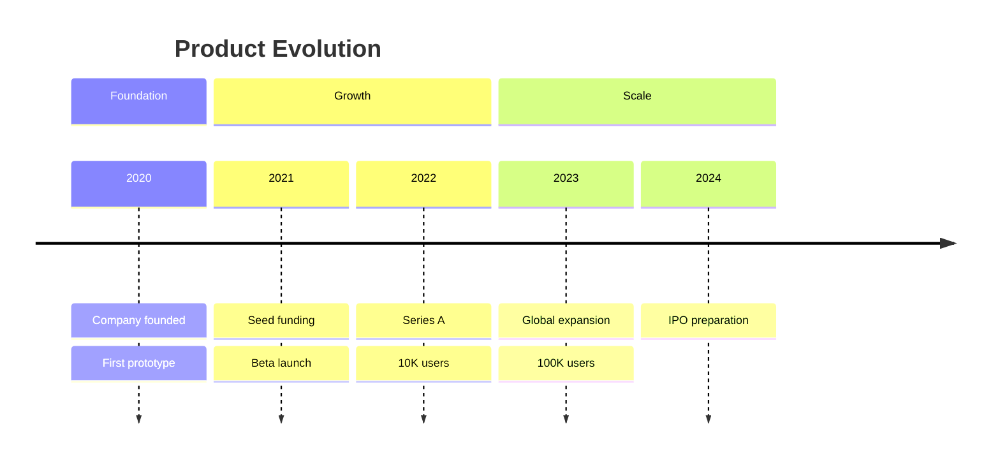

**When to use:**
- Company/product history
- Milestone tracking
- Retrospectives
- Investor presentations

---

## Business & Analysis Scenarios

### 11. Business Process Workflow

**Best Choice: Flowchart**

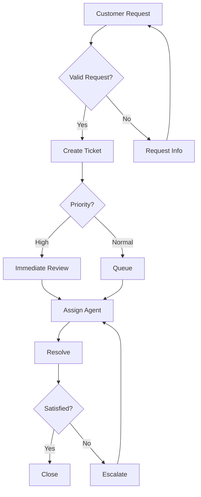

**When to use:**
- Process documentation
- SOP creation
- Workflow automation design
- Business analysis

---

### 12. Customer Journey Mapping

**Best Choice: User Journey**

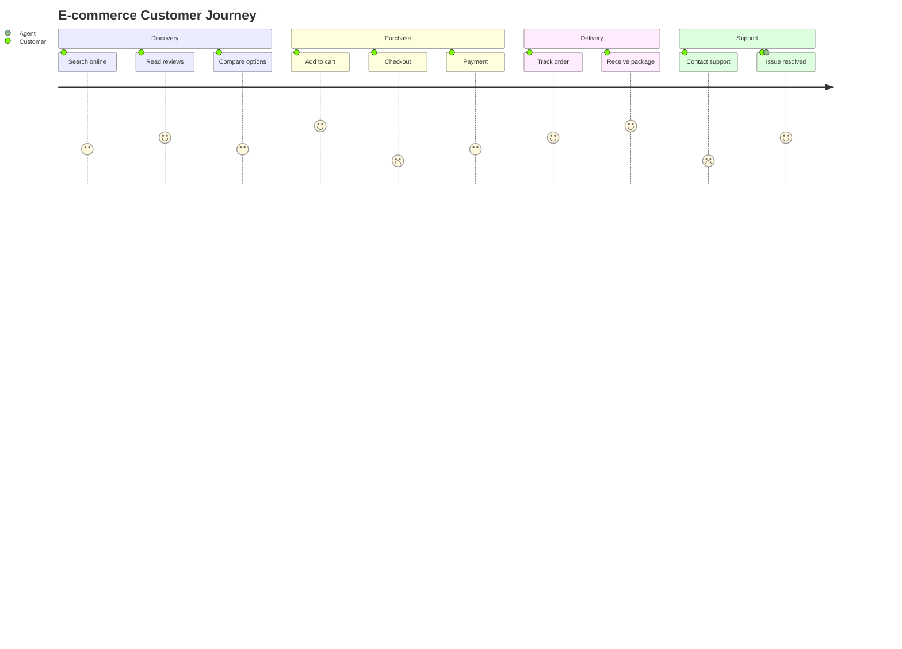

**When to use:**
- UX research documentation
- Pain point identification
- Service design
- Customer experience optimization

---

### 13. Data Distribution/Proportions

**Best Choice: Pie Chart**

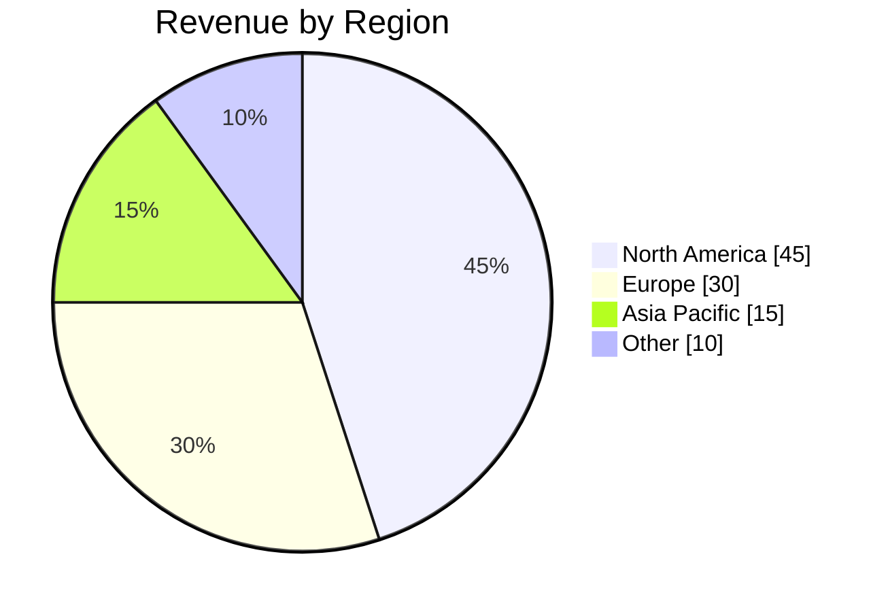

**When to use:**
- Budget allocation
- Market share
- Survey results
- Resource distribution

---

### 14. Flow Quantities (Budget, Energy, etc.)

**Best Choice: Sankey Diagram**

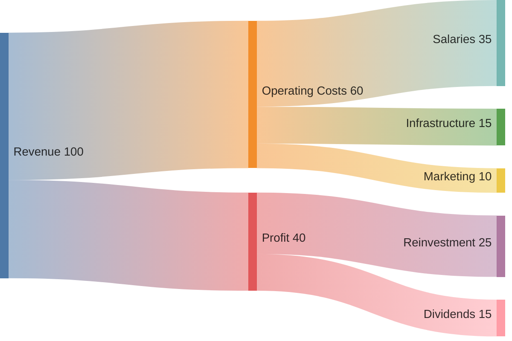

**When to use:**
- Financial flow visualization
- Energy/resource tracking
- Conversion funnels
- Supply chain analysis

---

### 15. Trend Analysis

**Best Choice: XY Chart**

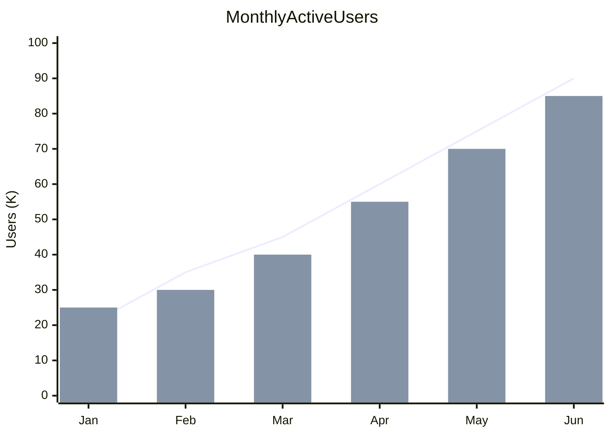

**When to use:**
- KPI tracking
- Performance metrics
- Financial reporting
- Comparative analysis

---

## Knowledge Management Scenarios

### 16. Brainstorming & Ideation

**Best Choice: Mindmap**

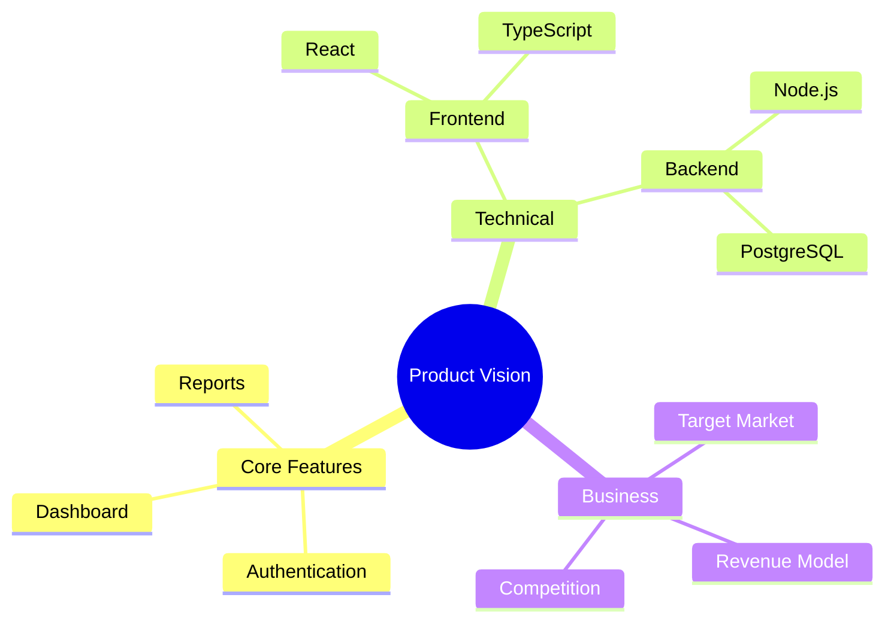

**When to use:**
- Brainstorming sessions
- Project scoping
- Learning/study notes
- Information organization

---

### 17. Knowledge Graph Visualization (Cagle Style)

**Best Choice: Flowchart with ELK**

```mermaid
---
config:
  layout: elk
---
flowchart LR
    classDef class fill:#DDA0DD,stroke:#000
    classDef instance fill:#ADD8E6,stroke:#000
    classDef literal fill:#FFFACD,stroke:#000

    Person["Person"]:::class
    Employee["Employee"]:::class
    John["John Smith"]:::instance
    StartDate["2024-01-15"]:::literal

    Person --> |subclass| Employee
    Employee --> |instance| John
    John --> |startDate| StartDate
```

**When to use:**
- RDF/ontology visualization
- Semantic data models
- Taxonomy documentation
- Linked data representation

---

### 18. Requirements Traceability

**Best Choice: Requirement Diagram**

```mermaid
requirementDiagram

    requirement secure_auth {
        id: REQ-001
        text: System must authenticate users securely
        risk: high
        verifymethod: test
    }

    requirement mfa {
        id: REQ-002
        text: MFA must be available
        risk: medium
        verifymethod: demonstration
    }

    element auth_module {
        type: module
    }

    auth_module - satisfies -> secure_auth
    mfa - derives -> secure_auth
```

**When to use:**
- Requirements documentation
- Compliance tracking
- Feature traceability
- Audit preparation

---

## Decision Guide Flowchart

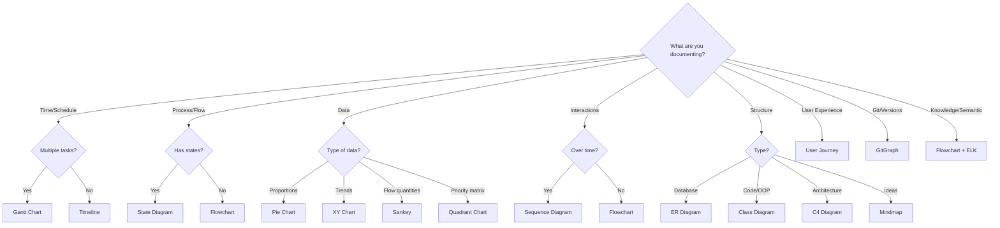

---

## Summary Table

| Scenario | Primary | Alternative | Cagle Approach |
|----------|---------|-------------|----------------|
| System architecture | C4 | Flowchart | Flowchart LR + subgraphs |
| API documentation | Sequence | - | - |
| Database design | ER | Class | - |
| OOP design | Class | - | - |
| State machines | State | Flowchart | classDef coloring |
| Project schedule | Gantt | Timeline | - |
| Priority analysis | Quadrant | Mindmap | - |
| Process workflows | Flowchart | State | Flowchart LR + ELK |
| User experience | Journey | Flowchart | - |
| Brainstorming | Mindmap | Flowchart | - |
| Knowledge graphs | Flowchart | - | **ELK + classDef + LR** |
| Data proportions | Pie | - | - |
| Trends/metrics | XY Chart | - | - |
| Flow quantities | Sankey | - | - |
| Git workflows | GitGraph | Flowchart | - |
| Requirements | Requirement | Mindmap | - |
