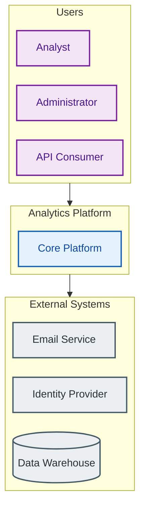
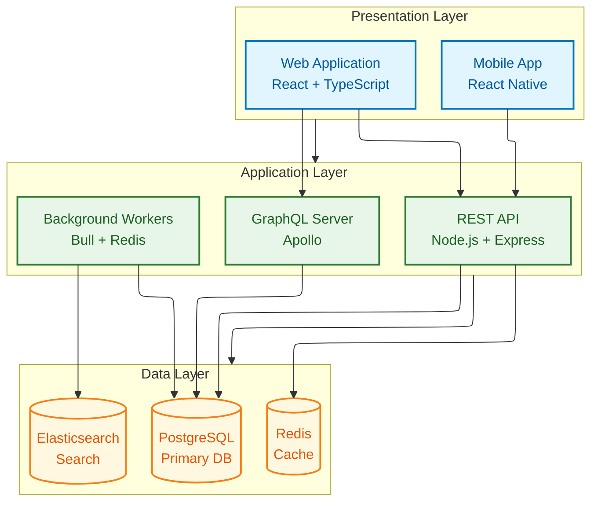
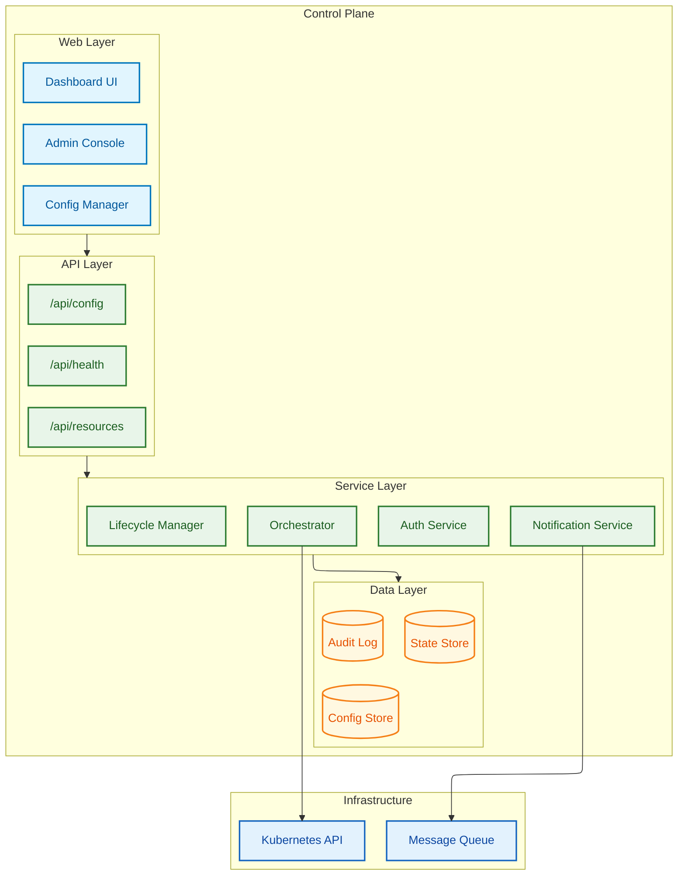
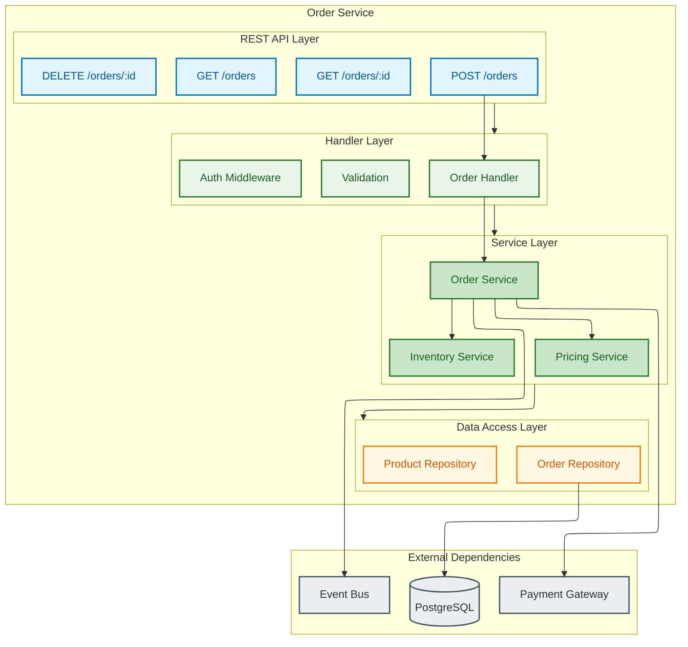
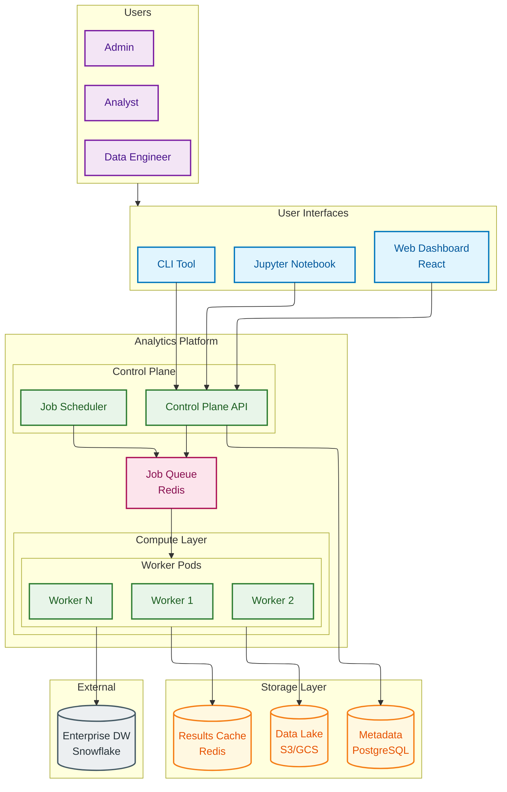
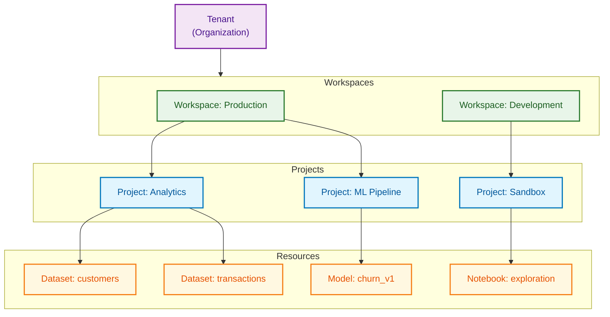
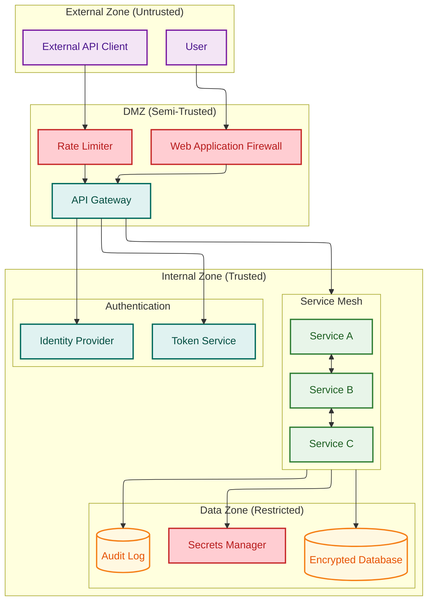
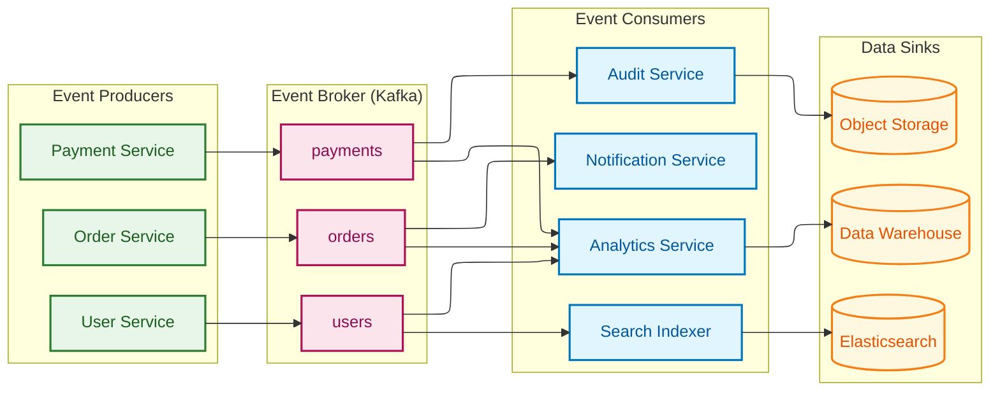
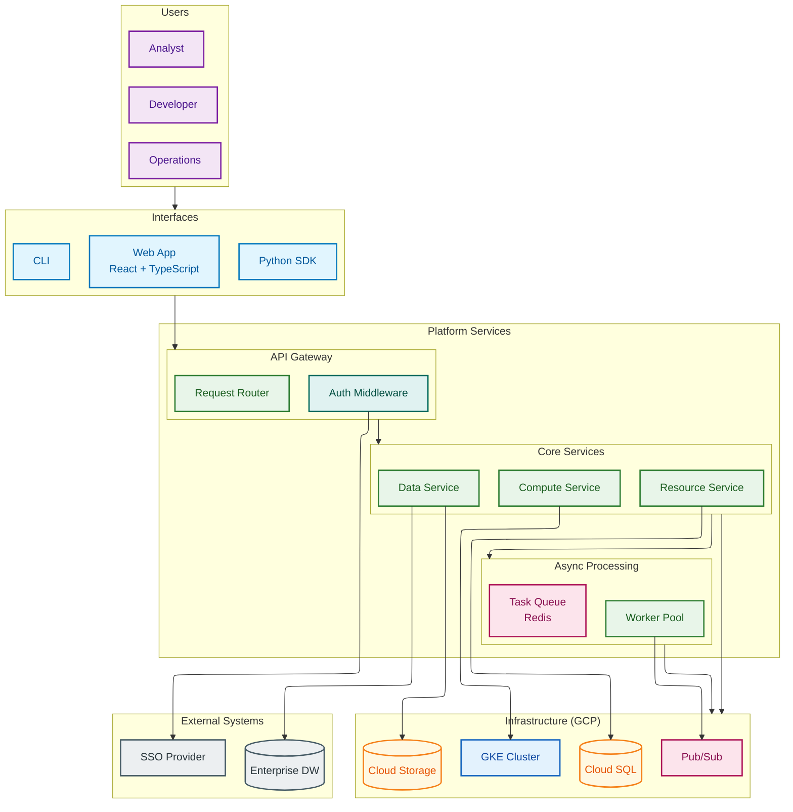

# Solution Architecture Diagram Guide

> **SKILL QUICK REF**: `flowchart TB` + ELK for architecture • Subgraphs for layers • Users→Interface→Service→Data flow • `classDef user|service|data|infra|security|external` • TB for layers, LR for flows

## When to Use

- System context diagrams (users, systems, external)
- Layered architecture (presentation, service, data)
- Component architecture (internal structure)
- Platform architecture (multi-service systems)
- Security architecture (trust boundaries)
- Integration architecture (API, events)

## Overview

Solution architecture diagrams communicate system design at multiple levels of abstraction. This guide covers patterns for creating clear, professional architecture diagrams using Mermaid, following Kurt Cagle's principles of semantic clarity and visual consistency.

**Key Insight**: Architecture diagrams should tell a story—from users through interfaces to services to infrastructure. Use consistent layering, semantic coloring, and appropriate layout engines.

---

## Configuration

### Recommended Settings for Architecture Diagrams

```yaml
---
config:
  layout: elk
  elk:
    mergeEdges: false
    nodePlacementStrategy: BRANDES_KOEPF
---
%%{init: {
  "theme": "base",
  "themeVariables": {
    "primaryColor": "#E3F2FD",
    "primaryTextColor": "#0D47A1",
    "primaryBorderColor": "#1565C0",
    "lineColor": "#37474F"
  }
}}%%
```

### Standard classDef Block

```
%% Cagle Architecture Palette
classDef user fill:#F3E5F5,stroke:#7B1FA2,stroke-width:2px,color:#4A148C
classDef interface fill:#E1F5FE,stroke:#0277BD,stroke-width:2px,color:#01579B
classDef service fill:#E8F5E9,stroke:#2E7D32,stroke-width:2px,color:#1B5E20
classDef data fill:#FFF8E1,stroke:#F57F17,stroke-width:2px,color:#E65100
classDef infra fill:#E3F2FD,stroke:#1565C0,stroke-width:2px,color:#0D47A1
classDef security fill:#E0F2F1,stroke:#00695C,stroke-width:2px,color:#004D40
classDef external fill:#ECEFF1,stroke:#455A64,stroke-width:2px,color:#263238
classDef queue fill:#FCE4EC,stroke:#AD1457,stroke-width:2px,color:#880E4F
```

---

## Pattern 1: System Context Diagram

The highest-level view showing users, the system, and external dependencies.

### Structure

```
Users → System → External Dependencies
```

### Example



### Guidelines

1. **Three-zone layout**: Users (top/left) → System (center) → External (bottom/right)
2. **Single system box**: Abstract internal complexity at this level
3. **Name external dependencies explicitly**: Shows integration points
4. **Use TB direction**: Natural top-down reading for context diagrams

---

## Pattern 2: Layered Architecture

Shows the vertical layers of a system from presentation through data.

### Structure

```
Presentation Layer
    ↓
API Layer
    ↓
Service Layer
    ↓
Data Layer
```

### Example: Three-Tier Application



### Example: Control Plane Architecture



---

## Pattern 3: Component Architecture

Detailed view of a single service or application's internal structure.

### Structure

```
Entry Points (APIs/Events)
    ↓
Controllers/Handlers
    ↓
Business Logic Services
    ↓
Data Access / External Clients
```

### Example: Microservice Internal Architecture



---

## Pattern 4: Platform Architecture

Shows the complete platform with multiple services, infrastructure, and data flows.

### Example: Analytics Platform



---

## Pattern 5: Resource Hierarchy

Shows ownership and containment relationships between resources.

### Structure (ASCII)

```
Resource Type A (long-lived)
    └── Resource Type B (medium-lived)
            └── Resource Type C (ephemeral)
```

### Example: Multi-Tenant Resource Model



---

## Pattern 6: Security Architecture

Shows authentication, authorization, and trust boundaries.

### Example: Zero Trust Architecture



---

## Pattern 7: Integration Architecture

Shows how systems communicate via APIs, events, and data flows.

### Example: Event-Driven Integration



---

## Best Practices

### Layout

1. **Use ELK** for complex diagrams (>10 nodes or >15 edges)
2. **TB direction** for layered architectures (top = users, bottom = data)
3. **LR direction** for flow-based architectures (left = input, right = output)
4. **Consistent subgraph nesting** - 2-3 levels maximum

### Coloring

1. **Semantic consistency** - Same color = same type across all diagrams
2. **Layer distinction** - Each architectural layer gets its own color
3. **External systems** - Always gray (`#ECEFF1`) to distinguish from internal
4. **Security elements** - Teal for auth, red accents for critical security

### Labeling

1. **Technology annotations** - Include framework/tool names in labels
2. **Clear node IDs** - Use descriptive IDs that match the visual labels
3. **Relationship labels** - Add labels to non-obvious connections

### Subgraphs

1. **Named subgraphs** - Always provide descriptive titles
2. **Consistent boundaries** - Subgraphs represent real architectural boundaries
3. **Direction within subgraphs** - Use `direction LR` or `TB` for internal layout

---

## Complete Example: Full Platform Architecture



---

## See Also

- [11-CAGLE-COLOR-SYSTEM.md](./11-CAGLE-COLOR-SYSTEM.md) - Complete color reference
- [13-DATA-FLOW-PATTERNS-GUIDE.md](./13-DATA-FLOW-PATTERNS-GUIDE.md) - Sequence and flow diagrams
- [14-DEPLOYMENT-ARCHITECTURE-GUIDE.md](./14-DEPLOYMENT-ARCHITECTURE-GUIDE.md) - Kubernetes and cloud patterns
- [15-TECHNICAL-DESIGN-PATTERNS.md](./15-TECHNICAL-DESIGN-PATTERNS.md) - Combining diagram types
