# Data Flow Patterns Guide

> **SKILL QUICK REF**: API flows→`sequenceDiagram` | Async/Queue→`flowchart LR` | Events→`flowchart TB` | Streaming→ELK | `rect rgb()` for phases | `classDef source|processor|sink|queue` | Saga patterns

## When to Use

- Synchronous API request/response flows
- Asynchronous message queue patterns
- Event-driven architecture (CQRS, Event Sourcing)
- Streaming data pipelines
- Saga patterns for distributed transactions
- Circuit breaker and retry flows

## Overview

This guide documents data flow visualization patterns using Mermaid diagrams, following Kurt Cagle's semantic visualization principles. Data flows are critical for understanding how information moves through systems—from user inputs to storage, from services to queues, and through complex event-driven architectures.

**Key Principle**: *"Data flow diagrams should reveal the temporal and spatial journey of information, making visible the transformations, validations, and decision points that occur along the way."*

---

## Cagle Color System for Data Flows

### Flow-Specific Semantic Colors

```
%% Data Flow Color System
%% Based on Cagle's semantic approach with analogous palette

%% Data States
classDef raw fill:#FFECB3,stroke:#FF8F00,stroke-width:2px,color:#E65100
classDef validated fill:#C8E6C9,stroke:#2E7D32,stroke-width:2px,color:#1B5E20
classDef transformed fill:#B3E5FC,stroke:#0277BD,stroke-width:2px,color:#01579B
classDef stored fill:#FFF8E1,stroke:#F57F17,stroke-width:2px,color:#E65100

%% Flow Participants
classDef source fill:#E3F2FD,stroke:#1565C0,stroke-width:2px,color:#0D47A1
classDef processor fill:#E8F5E9,stroke:#2E7D32,stroke-width:2px,color:#1B5E20
classDef sink fill:#FFF8E1,stroke:#F57F17,stroke-width:2px,color:#E65100
classDef queue fill:#F3E5F5,stroke:#7B1FA2,stroke-width:2px,color:#4A148C

%% Flow Types
classDef sync fill:#E1F5FE,stroke:#0277BD,stroke-width:2px,color:#01579B
classDef async fill:#FCE4EC,stroke:#C2185B,stroke-width:2px,color:#880E4F
classDef batch fill:#E0F2F1,stroke:#00695C,stroke-width:2px,color:#004D40
classDef stream fill:#EDE7F6,stroke:#512DA8,stroke-width:2px,color:#311B92
```

### Sequence Diagram Theme for Data Flows

```yaml
%%{init: {
  "theme": "base",
  "themeVariables": {
    "actorBkg": "#E3F2FD",
    "actorBorder": "#1565C0",
    "actorTextColor": "#0D47A1",
    "actorLineColor": "#1565C0",
    "signalColor": "#37474F",
    "signalTextColor": "#263238",
    "noteBkgColor": "#FFF8E1",
    "noteTextColor": "#E65100",
    "noteBorderColor": "#F57F17",
    "activationBkgColor": "#E8F5E9",
    "activationBorderColor": "#2E7D32",
    "sequenceNumberColor": "#FFFFFF"
  }
}}%%
```

---

## Pattern 1: Synchronous API Request/Response

### Basic Request Flow


### REST CRUD Pattern


---

## Pattern 2: Asynchronous Message Queue Flow

### Producer-Consumer Pattern

```mermaid
---
config:
  layout: elk
  elk:
    mergeEdges: false
    nodePlacementStrategy: BRANDES_KOEPF
---
flowchart LR
    %% Cagle Data Flow Colors
    classDef source fill:#E3F2FD,stroke:#1565C0,stroke-width:2px,color:#0D47A1
    classDef queue fill:#F3E5F5,stroke:#7B1FA2,stroke-width:2px,color:#4A148C
    classDef processor fill:#E8F5E9,stroke:#2E7D32,stroke-width:2px,color:#1B5E20
    classDef sink fill:#FFF8E1,stroke:#F57F17,stroke-width:2px,color:#E65100

    subgraph Producers ["📤 Producers"]
        P1[Web API]:::source
        P2[Mobile API]:::source
        P3[Batch Job]:::source
    end

    subgraph MessageBroker ["📨 Message Broker"]
        Q1[/Order Queue/]:::queue
        Q2[/Notification Queue/]:::queue
        Q3[/Analytics Queue/]:::queue
    end

    subgraph Consumers ["📥 Consumers"]
        C1[Order Processor]:::processor
        C2[Email Service]:::processor
        C3[Analytics Engine]:::processor
    end

    subgraph Storage ["💾 Storage"]
        DB1[(Orders DB)]:::sink
        DB2[(Email Logs)]:::sink
        DB3[(Data Warehouse)]:::sink
    end

    P1 --> Q1
    P1 --> Q2
    P2 --> Q1
    P2 --> Q2
    P3 --> Q3

    Q1 --> C1
    Q2 --> C2
    Q3 --> C3

    C1 --> DB1
    C2 --> DB2
    C3 --> DB3
```



### Message Queue Sequence with Retry


---

## Pattern 3: Event-Driven Architecture

### Event Sourcing Flow

```mermaid
---
config:
  layout: elk
---
flowchart TB
    %% Cagle Event Flow Colors
    classDef command fill:#E3F2FD,stroke:#1565C0,stroke-width:2px,color:#0D47A1
    classDef event fill:#E8F5E9,stroke:#2E7D32,stroke-width:2px,color:#1B5E20
    classDef store fill:#FFF8E1,stroke:#F57F17,stroke-width:2px,color:#E65100
    classDef projection fill:#E1F5FE,stroke:#0277BD,stroke-width:2px,color:#01579B
    classDef handler fill:#F3E5F5,stroke:#7B1FA2,stroke-width:2px,color:#4A148C

    subgraph Commands ["📝 Commands"]
        CMD1[CreateOrder]:::command
        CMD2[UpdateOrder]:::command
        CMD3[CancelOrder]:::command
    end

    subgraph Aggregate ["🎯 Order Aggregate"]
        AGG[Order Domain Logic]:::handler
    end

    subgraph Events ["📢 Domain Events"]
        E1[OrderCreated]:::event
        E2[OrderUpdated]:::event
        E3[OrderCancelled]:::event
    end

    subgraph EventStore ["💾 Event Store"]
        ES[(Event Log)]:::store
    end

    subgraph Projections ["📊 Read Models"]
        P1[Orders List View]:::projection
        P2[Order Detail View]:::projection
        P3[Analytics View]:::projection
    end

    CMD1 --> AGG
    CMD2 --> AGG
    CMD3 --> AGG

    AGG --> E1
    AGG --> E2
    AGG --> E3

    E1 --> ES
    E2 --> ES
    E3 --> ES

    ES --> P1
    ES --> P2
    ES --> P3
```



### CQRS Pattern

```mermaid
---
config:
  layout: elk
  elk:
    mergeEdges: false
---
flowchart LR
    %% Cagle CQRS Colors
    classDef user fill:#F3E5F5,stroke:#7B1FA2,stroke-width:2px,color:#4A148C
    classDef command fill:#E3F2FD,stroke:#1565C0,stroke-width:2px,color:#0D47A1
    classDef query fill:#E8F5E9,stroke:#2E7D32,stroke-width:2px,color:#1B5E20
    classDef event fill:#E1F5FE,stroke:#0277BD,stroke-width:2px,color:#01579B
    classDef store fill:#FFF8E1,stroke:#F57F17,stroke-width:2px,color:#E65100

    User[User]:::user

    subgraph WriteStack ["✏️ Write Side (Commands)"]
        direction TB
        CmdAPI[Command API]:::command
        CmdHandler[Command Handler]:::command
        WriteDB[(Write Database)]:::store
    end

    subgraph EventBus ["📡 Event Bus"]
        EB[Domain Events]:::event
    end

    subgraph ReadStack ["📖 Read Side (Queries)"]
        direction TB
        QueryAPI[Query API]:::query
        Projector[Event Projector]:::query
        ReadDB[(Read Database)]:::store
    end

    User -->|Commands| CmdAPI
    CmdAPI --> CmdHandler
    CmdHandler --> WriteDB
    CmdHandler --> EB
    EB --> Projector
    Projector --> ReadDB
    ReadDB --> QueryAPI
    QueryAPI -->|Queries| User
```



---

## Pattern 4: Streaming Data Pipeline

### Real-Time Stream Processing


### Kafka Consumer Group Pattern


---

## Pattern 5: Batch Processing Flow

### ETL Pipeline


### Batch Job State Machine


---

## Pattern 6: API Gateway Flow

### Gateway Routing Pattern


### API Gateway Sequence


---

## Pattern 7: Saga Pattern for Distributed Transactions

### Choreography-Based Saga


### Orchestration-Based Saga


---

## Pattern 8: Data Validation Pipeline

### Multi-Stage Validation Flow

```mermaid
---
config:
  layout: elk
---
flowchart LR
    %% Cagle Validation Colors
    classDef input fill:#E3F2FD,stroke:#1565C0,stroke-width:2px,color:#0D47A1
    classDef validate fill:#E0F2F1,stroke:#00695C,stroke-width:2px,color:#004D40
    classDef transform fill:#E8F5E9,stroke:#2E7D32,stroke-width:2px,color:#1B5E20
    classDef output fill:#FFF8E1,stroke:#F57F17,stroke-width:2px,color:#E65100
    classDef error fill:#FFCDD2,stroke:#C62828,stroke-width:2px,color:#B71C1C
    classDef warning fill:#FFF9C4,stroke:#F9A825,stroke-width:2px,color:#F57F17

    INPUT[Raw Input]:::input

    subgraph Validation ["🔍 Validation Pipeline"]
        direction TB
        V1{Schema Validation}:::validate
        V2{Type Coercion}:::validate
        V3{Business Rules}:::validate
        V4{Cross-Field Validation}:::validate
    end

    subgraph Results ["📊 Results"]
        VALID[Valid Record]:::output
        WARN[Warnings]:::warning
        ERR[Errors]:::error
    end

    TRANSFORM[Transformed Data]:::transform
    OUTPUT[(Target System)]:::output

    INPUT --> V1
    V1 -->|Pass| V2
    V1 -->|Fail| ERR
    V2 -->|Pass| V3
    V2 -->|Coerced| WARN
    V2 -->|Fail| ERR
    V3 -->|Pass| V4
    V3 -->|Fail| ERR
    V4 -->|Pass| VALID
    V4 -->|Fail| ERR

    VALID --> TRANSFORM
    WARN --> TRANSFORM
    TRANSFORM --> OUTPUT
```



---

## Pattern 9: Circuit Breaker Flow

### Circuit Breaker State Machine


### Circuit Breaker Sequence


---

## Pattern 10: Data Replication Flow

### Master-Replica Synchronization

```mermaid
---
config:
  layout: elk
---
flowchart TB
    %% Cagle Replication Colors
    classDef master fill:#E3F2FD,stroke:#1565C0,stroke-width:2px,color:#0D47A1
    classDef replica fill:#E8F5E9,stroke:#2E7D32,stroke-width:2px,color:#1B5E20
    classDef sync fill:#F3E5F5,stroke:#7B1FA2,stroke-width:2px,color:#4A148C
    classDef app fill:#FFF8E1,stroke:#F57F17,stroke-width:2px,color:#E65100

    subgraph Application ["📱 Application Layer"]
        W[Write Operations]:::app
        R[Read Operations]:::app
    end

    subgraph Primary ["🔵 Primary Region"]
        M[(Master DB)]:::master
    end

    subgraph Replicas ["🟢 Read Replicas"]
        R1[(Replica 1)]:::replica
        R2[(Replica 2)]:::replica
        R3[(Replica 3)]:::replica
    end

    subgraph Replication ["🔄 Replication"]
        SYNC[Sync Process]:::sync
    end

    W -->|All Writes| M
    M --> SYNC
    SYNC -->|Async Replication| R1
    SYNC -->|Async Replication| R2
    SYNC -->|Async Replication| R3

    R1 -->|Reads| R
    R2 -->|Reads| R
    R3 -->|Reads| R
```



---

## Colored Region Reference

### Standard Flow Phases

Use `rect` blocks to highlight different phases:

```mermaid
sequenceDiagram
    participant A as Service A
    participant B as Service B
    participant C as Service C

    rect rgb(227, 242, 253)
        Note over A,C: 🔵 Initialization Phase
        A->>B: Initialize
        B->>C: Setup
    end

    rect rgb(232, 245, 233)
        Note over A,C: 🟢 Processing Phase
        A->>B: Process Data
        B->>C: Transform
        C-->>B: Result
        B-->>A: Complete
    end

    rect rgb(255, 248, 225)
        Note over A,C: 🟡 Finalization Phase
        A->>B: Cleanup
        B->>C: Release Resources
    end
```



### Phase Color Reference

| Phase | RGB Value | Hex Equivalent | Use Case |
|-------|-----------|----------------|----------|
| **Initialization** | `rgb(227, 242, 253)` | `#E3F2FD` | Setup, connection, auth |
| **Processing** | `rgb(232, 245, 233)` | `#E8F5E9` | Main operation, success path |
| **Data Operations** | `rgb(255, 248, 225)` | `#FFF8E1` | Database, storage, persistence |
| **Error Handling** | `rgb(255, 205, 210)` | `#FFCDD2` | Failures, exceptions, rollback |
| **Warning/Caution** | `rgb(255, 249, 196)` | `#FFF9C4` | Retry, degraded, warnings |
| **Security** | `rgb(224, 242, 241)` | `#E0F2F1` | Auth, encryption, validation |
| **Async/Background** | `rgb(237, 231, 246)` | `#EDE7F6` | Queue, stream, async processing |

---

## Quick Reference

### Copy-Paste Data Flow classDef Block

```
%% Cagle Data Flow Color System

%% Data States
classDef raw fill:#FFECB3,stroke:#FF8F00,stroke-width:2px,color:#E65100
classDef validated fill:#C8E6C9,stroke:#2E7D32,stroke-width:2px,color:#1B5E20
classDef transformed fill:#B3E5FC,stroke:#0277BD,stroke-width:2px,color:#01579B
classDef stored fill:#FFF8E1,stroke:#F57F17,stroke-width:2px,color:#E65100

%% Flow Participants
classDef source fill:#E3F2FD,stroke:#1565C0,stroke-width:2px,color:#0D47A1
classDef processor fill:#E8F5E9,stroke:#2E7D32,stroke-width:2px,color:#1B5E20
classDef sink fill:#FFF8E1,stroke:#F57F17,stroke-width:2px,color:#E65100
classDef queue fill:#F3E5F5,stroke:#7B1FA2,stroke-width:2px,color:#4A148C

%% Flow Types
classDef sync fill:#E1F5FE,stroke:#0277BD,stroke-width:2px,color:#01579B
classDef async fill:#FCE4EC,stroke:#C2185B,stroke-width:2px,color:#880E4F
classDef batch fill:#E0F2F1,stroke:#00695C,stroke-width:2px,color:#004D40
classDef stream fill:#EDE7F6,stroke:#512DA8,stroke-width:2px,color:#311B92

%% Status
classDef success fill:#C8E6C9,stroke:#2E7D32,stroke-width:2px,color:#1B5E20
classDef error fill:#FFCDD2,stroke:#C62828,stroke-width:2px,color:#B71C1C
classDef warning fill:#FFF9C4,stroke:#F9A825,stroke-width:2px,color:#F57F17
```

### Sequence Diagram Theme Configuration

```yaml
%%{init: {
  "theme": "base",
  "themeVariables": {
    "actorBkg": "#E3F2FD",
    "actorBorder": "#1565C0",
    "actorTextColor": "#0D47A1",
    "actorLineColor": "#1565C0",
    "signalColor": "#37474F",
    "signalTextColor": "#263238",
    "noteBkgColor": "#FFF8E1",
    "noteTextColor": "#E65100",
    "noteBorderColor": "#F57F17",
    "activationBkgColor": "#E8F5E9",
    "activationBorderColor": "#2E7D32",
    "sequenceNumberColor": "#FFFFFF"
  }
}}%%
```

---

## References

- Cagle, Kurt. "RDF, Graphs and Mermaid Diagrams" - LinkedIn
- [Enterprise Integration Patterns](https://www.enterpriseintegrationpatterns.com/)
- [Mermaid Sequence Diagram Documentation](https://mermaid.js.org/syntax/sequenceDiagram.html)
- [Microsoft Cloud Design Patterns](https://docs.microsoft.com/en-us/azure/architecture/patterns/)
