# Deployment Architecture Guide

> **SKILL QUICK REF**: K8s→`flowchart TB` + ELK • Cloud regions→nested subgraphs • CI/CD→`flowchart LR` or `sequenceDiagram` • `classDef cluster|namespace|pod|service|ingress|storage` • HA/DR patterns

## When to Use

- Cloud infrastructure topology (multi-region, VPC)
- Kubernetes architecture (clusters, namespaces, pods)
- CI/CD pipeline visualization
- Container and service mesh architecture
- Monitoring and observability stacks
- High availability and disaster recovery

## Overview

This guide documents deployment and infrastructure visualization patterns using Mermaid diagrams, following Kurt Cagle's semantic visualization principles. Deployment diagrams illustrate how software systems are deployed to hardware, cloud infrastructure, containers, and orchestration platforms.

**Key Principle**: *"Deployment architecture diagrams should reveal the physical and logical topology of systems, showing how components are distributed across infrastructure and how they communicate."*

---

## Cagle Color System for Deployment

### Infrastructure Semantic Colors

```
%% Deployment Architecture Color System
%% Based on Cagle's semantic approach with infrastructure focus

%% Cloud & Platform
classDef cloud fill:#E3F2FD,stroke:#1565C0,stroke-width:2px,color:#0D47A1
classDef region fill:#BBDEFB,stroke:#1976D2,stroke-width:2px,color:#0D47A1
classDef zone fill:#90CAF9,stroke:#1E88E5,stroke-width:2px,color:#0D47A1

%% Kubernetes Resources
classDef cluster fill:#E8F5E9,stroke:#2E7D32,stroke-width:2px,color:#1B5E20
classDef namespace fill:#C8E6C9,stroke:#43A047,stroke-width:2px,color:#1B5E20
classDef pod fill:#A5D6A7,stroke:#66BB6A,stroke-width:2px,color:#1B5E20
classDef service fill:#81C784,stroke:#4CAF50,stroke-width:2px,color:#1B5E20

%% Containers & Runtime
classDef container fill:#E1F5FE,stroke:#0277BD,stroke-width:2px,color:#01579B
classDef image fill:#B3E5FC,stroke:#039BE5,stroke-width:2px,color:#01579B

%% Networking
classDef network fill:#F3E5F5,stroke:#7B1FA2,stroke-width:2px,color:#4A148C
classDef loadbalancer fill:#E1BEE7,stroke:#8E24AA,stroke-width:2px,color:#4A148C
classDef ingress fill:#CE93D8,stroke:#AB47BC,stroke-width:2px,color:#4A148C

%% Storage
classDef storage fill:#FFF8E1,stroke:#F57F17,stroke-width:2px,color:#E65100
classDef volume fill:#FFECB3,stroke:#FFA000,stroke-width:2px,color:#E65100
classDef database fill:#FFE082,stroke:#FFB300,stroke-width:2px,color:#E65100

%% Security
classDef security fill:#E0F2F1,stroke:#00695C,stroke-width:2px,color:#004D40
classDef firewall fill:#B2DFDB,stroke:#00897B,stroke-width:2px,color:#004D40

%% CI/CD
classDef pipeline fill:#EDE7F6,stroke:#512DA8,stroke-width:2px,color:#311B92
classDef stage fill:#D1C4E9,stroke:#673AB7,stroke-width:2px,color:#311B92
classDef artifact fill:#B39DDB,stroke:#7E57C2,stroke-width:2px,color:#311B92
```

---

## Pattern 1: Cloud Infrastructure Topology

### Multi-Region Architecture


### VPC Network Architecture

```mermaid
---
config:
  layout: elk
---
flowchart TB
    %% Cagle Network Colors
    classDef vpc fill:#E3F2FD,stroke:#1565C0,stroke-width:2px,color:#0D47A1
    classDef subnet fill:#E8F5E9,stroke:#2E7D32,stroke-width:2px,color:#1B5E20
    classDef firewall fill:#E0F2F1,stroke:#00695C,stroke-width:2px,color:#004D40
    classDef nat fill:#F3E5F5,stroke:#7B1FA2,stroke-width:2px,color:#4A148C
    classDef instance fill:#FFF8E1,stroke:#F57F17,stroke-width:2px,color:#E65100

    INET[Internet]

    subgraph VPC ["🔒 Production VPC (10.0.0.0/16)"]
        FW[Cloud Firewall]:::firewall
        NAT[Cloud NAT]:::nat

        subgraph PubSubnet ["📡 Public Subnet (10.0.1.0/24)"]
            LB[Load Balancer]:::subnet
            BASTION[Bastion Host]:::instance
        end

        subgraph AppSubnet ["🔧 Application Subnet (10.0.2.0/24)"]
            APP1[App Server 1]:::instance
            APP2[App Server 2]:::instance
            APP3[App Server 3]:::instance
        end

        subgraph DataSubnet ["💾 Data Subnet (10.0.3.0/24)"]
            DB1[(Primary DB)]:::instance
            DB2[(Replica DB)]:::instance
            CACHE[Redis Cache]:::instance
        end
    end

    INET --> FW
    FW --> LB
    FW --> BASTION
    LB --> APP1
    LB --> APP2
    LB --> APP3
    APP1 --> DB1
    APP2 --> DB1
    APP3 --> DB1
    DB1 -.-> DB2
    APP1 --> CACHE
    APP2 --> CACHE
    APP3 --> CACHE
    AppSubnet --> NAT
    NAT --> INET
```



---

## Pattern 2: Kubernetes Architecture

### GKE Cluster Topology

```mermaid
---
config:
  layout: elk
---
flowchart TB
    %% Cagle K8s Colors
    classDef cluster fill:#E3F2FD,stroke:#1565C0,stroke-width:2px,color:#0D47A1
    classDef control fill:#E8F5E9,stroke:#2E7D32,stroke-width:2px,color:#1B5E20
    classDef node fill:#E1F5FE,stroke:#0277BD,stroke-width:2px,color:#01579B
    classDef pod fill:#FFF8E1,stroke:#F57F17,stroke-width:2px,color:#E65100
    classDef service fill:#F3E5F5,stroke:#7B1FA2,stroke-width:2px,color:#4A148C

    subgraph GKE ["☸️ GKE Cluster"]
        subgraph ControlPlane ["🎛️ Control Plane (Managed)"]
            API[API Server]:::control
            ETCD[(etcd)]:::control
            SCHED[Scheduler]:::control
            CM[Controller Manager]:::control
        end

        subgraph NodePool1 ["📦 Node Pool: General (n2-standard-4)"]
            N1[Node 1]:::node
            N2[Node 2]:::node
            N3[Node 3]:::node
        end

        subgraph NodePool2 ["🚀 Node Pool: High-Memory (n2-highmem-8)"]
            N4[Node 4]:::node
            N5[Node 5]:::node
        end

        subgraph NodePool3 ["⚡ Node Pool: GPU (a2-highgpu-1g)"]
            N6[GPU Node 1]:::node
        end
    end

    API --> ETCD
    API --> SCHED
    API --> CM
    SCHED --> N1
    SCHED --> N2
    SCHED --> N3
    SCHED --> N4
    SCHED --> N5
    SCHED --> N6
```



### Namespace Organization

```mermaid
---
config:
  layout: elk
---
flowchart LR
    %% Cagle Namespace Colors
    classDef system fill:#FFCDD2,stroke:#C62828,stroke-width:2px,color:#B71C1C
    classDef infra fill:#E3F2FD,stroke:#1565C0,stroke-width:2px,color:#0D47A1
    classDef app fill:#E8F5E9,stroke:#2E7D32,stroke-width:2px,color:#1B5E20
    classDef data fill:#FFF8E1,stroke:#F57F17,stroke-width:2px,color:#E65100
    classDef monitor fill:#F3E5F5,stroke:#7B1FA2,stroke-width:2px,color:#4A148C

    subgraph Cluster ["☸️ Kubernetes Cluster"]
        subgraph kube-system ["🔴 kube-system"]
            DNS[CoreDNS]:::system
            PROXY[kube-proxy]:::system
            CNI[Calico CNI]:::system
        end

        subgraph istio-system ["🔵 istio-system"]
            ISTIOD[istiod]:::infra
            INGRESS[Istio Ingress]:::infra
            EGRESS[Istio Egress]:::infra
        end

        subgraph app-prod ["🟢 app-prod"]
            API[API Pods]:::app
            WEB[Web Pods]:::app
            WORKER[Worker Pods]:::app
        end

        subgraph data-prod ["🟡 data-prod"]
            PG[(PostgreSQL)]:::data
            REDIS[(Redis)]:::data
            KAFKA[Kafka]:::data
        end

        subgraph monitoring ["🟣 monitoring"]
            PROM[Prometheus]:::monitor
            GRAF[Grafana]:::monitor
            ALERT[Alertmanager]:::monitor
        end
    end

    INGRESS --> API
    INGRESS --> WEB
    API --> PG
    API --> REDIS
    WORKER --> KAFKA
    PROM --> API
    PROM --> WEB
    PROM --> WORKER
```



### Pod Architecture Detail

```mermaid
---
config:
  layout: elk
---
flowchart TB
    %% Cagle Pod Colors
    classDef pod fill:#E8F5E9,stroke:#2E7D32,stroke-width:2px,color:#1B5E20
    classDef container fill:#E1F5FE,stroke:#0277BD,stroke-width:2px,color:#01579B
    classDef init fill:#FFF9C4,stroke:#F9A825,stroke-width:2px,color:#F57F17
    classDef sidecar fill:#F3E5F5,stroke:#7B1FA2,stroke-width:2px,color:#4A148C
    classDef volume fill:#FFF8E1,stroke:#F57F17,stroke-width:2px,color:#E65100
    classDef service fill:#E3F2FD,stroke:#1565C0,stroke-width:2px,color:#0D47A1

    SVC[Service: api-service]:::service

    subgraph Pod ["📦 Pod: api-deployment-xyz"]
        subgraph InitContainers ["⏳ Init Containers"]
            INIT1[db-migrator]:::init
            INIT2[config-loader]:::init
        end

        subgraph Containers ["🐳 Containers"]
            MAIN[api-server :8080]:::container
            SIDECAR1[istio-proxy :15001]:::sidecar
            SIDECAR2[filebeat :5066]:::sidecar
        end

        subgraph Volumes ["💾 Volumes"]
            VOL1[config-volume]:::volume
            VOL2[secret-volume]:::volume
            VOL3[log-volume]:::volume
        end
    end

    ConfigMap[ConfigMap: api-config]:::service
    Secret[Secret: api-secrets]:::service
    PVC[PVC: logs-pvc]:::service

    SVC --> Pod
    INIT1 --> INIT2
    INIT2 --> MAIN
    MAIN --> SIDECAR1
    MAIN --> SIDECAR2
    ConfigMap --> VOL1
    Secret --> VOL2
    PVC --> VOL3
    VOL1 --> MAIN
    VOL2 --> MAIN
    VOL3 --> SIDECAR2
```



---

## Pattern 3: CI/CD Pipeline Architecture

### GitOps Deployment Pipeline

```mermaid
---
config:
  layout: elk
---
flowchart LR
    %% Cagle CI/CD Colors
    classDef source fill:#E3F2FD,stroke:#1565C0,stroke-width:2px,color:#0D47A1
    classDef build fill:#E8F5E9,stroke:#2E7D32,stroke-width:2px,color:#1B5E20
    classDef test fill:#E1F5FE,stroke:#0277BD,stroke-width:2px,color:#01579B
    classDef artifact fill:#F3E5F5,stroke:#7B1FA2,stroke-width:2px,color:#4A148C
    classDef deploy fill:#FFF8E1,stroke:#F57F17,stroke-width:2px,color:#E65100
    classDef env fill:#E0F2F1,stroke:#00695C,stroke-width:2px,color:#004D40

    subgraph Source ["📝 Source"]
        GIT[GitHub Repository]:::source
        PR[Pull Request]:::source
    end

    subgraph CI ["🔨 CI Pipeline"]
        BUILD[Build & Compile]:::build
        UNIT[Unit Tests]:::test
        LINT[Lint & SAST]:::test
        IMG[Build Image]:::build
    end

    subgraph Registry ["📦 Artifact Registry"]
        GAR[Google Artifact Registry]:::artifact
        HELM[Helm Charts]:::artifact
    end

    subgraph CD ["🚀 CD Pipeline (ArgoCD)"]
        ARGO[ArgoCD]:::deploy
        SYNC[Sync Controller]:::deploy
    end

    subgraph Environments ["🌍 Environments"]
        DEV[Development]:::env
        STG[Staging]:::env
        PROD[Production]:::env
    end

    GIT -->|push| BUILD
    PR -->|webhook| BUILD
    BUILD --> UNIT
    UNIT --> LINT
    LINT --> IMG
    IMG --> GAR
    IMG --> HELM
    GAR --> ARGO
    HELM --> ARGO
    ARGO --> SYNC
    SYNC --> DEV
    DEV -->|promote| STG
    STG -->|promote| PROD
```



### Detailed CI/CD Sequence


### Multi-Stage Pipeline


---

## Pattern 4: Container Architecture

### Microservices Container Deployment

```mermaid
---
config:
  layout: elk
---
flowchart TB
    %% Cagle Container Colors
    classDef ingress fill:#F3E5F5,stroke:#7B1FA2,stroke-width:2px,color:#4A148C
    classDef api fill:#E3F2FD,stroke:#1565C0,stroke-width:2px,color:#0D47A1
    classDef service fill:#E8F5E9,stroke:#2E7D32,stroke-width:2px,color:#1B5E20
    classDef worker fill:#E1F5FE,stroke:#0277BD,stroke-width:2px,color:#01579B
    classDef data fill:#FFF8E1,stroke:#F57F17,stroke-width:2px,color:#E65100
    classDef queue fill:#EDE7F6,stroke:#512DA8,stroke-width:2px,color:#311B92

    LB[Load Balancer]:::ingress
    ING[Ingress Controller]:::ingress

    subgraph APIGateway ["🚪 API Gateway"]
        GW1[Gateway Pod 1]:::api
        GW2[Gateway Pod 2]:::api
    end

    subgraph Services ["🔧 Microservices"]
        subgraph UserSvc ["User Service"]
            U1[user-svc:v2.1]:::service
            U2[user-svc:v2.1]:::service
            U3[user-svc:v2.1]:::service
        end

        subgraph OrderSvc ["Order Service"]
            O1[order-svc:v3.0]:::service
            O2[order-svc:v3.0]:::service
        end

        subgraph PaymentSvc ["Payment Service"]
            P1[payment-svc:v1.5]:::service
            P2[payment-svc:v1.5]:::service
        end
    end

    subgraph Workers ["⚙️ Background Workers"]
        W1[email-worker]:::worker
        W2[report-worker]:::worker
        W3[sync-worker]:::worker
    end

    subgraph Messaging ["📨 Message Queue"]
        KAFKA[Kafka Cluster]:::queue
    end

    subgraph DataLayer ["💾 Data Layer"]
        PG[(PostgreSQL)]:::data
        REDIS[(Redis)]:::data
        ES[(Elasticsearch)]:::data
    end

    LB --> ING
    ING --> GW1 & GW2
    GW1 & GW2 --> U1 & U2 & U3
    GW1 & GW2 --> O1 & O2
    GW1 & GW2 --> P1 & P2

    U1 & U2 & U3 --> PG
    U1 & U2 & U3 --> REDIS
    O1 & O2 --> PG
    O1 & O2 --> KAFKA
    P1 & P2 --> PG

    KAFKA --> W1 & W2 & W3
    W1 --> ES
    W2 --> ES
    W3 --> PG
```



### Docker Compose Development Stack

```mermaid
---
config:
  layout: elk
---
flowchart LR
    %% Cagle Docker Colors
    classDef frontend fill:#E3F2FD,stroke:#1565C0,stroke-width:2px,color:#0D47A1
    classDef backend fill:#E8F5E9,stroke:#2E7D32,stroke-width:2px,color:#1B5E20
    classDef database fill:#FFF8E1,stroke:#F57F17,stroke-width:2px,color:#E65100
    classDef cache fill:#F3E5F5,stroke:#7B1FA2,stroke-width:2px,color:#4A148C
    classDef proxy fill:#E0F2F1,stroke:#00695C,stroke-width:2px,color:#004D40
    classDef volume fill:#ECEFF1,stroke:#455A64,stroke-width:2px,color:#263238

    subgraph DockerCompose ["🐳 Docker Compose Stack"]
        NGINX[nginx:alpine<br/>:80, :443]:::proxy

        subgraph Frontend ["Frontend"]
            REACT[react-app<br/>:3000]:::frontend
        end

        subgraph Backend ["Backend Services"]
            API[api-server<br/>:8080]:::backend
            WORKER[worker<br/>]:::backend
        end

        subgraph Data ["Data Services"]
            PG[(postgres:15<br/>:5432)]:::database
            REDIS[(redis:7<br/>:6379)]:::cache
            MINIO[minio<br/>:9000]:::database
        end

        subgraph Volumes ["Volumes"]
            V1[pg_data]:::volume
            V2[redis_data]:::volume
            V3[minio_data]:::volume
        end
    end

    NGINX --> REACT
    NGINX --> API
    API --> PG
    API --> REDIS
    API --> MINIO
    WORKER --> PG
    WORKER --> REDIS
    PG --- V1
    REDIS --- V2
    MINIO --- V3
```



---

## Pattern 5: Service Mesh Architecture

### Istio Service Mesh

```mermaid
---
config:
  layout: elk
---
flowchart TB
    %% Cagle Service Mesh Colors
    classDef control fill:#E3F2FD,stroke:#1565C0,stroke-width:2px,color:#0D47A1
    classDef data fill:#E8F5E9,stroke:#2E7D32,stroke-width:2px,color:#1B5E20
    classDef proxy fill:#F3E5F5,stroke:#7B1FA2,stroke-width:2px,color:#4A148C
    classDef service fill:#FFF8E1,stroke:#F57F17,stroke-width:2px,color:#E65100
    classDef external fill:#ECEFF1,stroke:#455A64,stroke-width:2px,color:#263238

    EXT[External Traffic]:::external

    subgraph ControlPlane ["🎛️ Control Plane"]
        ISTIOD[istiod]:::control
        PILOT[Pilot]:::control
        CITADEL[Citadel]:::control
        GALLEY[Galley]:::control
    end

    subgraph DataPlane ["📦 Data Plane"]
        ING[Istio Ingress Gateway]:::proxy

        subgraph SvcA ["Service A Pod"]
            A_APP[app-a]:::service
            A_PROXY[envoy-proxy]:::proxy
        end

        subgraph SvcB ["Service B Pod"]
            B_APP[app-b]:::service
            B_PROXY[envoy-proxy]:::proxy
        end

        subgraph SvcC ["Service C Pod"]
            C_APP[app-c]:::service
            C_PROXY[envoy-proxy]:::proxy
        end

        EG[Istio Egress Gateway]:::proxy
    end

    EXT_SVC[External Service]:::external

    EXT --> ING
    ING --> A_PROXY --> A_APP
    A_PROXY --> B_PROXY --> B_APP
    B_PROXY --> C_PROXY --> C_APP
    C_PROXY --> EG --> EXT_SVC

    ISTIOD --> PILOT
    ISTIOD --> CITADEL
    ISTIOD --> GALLEY

    PILOT -.->|config| A_PROXY
    PILOT -.->|config| B_PROXY
    PILOT -.->|config| C_PROXY
    CITADEL -.->|certs| A_PROXY
    CITADEL -.->|certs| B_PROXY
    CITADEL -.->|certs| C_PROXY
```



---

## Pattern 6: Monitoring Stack

### Observability Architecture


---

## Pattern 7: High Availability Deployment

### Active-Active Configuration

```mermaid
---
config:
  layout: elk
---
flowchart TB
    %% Cagle HA Colors
    classDef user fill:#F3E5F5,stroke:#7B1FA2,stroke-width:2px,color:#4A148C
    classDef lb fill:#E3F2FD,stroke:#1565C0,stroke-width:2px,color:#0D47A1
    classDef active fill:#C8E6C9,stroke:#2E7D32,stroke-width:2px,color:#1B5E20
    classDef standby fill:#FFF9C4,stroke:#F9A825,stroke-width:2px,color:#F57F17
    classDef storage fill:#FFF8E1,stroke:#F57F17,stroke-width:2px,color:#E65100
    classDef sync fill:#E1F5FE,stroke:#0277BD,stroke-width:2px,color:#01579B

    USERS[Users]:::user
    GSLB[Global Server Load Balancer]:::lb

    subgraph DC1 ["🏢 Data Center 1 (Primary)"]
        LB1[Load Balancer]:::lb
        subgraph Cluster1 ["Active Cluster"]
            APP1_1[App Node 1]:::active
            APP1_2[App Node 2]:::active
            APP1_3[App Node 3]:::active
        end
        DB1[(Primary DB)]:::storage
        CACHE1[(Redis Primary)]:::storage
    end

    subgraph DC2 ["🏢 Data Center 2 (Secondary)"]
        LB2[Load Balancer]:::lb
        subgraph Cluster2 ["Active Cluster"]
            APP2_1[App Node 1]:::active
            APP2_2[App Node 2]:::active
            APP2_3[App Node 3]:::active
        end
        DB2[(Replica DB)]:::storage
        CACHE2[(Redis Replica)]:::storage
    end

    USERS --> GSLB
    GSLB -->|50%| LB1
    GSLB -->|50%| LB2

    LB1 --> APP1_1 & APP1_2 & APP1_3
    LB2 --> APP2_1 & APP2_2 & APP2_3

    APP1_1 & APP1_2 & APP1_3 --> DB1
    APP2_1 & APP2_2 & APP2_3 --> DB2

    APP1_1 & APP1_2 & APP1_3 --> CACHE1
    APP2_1 & APP2_2 & APP2_3 --> CACHE2

    DB1 <-->|Sync Replication| DB2
    CACHE1 <-->|Redis Cluster| CACHE2
```



### Blue-Green Deployment


---

## Pattern 8: Disaster Recovery

### DR Architecture


---

## Quick Reference

### Copy-Paste Deployment classDef Block

```
%% Cagle Deployment Architecture Color System

%% Cloud & Platform
classDef cloud fill:#E3F2FD,stroke:#1565C0,stroke-width:2px,color:#0D47A1
classDef region fill:#BBDEFB,stroke:#1976D2,stroke-width:2px,color:#0D47A1
classDef zone fill:#90CAF9,stroke:#1E88E5,stroke-width:2px,color:#0D47A1

%% Kubernetes
classDef cluster fill:#E8F5E9,stroke:#2E7D32,stroke-width:2px,color:#1B5E20
classDef namespace fill:#C8E6C9,stroke:#43A047,stroke-width:2px,color:#1B5E20
classDef pod fill:#A5D6A7,stroke:#66BB6A,stroke-width:2px,color:#1B5E20
classDef service fill:#81C784,stroke:#4CAF50,stroke-width:2px,color:#1B5E20

%% Containers
classDef container fill:#E1F5FE,stroke:#0277BD,stroke-width:2px,color:#01579B

%% Networking
classDef network fill:#F3E5F5,stroke:#7B1FA2,stroke-width:2px,color:#4A148C
classDef loadbalancer fill:#E1BEE7,stroke:#8E24AA,stroke-width:2px,color:#4A148C
classDef ingress fill:#CE93D8,stroke:#AB47BC,stroke-width:2px,color:#4A148C

%% Storage
classDef storage fill:#FFF8E1,stroke:#F57F17,stroke-width:2px,color:#E65100
classDef database fill:#FFE082,stroke:#FFB300,stroke-width:2px,color:#E65100

%% Security
classDef security fill:#E0F2F1,stroke:#00695C,stroke-width:2px,color:#004D40
classDef firewall fill:#B2DFDB,stroke:#00897B,stroke-width:2px,color:#004D40

%% CI/CD
classDef pipeline fill:#EDE7F6,stroke:#512DA8,stroke-width:2px,color:#311B92
classDef artifact fill:#B39DDB,stroke:#7E57C2,stroke-width:2px,color:#311B92

%% Status
classDef active fill:#C8E6C9,stroke:#2E7D32,stroke-width:2px,color:#1B5E20
classDef standby fill:#FFF9C4,stroke:#F9A825,stroke-width:2px,color:#F57F17
classDef failed fill:#FFCDD2,stroke:#C62828,stroke-width:2px,color:#B71C1C
```

### ELK Configuration for Infrastructure Diagrams

```yaml
---
config:
  layout: elk
  elk:
    mergeEdges: false
    nodePlacementStrategy: BRANDES_KOEPF
    hierarchyHandling: INCLUDE_CHILDREN
---
```

---

## References

- Cagle, Kurt. "Semantic Visualization and Knowledge Graphs" - The Ontologist
- [Kubernetes Architecture](https://kubernetes.io/docs/concepts/architecture/)
- [Google Cloud Architecture Center](https://cloud.google.com/architecture)
- [Mermaid Flowchart Documentation](https://mermaid.js.org/syntax/flowchart.html)
- [GitOps Principles](https://opengitops.dev/)
