# Technical Design Patterns Guide

> **SKILL QUICK REF**: GoF patterns→`classDiagram` | Behavioral→add `sequenceDiagram` | Architectural→`flowchart` + ELK | DDD→`classDiagram` aggregates | API→`classDiagram` + `sequenceDiagram` | `classDef interface|abstract|concrete|client`

## When to Use

- Creational patterns (Factory, Builder, Singleton)
- Structural patterns (Adapter, Decorator, Facade)
- Behavioral patterns (Observer, Strategy, Command)
- Architectural patterns (Repository, Clean, Hexagonal)
- Domain-Driven Design (Aggregates, Bounded Contexts)
- API design patterns (REST, GraphQL)

## Overview

This guide documents technical design pattern visualization using Mermaid diagrams, following Kurt Cagle's semantic visualization principles. It covers software design patterns, architectural patterns, and how to combine multiple diagram types for comprehensive technical documentation.

**Key Principle**: *"Design patterns are the vocabulary of software architecture. Visualizing them creates a shared understanding that transcends language barriers and experience levels."*

---

## Cagle Color System for Design Patterns

### Pattern-Specific Semantic Colors

```
%% Technical Design Patterns Color System
%% Based on Cagle's semantic approach

%% Core Pattern Elements
classDef interface fill:#E1BEE7,stroke:#6A1B9A,stroke-width:2px,color:#4A148C
classDef abstract fill:#F3E5F5,stroke:#7B1FA2,stroke-width:2px,color:#4A148C
classDef concrete fill:#E8F5E9,stroke:#2E7D32,stroke-width:2px,color:#1B5E20
classDef client fill:#E3F2FD,stroke:#1565C0,stroke-width:2px,color:#0D47A1

%% Behavioral Elements
classDef handler fill:#E1F5FE,stroke:#0277BD,stroke-width:2px,color:#01579B
classDef observer fill:#FFF8E1,stroke:#F57F17,stroke-width:2px,color:#E65100
classDef strategy fill:#E0F2F1,stroke:#00695C,stroke-width:2px,color:#004D40

%% Structural Elements
classDef decorator fill:#FCE4EC,stroke:#C2185B,stroke-width:2px,color:#880E4F
classDef adapter fill:#ECEFF1,stroke:#455A64,stroke-width:2px,color:#263238
classDef facade fill:#FFF3E0,stroke:#E65100,stroke-width:2px,color:#BF360C

%% Creational Elements
classDef factory fill:#E8EAF6,stroke:#3F51B5,stroke-width:2px,color:#1A237E
classDef builder fill:#E0F7FA,stroke:#00838F,stroke-width:2px,color:#006064
classDef singleton fill:#FFEBEE,stroke:#C62828,stroke-width:2px,color:#B71C1C
```

---

## Creational Patterns

### Factory Method Pattern

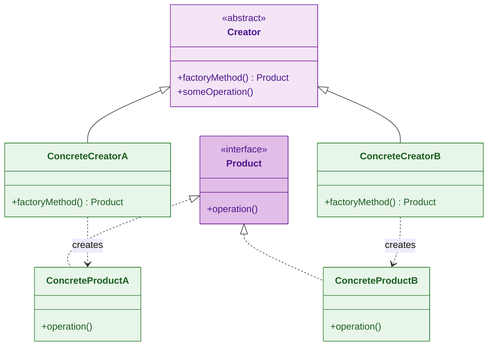
```mermaid
classDiagram
    class Creator {
        <<abstract>>
        +factoryMethod() Product
        +someOperation()
    }

    class ConcreteCreatorA {
        +factoryMethod() Product
    }

    class ConcreteCreatorB {
        +factoryMethod() Product
    }

    class Product {
        <<interface>>
        +operation()
    }

    class ConcreteProductA {
        +operation()
    }

    class ConcreteProductB {
        +operation()
    }

    Creator <|-- ConcreteCreatorA
    Creator <|-- ConcreteCreatorB
    Product <|.. ConcreteProductA
    Product <|.. ConcreteProductB
    ConcreteCreatorA ..> ConcreteProductA : creates
    ConcreteCreatorB ..> ConcreteProductB : creates

    style Creator fill:#F3E5F5,stroke:#7B1FA2,color:#4A148C
    style Product fill:#E1BEE7,stroke:#6A1B9A,color:#4A148C
    style ConcreteCreatorA fill:#E8F5E9,stroke:#2E7D32,color:#1B5E20
    style ConcreteCreatorB fill:#E8F5E9,stroke:#2E7D32,color:#1B5E20
    style ConcreteProductA fill:#E8F5E9,stroke:#2E7D32,color:#1B5E20
    style ConcreteProductB fill:#E8F5E9,stroke:#2E7D32,color:#1B5E20
```

### Abstract Factory Pattern

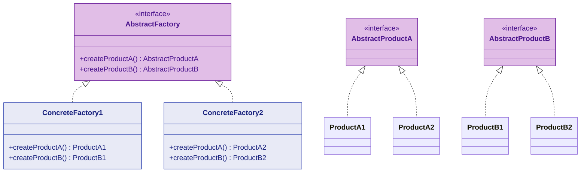
```mermaid
classDiagram
    class AbstractFactory {
        <<interface>>
        +createProductA() AbstractProductA
        +createProductB() AbstractProductB
    }

    class ConcreteFactory1 {
        +createProductA() ProductA1
        +createProductB() ProductB1
    }

    class ConcreteFactory2 {
        +createProductA() ProductA2
        +createProductB() ProductB2
    }

    class AbstractProductA {
        <<interface>>
    }

    class AbstractProductB {
        <<interface>>
    }

    class ProductA1
    class ProductA2
    class ProductB1
    class ProductB2

    AbstractFactory <|.. ConcreteFactory1
    AbstractFactory <|.. ConcreteFactory2
    AbstractProductA <|.. ProductA1
    AbstractProductA <|.. ProductA2
    AbstractProductB <|.. ProductB1
    AbstractProductB <|.. ProductB2

    style AbstractFactory fill:#E1BEE7,stroke:#6A1B9A,color:#4A148C
    style AbstractProductA fill:#E1BEE7,stroke:#6A1B9A,color:#4A148C
    style AbstractProductB fill:#E1BEE7,stroke:#6A1B9A,color:#4A148C
    style ConcreteFactory1 fill:#E8EAF6,stroke:#3F51B5,color:#1A237E
    style ConcreteFactory2 fill:#E8EAF6,stroke:#3F51B5,color:#1A237E
```

### Builder Pattern

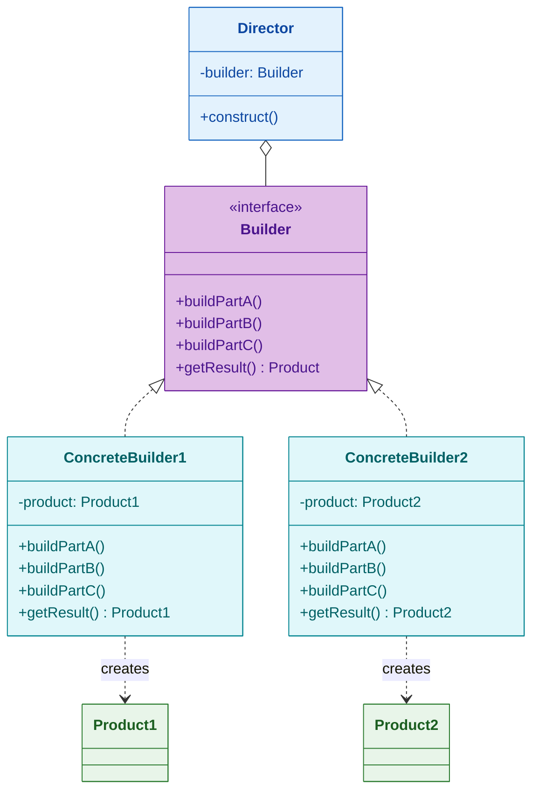
```mermaid
classDiagram
    class Director {
        -builder: Builder
        +construct()
    }

    class Builder {
        <<interface>>
        +buildPartA()
        +buildPartB()
        +buildPartC()
        +getResult() Product
    }

    class ConcreteBuilder1 {
        -product: Product1
        +buildPartA()
        +buildPartB()
        +buildPartC()
        +getResult() Product1
    }

    class ConcreteBuilder2 {
        -product: Product2
        +buildPartA()
        +buildPartB()
        +buildPartC()
        +getResult() Product2
    }

    class Product1
    class Product2

    Director o-- Builder
    Builder <|.. ConcreteBuilder1
    Builder <|.. ConcreteBuilder2
    ConcreteBuilder1 ..> Product1 : creates
    ConcreteBuilder2 ..> Product2 : creates

    style Director fill:#E3F2FD,stroke:#1565C0,color:#0D47A1
    style Builder fill:#E1BEE7,stroke:#6A1B9A,color:#4A148C
    style ConcreteBuilder1 fill:#E0F7FA,stroke:#00838F,color:#006064
    style ConcreteBuilder2 fill:#E0F7FA,stroke:#00838F,color:#006064
    style Product1 fill:#E8F5E9,stroke:#2E7D32,color:#1B5E20
    style Product2 fill:#E8F5E9,stroke:#2E7D32,color:#1B5E20
```

### Singleton Pattern

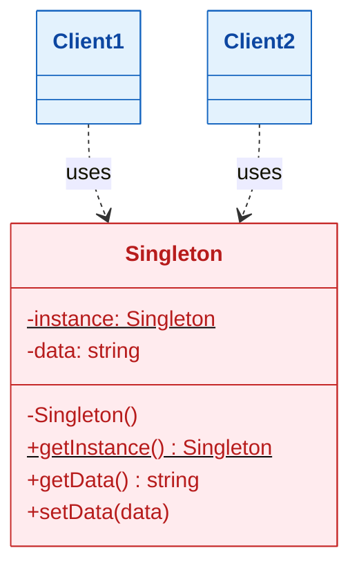
```mermaid
classDiagram
    class Singleton {
        -instance: Singleton$
        -data: string
        -Singleton()
        +getInstance()$ Singleton
        +getData() string
        +setData(data)
    }

    class Client1
    class Client2

    Client1 ..> Singleton : uses
    Client2 ..> Singleton : uses

    style Singleton fill:#FFEBEE,stroke:#C62828,color:#B71C1C
    style Client1 fill:#E3F2FD,stroke:#1565C0,color:#0D47A1
    style Client2 fill:#E3F2FD,stroke:#1565C0,color:#0D47A1
```

---

## Structural Patterns

### Adapter Pattern

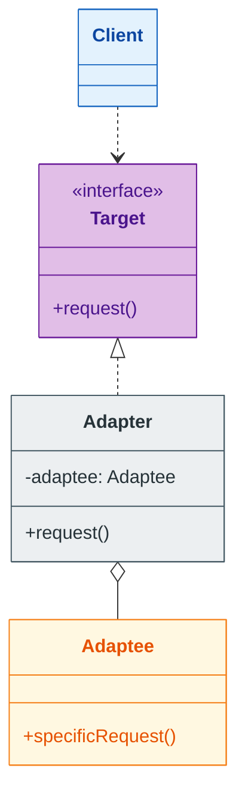
```mermaid
classDiagram
    class Target {
        <<interface>>
        +request()
    }

    class Adapter {
        -adaptee: Adaptee
        +request()
    }

    class Adaptee {
        +specificRequest()
    }

    class Client

    Target <|.. Adapter
    Adapter o-- Adaptee
    Client ..> Target

    style Target fill:#E1BEE7,stroke:#6A1B9A,color:#4A148C
    style Adapter fill:#ECEFF1,stroke:#455A64,color:#263238
    style Adaptee fill:#FFF8E1,stroke:#F57F17,color:#E65100
    style Client fill:#E3F2FD,stroke:#1565C0,color:#0D47A1
```

### Decorator Pattern

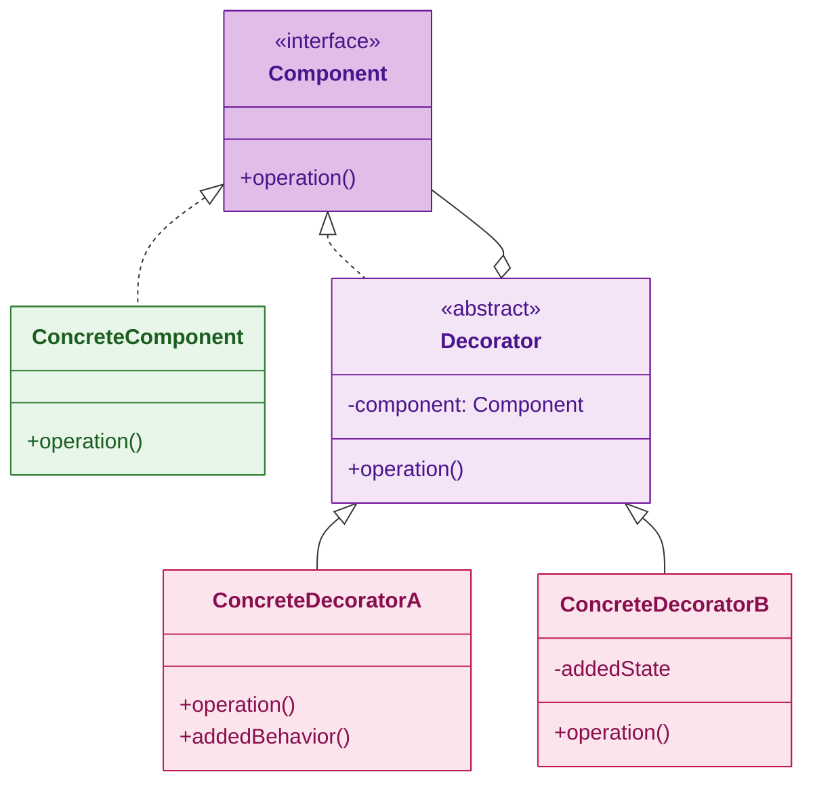
```mermaid
classDiagram
    class Component {
        <<interface>>
        +operation()
    }

    class ConcreteComponent {
        +operation()
    }

    class Decorator {
        <<abstract>>
        -component: Component
        +operation()
    }

    class ConcreteDecoratorA {
        +operation()
        +addedBehavior()
    }

    class ConcreteDecoratorB {
        -addedState
        +operation()
    }

    Component <|.. ConcreteComponent
    Component <|.. Decorator
    Decorator <|-- ConcreteDecoratorA
    Decorator <|-- ConcreteDecoratorB
    Decorator o-- Component

    style Component fill:#E1BEE7,stroke:#6A1B9A,color:#4A148C
    style ConcreteComponent fill:#E8F5E9,stroke:#2E7D32,color:#1B5E20
    style Decorator fill:#F3E5F5,stroke:#7B1FA2,color:#4A148C
    style ConcreteDecoratorA fill:#FCE4EC,stroke:#C2185B,color:#880E4F
    style ConcreteDecoratorB fill:#FCE4EC,stroke:#C2185B,color:#880E4F
```

### Facade Pattern

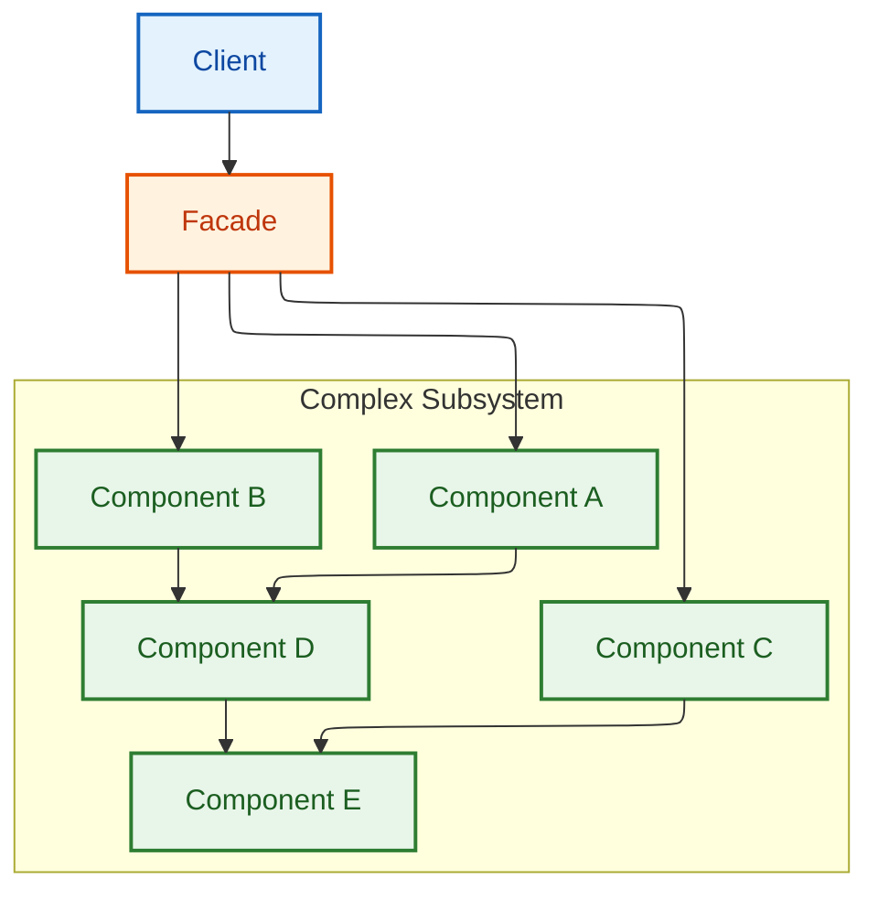
```mermaid
---
config:
  layout: elk
---
flowchart TB
    %% Cagle Facade Colors
    classDef client fill:#E3F2FD,stroke:#1565C0,stroke-width:2px,color:#0D47A1
    classDef facade fill:#FFF3E0,stroke:#E65100,stroke-width:2px,color:#BF360C
    classDef subsystem fill:#E8F5E9,stroke:#2E7D32,stroke-width:2px,color:#1B5E20

    CLIENT[Client]:::client
    FACADE[Facade]:::facade

    subgraph Subsystem ["Complex Subsystem"]
        S1[Component A]:::subsystem
        S2[Component B]:::subsystem
        S3[Component C]:::subsystem
        S4[Component D]:::subsystem
        S5[Component E]:::subsystem
    end

    CLIENT --> FACADE
    FACADE --> S1
    FACADE --> S2
    FACADE --> S3
    S1 --> S4
    S2 --> S4
    S3 --> S5
    S4 --> S5
```

### Composite Pattern

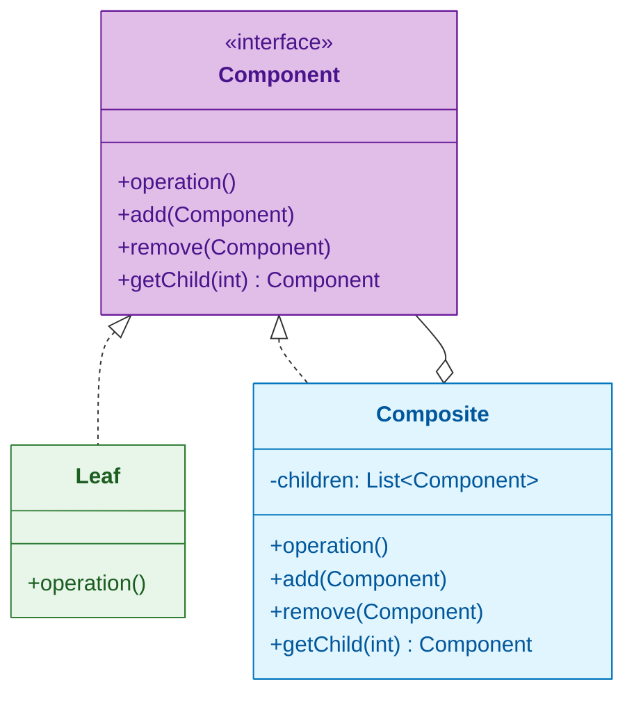
```mermaid
classDiagram
    class Component {
        <<interface>>
        +operation()
        +add(Component)
        +remove(Component)
        +getChild(int) Component
    }

    class Leaf {
        +operation()
    }

    class Composite {
        -children: List~Component~
        +operation()
        +add(Component)
        +remove(Component)
        +getChild(int) Component
    }

    Component <|.. Leaf
    Component <|.. Composite
    Composite o-- Component

    style Component fill:#E1BEE7,stroke:#6A1B9A,color:#4A148C
    style Leaf fill:#E8F5E9,stroke:#2E7D32,color:#1B5E20
    style Composite fill:#E1F5FE,stroke:#0277BD,color:#01579B
```

---

## Behavioral Patterns

### Observer Pattern

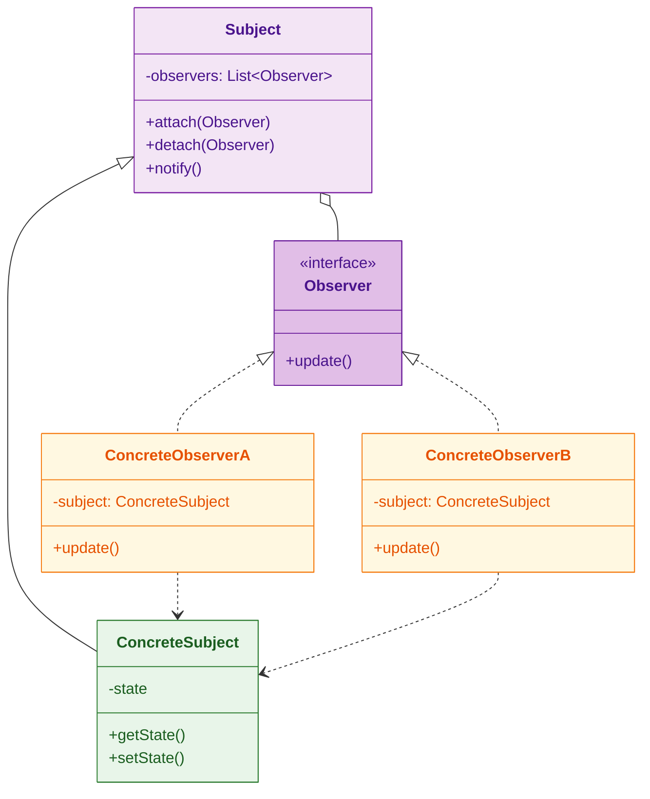
```mermaid
classDiagram
    class Subject {
        -observers: List~Observer~
        +attach(Observer)
        +detach(Observer)
        +notify()
    }

    class ConcreteSubject {
        -state
        +getState()
        +setState()
    }

    class Observer {
        <<interface>>
        +update()
    }

    class ConcreteObserverA {
        -subject: ConcreteSubject
        +update()
    }

    class ConcreteObserverB {
        -subject: ConcreteSubject
        +update()
    }

    Subject <|-- ConcreteSubject
    Observer <|.. ConcreteObserverA
    Observer <|.. ConcreteObserverB
    Subject o-- Observer
    ConcreteObserverA ..> ConcreteSubject
    ConcreteObserverB ..> ConcreteSubject

    style Subject fill:#F3E5F5,stroke:#7B1FA2,color:#4A148C
    style Observer fill:#E1BEE7,stroke:#6A1B9A,color:#4A148C
    style ConcreteSubject fill:#E8F5E9,stroke:#2E7D32,color:#1B5E20
    style ConcreteObserverA fill:#FFF8E1,stroke:#F57F17,color:#E65100
    style ConcreteObserverB fill:#FFF8E1,stroke:#F57F17,color:#E65100
```

### Observer Pattern Sequence

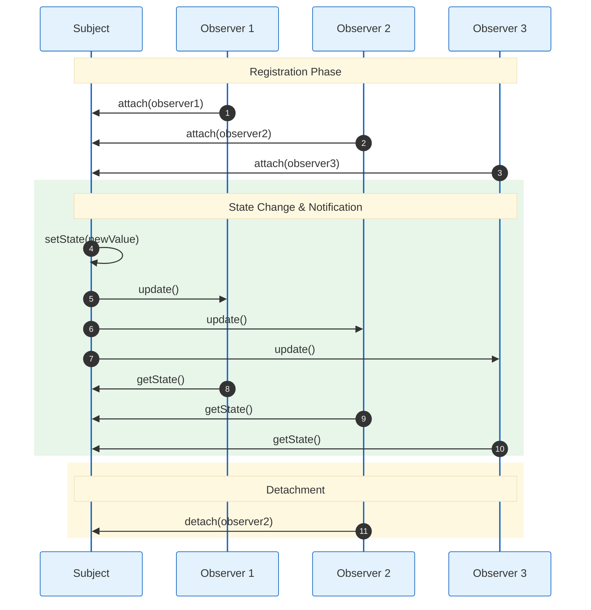
```mermaid
%%{init: {
  "theme": "base",
  "themeVariables": {
    "actorBkg": "#E3F2FD",
    "actorBorder": "#1565C0",
    "noteBkgColor": "#FFF8E1",
    "activationBkgColor": "#E8F5E9"
  }
}}%%
sequenceDiagram
    autonumber
    participant S as Subject
    participant O1 as Observer 1
    participant O2 as Observer 2
    participant O3 as Observer 3

    Note over S,O3: Registration Phase
    O1->>S: attach(observer1)
    O2->>S: attach(observer2)
    O3->>S: attach(observer3)

    rect rgb(232, 245, 233)
        Note over S,O3: State Change & Notification
        S->>S: setState(newValue)
        S->>O1: update()
        S->>O2: update()
        S->>O3: update()
        O1->>S: getState()
        O2->>S: getState()
        O3->>S: getState()
    end

    rect rgb(255, 248, 225)
        Note over S,O3: Detachment
        O2->>S: detach(observer2)
    end
```

### Strategy Pattern

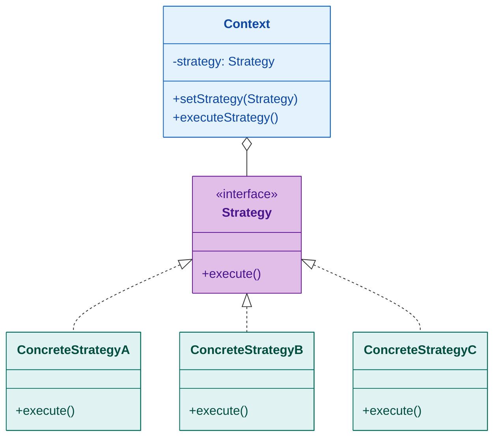
```mermaid
classDiagram
    class Context {
        -strategy: Strategy
        +setStrategy(Strategy)
        +executeStrategy()
    }

    class Strategy {
        <<interface>>
        +execute()
    }

    class ConcreteStrategyA {
        +execute()
    }

    class ConcreteStrategyB {
        +execute()
    }

    class ConcreteStrategyC {
        +execute()
    }

    Context o-- Strategy
    Strategy <|.. ConcreteStrategyA
    Strategy <|.. ConcreteStrategyB
    Strategy <|.. ConcreteStrategyC

    style Context fill:#E3F2FD,stroke:#1565C0,color:#0D47A1
    style Strategy fill:#E1BEE7,stroke:#6A1B9A,color:#4A148C
    style ConcreteStrategyA fill:#E0F2F1,stroke:#00695C,color:#004D40
    style ConcreteStrategyB fill:#E0F2F1,stroke:#00695C,color:#004D40
    style ConcreteStrategyC fill:#E0F2F1,stroke:#00695C,color:#004D40
```

### Command Pattern

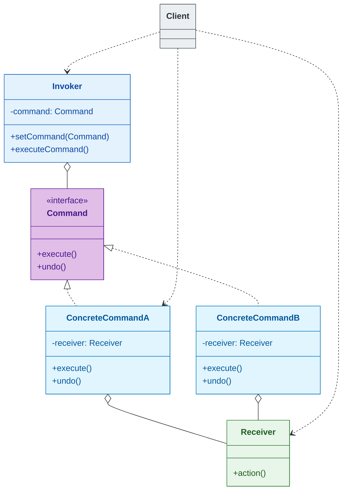
```mermaid
classDiagram
    class Invoker {
        -command: Command
        +setCommand(Command)
        +executeCommand()
    }

    class Command {
        <<interface>>
        +execute()
        +undo()
    }

    class ConcreteCommandA {
        -receiver: Receiver
        +execute()
        +undo()
    }

    class ConcreteCommandB {
        -receiver: Receiver
        +execute()
        +undo()
    }

    class Receiver {
        +action()
    }

    class Client

    Invoker o-- Command
    Command <|.. ConcreteCommandA
    Command <|.. ConcreteCommandB
    ConcreteCommandA o-- Receiver
    ConcreteCommandB o-- Receiver
    Client ..> Invoker
    Client ..> Receiver
    Client ..> ConcreteCommandA

    style Invoker fill:#E3F2FD,stroke:#1565C0,color:#0D47A1
    style Command fill:#E1BEE7,stroke:#6A1B9A,color:#4A148C
    style ConcreteCommandA fill:#E1F5FE,stroke:#0277BD,color:#01579B
    style ConcreteCommandB fill:#E1F5FE,stroke:#0277BD,color:#01579B
    style Receiver fill:#E8F5E9,stroke:#2E7D32,color:#1B5E20
    style Client fill:#ECEFF1,stroke:#455A64,color:#263238
```

### Chain of Responsibility

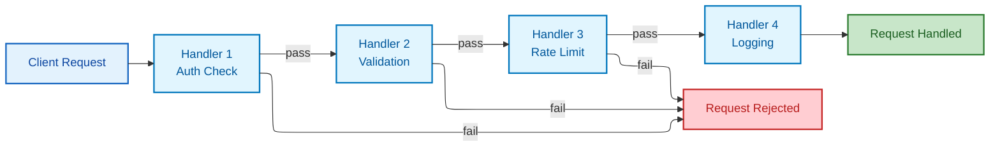
```mermaid
---
config:
  layout: elk
---
flowchart LR
    %% Cagle Chain Colors
    classDef client fill:#E3F2FD,stroke:#1565C0,stroke-width:2px,color:#0D47A1
    classDef handler fill:#E1F5FE,stroke:#0277BD,stroke-width:2px,color:#01579B
    classDef handled fill:#C8E6C9,stroke:#2E7D32,stroke-width:2px,color:#1B5E20
    classDef unhandled fill:#FFCDD2,stroke:#C62828,stroke-width:2px,color:#B71C1C

    CLIENT[Client Request]:::client
    H1[Handler 1<br/>Auth Check]:::handler
    H2[Handler 2<br/>Validation]:::handler
    H3[Handler 3<br/>Rate Limit]:::handler
    H4[Handler 4<br/>Logging]:::handler
    SUCCESS[Request Handled]:::handled
    FAIL[Request Rejected]:::unhandled

    CLIENT --> H1
    H1 -->|pass| H2
    H1 -->|fail| FAIL
    H2 -->|pass| H3
    H2 -->|fail| FAIL
    H3 -->|pass| H4
    H3 -->|fail| FAIL
    H4 --> SUCCESS
```

---

## Architectural Patterns

### Repository Pattern

```mermaid
classDiagram
    class IRepository~T~ {
        <<interface>>
        +getById(id) T
        +getAll() List~T~
        +add(entity: T)
        +update(entity: T)
        +delete(id)
    }

    class UserRepository {
        -dbContext: DbContext
        +getById(id) User
        +getAll() List~User~
        +add(entity: User)
        +update(entity: User)
        +delete(id)
        +findByEmail(email) User
    }

    class OrderRepository {
        -dbContext: DbContext
        +getById(id) Order
        +getAll() List~Order~
        +add(entity: Order)
        +update(entity: Order)
        +delete(id)
        +findByUser(userId) List~Order~
    }

    class User {
        +id: string
        +email: string
        +name: string
    }

    class Order {
        +id: string
        +userId: string
        +total: decimal
    }

    IRepository~T~ <|.. UserRepository
    IRepository~T~ <|.. OrderRepository
    UserRepository ..> User
    OrderRepository ..> Order

    style IRepository~T~ fill:#E1BEE7,stroke:#6A1B9A,color:#4A148C
    style UserRepository fill:#E8F5E9,stroke:#2E7D32,color:#1B5E20
    style OrderRepository fill:#E8F5E9,stroke:#2E7D32,color:#1B5E20
    style User fill:#FFF8E1,stroke:#F57F17,color:#E65100
    style Order fill:#FFF8E1,stroke:#F57F17,color:#E65100
```

### Clean Architecture Layers

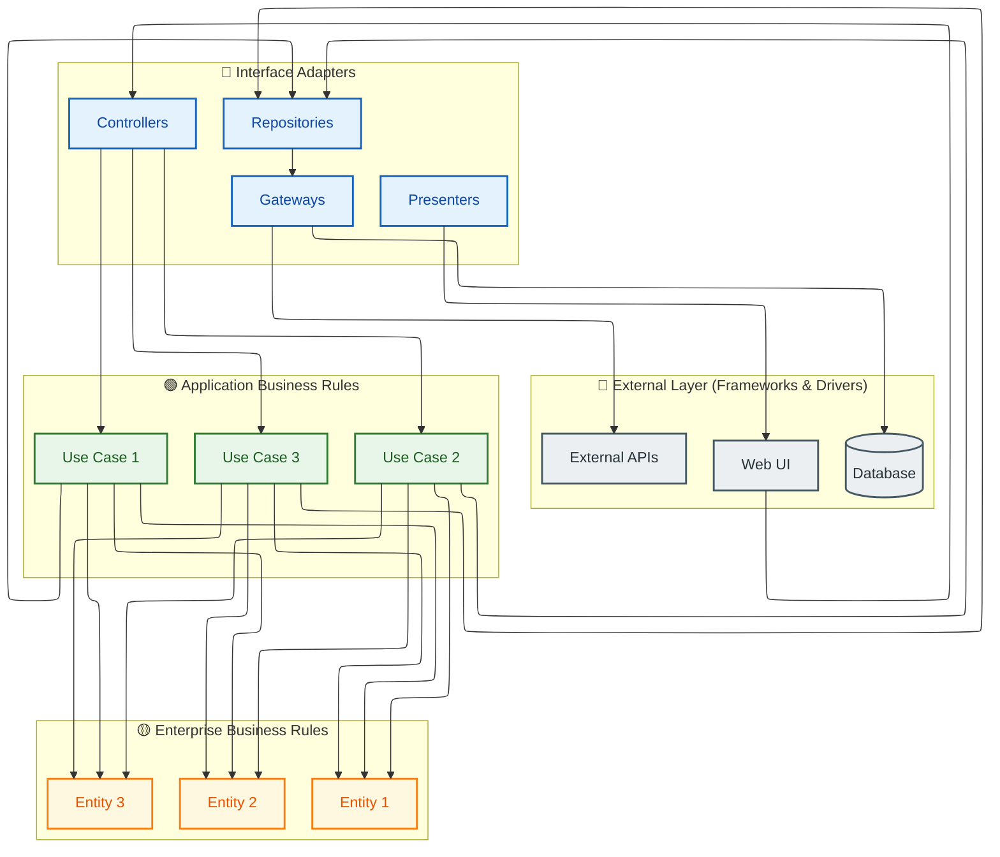
```mermaid
---
config:
  layout: elk
---
flowchart TB
    %% Cagle Clean Architecture Colors
    classDef external fill:#ECEFF1,stroke:#455A64,stroke-width:2px,color:#263238
    classDef interface fill:#E3F2FD,stroke:#1565C0,stroke-width:2px,color:#0D47A1
    classDef usecase fill:#E8F5E9,stroke:#2E7D32,stroke-width:2px,color:#1B5E20
    classDef entity fill:#FFF8E1,stroke:#F57F17,stroke-width:2px,color:#E65100

    subgraph External ["🔲 External Layer (Frameworks & Drivers)"]
        UI[Web UI]:::external
        DB[(Database)]:::external
        EXT[External APIs]:::external
    end

    subgraph Interface ["🔵 Interface Adapters"]
        CTRL[Controllers]:::interface
        PRES[Presenters]:::interface
        GW[Gateways]:::interface
        REPO[Repositories]:::interface
    end

    subgraph UseCase ["🟢 Application Business Rules"]
        UC1[Use Case 1]:::usecase
        UC2[Use Case 2]:::usecase
        UC3[Use Case 3]:::usecase
    end

    subgraph Entity ["🟡 Enterprise Business Rules"]
        E1[Entity 1]:::entity
        E2[Entity 2]:::entity
        E3[Entity 3]:::entity
    end

    UI --> CTRL
    CTRL --> UC1 & UC2 & UC3
    UC1 & UC2 & UC3 --> E1 & E2 & E3
    UC1 & UC2 & UC3 --> REPO
    REPO --> GW
    GW --> DB
    GW --> EXT
    PRES --> UI
```

### Hexagonal Architecture

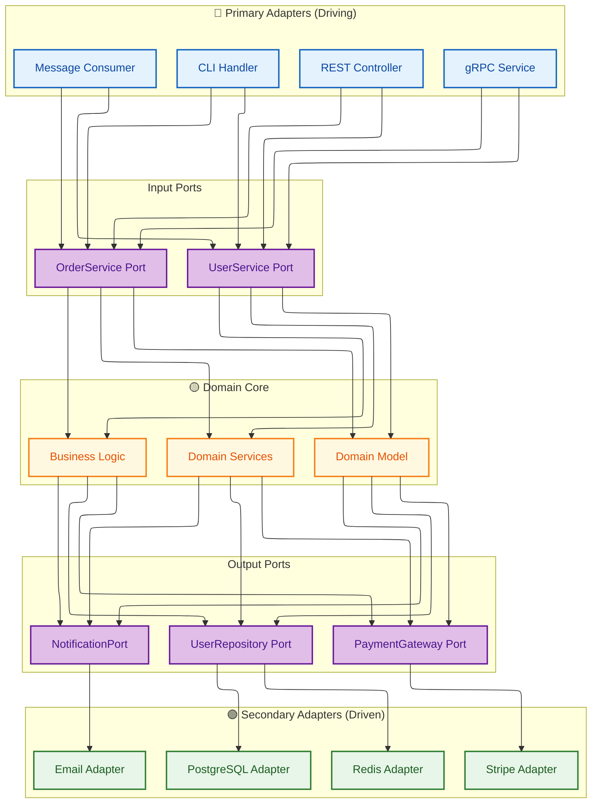
```mermaid
---
config:
  layout: elk
---
flowchart TB
    %% Cagle Hexagonal Colors
    classDef primary fill:#E3F2FD,stroke:#1565C0,stroke-width:2px,color:#0D47A1
    classDef secondary fill:#E8F5E9,stroke:#2E7D32,stroke-width:2px,color:#1B5E20
    classDef core fill:#FFF8E1,stroke:#F57F17,stroke-width:2px,color:#E65100
    classDef port fill:#E1BEE7,stroke:#6A1B9A,stroke-width:2px,color:#4A148C
    classDef adapter fill:#E1F5FE,stroke:#0277BD,stroke-width:2px,color:#01579B

    subgraph PrimaryAdapters ["🔵 Primary Adapters (Driving)"]
        REST[REST Controller]:::primary
        GRPC[gRPC Service]:::primary
        CLI[CLI Handler]:::primary
        MSG[Message Consumer]:::primary
    end

    subgraph InputPorts ["Input Ports"]
        IP1[UserService Port]:::port
        IP2[OrderService Port]:::port
    end

    subgraph Core ["🟡 Domain Core"]
        DOM[Domain Model]:::core
        SVC[Domain Services]:::core
        LOGIC[Business Logic]:::core
    end

    subgraph OutputPorts ["Output Ports"]
        OP1[UserRepository Port]:::port
        OP2[PaymentGateway Port]:::port
        OP3[NotificationPort]:::port
    end

    subgraph SecondaryAdapters ["🟢 Secondary Adapters (Driven)"]
        PGSQL[PostgreSQL Adapter]:::secondary
        STRIPE[Stripe Adapter]:::secondary
        EMAIL[Email Adapter]:::secondary
        CACHE[Redis Adapter]:::secondary
    end

    REST & GRPC & CLI & MSG --> IP1 & IP2
    IP1 & IP2 --> DOM & SVC & LOGIC
    DOM & SVC & LOGIC --> OP1 & OP2 & OP3
    OP1 --> PGSQL & CACHE
    OP2 --> STRIPE
    OP3 --> EMAIL
```

---

## Domain-Driven Design Patterns

### Aggregate Structure

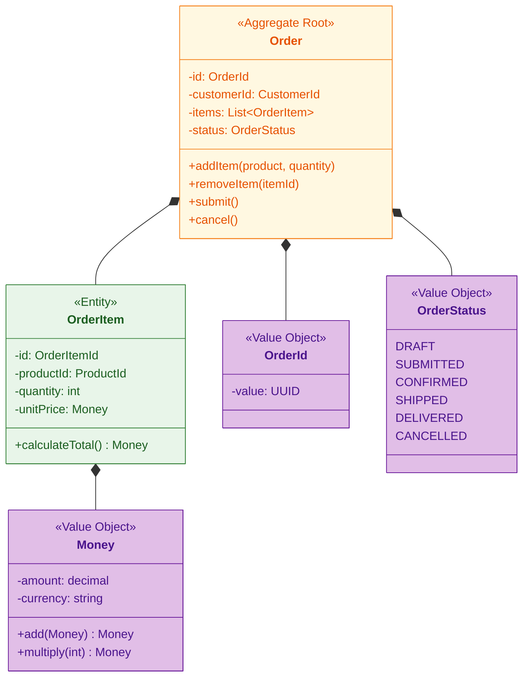
```mermaid
classDiagram
    class Order {
        <<Aggregate Root>>
        -id: OrderId
        -customerId: CustomerId
        -items: List~OrderItem~
        -status: OrderStatus
        +addItem(product, quantity)
        +removeItem(itemId)
        +submit()
        +cancel()
    }

    class OrderItem {
        <<Entity>>
        -id: OrderItemId
        -productId: ProductId
        -quantity: int
        -unitPrice: Money
        +calculateTotal() Money
    }

    class OrderId {
        <<Value Object>>
        -value: UUID
    }

    class Money {
        <<Value Object>>
        -amount: decimal
        -currency: string
        +add(Money) Money
        +multiply(int) Money
    }

    class OrderStatus {
        <<Value Object>>
        DRAFT
        SUBMITTED
        CONFIRMED
        SHIPPED
        DELIVERED
        CANCELLED
    }

    Order *-- OrderItem
    Order *-- OrderId
    Order *-- OrderStatus
    OrderItem *-- Money

    style Order fill:#FFF8E1,stroke:#F57F17,color:#E65100
    style OrderItem fill:#E8F5E9,stroke:#2E7D32,color:#1B5E20
    style OrderId fill:#E1BEE7,stroke:#6A1B9A,color:#4A148C
    style Money fill:#E1BEE7,stroke:#6A1B9A,color:#4A148C
    style OrderStatus fill:#E1BEE7,stroke:#6A1B9A,color:#4A148C
```

### Bounded Context Map

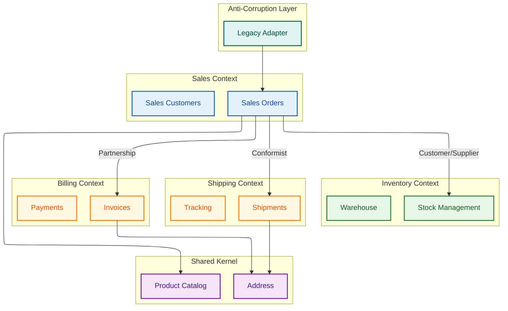
```mermaid
---
config:
  layout: elk
---
flowchart TB
    %% Cagle DDD Context Colors
    classDef context fill:#E3F2FD,stroke:#1565C0,stroke-width:2px,color:#0D47A1
    classDef upstream fill:#E8F5E9,stroke:#2E7D32,stroke-width:2px,color:#1B5E20
    classDef downstream fill:#FFF8E1,stroke:#F57F17,stroke-width:2px,color:#E65100
    classDef shared fill:#F3E5F5,stroke:#7B1FA2,stroke-width:2px,color:#4A148C
    classDef acl fill:#E0F2F1,stroke:#00695C,stroke-width:2px,color:#004D40

    subgraph Sales ["Sales Context"]
        SO[Sales Orders]:::context
        SC[Sales Customers]:::context
    end

    subgraph Inventory ["Inventory Context"]
        INV[Stock Management]:::upstream
        WH[Warehouse]:::upstream
    end

    subgraph Shipping ["Shipping Context"]
        SHIP[Shipments]:::downstream
        TRACK[Tracking]:::downstream
    end

    subgraph Billing ["Billing Context"]
        BILL[Invoices]:::downstream
        PAY[Payments]:::downstream
    end

    subgraph SharedKernel ["Shared Kernel"]
        PROD[Product Catalog]:::shared
        ADDR[Address]:::shared
    end

    subgraph ACL ["Anti-Corruption Layer"]
        ACL1[Legacy Adapter]:::acl
    end

    SO -->|Customer/Supplier| INV
    SO -->|Conformist| SHIP
    SO -->|Partnership| BILL
    SO --> PROD
    SHIP --> ADDR
    BILL --> ADDR
    ACL1 --> SO
```

---

## API Design Patterns

### REST Resource Model

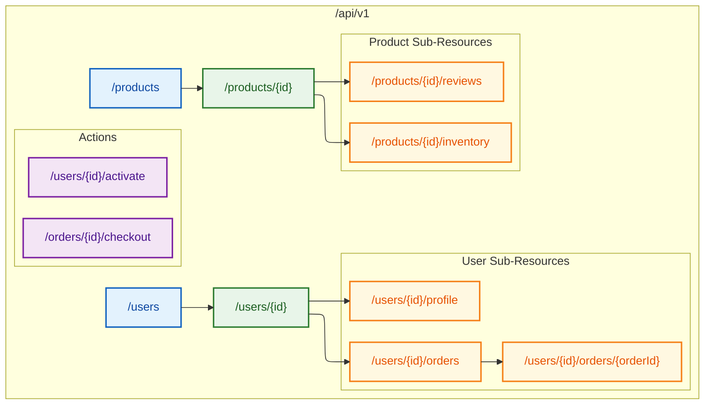
```mermaid
---
config:
  layout: elk
---
flowchart LR
    %% Cagle API Colors
    classDef collection fill:#E3F2FD,stroke:#1565C0,stroke-width:2px,color:#0D47A1
    classDef resource fill:#E8F5E9,stroke:#2E7D32,stroke-width:2px,color:#1B5E20
    classDef subresource fill:#FFF8E1,stroke:#F57F17,stroke-width:2px,color:#E65100
    classDef action fill:#F3E5F5,stroke:#7B1FA2,stroke-width:2px,color:#4A148C

    subgraph API ["/api/v1"]
        USERS["/users"]:::collection
        USER["/users/{id}"]:::resource

        subgraph UserResources ["User Sub-Resources"]
            ORDERS_C["/users/{id}/orders"]:::subresource
            ORDER["/users/{id}/orders/{orderId}"]:::subresource
            PROFILE["/users/{id}/profile"]:::subresource
        end

        PRODUCTS["/products"]:::collection
        PRODUCT["/products/{id}"]:::resource

        subgraph ProductResources ["Product Sub-Resources"]
            REVIEWS["/products/{id}/reviews"]:::subresource
            INVENTORY["/products/{id}/inventory"]:::subresource
        end

        subgraph Actions ["Actions"]
            ACTIVATE["/users/{id}/activate"]:::action
            CHECKOUT["/orders/{id}/checkout"]:::action
        end
    end

    USERS --> USER
    USER --> ORDERS_C --> ORDER
    USER --> PROFILE
    PRODUCTS --> PRODUCT
    PRODUCT --> REVIEWS
    PRODUCT --> INVENTORY
```

### GraphQL Schema Visualization

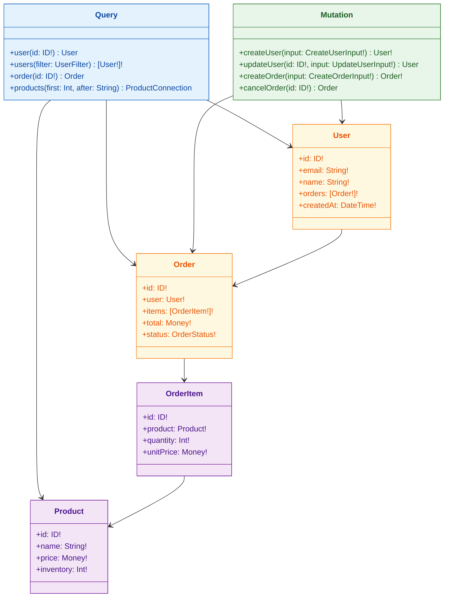
```mermaid
classDiagram
    class Query {
        +user(id: ID!) User
        +users(filter: UserFilter) [User!]!
        +order(id: ID!) Order
        +products(first: Int, after: String) ProductConnection
    }

    class Mutation {
        +createUser(input: CreateUserInput!) User!
        +updateUser(id: ID!, input: UpdateUserInput!) User
        +createOrder(input: CreateOrderInput!) Order!
        +cancelOrder(id: ID!) Order
    }

    class User {
        +id: ID!
        +email: String!
        +name: String!
        +orders: [Order!]!
        +createdAt: DateTime!
    }

    class Order {
        +id: ID!
        +user: User!
        +items: [OrderItem!]!
        +total: Money!
        +status: OrderStatus!
    }

    class OrderItem {
        +id: ID!
        +product: Product!
        +quantity: Int!
        +unitPrice: Money!
    }

    class Product {
        +id: ID!
        +name: String!
        +price: Money!
        +inventory: Int!
    }

    Query --> User
    Query --> Order
    Query --> Product
    Mutation --> User
    Mutation --> Order
    User --> Order
    Order --> OrderItem
    OrderItem --> Product

    style Query fill:#E3F2FD,stroke:#1565C0,color:#0D47A1
    style Mutation fill:#E8F5E9,stroke:#2E7D32,color:#1B5E20
    style User fill:#FFF8E1,stroke:#F57F17,color:#E65100
    style Order fill:#FFF8E1,stroke:#F57F17,color:#E65100
    style OrderItem fill:#F3E5F5,stroke:#7B1FA2,color:#4A148C
    style Product fill:#F3E5F5,stroke:#7B1FA2,color:#4A148C
```

---

## Integration Patterns

### Gateway Aggregation Pattern

```mermaid
%%{init: {
  "theme": "base",
  "themeVariables": {
    "actorBkg": "#E3F2FD",
    "actorBorder": "#1565C0",
    "noteBkgColor": "#FFF8E1",
    "activationBkgColor": "#E8F5E9"
  }
}}%%
sequenceDiagram
    autonumber
    participant C as Client
    participant GW as API Gateway
    participant US as User Service
    participant OS as Order Service
    participant PS as Product Service

    C->>+GW: GET /dashboard

    par Parallel Calls
        GW->>+US: GET /users/{id}
        GW->>+OS: GET /users/{id}/orders
        GW->>+PS: GET /products/featured
    end

    US-->>-GW: User Data
    OS-->>-GW: Order List
    PS-->>-GW: Products

    Note over GW: Aggregate Responses

    GW-->>-C: Combined Dashboard Response
```

### Anti-Corruption Layer

```mermaid
---
config:
  layout: elk
---
flowchart LR
    %% Cagle ACL Colors
    classDef modern fill:#E8F5E9,stroke:#2E7D32,stroke-width:2px,color:#1B5E20
    classDef acl fill:#E0F2F1,stroke:#00695C,stroke-width:2px,color:#004D40
    classDef legacy fill:#ECEFF1,stroke:#455A64,stroke-width:2px,color:#263238
    classDef translator fill:#F3E5F5,stroke:#7B1FA2,stroke-width:2px,color:#4A148C

    subgraph Modern ["Modern System"]
        MS[Modern Service]:::modern
        MD[Modern Domain]:::modern
    end

    subgraph ACL ["Anti-Corruption Layer"]
        FACADE[Facade]:::acl
        TRANS[Translator]:::translator
        ADAPT[Adapter]:::acl
    end

    subgraph Legacy ["Legacy System"]
        LS[Legacy Service]:::legacy
        LD[Legacy Database]:::legacy
    end

    MS --> MD
    MD --> FACADE
    FACADE --> TRANS
    TRANS --> ADAPT
    ADAPT --> LS
    LS --> LD
```

---

## Combining Multiple Diagrams

### Technical Design Document Structure

For comprehensive technical designs, combine multiple diagram types:

#### 1. System Context (C4)
```mermaid
C4Context
    title System Context - E-Commerce Platform

    Person(customer, "Customer", "Online shopper")
    Person(admin, "Admin", "Platform administrator")

    System(ecommerce, "E-Commerce Platform", "Main shopping system")

    System_Ext(payment, "Payment Gateway", "Processes payments")
    System_Ext(shipping, "Shipping API", "Calculates shipping")
    System_Ext(email, "Email Service", "Sends notifications")

    Rel(customer, ecommerce, "Browses, purchases")
    Rel(admin, ecommerce, "Manages products, orders")
    Rel(ecommerce, payment, "Processes payments")
    Rel(ecommerce, shipping, "Gets rates")
    Rel(ecommerce, email, "Sends emails")
```

#### 2. Component Architecture (Flowchart)
```mermaid
---
config:
  layout: elk
---
flowchart TB
    %% Cagle Architecture Colors
    classDef api fill:#E3F2FD,stroke:#1565C0,stroke-width:2px,color:#0D47A1
    classDef service fill:#E8F5E9,stroke:#2E7D32,stroke-width:2px,color:#1B5E20
    classDef data fill:#FFF8E1,stroke:#F57F17,stroke-width:2px,color:#E65100

    subgraph API ["API Layer"]
        GW[API Gateway]:::api
        AUTH[Auth Service]:::api
    end

    subgraph Services ["Business Services"]
        US[User Service]:::service
        PS[Product Service]:::service
        OS[Order Service]:::service
        CS[Cart Service]:::service
    end

    subgraph Data ["Data Layer"]
        PG[(PostgreSQL)]:::data
        REDIS[(Redis)]:::data
        ES[(Elasticsearch)]:::data
    end

    GW --> AUTH
    GW --> US & PS & OS & CS
    US --> PG
    PS --> PG & ES
    OS --> PG
    CS --> REDIS
```

#### 3. Data Model (ER Diagram)
```mermaid
erDiagram
    USER ||--o{ ORDER : places
    USER ||--|| PROFILE : has
    ORDER ||--|{ ORDER_ITEM : contains
    PRODUCT ||--o{ ORDER_ITEM : "included in"
    PRODUCT }|--|| CATEGORY : "belongs to"
    PRODUCT ||--o{ REVIEW : has

    USER {
        uuid id PK
        string email UK
        string password_hash
        timestamp created_at
    }

    ORDER {
        uuid id PK
        uuid user_id FK
        decimal total
        enum status
        timestamp created_at
    }

    PRODUCT {
        uuid id PK
        string name
        decimal price
        int inventory
        uuid category_id FK
    }
```

#### 4. API Flow (Sequence)
```mermaid
%%{init: {
  "theme": "base",
  "themeVariables": {
    "actorBkg": "#E3F2FD",
    "actorBorder": "#1565C0",
    "noteBkgColor": "#FFF8E1",
    "activationBkgColor": "#E8F5E9"
  }
}}%%
sequenceDiagram
    autonumber
    participant U as User
    participant API as API Gateway
    participant Cart as Cart Service
    participant Order as Order Service
    participant Pay as Payment Service
    participant DB as Database

    U->>+API: POST /checkout
    API->>+Cart: Get Cart Items
    Cart-->>-API: Cart Data
    API->>+Order: Create Order
    Order->>+DB: Save Order
    DB-->>-Order: Order ID
    Order-->>-API: Order Created
    API->>+Pay: Process Payment
    Pay-->>-API: Payment Confirmed
    API->>+Order: Update Status
    Order-->>-API: Status Updated
    API-->>-U: Order Confirmation
```

#### 5. State Machine (State Diagram)
```mermaid
%%{init: {
  "theme": "base",
  "themeVariables": {
    "primaryColor": "#E1F5FE",
    "primaryTextColor": "#01579B",
    "primaryBorderColor": "#0277BD"
  }
}}%%
stateDiagram-v2
    classDef pending fill:#FFF9C4,stroke:#F9A825,color:#F57F17
    classDef processing fill:#BBDEFB,stroke:#1565C0,color:#0D47A1
    classDef success fill:#C8E6C9,stroke:#2E7D32,color:#1B5E20
    classDef failed fill:#FFCDD2,stroke:#C62828,color:#B71C1C

    [*] --> Pending

    Pending --> PaymentProcessing : checkout
    PaymentProcessing --> Confirmed : payment_success
    PaymentProcessing --> PaymentFailed : payment_failed
    PaymentFailed --> Pending : retry
    PaymentFailed --> Cancelled : abandon

    Confirmed --> Processing : begin_fulfillment
    Processing --> Shipped : ship
    Shipped --> Delivered : deliver

    Pending --> Cancelled : cancel
    Confirmed --> Cancelled : cancel
    Processing --> Cancelled : cancel

    Delivered --> [*]
    Cancelled --> [*]

    class Pending pending
    class PaymentProcessing,Processing processing
    class Confirmed,Shipped,Delivered success
    class PaymentFailed,Cancelled failed
```

---

## Quick Reference

### Copy-Paste Design Patterns classDef Block

```
%% Cagle Design Patterns Color System

%% Core Pattern Elements
classDef interface fill:#E1BEE7,stroke:#6A1B9A,stroke-width:2px,color:#4A148C
classDef abstract fill:#F3E5F5,stroke:#7B1FA2,stroke-width:2px,color:#4A148C
classDef concrete fill:#E8F5E9,stroke:#2E7D32,stroke-width:2px,color:#1B5E20
classDef client fill:#E3F2FD,stroke:#1565C0,stroke-width:2px,color:#0D47A1

%% Behavioral Elements
classDef handler fill:#E1F5FE,stroke:#0277BD,stroke-width:2px,color:#01579B
classDef observer fill:#FFF8E1,stroke:#F57F17,stroke-width:2px,color:#E65100
classDef strategy fill:#E0F2F1,stroke:#00695C,stroke-width:2px,color:#004D40

%% Structural Elements
classDef decorator fill:#FCE4EC,stroke:#C2185B,stroke-width:2px,color:#880E4F
classDef adapter fill:#ECEFF1,stroke:#455A64,stroke-width:2px,color:#263238
classDef facade fill:#FFF3E0,stroke:#E65100,stroke-width:2px,color:#BF360C

%% Creational Elements
classDef factory fill:#E8EAF6,stroke:#3F51B5,stroke-width:2px,color:#1A237E
classDef builder fill:#E0F7FA,stroke:#00838F,stroke-width:2px,color:#006064
classDef singleton fill:#FFEBEE,stroke:#C62828,stroke-width:2px,color:#B71C1C

%% DDD Elements
classDef aggregate fill:#FFF8E1,stroke:#F57F17,stroke-width:2px,color:#E65100
classDef entity fill:#E8F5E9,stroke:#2E7D32,stroke-width:2px,color:#1B5E20
classDef valueobject fill:#E1BEE7,stroke:#6A1B9A,stroke-width:2px,color:#4A148C
classDef context fill:#E3F2FD,stroke:#1565C0,stroke-width:2px,color:#0D47A1
```

### Pattern Type Quick Selection

| Pattern Type | Primary Diagram | Secondary Diagram |
|--------------|-----------------|-------------------|
| **Creational** | Class Diagram | Sequence (for runtime) |
| **Structural** | Class Diagram | Flowchart (for dependencies) |
| **Behavioral** | Class Diagram | Sequence + State |
| **Architectural** | Flowchart (ELK) | C4 Context |
| **DDD** | Class Diagram | Flowchart (context map) |
| **API** | Sequence | Class (schema) |
| **Integration** | Sequence | Flowchart |

---

## References

- Cagle, Kurt. "Semantic Visualization and Knowledge Representation" - The Ontologist
- Gamma, Erich et al. *Design Patterns: Elements of Reusable Object-Oriented Software*
- Evans, Eric. *Domain-Driven Design: Tackling Complexity in the Heart of Software*
- [Mermaid Class Diagram Documentation](https://mermaid.js.org/syntax/classDiagram.html)
- [Refactoring Guru - Design Patterns](https://refactoring.guru/design-patterns)
