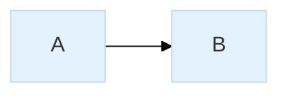
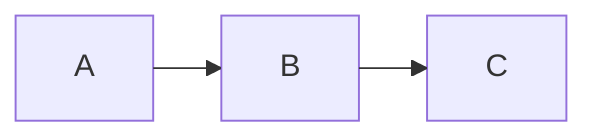

# Mermaid Configuration Reference

> **SKILL QUICK REF**: Frontmatter `---config:---` or `%%{init: {}}%%` | `theme: base` required | `layout: elk` for complex | `themeVariables:` for colors | Diagram-specific: `flowchart:` `sequence:` `class:` `state:` `er:`

## When to Use

- Setting global diagram configuration
- ELK layout engine options
- Diagram-specific configuration
- Theme variable customization
- Troubleshooting rendering issues

---

## Diagram Type Stability

| Status | Diagram Types | Notes |
|--------|---------------|-------|
| **Stable** | `flowchart`, `sequenceDiagram`, `classDiagram`, `stateDiagram-v2`, `erDiagram`, `gantt`, `pie`, `gitGraph` | Production-ready, syntax stable |
| **Beta** | `architecture-beta`, `block-beta`, `xychart-beta`, `radar-beta`, `treemap-beta`, `packet-beta`, `kanban`, `sankey-beta` | Syntax may change, use `-beta` suffix |
| **Experimental** | `C4Context`, `C4Container`, `C4Component`, `C4Dynamic` | C4 model support, syntax evolving |

### ELK Layout Support

ELK layout engine is supported for:
- `flowchart` / `graph`
- `stateDiagram-v2`

Not supported: sequence, class, ER, gantt, pie, or beta diagrams.

---

## Overview

This comprehensive reference documents ALL configuration options available in Mermaid.js, following Kurt Cagle's approach to systematic documentation. Configuration can be specified using:

1. **Frontmatter** (recommended, v10.5.0+): YAML block at the top of the diagram
2. **Init Directive**: Legacy method using `%%{init: {...}}%%`
3. **JavaScript API**: For programmatic configuration

**Key Principle**: *"Configuration is the bridge between default behavior and intentional design. Master configuration, master visualization."*

---

## Configuration Methods

### Method 1: Frontmatter (Recommended)

```yaml
---
config:
  theme: base
  layout: elk
  themeVariables:
    primaryColor: "#E3F2FD"
---
flowchart LR
    A --> B
```

### Method 2: Init Directive



### Method 3: Combined (Diagram-Specific)

```yaml
---
config:
  flowchart:
    nodeSpacing: 30
    rankSpacing: 40
    curve: basis
---
flowchart LR
    A --> B
```

---

## Global Configuration Options

### Core Settings

| Property | Type | Default | Description |
|----------|------|---------|-------------|
| `theme` | string | `"default"` | Theme selection: `default`, `base`, `dark`, `forest`, `neutral`, `null` |
| `look` | string | `"classic"` | Visual style: `classic` or `handDrawn` |
| `layout` | string | `"dagre"` | Layout engine: `dagre`, `elk` |
| `darkMode` | boolean | `false` | Enable dark mode color calculations |
| `fontFamily` | string | `"trebuchet ms..."` | Primary font for all text |
| `fontSize` | number | `16` | Base font size in pixels |

### Security & Rendering

| Property | Type | Default | Description |
|----------|------|---------|-------------|
| `securityLevel` | string | `"strict"` | Trust level: `strict`, `loose`, `antiscript`, `sandbox` |
| `startOnLoad` | boolean | `true` | Auto-render diagrams on page load |
| `deterministicIds` | boolean | `false` | Generate consistent element IDs |
| `logLevel` | string | `"fatal"` | Logging: `trace`, `debug`, `info`, `warn`, `error`, `fatal` |
| `handDrawnSeed` | number | `0` | Seed for hand-drawn style randomization |

### Example: Complete Global Configuration

```yaml
---
config:
  theme: base
  look: classic
  layout: elk
  darkMode: false
  fontFamily: "Inter, -apple-system, BlinkMacSystemFont, 'Segoe UI', sans-serif"
  fontSize: 14
  securityLevel: strict
---
```

---

## Layout Engine Configuration

### ELK (Eclipse Layout Kernel)

ELK provides superior layout for complex diagrams with many interconnections.

| Property | Type | Default | Description |
|----------|------|---------|-------------|
| `mergeEdges` | boolean | `false` | Allow edges to share paths (prettier but less readable) |
| `nodePlacementStrategy` | string | `"BRANDES_KOEPF"` | Node positioning algorithm |
| `cycleBreakingStrategy` | string | `"GREEDY_MODEL_ORDER"` | How to handle cycles in the graph |
| `forceNodeModelOrder` | boolean | `false` | Preserve node order from model |
| `considerModelOrder` | string | `"NODES_AND_EDGES"` | What ordering to preserve |

#### nodePlacementStrategy Options

| Strategy | Description | Best For |
|----------|-------------|----------|
| `SIMPLE` | Basic placement | Simple graphs |
| `NETWORK_SIMPLEX` | Optimizes edge lengths | Cost/weight graphs, flow diagrams |
| `LINEAR_SEGMENTS` | Minimizes bends | Timelines, sequential processes |
| `BRANDES_KOEPF` | Balanced layout (default) | General use, knowledge graphs |

**Selection Guide**:
- **Timelines/sequences**: Use `LINEAR_SEGMENTS` to keep nodes in straight lines
- **Cost/weight networks**: Use `NETWORK_SIMPLEX` to minimize total edge length
- **Knowledge graphs**: Use `BRANDES_KOEPF` for balanced, readable layouts

#### cycleBreakingStrategy Options

| Strategy | Description |
|----------|-------------|
| `GREEDY` | Fast, simple approach |
| `DEPTH_FIRST` | DFS-based cycle breaking |
| `INTERACTIVE` | Preserves user layout |
| `MODEL_ORDER` | Follows model order |
| `GREEDY_MODEL_ORDER` | Greedy with model preference |

#### considerModelOrder Options

| Option | Description |
|--------|-------------|
| `NONE` | Ignore model order |
| `NODES_AND_EDGES` | Preserve both node and edge order |
| `PREFER_EDGES` | Prioritize edge order |
| `PREFER_NODES` | Prioritize node order |

### ELK Configuration Example

```yaml
---
config:
  layout: elk
  elk:
    mergeEdges: false
    nodePlacementStrategy: BRANDES_KOEPF
    cycleBreakingStrategy: GREEDY_MODEL_ORDER
    forceNodeModelOrder: false
    considerModelOrder: NODES_AND_EDGES
---
flowchart LR
    A --> B --> C
    B --> D --> E
    C --> F
    D --> F
```

### Alternative ELK Initialization (Init Directive)

Equivalent to the frontmatter config block - use when frontmatter isn't supported:



### ELK Troubleshooting

**Cycles causing layout issues?** Add `cycleBreakingStrategy: GREEDY`:

```yaml
---
config:
  layout: elk
  elk:
    cycleBreakingStrategy: GREEDY
---
```

This aggressively breaks cycles to prevent the "hairball" effect in complex graphs.

---

## Flowchart Configuration

### Complete Options

| Property | Type | Default | Description |
|----------|------|---------|-------------|
| `titleTopMargin` | integer | `25` | Margin above title |
| `subGraphTitleMargin` | object | `{top:0, bottom:0}` | Subgraph title margins |
| `diagramPadding` | integer | `20` | Padding around entire diagram |
| `nodeSpacing` | integer | `50` | Space between nodes on same level |
| `rankSpacing` | integer | `50` | Space between levels/ranks |
| `curve` | string | `"basis"` | Line curve type |
| `padding` | number | `15` | Padding between labels and shapes |
| `wrappingWidth` | number | `200` | Width for text wrapping |
| `htmlLabels` | boolean | `true` | Enable HTML in labels |
| `defaultRenderer` | string | `"dagre-wrapper"` | Rendering engine |
| `inheritDir` | boolean | `false` | Subgraphs inherit parent direction |

### Curve Types

| Curve | Description | Visual Style |
|-------|-------------|--------------|
| `basis` | B-spline (default) | Smooth, flowing |
| `bumpX` | Bump curve (horizontal) | S-curves horizontal |
| `bumpY` | Bump curve (vertical) | S-curves vertical |
| `cardinal` | Cardinal spline | Smooth through points |
| `catmullRom` | Catmull-Rom spline | Very smooth |
| `linear` | Straight lines | Sharp, angular |
| `monotoneX` | Monotone horizontal | No overshooting |
| `monotoneY` | Monotone vertical | No overshooting |
| `natural` | Natural cubic spline | Smooth, natural |
| `step` | Step function | Right angles (center) |
| `stepAfter` | Step after | Right angles (after point) |
| `stepBefore` | Step before | Right angles (before point) |

### Flowchart Configuration Example

```yaml
---
config:
  flowchart:
    titleTopMargin: 25
    diagramPadding: 20
    nodeSpacing: 50
    rankSpacing: 50
    curve: basis
    padding: 15
    wrappingWidth: 200
    htmlLabels: true
    defaultRenderer: elk
    inheritDir: true
---
flowchart LR
    A[Start] --> B{Decision}
    B -->|Yes| C[Process]
    B -->|No| D[End]
```

---

## Sequence Diagram Configuration

### Complete Options

| Property | Type | Default | Description |
|----------|------|---------|-------------|
| `diagramMarginX` | integer | `50` | Horizontal margin |
| `diagramMarginY` | integer | `10` | Vertical margin |
| `actorMargin` | integer | `50` | Space between actors |
| `width` | integer | `150` | Actor box width |
| `height` | integer | `50` | Actor box height |
| `boxMargin` | integer | `10` | Loop box margin |
| `boxTextMargin` | integer | `5` | Text margin in loop boxes |
| `noteMargin` | integer | `10` | Note margin |
| `messageMargin` | integer | `35` | Space between messages |
| `messageAlign` | string | `"center"` | Message alignment: `left`, `center`, `right` |
| `mirrorActors` | boolean | `true` | Show actors at bottom |
| `bottomMarginAdj` | integer | `1` | Bottom margin adjustment |
| `activationWidth` | integer | `10` | Activation bar width |
| `rightAngles` | boolean | `false` | Use right-angle arrows |
| `showSequenceNumbers` | boolean | `false` | Show message numbers |
| `hideUnusedParticipants` | boolean | `false` | Hide unused participants |
| `forceMenus` | boolean | `false` | Force popup menus visible |
| `wrap` | boolean | `false` | Enable text wrapping |
| `wrapPadding` | number | `10` | Wrap padding |
| `labelBoxWidth` | number | `50` | Loop label box width |
| `labelBoxHeight` | number | `20` | Loop label box height |

### Font Configuration

| Property | Type | Default | Description |
|----------|------|---------|-------------|
| `actorFontSize` | number | `14` | Actor text size |
| `actorFontFamily` | string | `"Open Sans, sans-serif"` | Actor font |
| `actorFontWeight` | number | `400` | Actor font weight |
| `noteFontSize` | number | `14` | Note text size |
| `noteFontFamily` | string | `"trebuchet ms..."` | Note font |
| `noteFontWeight` | number | `400` | Note font weight |
| `messageFontSize` | number | `16` | Message text size |
| `messageFontFamily` | string | `"trebuchet ms..."` | Message font |
| `messageFontWeight` | number | `400` | Message font weight |
| `noteAlign` | string | `"center"` | Note text alignment |

### Sequence Diagram Example

```yaml
---
config:
  sequence:
    diagramMarginX: 50
    diagramMarginY: 10
    actorMargin: 50
    width: 150
    height: 65
    boxMargin: 10
    boxTextMargin: 5
    noteMargin: 10
    messageMargin: 35
    messageAlign: center
    mirrorActors: true
    activationWidth: 10
    rightAngles: false
    showSequenceNumbers: true
    wrap: false
    actorFontSize: 14
    noteFontSize: 14
    messageFontSize: 16
---
sequenceDiagram
    autonumber
    participant A as Service A
    participant B as Service B
    A->>B: Request
    B-->>A: Response
```

---

## State Diagram Configuration

### Complete Options

| Property | Type | Default | Description |
|----------|------|---------|-------------|
| `titleTopMargin` | integer | `25` | Title margin |
| `dividerMargin` | number | `10` | Divider spacing |
| `sizeUnit` | number | `5` | Base size unit |
| `padding` | number | `8` | Internal padding |
| `textHeight` | number | `10` | Text height |
| `titleShift` | number | `-15` | Title offset |
| `noteMargin` | number | `10` | Note margin |
| `nodeSpacing` | integer | — | Node spacing |
| `rankSpacing` | integer | — | Rank spacing |
| `forkWidth` | number | `70` | Fork symbol width |
| `forkHeight` | number | `7` | Fork symbol height |
| `miniPadding` | number | `2` | Minimal padding |
| `fontSizeFactor` | number | `5.02` | Font size factor |
| `fontSize` | number | `24` | Base font size |
| `labelHeight` | number | `16` | Label height |
| `edgeLengthFactor` | string | `"20"` | Edge length multiplier |
| `compositTitleSize` | number | `35` | Composite state title size |
| `radius` | number | `5` | Corner radius |
| `defaultRenderer` | string | `"dagre-wrapper"` | Rendering engine |

### State Diagram Example

```yaml
---
config:
  state:
    titleTopMargin: 25
    padding: 8
    fontSize: 16
    nodeSpacing: 50
    rankSpacing: 40
    defaultRenderer: elk
---
stateDiagram-v2
    [*] --> Active
    Active --> Inactive
    Inactive --> [*]
```

---

## Class Diagram Configuration

### Complete Options

| Property | Type | Default | Description |
|----------|------|---------|-------------|
| `titleTopMargin` | integer | `25` | Title margin |
| `dividerMargin` | number | `10` | Class member divider spacing |
| `padding` | number | `5` | Internal padding |
| `textHeight` | number | `10` | Text height |
| `nodeSpacing` | integer | — | Space between classes |
| `rankSpacing` | integer | — | Space between ranks |
| `diagramPadding` | integer | `20` | Diagram padding |
| `htmlLabels` | boolean | `false` | Enable HTML labels |
| `hideEmptyMembersBox` | boolean | `false` | Hide empty member boxes |
| `defaultRenderer` | string | `"dagre-wrapper"` | Rendering engine |

### Class Diagram Example

```yaml
---
config:
  class:
    titleTopMargin: 25
    padding: 5
    nodeSpacing: 50
    rankSpacing: 40
    hideEmptyMembersBox: true
    defaultRenderer: elk
---
classDiagram
    class Animal {
        +name: string
        +makeSound()
    }
```

---

## ER Diagram Configuration

### Complete Options

| Property | Type | Default | Description |
|----------|------|---------|-------------|
| `titleTopMargin` | integer | `25` | Title margin |
| `diagramPadding` | integer | `20` | Diagram padding |
| `layoutDirection` | string | `"TB"` | Layout direction: `TB`, `BT`, `LR`, `RL` |
| `minEntityWidth` | integer | `100` | Minimum entity width |
| `minEntityHeight` | integer | `75` | Minimum entity height |
| `entityPadding` | integer | `15` | Entity internal padding |
| `nodeSpacing` | integer | `140` | Horizontal spacing |
| `rankSpacing` | integer | `80` | Vertical spacing |
| `stroke` | string | `"gray"` | Line color |
| `fill` | string | `"honeydew"` | Entity fill color |
| `fontSize` | integer | `12` | Font size |

### ER Diagram Example

```yaml
---
config:
  er:
    titleTopMargin: 25
    diagramPadding: 20
    layoutDirection: TB
    minEntityWidth: 100
    minEntityHeight: 75
    entityPadding: 15
    nodeSpacing: 140
    rankSpacing: 80
    fontSize: 12
---
erDiagram
    USER ||--o{ ORDER : places
    ORDER ||--|{ ITEM : contains
```

---

## Styling Reference

For colors, themes, classDef syntax, and themeVariables, see **09-STYLING-GUIDE.md**.

This file focuses on structural configuration (layout, spacing, behavior).

---

## Responsive Configuration

### useMaxWidth vs useWidth

All diagram configurations support:

| Property | Type | Default | Description |
|----------|------|---------|-------------|
| `useMaxWidth` | boolean | `true` | Scale diagram to container width |
| `useWidth` | number | — | Fixed width in pixels |

### Example

```yaml
---
config:
  flowchart:
    useMaxWidth: true
---
```

---

## Troubleshooting

### Common Issues

1. **Colors not applying**: Use hex codes only, not named colors
2. **ELK not working**: Ensure the environment supports `@mermaid-js/layout-elk`
3. **Text wrapping issues**: Increase `wrappingWidth` or use `wrap: false`
4. **Node spacing ignored in subgraphs**: Known issue, use ELK layout instead
5. **Theme changes not visible**: Only `base` theme supports customization

### Validation Checklist

- [ ] Using `base` theme for customization
- [ ] Using hex color codes (e.g., `#FF0000`)
- [ ] Configuration property names are correct (case-sensitive)
- [ ] Numeric values are integers where required
- [ ] String values are properly quoted in YAML

---

## References

- [Mermaid Configuration Schema](https://mermaid.js.org/config/schema-docs/config.html)
- [Mermaid Theme Configuration](https://mermaid.js.org/config/theming.html)
- [Mermaid ELK Layout](https://mermaid.js.org/config/schema-docs/config-properties-elk.html)
- [Flowchart Config Schema](https://mermaid.js.org/config/schema-docs/config-defs-flowchart-diagram-config.html)
- [Sequence Diagram Config Schema](https://mermaid.js.org/config/schema-docs/config-defs-sequence-diagram-config.html)
