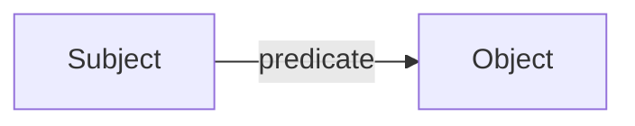
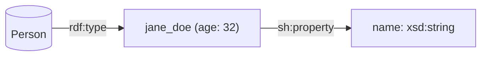
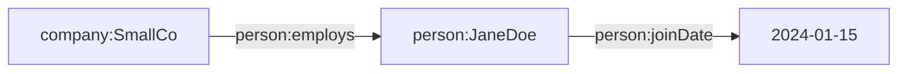
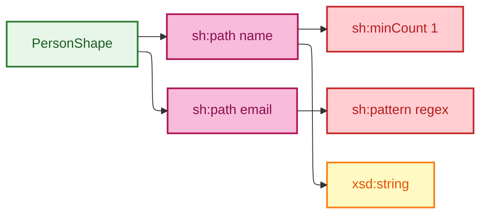
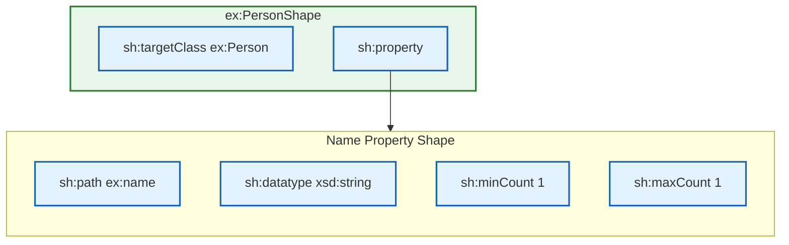
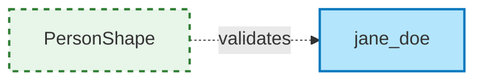
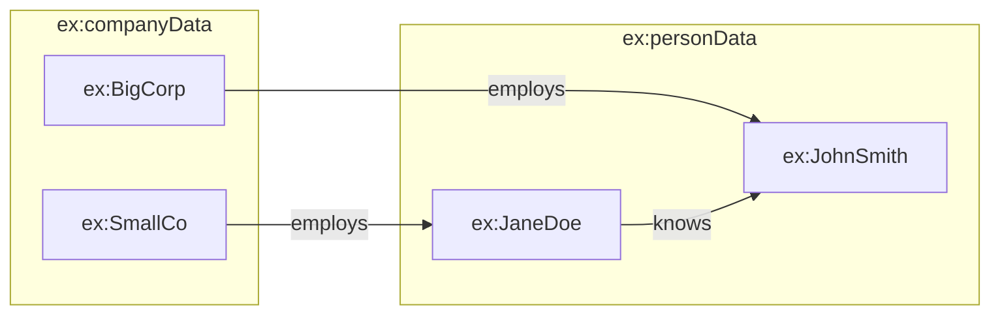
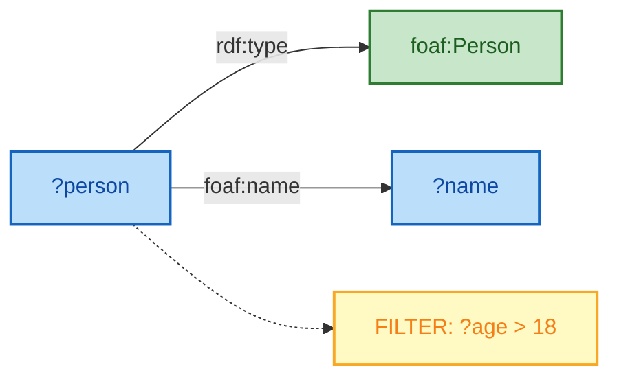
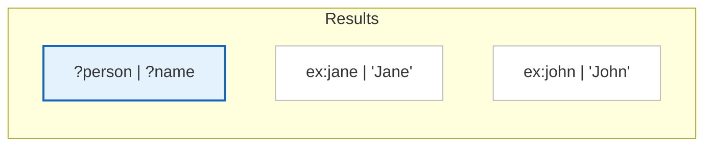

# Linked Data & RDF Visualization Guide

> **SKILL QUICK REF**: `flowchart LR` + ELK | Subject→Predicate→Object | Namespace comments `%% @prefix` | Type-Instance labels `["<b>Type</b>\nInstance"]` | classDef: class `#E1BEE7` instance `#B3E5FC` property `#F8BBD9` literal `#FFF9C4`

## When to Use

- RDF triple visualization
- Ontology class hierarchies (RDFS, OWL)
- SHACL shape documentation
- SPARQL query result illustration
- Knowledge graph data models
- Semantic web architecture diagrams
- Linked data integration flows

---

## Core Principle: Subject-Predicate-Object

RDF data follows the triple pattern. Use `flowchart LR` to mirror this natural reading direction:



**Always use LR direction** for linked data - it reflects how triples are read and written.

---

## Semantic Node Notation

Use consistent node shapes to convey semantic meaning:



| Shape | Syntax | Semantic Meaning |
|-------|--------|------------------|
| **Cylinder** | `[("Label")]` | Class, Type, or data container |
| **Brackets** | `["Label (prop: val)"]` | Instance with embedded properties |
| **Labeled Arrow** | `-->|sh:property|` | SHACL property constraint |
| **Plain Arrow** | `-->|predicate|` | RDF predicate relationship |

**Label brevity rule:** Keep labels ≤30 characters for readability in complex graphs.

---

## Namespace Preservation

Preserve RDF namespace URIs in comments for documentation without breaking Mermaid parsing:



This technique:
- Documents the full URIs for reference
- Keeps node IDs readable (prefixed form)
- Allows copy-paste to actual RDF tools

---

## Type-Instance Label Pattern

Distinguish ontology types from data instances using formatted labels:


**Pattern**: `["<b>ClassName</b><br/>InstanceName"]`

---

## Semantic Color System

Apply colors based on RDF entity semantics:

```mermaid
---
config:
  layout: elk
---
flowchart LR
    classDef class fill:#E1BEE7,stroke:#6A1B9A,stroke-width:2px,color:#4A148C
    classDef instance fill:#B3E5FC,stroke:#0277BD,stroke-width:2px,color:#01579B
    classDef property fill:#F8BBD9,stroke:#AD1457,stroke-width:2px,color:#880E4F
    classDef literal fill:#FFF9C4,stroke:#F57F17,stroke-width:2px,color:#E65100
    classDef namespace fill:#D7CCC8,stroke:#5D4037,stroke-width:2px,color:#3E2723

    Person[Person]:::class
    Jane[jane_doe]:::instance
    Name["Jane Doe"]:::literal

    Person -->|rdf:type| Jane
    Jane -->|foaf:name| Name
```

| Entity Type | Fill | Stroke | Use |
|-------------|------|--------|-----|
| **Class/Type** | `#E1BEE7` | `#6A1B9A` | rdfs:Class, owl:Class |
| **Instance** | `#B3E5FC` | `#0277BD` | Data individuals |
| **Property** | `#F8BBD9` | `#AD1457` | Predicates (as nodes) |
| **Literal** | `#FFF9C4` | `#F57F17` | xsd:string, xsd:date, etc. |
| **Namespace** | `#D7CCC8` | `#5D4037` | Prefix groupings |

---

## Ontology Class Hierarchies

### RDFS Subclass Relationships

```mermaid
---
config:
  layout: elk
---
flowchart TB
    classDef class fill:#E1BEE7,stroke:#6A1B9A,stroke-width:2px,color:#4A148C

    Thing[owl:Thing]:::class
    Agent[foaf:Agent]:::class
    Person[foaf:Person]:::class
    Org[foaf:Organization]:::class
    Company[ex:Company]:::class

    Thing -->|rdfs:subClassOf| Agent
    Agent -->|rdfs:subClassOf| Person
    Agent -->|rdfs:subClassOf| Org
    Org -->|rdfs:subClassOf| Company
```

### OWL Restrictions

```mermaid
flowchart LR
    classDef class fill:#E1BEE7,stroke:#6A1B9A,stroke-width:2px,color:#4A148C
    classDef restriction fill:#FFCCBC,stroke:#E64A19,stroke-width:2px,color:#BF360C

    Pizza[Pizza]:::class
    Topping[Topping]:::class
    HasTopping[hasTopping<br/>some Topping]:::restriction

    Pizza -->|owl:equivalentClass| HasTopping
    HasTopping -->|owl:someValuesFrom| Topping
```

---

## SHACL Shape Visualization

Document SHACL validation shapes:



### SHACL Property Shape Pattern



### SHACL Shape Styling

Use dashed strokes to distinguish SHACL shapes from concrete instances:



**Pattern**: SHACL shapes use `stroke-dasharray: 5 5` to visually distinguish validation rules from data instances.

---

## Named Graphs with Subgraphs

Use Mermaid subgraphs to represent RDF named graphs:



---

## SPARQL Query Visualization

Illustrate SPARQL query patterns:

### SELECT Query Pattern



### Query Result Binding



---

## Knowledge Graph Data Model

Full example combining techniques:

```mermaid
---
config:
  layout: elk
  elk:
    mergeEdges: false
    nodePlacementStrategy: BRANDES_KOEPF
---
flowchart LR
    %% @prefix schema: <http://schema.org/>
    %% @prefix ex: <http://example.org/>

    classDef class fill:#E1BEE7,stroke:#6A1B9A,stroke-width:2px,color:#4A148C
    classDef instance fill:#B3E5FC,stroke:#0277BD,stroke-width:2px,color:#01579B
    classDef literal fill:#FFF9C4,stroke:#F57F17,stroke-width:2px,color:#E65100

    %% Classes
    Organization[schema:Organization]:::class
    Person[schema:Person]:::class
    Place[schema:Place]:::class

    %% Instances
    Acme["<b>Organization</b><br/>Acme Corp"]:::instance
    Jane["<b>Person</b><br/>Jane Doe"]:::instance
    NYC["<b>Place</b><br/>New York"]:::instance

    %% Literals
    AcmeName["Acme Corporation"]:::literal
    JaneName["Jane Doe"]:::literal
    Founded["1995"]:::literal

    %% Type relationships
    Acme -->|rdf:type| Organization
    Jane -->|rdf:type| Person
    NYC -->|rdf:type| Place

    %% Data properties
    Acme -->|schema:name| AcmeName
    Acme -->|schema:foundingDate| Founded
    Jane -->|schema:name| JaneName

    %% Object properties
    Jane -->|schema:worksFor| Acme
    Acme -->|schema:location| NYC
```

---

## AI Prompt Pattern

When using AI to generate linked data diagrams, use this prompt structure:

> "Using the RDF data / SHACL shapes / ontology in this session, create a mermaid flowchart diagram that illustrates [specific aspect]. Use LR direction, ELK layout, and apply semantic coloring (purple for classes, blue for instances, yellow for literals)."

---

## Configuration

### Recommended ELK Settings for Knowledge Graphs

```yaml
---
config:
  layout: elk
  elk:
    mergeEdges: false
    nodePlacementStrategy: BRANDES_KOEPF
    hierarchyHandling: INCLUDE_CHILDREN
---
```

### Theme for Linked Data

```yaml
%%{init: {
  "theme": "base",
  "themeVariables": {
    "primaryColor": "#E1BEE7",
    "primaryTextColor": "#4A148C",
    "primaryBorderColor": "#6A1B9A",
    "secondaryColor": "#B3E5FC",
    "tertiaryColor": "#FFF9C4",
    "lineColor": "#37474F"
  }
}}%%
```

---

## Best Practices

1. **Always use `flowchart LR`** - Mirrors triple reading direction
2. **Preserve namespaces in comments** - Document full URIs
3. **Use type-instance labels** - `["<b>Type</b><br/>Instance"]`
4. **Apply semantic colors consistently** - Class/Instance/Property/Literal
5. **Enable ELK for >5 triples** - Better edge routing
6. **Use subgraphs for named graphs** - Visual grouping
7. **Label all predicates** - `-->|predicate|` not just `-->`
8. **Keep diagrams focused** - One aspect per diagram

---

## References

- [Kurt Cagle - RDF, Graphs and Mermaid Diagrams](https://www.linkedin.com/pulse/rdf-graphs-mermaid-diagrams-kurt-cagle-jqrac)
- [The Ontologist - SHACL and Taxonomies](https://ontologist.substack.com/p/shacl-and-taxonomies)
- [W3C RDF Primer](https://www.w3.org/TR/rdf-primer/)
- [SHACL Specification](https://www.w3.org/TR/shacl/)
