# Property Graph Visualization Guide

> **SKILL QUICK REF**: `flowchart LR` + ELK | Nodes with properties `["Label<br/><small>prop: value</small>"]` | Labeled relationships `-->|:RELATIONSHIP|` | classDef by node label | Neo4j/graph DB patterns

## When to Use

- Neo4j/graph database schema design
- Cypher query visualization
- Social network graphs
- Recommendation engine models
- Fraud detection patterns
- Network topology diagrams
- Entity relationship with properties

---

## Property Graph vs RDF

| Aspect | Property Graph | RDF/Linked Data |
|--------|---------------|-----------------|
| **Model** | Nodes + Relationships (both have properties) | Subject-Predicate-Object triples |
| **Properties** | On nodes AND edges | Literals only on objects |
| **Schema** | Labels on nodes, types on relationships | Classes and predicates |
| **Query** | Cypher, Gremlin | SPARQL |
| **Use** | Traversal-heavy, local queries | Integration, inference |

Use this guide for Neo4j-style property graphs. Use `17-LINKED-DATA-GUIDE.md` for RDF.

---

## Core Pattern: Labeled Nodes and Relationships

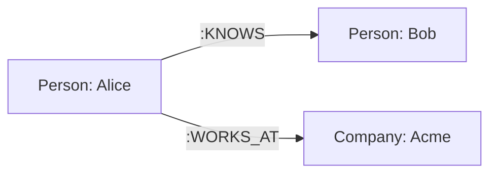

**Convention**:
- Node labels: `[Label: Name]`
- Relationship types: `-->|:TYPE|` (uppercase with colon prefix)

---

## Nodes with Properties

Show node properties using HTML-style formatting:

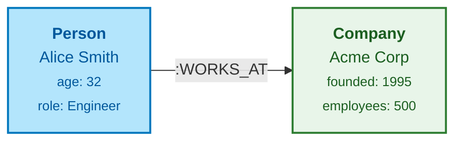

**Pattern**: `["<b>Label</b><br/>Name<br/><small>prop: value</small>"]`

---

## Relationship Properties

Show properties on relationships using edge labels:

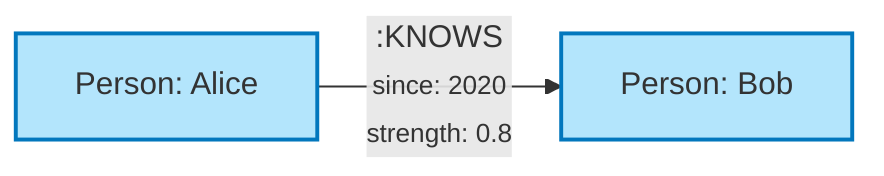

For complex relationship properties, use an intermediate node:

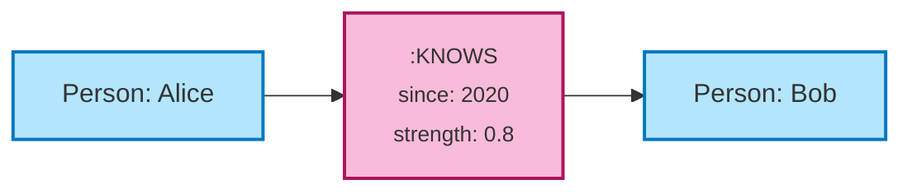

---

## Semantic Color System for Property Graphs

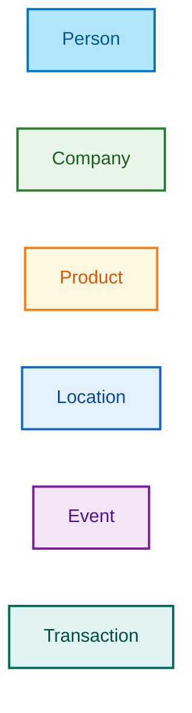

| Node Label | Fill | Stroke | Use |
|------------|------|--------|-----|
| **Person/User** | `#B3E5FC` | `#0277BD` | People, accounts, actors |
| **Company/Org** | `#E8F5E9` | `#2E7D32` | Organizations, groups |
| **Product/Item** | `#FFF8E1` | `#F57F17` | Products, content, assets |
| **Location** | `#E3F2FD` | `#1565C0` | Places, addresses, regions |
| **Event** | `#F3E5F5` | `#7B1FA2` | Actions, occurrences |
| **Transaction** | `#E0F2F1` | `#00695C` | Payments, transfers |

---

## Common Graph Patterns

### Social Network

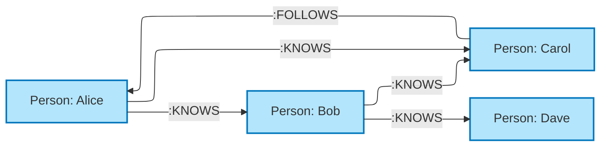

### E-Commerce Model

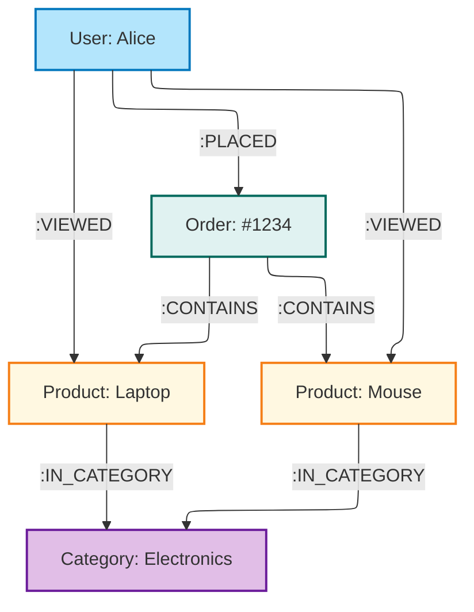

### Recommendation Pattern

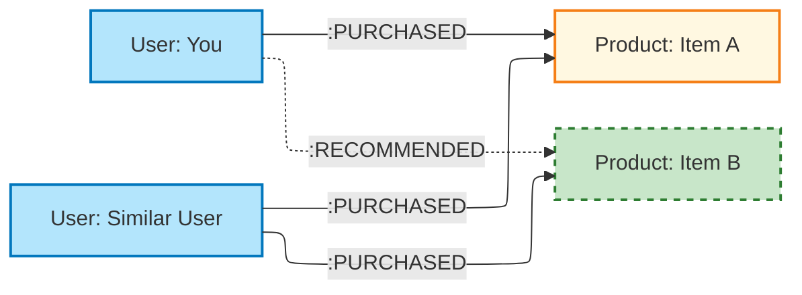

### Fraud Detection Pattern

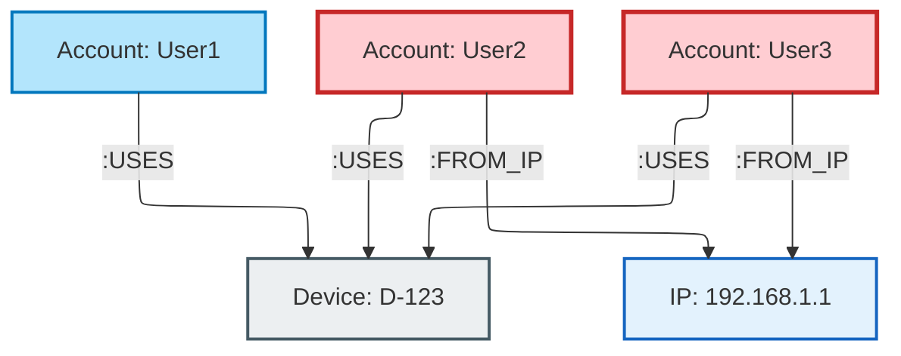

### Knowledge Graph (Domain Model)

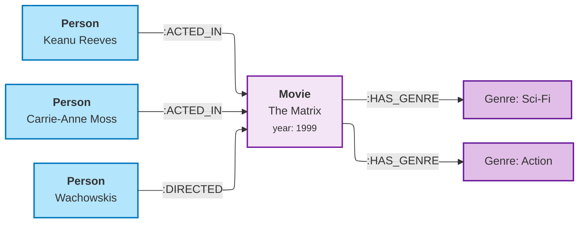

---

## Cypher Query Visualization

### Match Pattern

Visualize what a Cypher query matches:

```cypher
MATCH (p:Person)-[:KNOWS]->(friend:Person)-[:WORKS_AT]->(c:Company)
WHERE c.name = 'Acme'
RETURN p, friend
```

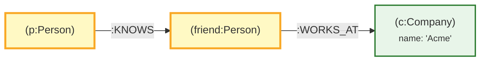

### Path Pattern

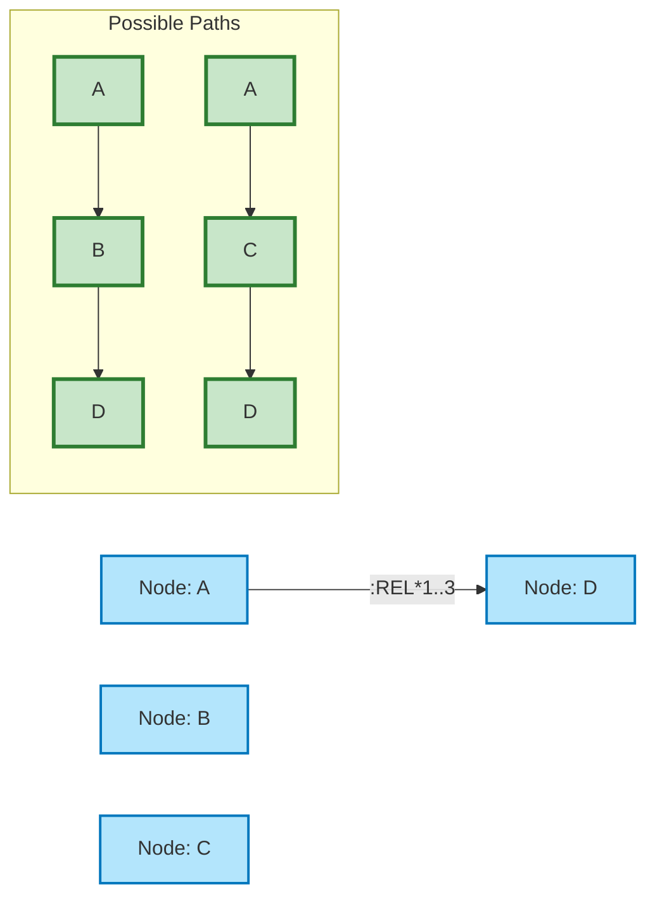

---

## Schema Visualization

### Node Labels and Properties

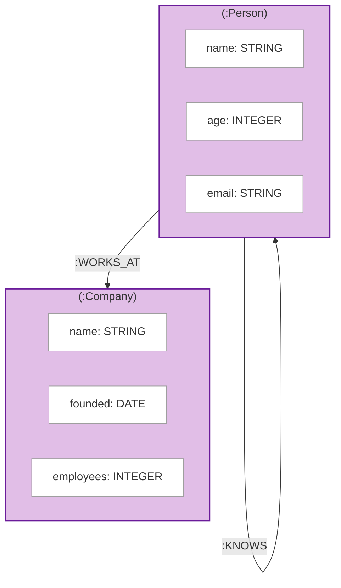

### Index and Constraint Notation

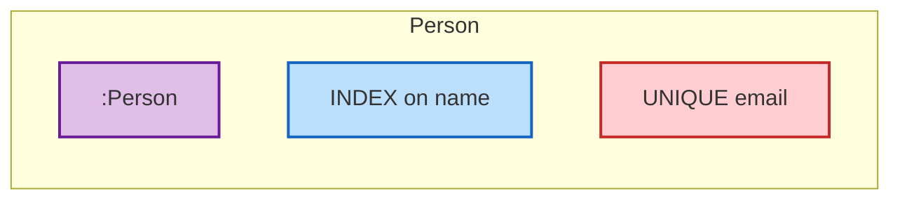

---

## Graph Algorithms Visualization

### Shortest Path

```mermaid
flowchart LR
    classDef node fill:#ECEFF1,stroke:#455A64,stroke-width:2px
    classDef path fill:#C8E6C9,stroke:#2E7D32,stroke-width:3px
    classDef start fill:#BBDEFB,stroke:#1565C0,stroke-width:3px
    classDef end fill:#F8BBD9,stroke:#AD1457,stroke-width:3px

    A[A]:::start
    B[B]:::node
    C[C]:::path
    D[D]:::path
    E[E]:::node
    F[F]:::end

    A -->|1| B
    A -->|2| C
    B -->|3| E
    C -->|1| D
    D -->|1| F
    E -->|2| F

    linkStyle 1,2,3 stroke:#2E7D32,stroke-width:3px
```

### PageRank / Centrality

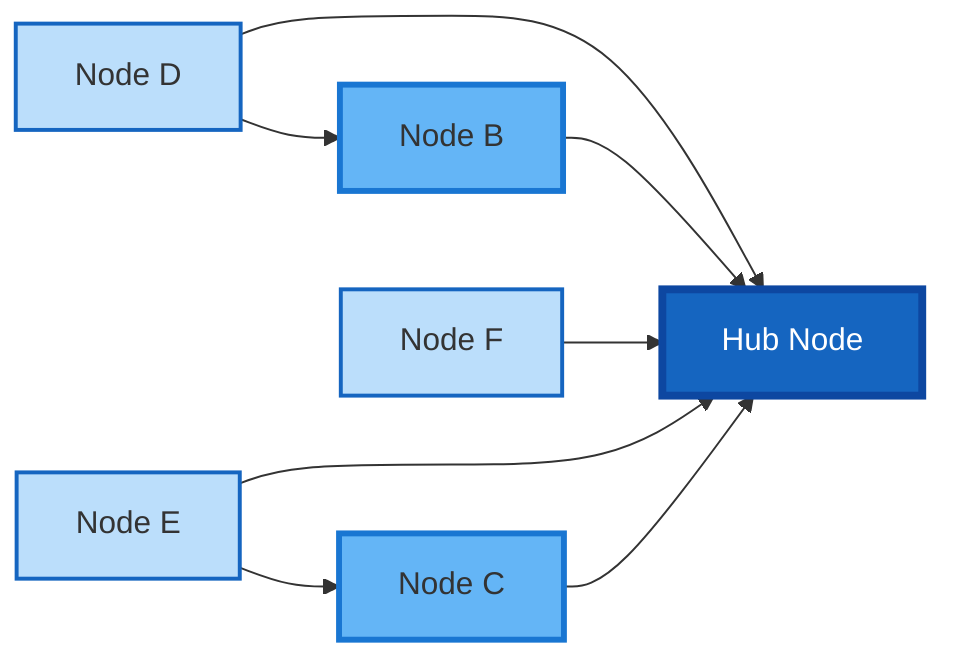

---

## Configuration

### ELK Settings for Property Graphs

```yaml
---
config:
  layout: elk
  elk:
    mergeEdges: false
    nodePlacementStrategy: BRANDES_KOEPF
    edgeRouting: ORTHOGONAL
---
```

### Theme for Property Graphs

```yaml
%%{init: {
  "theme": "base",
  "themeVariables": {
    "primaryColor": "#B3E5FC",
    "primaryTextColor": "#01579B",
    "primaryBorderColor": "#0277BD",
    "secondaryColor": "#E8F5E9",
    "tertiaryColor": "#FFF8E1",
    "lineColor": "#37474F"
  }
}}%%
```

---

## Best Practices

1. **Use consistent label colors** - Same color for same node labels across diagrams
2. **Uppercase relationship types** - `:KNOWS`, `:WORKS_AT`, `:PURCHASED`
3. **Show key properties only** - Don't overload nodes with all properties
4. **Use ELK for >10 nodes** - Better layout for complex graphs
5. **Highlight query patterns** - Use distinct colors for matched elements
6. **Direction matters** - LR for flows, TB for hierarchies
7. **Use subgraphs for schema** - Group label definitions
8. **Dashed lines for inferred** - Recommendations, predictions

---

## References

- [Neo4j Graph Data Modeling](https://neo4j.com/developer/data-modeling/)
- [Cypher Query Language](https://neo4j.com/docs/cypher-manual/)
- [Graph Algorithms](https://neo4j.com/docs/graph-data-science/)
- [Property Graph Model](https://github.com/opencypher/openCypher)
