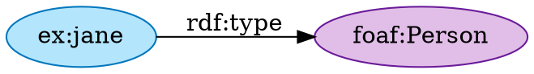
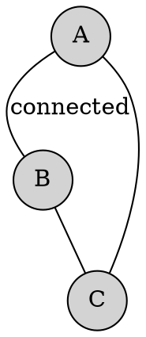
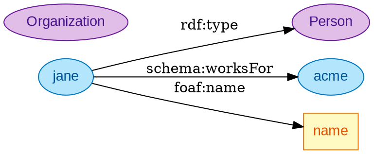
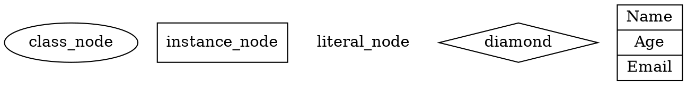
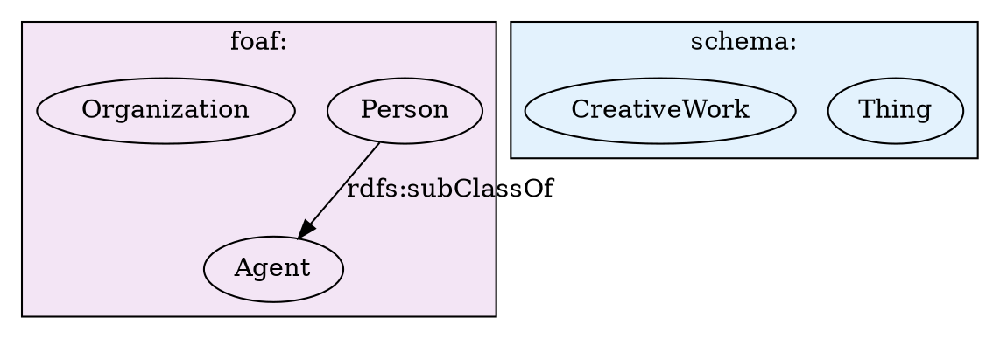
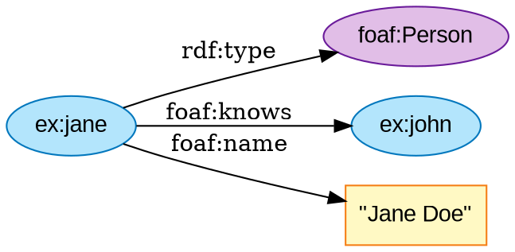
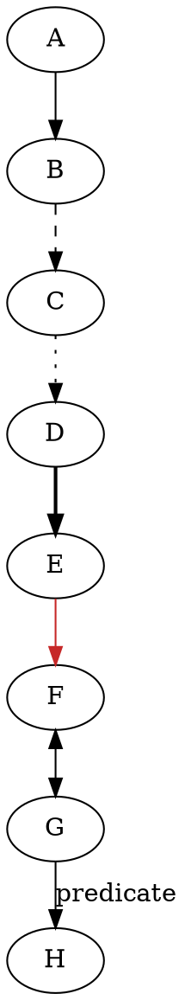
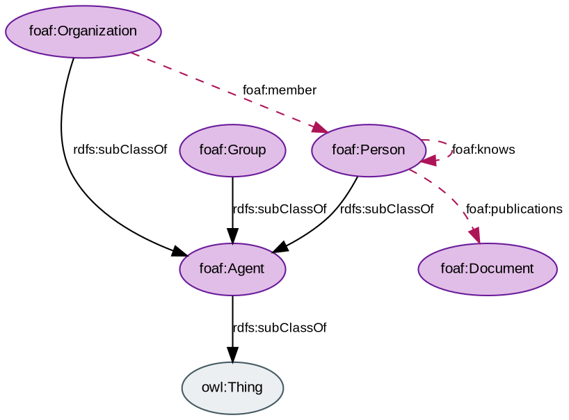

# DOT/Graphviz Guide

> **SKILL QUICK REF**: `digraph` for directed | `graph` for undirected | `rankdir=LR` for S-P-O | Semantic colors via `fillcolor`/`color` | Generate from Turtle with SPARQL CONSTRUCT

## When to Use DOT Instead of Mermaid

| Scenario | Use DOT | Use Mermaid |
|----------|---------|-------------|
| Pure network topology | ✅ | |
| Semantic web community standard | ✅ | |
| Maximum layout control | ✅ | |
| Ball-and-arrow graphs | ✅ | |
| Large-scale networks (>100 nodes) | ✅ | |
| Turtle/RDF direct conversion | ✅ | |
| Flowcharts with labeled relationships | | ✅ |
| SHACL shape visualization | | ✅ |
| Markdown/GitHub embedding | | ✅ |
| Sequence diagrams, ER, Gantt | | ✅ |

**Cagle's Rule**: "DOT has become my go-to tool for building network graphs (semantic graphs), and I've written more than a few tools to generate DOT directly from Turtle."

---

## Basic DOT Syntax

### Directed Graph (Most Common for RDF)



### Undirected Graph



---

## Semantic Color System for DOT

Apply the Cagle palette using DOT's `fillcolor` and `color` attributes:



### Color Reference Table

| Entity Type | fillcolor | color (border) | fontcolor |
|-------------|-----------|----------------|-----------|
| **Class/Type** | `#E1BEE7` | `#6A1B9A` | `#4A148C` |
| **Instance** | `#B3E5FC` | `#0277BD` | `#01579B` |
| **Property** (as node) | `#F8BBD9` | `#AD1457` | `#880E4F` |
| **Literal** | `#FFF9C4` | `#F57F17` | `#E65100` |
| **Infrastructure** | `#E3F2FD` | `#1565C0` | `#0D47A1` |
| **Service** | `#E8F5E9` | `#2E7D32` | `#1B5E20` |
| **Data/Storage** | `#FFF8E1` | `#F57F17` | `#E65100` |
| **External** | `#ECEFF1` | `#455A64` | `#263238` |

---

## Layout Control

### Direction

```dot
digraph {
    rankdir=LR;  // Left-to-right (best for S-P-O triples)
    // rankdir=TB;  // Top-to-bottom (hierarchies)
    // rankdir=BT;  // Bottom-to-top
    // rankdir=RL;  // Right-to-left
}
```

### Node Shapes



### Clustering (Subgraphs)



---

## Converting Turtle to DOT

### Manual Pattern

Given Turtle:
```turtle
@prefix ex: <http://example.org/> .
@prefix foaf: <http://xmlns.com/foaf/0.1/> .

ex:jane a foaf:Person ;
    foaf:name "Jane Doe" ;
    foaf:knows ex:john .
```

Generate DOT:


### SPARQL CONSTRUCT to DOT Pattern

```sparql
CONSTRUCT {
    ?s ?p ?o .
} WHERE {
    ?s ?p ?o .
    FILTER(isIRI(?s) && isIRI(?o))
}
```

Transform results:
- Each `?s -> ?o` becomes a DOT edge
- `?p` becomes the edge label
- Apply semantic coloring based on rdf:type

---

## Large Network Optimization

### For >50 Nodes

```dot
digraph LargeNetwork {
    // Performance settings
    rankdir=LR;
    splines=ortho;        // Orthogonal edges (faster)
    overlap=false;        // Prevent node overlap
    concentrate=true;     // Merge parallel edges

    // Layout engine hint (use with -K flag)
    // dot: hierarchical (default)
    // neato: spring model
    // fdp: force-directed
    // sfdp: scalable force-directed (best for large graphs)
    // circo: circular
    // twopi: radial

    node [shape=point];   // Minimal nodes for large graphs
}
```

### Rendering Commands

```bash
# Standard hierarchical
dot -Tsvg graph.dot -o graph.svg

# Force-directed for large networks
sfdp -Tsvg -Goverlap=prism graph.dot -o graph.svg

# Circular layout
circo -Tpng graph.dot -o graph.png
```

---

## Edge Styling



---

## Complete Example: Ontology Visualization



---

## Output Formats

| Format | Command | Use Case |
|--------|---------|----------|
| SVG | `dot -Tsvg` | Web, scalable |
| PNG | `dot -Tpng` | Documentation |
| PDF | `dot -Tpdf` | Print |
| Plain text | `dot -Tplain` | Coordinates for custom rendering |

---

## Best Practices

1. **Always use `rankdir=LR`** for RDF/semantic graphs (mirrors S-P-O reading)
2. **Preserve namespaces in comments** at the top of the file
3. **Apply semantic colors consistently** using the Cagle palette
4. **Use clustering** for namespace grouping
5. **Choose layout engine** based on graph size and structure
6. **Use `splines=ortho`** for cleaner edge routing in dense graphs
7. **Label all edges** with predicate names

---

## References

- [Graphviz Documentation](https://graphviz.org/documentation/)
- [DOT Language Specification](https://graphviz.org/doc/info/lang.html)
- [Kurt Cagle - RDF, Graphs and Mermaid Diagrams](https://www.linkedin.com/pulse/rdf-graphs-mermaid-diagrams-kurt-cagle-jqrac)
