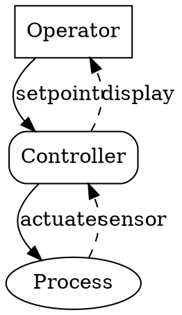
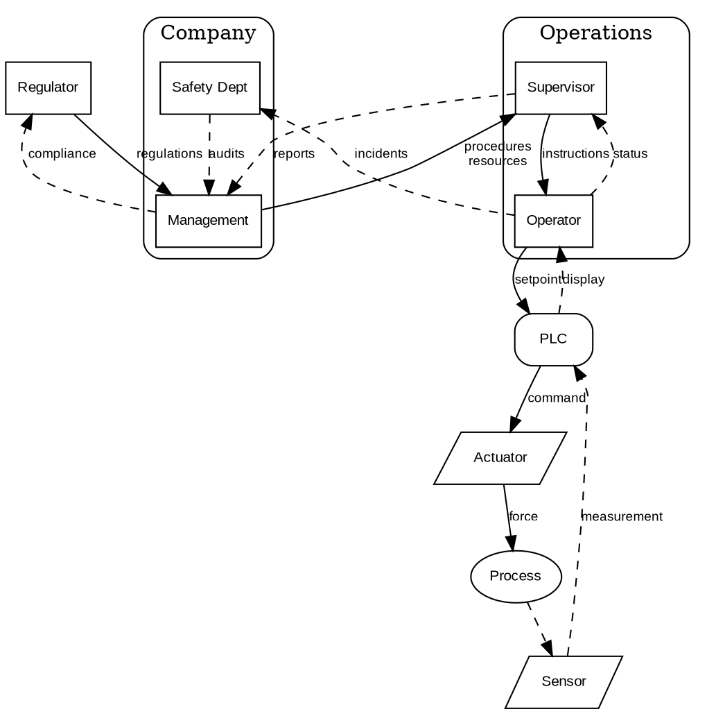

# STAMP Control Structure Diagrams

Generate DOT/Graphviz diagrams for STAMP (Systems-Theoretic Accident Model and Processes) analysis.

## When to Use

This guide applies when creating diagrams for:
- STPA (System-Theoretic Process Analysis) - prospective hazard analysis
- CAST (Causal Analysis based on System Theory) - retrospective incident analysis
- STPA-Sec - security-focused control analysis
- Any control structure, feedback loop, or causal scenario diagram

## Quick Reference

| Diagram Type | Layout | Key Convention |
|--------------|--------|----------------|
| Control structure | `rankdir=TB` | Solid=control, dashed=feedback |
| Routing/decision | `rankdir=TB` | Diamond=decision, colored boxes=outcomes |
| Causal scenario | `rankdir=LR` | Octagon=hazard, red=loss |

---

## Control Structure Diagrams

The core STAMP visual. Shows hierarchical controllers, controlled processes, control actions, and feedback paths.

### Conventions

**Layout:**
- `rankdir=TB` — Top-to-bottom hierarchy (higher = more authority)
- `rank=same` — Force horizontal alignment for peer controllers

**Node Shapes:**

| STAMP Concept | DOT Shape | Attributes |
|---------------|-----------|------------|
| Controller (human) | `box` | `shape=box` |
| Controller (automated) | `box, rounded` | `shape=box style=rounded` |
| Controlled process | `ellipse` | `shape=ellipse` |
| Sensor/actuator | `parallelogram` | `shape=parallelogram` |

**Edge Styles:**

| STAMP Concept | DOT Style | Attributes |
|---------------|-----------|------------|
| Control action (↓) | Solid arrow | default |
| Feedback (↑) | Dashed arrow | `style=dashed` |
| Flawed/failed path | Red highlight | `color=red penwidth=2` |

### Minimal Example

### Full Example with Nested Subsystems

## Routing/Decision Diagrams

[Content in Task 3]

## Causal Scenario Diagrams

[Content in Task 4]

## Common Patterns

[Content in Task 5]

## Validation Checklist

[Content in Task 6]
