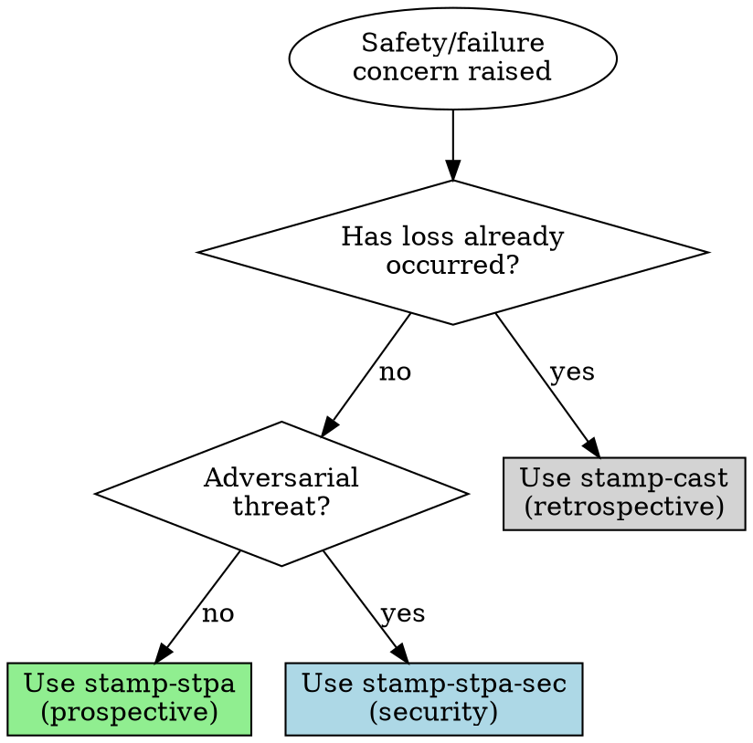

# STAMP Foundations

## Overview

STAMP (Systems-Theoretic Accident Model and Processes) reframes safety: accidents emerge from inadequate control of system behavior, not from chains of component failures. Instead of asking "what broke?", ask "what constraints were missing or inadequate?"

This base skill provides:
- Theoretical foundations for all STAMP analysis
- Routing to the appropriate methodology skill
- Shared concepts used across STPA, CAST, and STPA-Sec

## Routing

| Entry Point | Route To | Why |
|-------------|----------|-----|
| "I'm designing X, what could go wrong?" | stamp-stpa | Prospective hazard analysis |
| "Something failed / went wrong" | stamp-cast | Retrospective incident analysis |
| "What was the root cause?" | stamp-cast | Retrospective (will reframe "root cause") |
| "Security threats to this system" | stamp-stpa-sec | Prospective with adversarial scenarios |
| "Threat model this system" | stamp-stpa-sec | Security-focused control analysis |

**When ambiguous:** Ask one question:
> "Are we analyzing something that already happened, or preventing something that might happen?"

## The Paradigm Shift

If you're new to STAMP, here's what this methodology does:

**If you're familiar with fault trees, event chains:**
STAMP flips the question. Instead of "what failed?" (component fault tree), we ask "what constraints prevented the hazard?" (control structure analysis). This captures how systems migrate toward danger over time.

**If you're familiar with systems thinking, control loops:**
STAMP formalizes your intuition. Every system has controllers (human and automated), controlled processes, feedback, and control actions. Accidents happen when control is inadequate.

**If you're designing something new:**
Use stamp-stpa to identify hazards BEFORE they become problems by analyzing what could go wrong with your control structure.

**If you're investigating an incident:**
Use stamp-cast instead. This analyzes what already happened and why the control structure failed.

## Core Concepts

See [references/stamp-foundations.md](references/stamp-foundations.md) for:
- Accidents as emergent properties
- The control structure model
- Four conditions for safe control
- Causation categories
- Why "human error" is the wrong terminus
- Migration to hazard

## Training & Onboarding

For users new to STAMP, see [references/training-intro.md](references/training-intro.md):
- Mapping STAMP to familiar concepts (fault trees, control loops)
- Quick paths for different user contexts (safety, incident response, compliance)
- Handling resistance and common objections

## Quick Reference

| Traditional Framing | STAMP Reframing |
|---------------------|-----------------|
| "Component failed" | "Control constraint was missing or inadequate" |
| "Human error" | "Why did the system make that error likely?" |
| "Root cause found" | "What feedback/constraints would prevent recurrence?" |
| "Add more barriers" | "Fix the control structure" |
| "Calculate failure probability" | "Map control loops and find gaps" |

**Four conditions for safe control:**
1. Goals align with safety (not just production)
2. Control actions available (authority + means)
3. Process model accurate (controller understands reality)
4. Feedback adequate (timely, accurate information)

## Output Formats

STAMP analysis serves different audiences. See [references/output-formats.md](references/output-formats.md) for:
- **Executive Summary** — Decision-focused, business impact
- **Engineering Specification** — Actionable requirements with traceability
- **Incident Report** — Compliance-ready, methodology-documented
- **Quick Brief** — Verbal settings, alignment conversations

## Related Skills

- **stamp-stpa** — Prospective hazard analysis (what could go wrong?)
- **stamp-cast** — Retrospective incident analysis (what went wrong?)
- **stamp-stpa-sec** — Security-focused analysis (adversarial scenarios)
