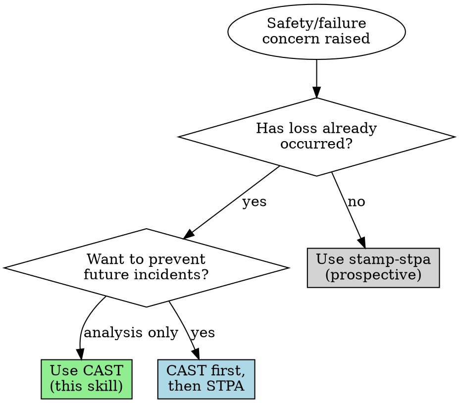

# CAST (Causal Analysis based on System Theory)

CAST identifies why safety controls failed to prevent a loss, enabling recommendations that strengthen the control structure rather than just blaming proximate actors.

## When to Use



| Entry Point | Route To | Why |
|-------------|----------|-----|
| "What went wrong with X?" | CAST | Retrospective incident analysis |
| "Why did this fail?" | CAST | Retrospective |
| "What was the root cause?" | CAST | Retrospective (will reframe "root cause") |
| "Investigate this incident" | CAST | Retrospective |
| "I'm designing X, what could go wrong?" | STPA | Prospective—use stamp-stpa |
| "Prevent this from happening again" | CAST → STPA | Analyze incident, then hazard analysis |

**When ambiguous:** Ask one question:
> "Are we analyzing something that already happened, or preventing something that might happen?"

## Agentic Behavior

### Checkpoints

Pause and ask when:

| Situation | Ask |
|-----------|-----|
| Incident scope unclear | "What's the boundary of this analysis—just the immediate event, or the organizational context too?" |
| Missing information about actors | "What was [controller]'s role and what information did they have at the time?" |
| Multiple incidents involved | "Should I analyze these as separate events or one systemic pattern?" |
| Recommendations scope unclear | "Should recommendations target the immediate team, or organizational/regulatory levels too?" |

**Don't** checkpoint after every CAST step. Pause on uncertainty, not ritual.

### Tone: Empathy Before Reframing

When responding to blame-focused requests after incidents:

1. **Acknowledge impact first**: "I understand this caused real problems"
2. **Surface framing conflict gently**: Offer the alternative, don't lecture
3. **Show value quickly**: Get to work—don't explain methodology at length
4. **Respect urgency**: If they need to fix now, help fix now; analysis can wait

### Urgency vs. Analysis

When incident response is ongoing:
> "Let's stabilize first. Once the immediate issue is resolved, I can help with the systemic analysis—that's where we'll find lasting fixes."

Don't compete with firefighting. CAST is for learning, not triage.

### Deadline and Authority Pressure

| User Says | Response Pattern |
|-----------|------------------|
| "Legal needs root cause by EOD" | "Want me to draft an interim statement that buys time for proper analysis without premature conclusions?" |
| "CEO wants someone fired" | "Accountability doesn't require a name—it requires systemic changes. Want me to show what would actually prevent recurrence?" |
| "I already know who/what caused it" | "That's your hypothesis. CAST can verify it or find factors you haven't considered. Want both?" |
| "Just document [person] as the cause" | "I can't do that—it's not analysis, it's blame assignment. But I can show why the system allowed this to happen, which is more defensible." |

**Interim statement template** (when deadline pressure requires something before full analysis):

> "On [date], [incident description]. Immediate remediation: [actions taken]. Root cause analysis is underway; preliminary findings indicate systemic factors beyond individual action. Full report with recommendations by [date]."

This buys time without premature blame or false precision.

### Framing Conflicts

When users bring traditional investigation framing, acknowledge their need, then offer CAST's stronger path:

| User Says | Response Pattern |
|-----------|------------------|
| "What was the root cause?" | "I understand—accountability discussions need clear causal chains. Here's the challenge: single root causes rarely hold up under scrutiny. I can give you something stronger: a map of all contributing factors and control gaps. That's more defensible when stakeholders push back. Want to try that?" |
| "Who's responsible?" / "Who failed?" | "Accountability matters. CAST's approach: understand why actions seemed correct at the time, then identify what system changes would prevent recurrence. That often lands better than naming individuals. Want me to take that angle?" |
| "It was human error" | "That's often where investigations start. The next question: what in the system made that action seem reasonable? If we can answer that, we get design changes—not just blame. Want me to trace it back?" |
| "They should have known better" | "That's hindsight talking—we know how it ended. What information did they actually have? What was their mental model? Understanding that reveals where the system failed them." |
| "Add more training/procedures" | "Training and procedures can help, but they're often the first things to erode under pressure. Want me to look for control structure changes that would make the safe path the easy path?" |

**Acknowledge** their legitimate need. **Offer** CAST as enhancement, not correction. **Let them choose**.

### Time Pressure

When incident response or compliance deadline is tight:

| Time Available | Minimum Viable CAST |
|----------------|---------------------|
| 1 hour | Event sequence + immediate control structure (paths involved in incident) + preliminary factors |
| 4 hours | Full control structure + component analysis + top 3 systemic factors + prioritized recommendations |
| 1 day | Complete CAST with all systemic factors, comprehensive recommendations, and stakeholder-ready report |

> "With [X time], I recommend we focus on [which steps]. That gets you [outcome] without deferring critical findings. Does that work?"

**If still in active response:** "Let's stabilize first. Once the immediate issue is contained, I can help with systemic analysis—that's where we find lasting fixes."

### Skill Handoffs

**To STPA** — If analysis reveals systemic issues worth preventing proactively:
> "This incident reveals control structure gaps. Want me to switch to STPA to analyze hazards in the current system design?"

**To stamp-stpa after CAST** — Common pattern for "prevent recurrence":
> "CAST analysis complete. To prevent similar incidents, want me to run STPA on the redesigned control structure?"

## Theoretical Foundation

CAST is built on STAMP (Systems-Theoretic Accident Model and Processes). See [references/stamp-foundations.md](references/stamp-foundations.md) for the core theoretical framework: why accidents emerge from inadequate control rather than component failures, the four conditions for safe control, and why "human error" is a symptom not a cause.

For common pitfalls in traditional accident investigation—root cause seduction, hindsight bias, blame—see [references/investigation-pitfalls.md](references/investigation-pitfalls.md).

For worked examples demonstrating the methodology, see [references/examples.md](references/examples.md) (medication error, water contamination, industrial fall).

## Core Principles

**No blame.** Goal is explanation, not accusation. Avoid "failure," "should have," "could have." State what happened without judgment.

**No root cause.** Reject oversimplification. Accidents are multifactorial; identifying one "root cause" prevents learning.

**Human error is symptom.** When humans err, ask why their action seemed correct to them at the time. Context explains behavior.

**Avoid hindsight bias.** After knowing the outcome, it seems obvious what should have been done. Reconstruct the pre-accident mental model.

## Key Definitions

- **Loss/Accident:** Undesired event stakeholders want to prevent (death, injury, financial loss, environmental damage, mission failure, reputation damage)
- **Hazard:** System state that, combined with environmental conditions, can lead to loss. Must be controllable by system designers/operators.
- **Safety Constraint:** Requirement that must be satisfied to prevent hazard
- **Safety Control Structure:** Hierarchy of controllers (humans, automation, organizations) enforcing constraints
- **Process Model:** Controller's understanding of controlled process state; flaws here often cause accidents

## CAST Process

Five steps, iterating as understanding develops:

### Step 1: Assemble Basic Information

1. Define system boundary and analysis scope
2. Identify the loss(es) that occurred
3. Identify hazard(s) that led to loss (system states, not component failures)
4. Derive safety constraints from hazards (what must be true to prevent hazard)
5. Document events without blame or judgment
6. Analyze physical process: failures, unsafe interactions, design deficiencies, contextual factors

See [references/methodology.md](references/methodology.md) for detailed guidance on each element.

### Step 2: Model Safety Control Structure

Create hierarchical model showing all controllers relevant to the hazard:
- Physical controls (interlocks, relief valves)
- Automated controllers (process control systems)
- Human operators
- Management levels
- External oversight (regulators)

For each controller, document assigned safety responsibilities.

See [references/control-structure.md](references/control-structure.md) for modeling patterns.

### Step 3: Analyze Individual Components

For each component in the control structure, working bottom-up:

1. **Responsibilities:** Safety-related responsibilities relevant to this accident
2. **Contribution:** Actions/inactions that contributed to hazard (no blame words)
3. **Why?** Contextual factors explaining behavior—what made it seem correct at the time
4. **Mental Model Flaws:** Incorrect beliefs about process state
5. **Summary & Recommendations:** Role in accident and specific improvements

See [references/component-analysis.md](references/component-analysis.md) for analysis templates and example questions.

### Step 4: Identify Systemic Flaws

Analyze control structure as a whole for factors affecting all components:

- Communication and coordination gaps
- Safety information system deficiencies
- Safety culture problems
- Safety management system design flaws
- Changes and dynamics over time
- Economic and environmental pressures

See [references/systemic-factors.md](references/systemic-factors.md) for detailed checklists.

### Step 5: Generate Recommendations

For each identified flaw:
1. Assign responsibility for implementation
2. Define verification criteria
3. Establish feedback mechanism for effectiveness
4. Prioritize by impact and feasibility

Recommendations should strengthen the control structure, not just add rules for operators.

See [references/recommendations.md](references/recommendations.md) for guidance on avoiding weak recommendations (retraining, more procedures) and generating effective system-level changes.

## Output Schema

When producing CAST analysis, structure output for machine parsing:

```yaml
cast_analysis:
  incident:
    name: string
    date: string
    boundary: string
    losses:
      - id: L-1
        description: string
        type: safety | financial | environmental | mission | reputational
    hazards:
      - id: H-1
        description: string
        losses: [L-1]
    safety_constraints_violated:
      - id: SC-1
        constraint: string
        hazards: [H-1]

  control_structure:
    controllers:
      - id: string
        type: human | automated | organizational
        level: physical | operational | tactical | strategic | regulatory
        responsibilities: [string]
    processes:
      - id: string
        description: string
    control_actions:
      - from: controller_id
        to: process_id
        action: string
    feedback_paths:
      - from: process_id
        to: controller_id
        information: string

  component_analyses:
    - controller: controller_id
      responsibilities: [string]
      contribution: string  # no blame language
      context: string  # why it seemed correct
      mental_model_flaws:
        - belief: string
          reality: string
      recommendations: [string]

  systemic_factors:
    communication_gaps: [string]
    safety_culture_issues: [string]
    safety_management_flaws: [string]
    change_dynamics: [string]
    economic_pressures: [string]

  recommendations:
    - id: R-1
      recommendation: string
      addresses: [controller_id | systemic_factor]
      responsibility: string
      verification: string
      priority: high | medium | low
```

Use this schema when:
- Handing off to another agent
- Storing analysis for later reference
- Feeding into STPA for prevention analysis

For human-readable output, use the prose format below.

## Output Format

CAST analysis produces:

1. **Foundational Information:** System boundary, hazards, constraints, event timeline
2. **Control Structure Model:** Diagram with responsibilities at each level
3. **Component Analyses:** For each controller: contribution, context, mental model flaws, recommendations
4. **Systemic Analysis:** Communication, culture, SMS, change management findings
5. **Recommendations:** Prioritized list with implementation responsibilities

Use the control structure diagram (in depict notation—see Depict Syntax below) as organizing framework for the report. Use `@red` to highlight flawed interactions.

## Quick Reference: Questions to Ask

**For any component:**
- What were their responsibilities related to this hazard?
- What did they do or not do that contributed to the hazardous state?
- Why did that seem like the right thing to do at the time?
- What information did they have? What were they missing?
- What pressures or incentives influenced their behavior?

**For systemic analysis:**
- Were communication channels designed? Were they working?
- Does the safety information system capture what's needed for learning?
- What does behavior reveal about actual (vs. espoused) safety values?
- What changes occurred (planned or unplanned) before the accident?
- What economic or environmental pressures affected decisions?

## Related

**RELATED:** For prospective hazard analysis to prevent future losses (before accidents occur), see stamp-stpa

## Depict Syntax

Use depict notation for control structure diagrams. Depict is purpose-built for STAMP—its semantics match control-theoretic concepts directly.

### Quick Reference

| Concept | Depict Syntax | Example |
|---------|---------------|---------|
| Vertical hierarchy | Names on separate lines | `regulator`<br>`company`<br>`operator` |
| Control action (↓) | `controller process: action` | `manager operator: assign_task` |
| Feedback (↑) | `controller process: / feedback` | `operator manager: / status_report` |
| Bidirectional | `a b: action / feedback` | `supervisor team: directive / report` |
| Multiple labels | Comma-separated | `mgmt ops: policy, budget, staffing` |
| Nesting/composition | `parent [ child ]` | `organization [ management operations ]` |
| Flawed interaction | `@red` suffix | `operator process: missed_check @red` |

### Example: Incident Control Structure

```
regulator company: regulations, audits / compliance_reports
company [ management operations ]
management operations: procedures, resources / incident_reports
operations equipment: operate / sensor_data
```

### CAST-Specific Usage

- Use `@red` to highlight control paths that failed during the incident
- Show hierarchical levels (regulatory → organizational → operational → physical)
- Include feedback paths that were missing, delayed, or ignored

### Limitations

Depict handles **structure**, not **analysis**. Component analysis, mental model flaws, and systemic factors require prose or tables—depict shows the control structure those analyses reference.
