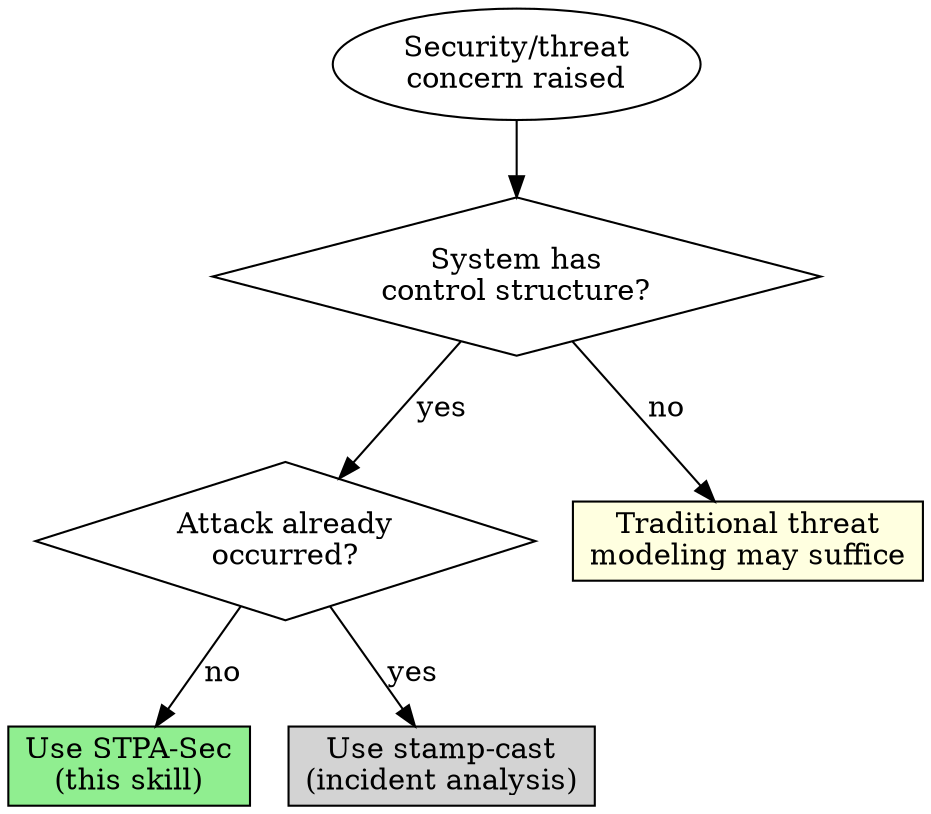

# STPA-Sec: Security Analysis Extension

STPA-Sec extends STPA to address cybersecurity through a systems-theoretic lens. Security threats become causal scenarios for unsafe control actions—the adversary must solve their own control problem to succeed.

## When to Use



| Entry Point | Route To | Why |
|-------------|----------|-----|
| "Threat model this system" | STPA-Sec | Prospective security analysis |
| "What could an attacker do?" | STPA-Sec | Adversarial scenario analysis |
| "Security review of control system" | STPA-Sec | Security + control structure |
| "We were hacked, what happened?" | CAST | Retrospective—use stamp-cast |
| "Map attack surface" | STPA-Sec | Identify vulnerable control/feedback paths |
| "STRIDE analysis needed" | STPA-Sec | Integrate STRIDE with control structure |

**When ambiguous:** Ask one question:
> "Are we analyzing what an attacker could do (prospective), or what an attacker did (incident)?"

## Agentic Behavior

### Checkpoints

Pause and ask when:

| Situation | Ask |
|-----------|-----|
| Threat actor unclear | "What adversary are we defending against—insider, external attacker, nation-state?" |
| Trust boundaries unclear | "Where are the trust boundaries? What's inside vs outside the security perimeter?" |
| Safety-security intersection | "Should I analyze safety implications of security failures, or focus on security alone?" |
| Scope of attack scenarios | "Should I cover all STRIDE categories, or focus on specific threats?" |
| API without system context | "What does this API control? Is it part of a larger system, or is the API itself what we're protecting?" |

**Don't** checkpoint after every step. Pause on uncertainty, not ritual.

### Framing Conflicts

When users bring traditional security framing, surface integration opportunities:

| User Says | Response Pattern |
|-----------|------------------|
| "Just do a STRIDE analysis" | "STRIDE maps well to control structures. Want me to integrate it with control path analysis for deeper scenarios?" |
| "We need penetration testing" | "Pen testing finds vulnerabilities; STPA-Sec finds why they matter. Want me to map attack paths to mission impact?" |
| "Add more firewalls/encryption" | "Barriers without understanding control structure may leave gaps. Want to map what controls those barriers protect first?" |
| "Calculate attack probability" | "Attacker behavior isn't random. Want to map attack scenarios to control structure vulnerabilities instead?" |
| "Keep it simple/quick" | "I can do a quick STRIDE pass. But 10 more minutes mapping what your system controls often reveals 2-3 critical scenarios traditional STRIDE misses. Your call—quick or thorough?" |

**Acknowledge** their approach works. **Offer** STPA-Sec as enhancement, not replacement. **Let them choose**.

### Time Pressure

When users have hard deadlines:

| Time Available | Minimum Viable STPA-Sec |
|----------------|-------------------------|
| 30 minutes | Control structure sketch + trust boundaries + top 3 attack scenarios |
| 2 hours | Full control structure + STRIDE mapping + key security requirements |
| Half day | Complete STPA-Sec with all attack classes and mitigations |

> "With [X time], I can give you [minimum viable output]. Want that, or should we focus on your highest-value assets only?"

### Compliance Integration

STPA-Sec generates compliance artifacts as outputs, not separate activities:

| Compliance Need | STPA-Sec Output |
|-----------------|-----------------|
| STRIDE checklist | Security scenarios table, organized by STRIDE category |
| Attack probability matrix | Attack scenarios with required capabilities (qualitative, not probabilistic) |
| Threat model document | Control structure + trust boundaries + security scenarios |
| Penetration test scope | Attack surfaces and vulnerable control/feedback paths |

| User Says | Response Pattern |
|-----------|------------------|
| "Auditor requires [specific format]" | "I can generate that format from control structure analysis. Want it filled with actual causal scenarios, or just checkboxes?" |
| "This is just for compliance" | "Compliance artifacts are outputs of security analysis. Want me to do the analysis that fills your template meaningfully?" |

### Skill Handoffs

**To stamp-stpa** — If analysis reveals safety implications:
> "These security scenarios could cause safety hazards. Want me to extend this with full STPA for safety requirements?"

**To stamp-cast** — If discussing a past security incident:
> "This sounds like an incident that already occurred. Want me to switch to CAST for retrospective analysis?"

**From stamp-stpa** — When STPA identifies adversarial concerns:
> Receive handoff when stamp-stpa detects security-relevant control paths.

## Core Insight

**Security threats are causal scenarios for unsafe control actions.**

When STPA asks "why might this unsafe control action occur?", traditional answers focus on accidents: sensor failure, software bugs, human error. STPA-Sec adds: "because an adversary intentionally caused it."

The adversary's attack has the same structure as an Unsafe Control Action:
```
<Exploit> <Provides> <Malicious Action> when <Context>
```

## STRIDE Integration

Microsoft's STRIDE threat taxonomy maps to control structure elements:

| STRIDE Threat | Control Structure Target | Effect |
|--------------|-------------------------|--------|
| **S**poofing | Controller identity, feedback source | False commands accepted, wrong process model |
| **T**ampering | Control actions, feedback, algorithm | Modified behavior, corrupted state |
| **R**epudiation | Audit/logging feedback | Loss of accountability, hidden attacks |
| **I**nformation Disclosure | Process model, control actions | Adversary learns system state |
| **D**enial of Service | Any control/feedback path | Missing control actions, stale process model |
| **E**levation of Privilege | Controller authority | Unauthorized control actions |

## Security Scenarios by Path

### Feedback Path Attacks

| STPA Causal Factor | Security Attack |
|-------------------|-----------------|
| Feedback not provided | **DoS** - block sensor data |
| Incorrect feedback | **Spoofing** - inject false readings |
| Feedback delayed | **DoS** - slow network, queue flooding |

### Control Path Attacks

| STPA Causal Factor | Security Attack |
|-------------------|-----------------|
| Control action not executed | **DoS** - block commands |
| Wrong control action executed | **Tampering** - modify commands in transit |
| Unauthorized control action | **Spoofing** - inject malicious commands |

### Controller Attacks

| STPA Causal Factor | Security Attack |
|-------------------|-----------------|
| Flawed control algorithm | **Tampering** - modify software/firmware |
| Incorrect process model | **Spoofing** - corrupt state information |
| Wrong goals | **Tampering** - modify configuration/policy |

## STPA-Sec Process

Follow STPA steps with security additions:

### Step 1: Define Purpose (Security Addition)

In addition to safety losses, identify:
- **Security-specific losses**: Confidentiality, integrity, availability
- **Adversary-relevant hazards**: System states an adversary would want to cause
- **Trust boundaries**: Where control/feedback crosses security domains

### Step 2: Model Control Structure (Security Addition)

Annotate the control structure with:
- **Trust boundaries**: Mark where controllers/paths cross security domains
- **Attack surfaces**: External interfaces, network connections, physical access points
- **Authentication points**: Where identity is verified (or assumed)

### Step 3: Identify Unsafe Control Actions (No Change)

UCAs remain the same—STPA-Sec doesn't change what's unsafe, only adds reasons why it might occur.

### Step 4: Identify Loss Scenarios (Security Addition)

For each UCA, add security-specific scenarios:

```
UCA: [Controller] [does/does not] [action] when [context]

Security Scenarios:
- Spoofing: Adversary impersonates [X] to cause [UCA]
- Tampering: Adversary modifies [Y] to cause [UCA]
- DoS: Adversary blocks [Z] to cause [UCA]
```

For each scenario, identify:
1. **Attack vector**: How adversary gains access
2. **Required capabilities**: What adversary needs (access, knowledge, resources)
3. **Indicators**: How attack might be detected
4. **Mitigations**: Controls that prevent or limit attack

## Output Schema

When producing STPA-Sec analysis, structure output for machine parsing:

```yaml
stpa_sec_analysis:
  system:
    name: string
    boundary: string
    trust_boundaries:
      - id: TB-1
        description: string
        crosses: [control_action_ids | feedback_path_ids]
    losses:
      - id: L-1
        description: string
        type: confidentiality | integrity | availability | safety | mission
    hazards:
      - id: H-1
        description: string
        losses: [L-1]

  threat_model:
    adversaries:
      - id: string
        type: insider | external | nation_state | opportunistic
        capabilities: [string]
        goals: [loss_ids]

  control_structure:
    controllers:
      - id: string
        type: human | automated
        trust_level: trusted | untrusted | partially_trusted
    attack_surfaces:
      - element: controller_id | control_action_id | feedback_path_id
        exposure: network | physical | supply_chain
        trust_boundary: TB-1

  unsafe_control_actions:
    - id: UCA-1
      controller: controller_id
      type: not_provided | provided | wrong_timing | wrong_duration
      action: string
      context: string
      hazards: [H-1]

  security_scenarios:
    - uca: UCA-1
      attack_class: spoofing | tampering | repudiation | information_disclosure | dos | elevation
      scenario: string
      attack_vector: string
      required_capabilities: [string]
      indicators: [string]

  security_requirements:
    - id: SR-1
      requirement: string
      addresses: [UCA-1]
      mitigates: [security_scenario_ids]
      verification: string
```

Use this schema when:
- Handing off to another agent
- Integrating with traditional security tools
- Feeding back into STPA for safety analysis

## When to Apply STPA-Sec

Use STPA-Sec when:
- System has network connections or external interfaces
- Adversarial threats are credible (not just accidents)
- Safety and security are coupled (security failure → safety failure)
- Mission assurance requires understanding cyber risk

Particularly valuable for:
- Cyber-physical systems (vehicles, industrial control, medical devices)
- Critical infrastructure (power grid, water systems)
- Military and defense systems
- Systems with wireless or remote access

## Related

**RELATED SKILLS:**
- stamp-base — Theoretical foundations and routing
- stamp-stpa — Safety-focused prospective analysis (without adversarial scenarios)
- stamp-cast — Retrospective analysis (including security incidents)

## Depict Syntax

Use depict notation for control structure diagrams. Depict is purpose-built for STAMP—its semantics match control-theoretic concepts directly.

### Quick Reference

| Concept | Depict Syntax | Example |
|---------|---------------|---------|
| Vertical hierarchy | Names on separate lines | `cloud_mgmt`<br>`api_gateway`<br>`backend` |
| Horizontal layout | End with `-` | `svc_a svc_b svc_c -` |
| Control action (↓) | `controller process: action` | `admin server: deploy_config` |
| Feedback (↑) | `controller process: / feedback` | `server admin: / health_status` |
| Bidirectional | `a b: action / feedback` | `client api: request / response` |
| Multiple labels | Comma-separated | `mgmt system: auth, provision, revoke` |
| Nesting/composition | `parent [ child ]` | `dmz [ web_server api_gateway ]` |
| Placeholder | `_` (underscore) | `external _ backend` (skip middle) |
| Vulnerable path | `@red` suffix | `external api: query @red` |
| Line separator | `;` (semicolon) | `a; b; c` (same as newlines) |

### Naming

Names can include hyphens, asterisks, parentheses, and angle brackets for clarity:
- `auth-service`, `api-gateway`
- `endpoint(exposed)`, `port<443>`
- `service*` (asterisk for annotation)

### Example: API Security Control Structure

```
admin [ auth_service config_mgmt ]
auth_service api_gateway: issue_token, revoke / auth_request
api_gateway backend: validated_request / response
external api_gateway: request @red / data
```

### Example: Microservices Attack Surface

```
external
load_balancer
svc_a svc_b svc_c -
database
external load_balancer: request @red
load_balancer svc_a: route; load_balancer svc_b: route; load_balancer svc_c: route
svc_a database: query; svc_b database: query @red; svc_c database: query
```

Shows horizontal microservices with one vulnerable database path.

### STPA-Sec Specific Usage

- Use `@red` to highlight attack surfaces (paths crossing trust boundaries)
- Nesting `[ ]` represents security domains (DMZ, internal, external)
- Use horizontal `-` for parallel services, redundant paths, or distributed components
- Label feedback paths that could be spoofed or tampered
- Use `(state)` or `<port>` in names to annotate security-relevant details

### Limitations

Depict handles **structure**, not **threat analysis**. Trust boundaries, STRIDE mappings, and attack scenarios require separate tables or prose—depict shows the control structure those analyses reference.

**Trust boundary workaround:** Use separate depict diagrams for each security domain, or use nesting `[ ]` to group elements within the same trust zone.
