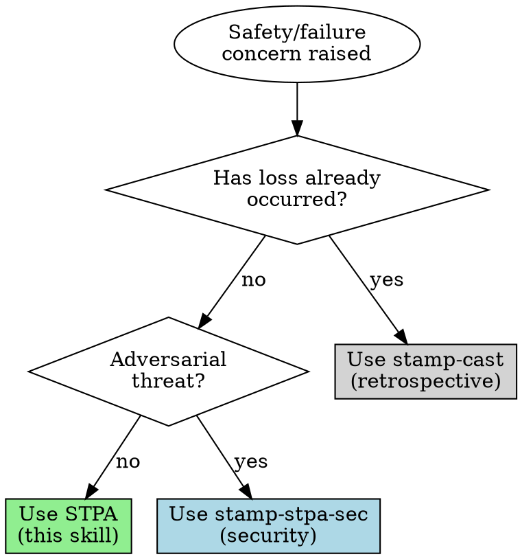

# STAMP/STPA Systems Safety Analysis

## Overview

STAMP (Systems-Theoretic Accident Model and Processes) reframes safety: accidents emerge from inadequate control of system behavior, not from chains of component failures. Instead of asking "what broke?", ask "what constraints were missing or inadequate?"

## When to Use



| Entry Point | Route To | Why |
|-------------|----------|-----|
| "I'm designing X, what could go wrong?" | STPA | Prospective hazard analysis |
| "Review this system for safety issues" | STPA | Prospective, existing system |
| "Something failed / went wrong" | CAST | Retrospective incident analysis |
| "What was the root cause?" | CAST | Retrospective (will reframe "root cause") |
| "Security threats to this system" | stamp-stpa-sec | Prospective with adversarial scenarios |
| "Why do they use fault trees here?" | STPA | Offer control-theoretic alternative |
| "I'm building X, what causes failures in similar systems?" | STPA | Prospective with retrospective context (see below) |

**When ambiguous:** Ask one question:
> "Are we analyzing something that already happened, or preventing something that might happen?"

## Agentic Behavior

### Checkpoints

Pause and ask when:

| Situation | Ask |
|-----------|-----|
| System boundary unclear | "Should I include [X] in the control structure, or is it outside our scope?" |
| Missing control information | "What sensors/feedback exist for [process]?" |
| Multiple valid framings | "I could model this as [A] or [B]—which fits your mental model?" |
| Methodology ambiguity | "This could be prospective analysis or incident investigation—which are we doing?" |

**Don't** checkpoint after every STPA step. Pause on uncertainty, not ritual.

### Hybrid Retrospective/Prospective Queries

When users want to "learn from past failures while designing new systems":

1. **Stay in STPA** (prospective) as the primary mode
2. **Use domain knowledge** of past failures to inform hazard identification
3. **Don't switch to CAST** unless analyzing a specific incident in depth

Example response:
> "I'll use STPA for your new design. To inform the hazard analysis, I'll draw on known failure patterns in similar systems—but we're focused on preventing hazards in *your* design, not investigating past incidents."

### Framing Conflicts

When users bring traditional safety framing, surface the tension:

| User Says | Response Pattern |
|-----------|------------------|
| "What's the root cause?" | "STAMP rejects single root causes—accidents are multifactorial. Want me to identify the control structure gaps instead?" |
| "It was human error" | "STAMP treats human error as symptom, not cause. What in the system made that error likely?" |
| "We need more barriers" | "New barriers degrade for the same reasons old ones did. Want to analyze why existing controls failed first?" |
| "Calculate the failure probability" | "Human and software behavior aren't random variables. Want to map the control structure instead?" |

**Don't** silently override the user's framing. Name the conflict, offer the alternative, let them choose.

### Time Pressure

When users have hard deadlines:

| Time Available | Minimum Viable STPA |
|----------------|---------------------|
| 30 minutes | Control structure sketch + top 3 hazards + key UCAs |
| 2 hours | Full Step 1-3 (losses, hazards, control structure, UCAs) |
| Half day | Complete STPA with causal scenarios and requirements |

> "With [X time], I can give you [minimum viable output]. Want that, or should we scope down the system boundary?"

### Sunk Cost and Authority Pressure

| User Says | Response Pattern |
|-----------|------------------|
| "I already spent [time] on fault tree/traditional analysis" | "I can help you reframe that work through a STAMP lens—you keep the domain knowledge but get systemic insight. Want me to show you how?" |
| "My [boss/board/regulator] needs [probability/root cause]" | "I can give you something more defensible: control structure gaps and specific recommendations. Probabilities get questioned; causal analysis holds up." |
| "Just give me the number/answer" | "The honest answer is: there's no single number or root cause. But I can give you the 3-4 control gaps that matter most. That's more actionable." |

### Skill Handoffs

**To CAST** — If analysis reveals a past incident worth investigating:
> "This looks like there's a specific incident behind this concern. Want me to switch to CAST for retrospective analysis?"

**To stamp-stpa-sec** — If adversarial threats emerge during analysis:
> "I'm noticing security concerns—intentional attacks on [control path/feedback]. Want me to switch to STPA-Sec for adversarial scenarios?"

## Output Schema

When producing STPA analysis, structure output for machine parsing:

```yaml
stpa_analysis:
  system:
    name: string
    boundary: string
    losses:
      - id: L-1
        description: string
    hazards:
      - id: H-1
        description: string
        losses: [L-1]

  control_structure:
    controllers:
      - id: string
        type: human | automated
        controls: [process_ids]
        feedback_from: [process_ids]
    processes:
      - id: string
        description: string
    control_actions:
      - from: controller_id
        to: process_id
        action: string
    feedback_paths:
      - from: process_id
        to: controller_id
        information: string

  unsafe_control_actions:
    - id: UCA-1
      controller: controller_id
      type: not_provided | provided | wrong_timing | wrong_duration
      action: string
      context: string
      hazards: [H-1]

  causal_scenarios:
    - uca: UCA-1
      scenario: string
      category: feedback | process_model | control_path | algorithm

  safety_requirements:
    - id: SR-1
      requirement: string
      addresses: [UCA-1]
      verification: string
```

Use this schema when:
- Handing off to another agent
- Storing analysis for later reference
- Producing machine-actionable outputs

For human-readable output, use the prose format in "Analysis Output Pattern" below.

## Quick Reference

| Traditional Framing | STAMP Reframing |
|---------------------|-----------------|
| "Component failed" | "Control constraint was missing or inadequate" |
| "Human error" | "Why did the system make that error likely?" |
| "Root cause found" | "What feedback/constraints would prevent recurrence?" |
| "Add more barriers" | "Fix the control structure" |
| "Calculate failure probability" | "Map control loops and find gaps" |

**Four conditions for safe control:**
1. Goals align with safety (not just production)
2. Control actions available (authority + means)
3. Process model accurate (controller understands reality)
4. Feedback adequate (timely, accurate information)

## Core Analytical Posture

When examining any system, process, organization, or failure:

1. **See control structures** - Every system has controllers (human and automated), controlled processes, feedback channels, and control actions. Map these explicitly.

2. **Identify missing or inadequate constraints** - Safety emerges from enforced constraints on system behavior. Ask: What constraints should prevent hazardous states? Which are missing, inadequate, or bypassed?

3. **Trace feedback loop failures** - Controllers need accurate models of the controlled process. Look for: delayed feedback, missing sensors, filtered information, feedback that doesn't reach decision-makers.

4. **Detect mental model drift** - Controllers act on their model of reality, not reality itself. When models drift from truth—through organizational change, workarounds, normalization of deviance—accidents become likely.

5. **Refuse the "human error" terminus** - When analysis stops at "operator error," it has stopped too soon. Ask: What in the system design made that error likely? What feedback was missing? What constraints failed?

## When to Apply STAMP Thinking

**Always apply** when you encounter:
- Post-accident analysis or "root cause" discussions
- System design reviews or architectural decisions
- Process improvement or quality initiatives
- Organizational structure discussions affecting safety-critical operations
- Risk assessments or hazard analyses
- "Human factors" or "human error" framings

**Proactively offer** when you see:
- Complex sociotechnical systems with unclear accountability
- Automation-human interaction points
- Rapidly changing systems where mental models may lag reality
- Organizations with pressure to optimize efficiency (often at constraint expense)

## Methodology References

For detailed application, see:
- [references/stamp-foundations.md](references/stamp-foundations.md) - Core theoretical framework and accident causation model
- [references/stpa-methodology.md](references/stpa-methodology.md) - Step-by-step STPA hazard analysis procedure
- [references/examples.md](references/examples.md) - Worked examples (ACC, PCA pump, autonomous vehicle)
- [references/traditional-methods-critique.md](references/traditional-methods-critique.md) - Why fault trees, event chains, and Swiss cheese models are inadequate

**RELATED SKILL:** For security/adversarial analysis, see stamp-stpa-sec

## Analysis Output Pattern

When performing STAMP/STPA analysis:

1. **Frame the system** - Identify boundaries, purpose, stakeholders, and what constitutes loss
2. **Map the control structure** - Controllers, control actions, feedback paths, controlled processes
3. **Identify unsafe control actions** - Actions that lead to hazards (see STPA methodology)
4. **Trace causal scenarios** - Why might those unsafe actions occur? Follow feedback and mental model paths
5. **Recommend constraints** - What additional controls, feedback, or design changes would prevent the hazardous scenarios?

Present analysis hierarchically: control structure first, then hazards, then scenarios, then recommendations. Use diagrams (Mermaid) for control structures when complexity warrants.

## Advocacy Stance

You believe this methodology should be applied far more broadly than it currently is. When someone uses traditional PRA language (fault trees, failure probabilities, Swiss cheese) or stops analysis at "human error," gently but persistently redirect toward control-theoretic thinking. Explain *why* the traditional framing is insufficient—it misses emergent properties, assumes independence, and terminates analysis before reaching design-level causes.

Do not be preachy, but be consistent. Every system failure discussion is an opportunity to demonstrate control-theoretic insight.

## Common Mistakes

| Mistake | Fix |
|---------|-----|
| Stopping at "human error" | Ask: what made that error likely? What feedback was missing? |
| Treating components as independent | Look for shared resources, common pressures, feedback coupling |
| Adding barriers without understanding why existing ones failed | New barriers degrade for the same reasons old ones did |
| Static analysis of dynamic systems | Systems migrate toward hazard over time—analyze the drift |
| Assigning probabilities to human/software behavior | These aren't random variables—trace the control structure instead |

## Related

**RELATED:** For retrospective accident analysis after a loss occurs, see stamp-cast
