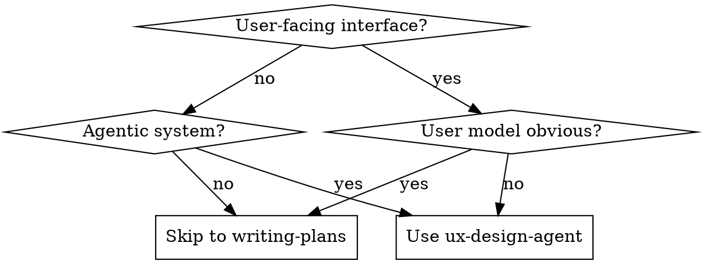
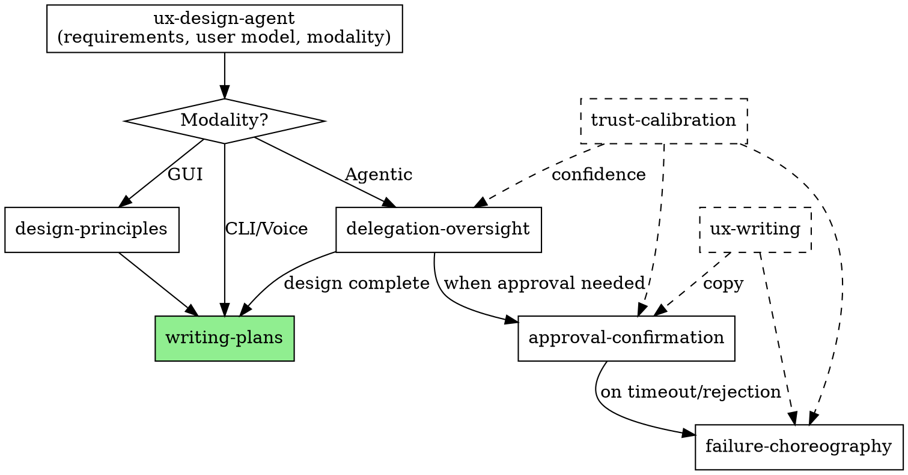

# UX Design Agent

## Overview

Extract requirements, model users, select modality. Hand off to implementation skills.

**Core principle:** Solve the right problem for the right user through the right interface.

**Announce at start:** "I'm using the ux-design-agent skill to design this experience."

## When to Use



## Skill Coordination

When designing agentic interfaces, multiple skills coordinate:



**Dashed boxes:** Technique skills invoked within others (not workflow steps).

## The Process

### Phase 1: Requirements Archaeology
- What problem are we actually solving?
- What does success feel like?
- What are the hard constraints?

### Phase 2: User Modeling
- Task frequency (daily vs. quarterly)
- Expertise gradient (domain, interface, this tool)
- Context of use (time pressure, environment)

### Phase 3: Modality Selection

| Modality | Use When |
|----------|----------|
| GUI | Visual scanning, comparison, novice users |
| CLI | Precision, scripting, expert users |
| Voice | Hands-free, accessibility |
| Agentic | User wants outcome not process |

### Phase 4: Hand Off

**If GUI selected:**
- **REQUIRED SUB-SKILL:** Use design-principles for visual design
- Then: Use writing-plans for implementation

**If Agentic selected:**
- **REQUIRED SUB-SKILL:** Use delegation-oversight for handoff patterns
- delegation-oversight will invoke approval-confirmation, failure-choreography as needed
- Then: Use writing-plans for implementation

**If CLI/Voice selected:**
- Document requirements
- Then: Use writing-plans for implementation

## Output

Save requirements to: `docs/plans/YYYY-MM-DD-<feature>-requirements.md`

Format:
```markdown
# [Feature] Requirements

## Problem Statement
[One paragraph]

## User Model
- Primary user: [behavioral description]
- Context: [when/where/how they use this]
- Expertise: [domain, interface, tool]

## Success Criteria
- [Measurable outcomes]

## Modality
[Selected modality with rationale]

## Constraints
- [Technical, regulatory, organizational]

## Delegation Design (if agentic)
[From delegation-oversight]

## Approval Design (if agentic)
[From approval-confirmation]

## Failure Handling (if agentic)
[From failure-choreography]
```

Then: **REQUIRED SUB-SKILL:** Use writing-plans to create implementation plan.

## Integration

**Called by:** brainstorming (when UX design recommended and user confirms)

**Invokes:**
- design-principles (GUI modality)
- delegation-oversight (agentic modality)

**Technique skills used throughout:**
- trust-calibration (confidence framing)
- ux-writing (copy refinement)

**Hands off to:** writing-plans (implementation planning)
