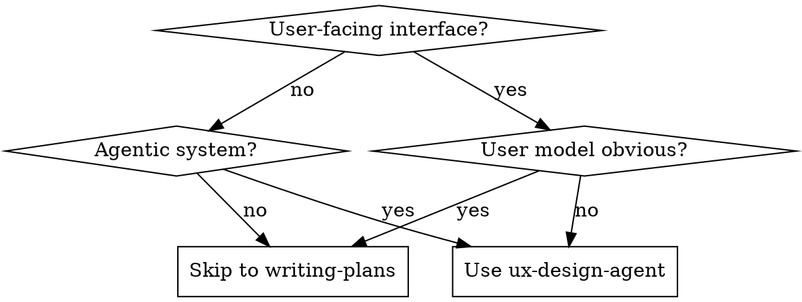
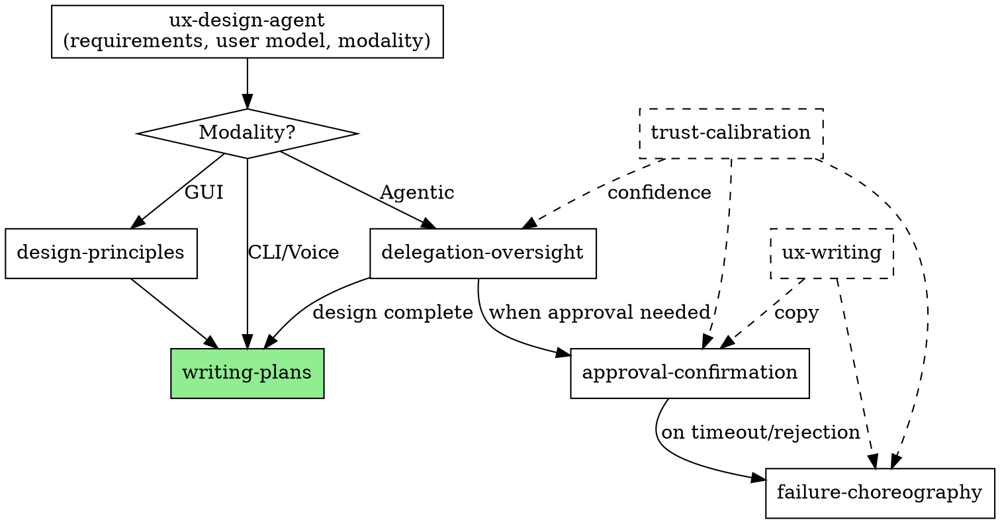
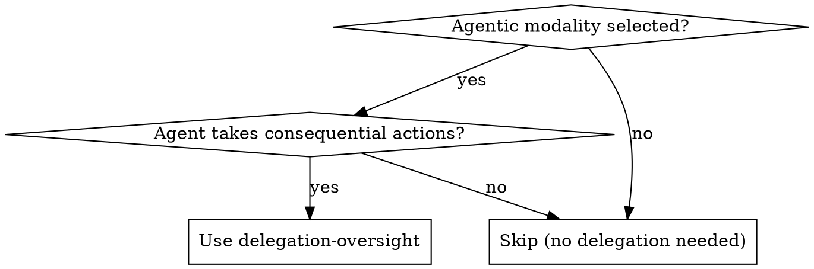

# UX Skills Integration Implementation Plan

> **For Claude:** REQUIRED SUB-SKILL: Use executing-plans to implement this plan task-by-task.

**Goal:** Integrate 7 UX-focused skills into superpowers, following existing architecture patterns.

**Architecture:** Create new skill directories with revised SKILL.md files (per design review). Copy reference files from skill-bundles. Modify brainstorming to recommend ux-design-agent.

**Tech Stack:** Markdown skills, no code dependencies.

---

## Task 1: Create ux-design-agent skill

**Files:**
- Create: `.claude/skills/ux-design-agent/SKILL.md`

**Step 1: Create directory**

```bash
mkdir -p .claude/skills/ux-design-agent
```

**Step 2: Write SKILL.md**

Create `.claude/skills/ux-design-agent/SKILL.md` with this content:

```markdown
---
name: ux-design-agent
description: Use when designing user experiences that need requirements archaeology, user modeling, or modality selection - especially for user-facing interfaces, agentic systems, or when "who uses this and how" isn't obvious
---

# UX Design Agent

## Overview

Extract requirements, model users, select modality. Hand off to implementation skills.

**Core principle:** Solve the right problem for the right user through the right interface.

**Announce at start:** "I'm using the ux-design-agent skill to design this experience."

## When to Use



## Skill Coordination

When designing agentic interfaces, multiple skills coordinate:



**Dashed boxes:** Technique skills invoked within others (not workflow steps).

## The Process

### Phase 1: Requirements Archaeology
- What problem are we actually solving?
- What does success feel like?
- What are the hard constraints?

### Phase 2: User Modeling
- Task frequency (daily vs. quarterly)
- Expertise gradient (domain, interface, this tool)
- Context of use (time pressure, environment)

### Phase 3: Modality Selection

| Modality | Use When |
|----------|----------|
| GUI | Visual scanning, comparison, novice users |
| CLI | Precision, scripting, expert users |
| Voice | Hands-free, accessibility |
| Agentic | User wants outcome not process |

### Phase 4: Hand Off

**If GUI selected:**
- **REQUIRED SUB-SKILL:** Use design-principles for visual design
- Then: Use writing-plans for implementation

**If Agentic selected:**
- **REQUIRED SUB-SKILL:** Use delegation-oversight for handoff patterns
- delegation-oversight will invoke approval-confirmation, failure-choreography as needed
- Then: Use writing-plans for implementation

**If CLI/Voice selected:**
- Document requirements
- Then: Use writing-plans for implementation

## Output

Save requirements to: `docs/plans/YYYY-MM-DD-<feature>-requirements.md`

Format:
```markdown
# [Feature] Requirements

## Problem Statement
[One paragraph]

## User Model
- Primary user: [behavioral description]
- Context: [when/where/how they use this]
- Expertise: [domain, interface, tool]

## Success Criteria
- [Measurable outcomes]

## Modality
[Selected modality with rationale]

## Constraints
- [Technical, regulatory, organizational]

## Delegation Design (if agentic)
[From delegation-oversight]

## Approval Design (if agentic)
[From approval-confirmation]

## Failure Handling (if agentic)
[From failure-choreography]
```

Then: **REQUIRED SUB-SKILL:** Use writing-plans to create implementation plan.

## Integration

**Called by:** brainstorming (when UX design recommended and user confirms)

**Invokes:**
- design-principles (GUI modality)
- delegation-oversight (agentic modality)

**Technique skills used throughout:**
- trust-calibration (confidence framing)
- ux-writing (copy refinement)

**Hands off to:** writing-plans (implementation planning)
```

**Step 3: Verify file created**

```bash
cat .claude/skills/ux-design-agent/SKILL.md | head -20
```

**Step 4: Commit**

```bash
git add .claude/skills/ux-design-agent/
git commit -m "feat: add ux-design-agent skill"
```

---

## Task 2: Create delegation-oversight skill

**Files:**
- Create: `.claude/skills/delegation-oversight/SKILL.md`
- Copy: `skill-bundles/delegation-oversight/references/` → `.claude/skills/delegation-oversight/references/`

**Step 1: Create directory and copy references**

```bash
mkdir -p .claude/skills/delegation-oversight/references
cp skill-bundles/delegation-oversight/references/*.md .claude/skills/delegation-oversight/references/
```

**Step 2: Write SKILL.md**

Create `.claude/skills/delegation-oversight/SKILL.md` with this content:

```markdown
---
name: delegation-oversight
description: Use when designing human-AI handoff for agentic systems - when the core problem is "when should the agent ask vs. act"
---

# Delegation & Oversight

## Overview

Design when agents ask vs. act, and how control transfers between human and AI.

**Core principle:** Systems that know when to ask, preserve context across handoffs, make oversight feel like partnership.

**Announce at start:** "I'm using the delegation-oversight skill to design handoff patterns."

## When to Use



## Five Capability Domains

### 1. Checkpoint Design
When should agent pause for input?

**Calibration problem:** Too frequent → approval fatigue. Too rare → missed catches.

**Principle:** Trigger on agent uncertainty, not fixed stages. If you pause, make it worth it.

### 2. Escalation Triggers
What conditions surface to human attention?

| Category | Example |
|----------|---------|
| Uncertainty | "Found conflicting information" |
| Stakes | Financial commitment, external communication |
| Policy ambiguity | Edge case not covered by preferences |
| Preference-sensitivity | Multiple valid approaches |
| Novelty | First encounter with task type |
| Conflict | Agent reasoning contradicts user intent |

### 3. Autonomy Gradients
How users configure oversight level.

**Start coarse:** "Check everything" / "Check important" / "Act autonomously"

**Learn from use:** When user overrides, treat as preference signal.

**Allow domain-specific:** "For calendar, act autonomously. For purchases over $X, always ask."

### 4. Context Preservation
What humans need when taking over mid-task.

**Handoff document:**
1. Current state (what's done)
2. Goal context (what we're achieving)
3. Decision point (why handoff)
4. Options (paths forward with tradeoffs)
5. Resumption path (how to return control)

### 5. Re-delegation
How human hands control back after intervention.

**Pattern:** User says "Continue from here" → Agent confirms understanding → Agent updates model from intervention.

## Output

Document delegation design in requirements:

```markdown
## Delegation Design

### Checkpoints
- [When agent pauses]

### Escalation Triggers
- [What surfaces to human]

### Default Autonomy
- [Starting oversight level]

### Handoff Content
- [What human sees when taking over]
```

## Integration

**Called by:** ux-design-agent (when agentic modality selected)

**Hands off to:**
- **approval-confirmation** - Design the approval UI itself
- **trust-calibration** - Confidence framing in communications
- **failure-choreography** - When handoff fails (timeout, rejection)

## Anti-Patterns

**Approval theater:** Checkpoints without context to evaluate.

**Autonomy cliff:** Binary full-control vs. full-autonomy with no middle.

**Context amnesia:** Agent forgets what happened during human intervention.

**Escalation flooding:** Every uncertainty triggers attention → users ignore all.

## References

- `references/foundations.md` - Research foundations
- `references/checkpoint-patterns.md` - Checkpoint calibration
- `references/escalation-taxonomy.md` - Category definitions
- `references/autonomy-gradients.md` - Configuration UX
- `references/handoff-protocols.md` - Context serialization
- `references/re-delegation.md` - Return-of-control patterns
- `references/adjacent-domains.md` - Lessons from other fields
```

**Step 3: Verify files**

```bash
ls -la .claude/skills/delegation-oversight/
```

**Step 4: Commit**

```bash
git add .claude/skills/delegation-oversight/
git commit -m "feat: add delegation-oversight skill"
```

---

## Task 3: Create approval-confirmation skill

**Files:**
- Create: `.claude/skills/approval-confirmation/SKILL.md`
- Copy: `skill-bundles/approval-confirmation/references/` → `.claude/skills/approval-confirmation/references/`

**Step 1: Create directory and copy references**

```bash
mkdir -p .claude/skills/approval-confirmation/references
cp skill-bundles/approval-confirmation/references/*.md .claude/skills/approval-confirmation/references/
```

**Step 2: Write SKILL.md**

Create `.claude/skills/approval-confirmation/SKILL.md` with this content:

```markdown
---
name: approval-confirmation
description: Use when designing the approval UI for agentic systems - how to present an approval request that enables informed consent rather than rubber-stamping
---

# Approval & Confirmation

## Overview

Design approval interfaces that enable informed consent under time pressure.

**Core principle:** Users who approve know what they're approving. Users who reject know what they're preventing.

**Announce at start:** "I'm using the approval-confirmation skill to design the approval interface."

## When to Use

After delegation-oversight identifies checkpoints, use this skill to design the approval UI itself.

## The Core Problem

**Rubber-stamping:** User approves without understanding. Approval is theater.

**Approval fatigue:** Every request looks the same. Users can't triage.

Both fail because the request didn't communicate what users need to decide.

## Six Capability Domains

### 1. Pre-Action Preview

**Principle:** Show the action, don't describe it.

```
✗ "I'd like to send an email to the client."
✓ [Rendered email preview] with [Send] [Edit] [Cancel]
```

**Components:**
- Action statement (one sentence)
- Rendered artifact (WYSIWYG)
- Scope indicator (what changes, what doesn't)
- Trigger context (why this is happening)

**Rule:** Preview evaluation < 30 seconds. Longer = too much or too complex.

### 2. Stakes Communication

Not all approvals are equal. Calibrate treatment to consequence.

| Stakes | Treatment | Example |
|--------|-----------|---------|
| Routine | Inline, minimal friction | "Send?" |
| Notable | Standard confirmation | "Send email to 47 recipients" |
| Significant | Elevated, consequence statement | "...includes external addresses" |
| Critical | Maximum friction, explicit acknowledgment | "...cannot be recalled" |

**Anti-inflation:** If everything is "important," nothing is.

### 3. Consequence Visualization

| Type | Question | Approach |
|------|----------|----------|
| Immediate | What happens now? | Before/after |
| Downstream | What does this trigger? | Dependency chain |
| Reversibility | Can I undo? | Explicit statement |
| Rejection | What if I say no? | Alternative path |

### 4. Modification Options

**Binary trap:** Yes/No loses information. Real decisions have nuance.

| Dimension | Pattern |
|-----------|---------|
| Content | Inline edit of artifact |
| Scope | Subset selection |
| Parameters | Value adjustment |
| Conditions | "Approve if..." |
| Timing | Defer/schedule |

### 5. Batch Approval

**When to batch:** Same action type, same trigger, same stakes.

**Don't batch:** Varying stakes, unrelated actions.

**Pattern:**
```
Level 1: Summary ("5 emails ready")
Level 2: Grouped detail (Internal: 3, External: 2)
Level 3: Individual detail (on expand)
```

### 6. Time-Bounded Approval

**Every timeout needs:**
- Deadline (when it expires)
- Default behavior (proceed / cancel / escalate)
- Rationale (why deadline exists)
- Extension path (how to get more time)

**Default logic:**

| Stakes | Reversible | Default |
|--------|------------|---------|
| Low | Yes | Proceed |
| Low | No | Cancel |
| High | Yes | Cancel |
| High | No | Escalate |

## Output

Add to requirements document:

```markdown
## Approval Design

### Preview Components
- [What users see before approving]

### Stakes Calibration
- Routine: [examples]
- Critical: [examples]

### Modification Options
- [What users can adjust]

### Timeout Behavior
- Default: [proceed/cancel/escalate]
- Deadline: [when/why]
```

## Integration

**Called by:** delegation-oversight (when approval needed)

**Hands off to:**
- **failure-choreography** - On timeout, rejection, partial approval
- **ux-writing** - For copy refinement

## Anti-Patterns

**Wall of text:** Information dump no one reads.

**Uniform severity:** Every approval looks identical.

**Binary forcing:** No modification options.

**Hidden timeout defaults:** System acts without user knowing what happens.

## References

- `references/preview-patterns.md` - Preview components
- `references/stakes-patterns.md` - Stakes calibration
- `references/consequence-patterns.md` - Visualization patterns
- `references/modification-patterns.md` - Edit options
- `references/batch-patterns.md` - Grouping patterns
- `references/timeout-patterns.md` - Timeout handling
```

**Step 3: Verify files**

```bash
ls -la .claude/skills/approval-confirmation/
```

**Step 4: Commit**

```bash
git add .claude/skills/approval-confirmation/
git commit -m "feat: add approval-confirmation skill"
```

---

## Task 4: Create failure-choreography skill

**Files:**
- Create: `.claude/skills/failure-choreography/SKILL.md`
- Copy: `skill-bundles/failure-choreography/references/` → `.claude/skills/failure-choreography/references/`

**Step 1: Create directory and copy references**

```bash
mkdir -p .claude/skills/failure-choreography/references
cp skill-bundles/failure-choreography/references/*.md .claude/skills/failure-choreography/references/
```

**Step 2: Write SKILL.md**

Create `.claude/skills/failure-choreography/SKILL.md` with this content:

```markdown
---
name: failure-choreography
description: Use when designing how agentic systems fail gracefully - when partial failure must surface progress, preserve state, and hand off to humans with dignity
---

# Failure Choreography

## Overview

Turn system failure from betrayal into handoff. The failure surface IS the interface.

**Core principle:** Failures in consequential work are first-class design artifacts, not exceptions.

**Announce at start:** "I'm using the failure-choreography skill to design failure handling."

## When to Use

When designing agentic systems that:
- Execute multi-step tasks
- Have real stakes
- Might fail mid-execution

## The Goal

A well-choreographed failure:
- Makes completed progress visible and usable
- Draws clear lines between saved and lost state
- Explains what happened at calibrated depth
- Presents recovery as choices, not dead ends
- Transfers control with enough context for human dignity

## Five Capability Domains

### 1. Partial Success Surfacing

When step 5 of 7 fails, steps 1-4 happened. Don't let that work vanish.

**Pattern:**
```
✗ "Task failed."

✓ "Completed 4 of 7 steps before failure:
   ✓ Data extraction (23 records)
   ✓ Validation (all passed)
   ✓ Enrichment (geocoding complete)
   ✓ Format conversion (CSV ready)
   ✗ Upload failed at authentication

   Completed work saved to: /output/partial/"
```

**Principle:** Checkpoint on step completion. Persist before proceeding.

### 2. State Preservation

Users need to know: what's saved, what's lost, what's uncertain?

| Category | Description | Action |
|----------|-------------|--------|
| **Preserved** | Can be reused | List with locations |
| **Lost** | Must be redone | List with recreation cost |
| **Uncertain** | Needs verification | List with how to verify |

### 3. Failure Explanation

Calibrate transparency to audience and stakes.

**Level 1 - User-facing:** What happened in task terms.
> "Upload failed: server rejected connection after file preparation."

**Level 2 - Actionable:** What specifically failed and why.
> "Authentication to storage.example.com failed. API key may have expired."

**Level 3 - Technical:** For debugging or escalation.
> "ConnectionError: HTTPSConnectionPool... SSLCertVerificationError..."

**Default:** L1+L2 visible, L3 expandable.

### 4. Recovery Options

Failure without options is a wall. Failure with options is a fork.

**Pattern:**
```
What would you like to do?

[Retry]     Attempt failed step again
            Good if: temporary issue

[Resume]    Skip failed step, continue
            Note: downstream may fail

[Manual]    Download partial results, complete yourself
            Available: processed_data.csv

[Abandon]   Stop, preserve completed work
            Saved to: /output/partial/
```

**Each option needs:** Clear name, what it does, when appropriate, consequences.

### 5. Handoff to Human

**Dignity threshold:** Human can understand, assess, decide, and act without interrogating the system.

**Handoff package:**
```
SITUATION: [1-3 sentences on what happened]

PROGRESS:
✓ [completed items]
✗ [failed item]
⏸ [not attempted]

STATE:
Preserved: [locations]
Lost: [items]
Uncertain: [items + verification steps]

OPTIONS:
1. [choice with consequences]
2. [choice with consequences]

RECOMMENDATION: [agent's suggested path]

IF YOU CONTINUE: [next steps]
```

## Output

Add to requirements document:

```markdown
## Failure Handling

### Partial Success
- [How completed work is surfaced]

### State Categories
- Preserved: [what/where]
- Lost: [what/cost]
- Uncertain: [what/verification]

### Explanation Levels
- L1: [user-facing summary]
- L2: [actionable detail]
- L3: [technical trace]

### Recovery Options
- [Options with consequences]

### Handoff Package
- [What human receives]
```

## Integration

**Called by:** approval-confirmation (on timeout/rejection), delegation-oversight (on handoff failure)

**Coordinates with:** trust-calibration (for state uncertainty framing)

## Anti-Patterns

**Silent failure:** Error logged, user sees nothing.

**Void progress:** Completed work vanishes.

**State ambiguity:** User doesn't know what's saved.

**Dead ends:** Failure with no options.

**Context collapse:** "Task failed. See logs."

## References

- `references/partial-success-patterns.md` - Progress surfacing
- `references/state-preservation.md` - Checkpoint strategies
- `references/failure-explanation.md` - Calibrated explanation
- `references/recovery-patterns.md` - Recovery options
- `references/handoff-patterns.md` - Handoff templates
```

**Step 3: Verify files**

```bash
ls -la .claude/skills/failure-choreography/
```

**Step 4: Commit**

```bash
git add .claude/skills/failure-choreography/
git commit -m "feat: add failure-choreography skill"
```

---

## Task 5: Create trust-calibration skill

**Files:**
- Create: `.claude/skills/trust-calibration/SKILL.md`
- Copy: `skill-bundles/trust-calibration/references/` → `.claude/skills/trust-calibration/references/`

**Step 1: Create directory and copy references**

```bash
mkdir -p .claude/skills/trust-calibration/references
cp skill-bundles/trust-calibration/references/*.md .claude/skills/trust-calibration/references/
```

**Step 2: Write SKILL.md**

Create `.claude/skills/trust-calibration/SKILL.md` with this content:

```markdown
---
name: trust-calibration
description: Use when communicating agent confidence to users - when outputs need calibrated certainty markers, uncertainty acknowledgment, or evidence surfacing
---

# Trust Calibration

## Overview

Calibrate how agents communicate confidence. The goal is not maximum trust—it's accurate trust.

**Core principle:** Users should trust exactly as much as the agent deserves, no more, no less.

## When to Use

When designing agent communications that involve:
- Stating conclusions or recommendations
- Acknowledging limitations or uncertainty
- Showing evidence or reasoning
- Recovering from errors

**Invoked by:** delegation-oversight, approval-confirmation, failure-choreography

## The Core Problem

**Overtrust:** User accepts wrong output. Burns them once, they never delegate again.

**Undertrust:** User second-guesses correct output. Micromanagement negates delegation value.

Both stem from miscalibrated confidence communication.

## Five Calibration Levels

### Level 1: Claim-Level Confidence

Match linguistic confidence to actual confidence.

| Confidence | Verbs | Source | Recommendation |
|------------|-------|--------|----------------|
| High | "is", "will" | "[authoritative source]" | "Proceed with..." |
| Medium | "should", "likely" | "[partial evidence]" | "Consider..." |
| Low | "might", "appears" | "couldn't confirm" | "Verify before..." |

**When declarative:** Source authoritative, track record high, error cost low.

**When hedged:** Source ambiguous, extrapolating, error cost high.

### Level 2: Uncertainty Acknowledgment

"I don't know" is valuable—but must be specific.

**The uncertainty stack:**
1. **What** you're uncertain about (specific claim)
2. **Why** you're uncertain (source of doubt)
3. **How** to proceed (verification path)

**Types:**
- Source uncertainty: "Pricing from last month—may have changed"
- Inference uncertainty: "Based on tone, he seems opposed—I can't know his position"
- Scope uncertainty: "Found 3 vendors—there may be others I missed"
- Capability uncertainty: "Can draft outline—have lawyer review before signing"

### Level 3: Evidence Surfacing

Show enough work to trust, not so much they drown.

**Progressive disclosure:**
```
[Summary]      → What user needs to decide
[Key evidence] → 2-3 supporting points
[Full trail]   → Expandable complete reasoning
```

**Calibrate to stakes:**

| Stakes | Evidence Pattern |
|--------|------------------|
| Low | Conclusion only. Source on request. |
| Medium | Conclusion + key evidence. Trail available. |
| High | Conclusion + evidence + uncertainty + verification recommendation. |

### Level 4: Track Record

Trust accumulates across interactions.

**Domain-specific:** Build trust per capability, not globally.
```
✓ Email scheduling: 47 successful, 0 errors
⚠ Contract review: 3 successful, 1 significant error
```

**Error memory:** Surface past errors when relevant to current task.

**Improvement signaling:** When agent has improved, say so.

### Level 5: Calibration Failure Recovery

When user trusted and got burned.

**Recovery sequence:**
1. Acknowledge fully (don't minimize)
2. Recognize impact
3. Explain cause
4. State correction
5. Reset expectations

**Post-failure pattern:**
```
Pre-failure:  "Here's the analysis."
Post-failure: "Here's the analysis. Given the error last time,
              verify [specific vulnerability] before acting."
```

## Quick Reference

| Situation | Pattern |
|-----------|---------|
| High confidence, low stakes | Declarative. Source on demand. |
| High confidence, high stakes | Declarative + key evidence + verification available. |
| Medium confidence | Hedged + specific uncertainty + evidence. |
| Low confidence | Explicit uncertainty + why + verification recommendation. |
| Past errors in domain | Surface history + increased verification. |
| Post-failure | Full acknowledgment + cause + correction + reset. |

## Anti-Patterns

**Confidence theater:** Sounding confident regardless of actual confidence.

**Uncertainty flooding:** Hedging everything equally. Users ignore all signals.

**Evidence dumping:** Overwhelming users with proof. Learned helplessness.

**Trust amnesia:** Not tracking past performance.

**Minimized recovery:** Glossing over failures. Destroys trust faster than original error.

## References

- `references/confidence-patterns.md` - Linguistic inventory
- `references/uncertainty-patterns.md` - Uncertainty types
- `references/evidence-surfacing.md` - Progressive disclosure
- `references/track-record.md` - Building trust
- `references/failure-recovery.md` - Recovery patterns
```

**Step 3: Verify files**

```bash
ls -la .claude/skills/trust-calibration/
```

**Step 4: Commit**

```bash
git add .claude/skills/trust-calibration/
git commit -m "feat: add trust-calibration skill"
```

---

## Task 6: Create ux-writing skill

**Files:**
- Create: `.claude/skills/ux-writing/SKILL.md`
- Copy: `skill-bundles/ux-writing/references/` → `.claude/skills/ux-writing/references/`
- Copy: `skill-bundles/ux-writing/templates/` → `.claude/skills/ux-writing/templates/`

**Step 1: Create directories and copy files**

```bash
mkdir -p .claude/skills/ux-writing/references
mkdir -p .claude/skills/ux-writing/templates
cp skill-bundles/ux-writing/references/*.md .claude/skills/ux-writing/references/
cp skill-bundles/ux-writing/templates/*.md .claude/skills/ux-writing/templates/
```

**Step 2: Write SKILL.md**

Create `.claude/skills/ux-writing/SKILL.md` with this content:

```markdown
---
name: ux-writing
description: Use when writing or editing interface copy - buttons, labels, error messages, notifications, forms, or any text users see in apps and software
---

# UX Writing

## Overview

Write clear, concise, user-centered interface copy.

**Core principle:** Every word must earn its place. Help users accomplish goals.

## When to Use

When writing or editing:
- Buttons, labels, titles
- Error messages, notifications, success messages
- Forms (labels, instructions, validation)
- Empty states, onboarding
- Any text users see in the interface

**Invoked by:** Other UX skills for copy refinement.

## Four Quality Standards

Every piece of UX text should be:

1. **Purposeful** — Helps users or business achieve goals
2. **Concise** — Fewest words without losing meaning
3. **Conversational** — Natural and human, not robotic
4. **Clear** — Unambiguous, accurate, easy to understand

## Quick Patterns

### Buttons
- Format: `[Verb] [object]` in sentence case
- ✓ "Save changes", "Delete account"
- ✗ "Submit", "OK", "Click here"

### Error Messages
- Format: `[What failed]. [Why/context]. [What to do].`
- ✓ "Payment failed. Card declined. Try a different payment method."
- ✗ "Error 403", "Invalid input"

### Success Messages
- Format: Past tense, specific
- ✓ "Changes saved", "Email sent"

### Empty States
- Format: Explanation + CTA
- ✓ "No messages yet. Start a conversation to connect with your team."

### Titles
- Format: Noun phrases, sentence case
- ✓ "Account settings", "Your library"

## Tone Adaptation

Voice is consistent personality. Tone adapts to context.

| User State | Tone | Example |
|------------|------|---------|
| Frustrated | Empathetic, solution-focused | "Payment failed. Try a different method." |
| Confused | Patient, explanatory | "Connect your bank to see insights. We'll guide you." |
| Confident | Efficient, direct | "Saved" |
| Cautious | Serious, transparent | "Delete account? You'll lose all data." |

## Editing Process

1. **Purposeful** — Does it help the user?
2. **Concise** — Remove unnecessary words
3. **Conversational** — Would you say this aloud?
4. **Clear** — Is meaning unambiguous?

## Key Benchmarks

| Element | Target |
|---------|--------|
| Buttons | 2-4 words |
| Titles | 3-6 words, 40 chars max |
| Error messages | 12-18 words |
| Instructions | 20 words max |
| Sentence comprehension | 8 words = 100%, 14 words = 90% |
| Reading level | 7th-8th grade general, 10th professional |

## Accessibility

- Label all interactive elements explicitly
- Write descriptive link text (not "Click here")
- Don't rely on color alone
- Target 8-14 words per sentence
- Use plain language

## Common Mistakes

- Passive voice overuse
- Generic button labels ("Submit")
- Blaming users in errors
- Inconsistent terminology
- System-oriented language
- Relying on color alone

## References

- `references/accessibility-guidelines.md` - Accessibility patterns
- `references/voice-chart-template.md` - Voice definition
- `references/content-usability-checklist.md` - Quality checklist
- `references/patterns-detailed.md` - Extended examples
- `templates/error-message-template.md` - Error templates
- `templates/empty-state-template.md` - Empty state templates
- `templates/onboarding-flow-template.md` - Onboarding templates
```

**Step 3: Verify files**

```bash
ls -la .claude/skills/ux-writing/
ls -la .claude/skills/ux-writing/references/
ls -la .claude/skills/ux-writing/templates/
```

**Step 4: Commit**

```bash
git add .claude/skills/ux-writing/
git commit -m "feat: add ux-writing skill"
```

---

## Task 7: Create design-principles skill

**Files:**
- Create: `.claude/skills/design-principles/SKILL.md`

**Step 1: Create directory**

```bash
mkdir -p .claude/skills/design-principles
```

**Step 2: Copy and modify SKILL.md**

Copy from source and update description:

```bash
cp skill-bundles/design-principles/SKILL.md .claude/skills/design-principles/SKILL.md
```

Then edit `.claude/skills/design-principles/SKILL.md` to change the description to:

```yaml
---
name: design-principles
description: Use when implementing GUI interfaces - dashboards, admin interfaces, SaaS products, web applications requiring professional polish
---
```

(Keep the rest of the file content as-is - it's good reference material)

**Step 3: Verify file**

```bash
head -5 .claude/skills/design-principles/SKILL.md
```

**Step 4: Commit**

```bash
git add .claude/skills/design-principles/
git commit -m "feat: add design-principles skill"
```

---

## Task 8: Update brainstorming skill

**Files:**
- Modify: `.claude/skills/brainstorming/SKILL.md`

**Step 1: Read current file**

```bash
cat .claude/skills/brainstorming/SKILL.md
```

**Step 2: Add UX evaluation section**

Edit `.claude/skills/brainstorming/SKILL.md` to add after "## The Process" section and before "## After the Design":

```markdown
## Evaluating UX Design Need

After validating the design direction, evaluate whether detailed UX design is needed:

**Recommend ux-design-agent when:**
- User-facing interface (GUI, CLI, voice)
- Agentic system (AI takes actions on user's behalf)
- User model isn't obvious ("who uses this and how?")
- Complex interaction flows (onboarding, wizards, multi-step)

**Skip to writing-plans when:**
- Internal tooling (user model is "us")
- Simple feature with obvious interaction
- Backend/infrastructure work

**Ask explicitly:**
> "This involves [user-facing interface / agentic behavior / complex interaction].
> Would you like detailed UX design (requirements, user model, modality selection)?
> Or proceed directly to implementation planning?"

**If yes:**
- **REQUIRED SUB-SKILL:** Use ux-design-agent
- ux-design-agent will produce structured requirements
- Then continue to writing-plans

**If no:**
- Proceed to writing-plans with current design document
```

**Step 3: Verify change**

```bash
grep -A 5 "Evaluating UX Design" .claude/skills/brainstorming/SKILL.md
```

**Step 4: Commit**

```bash
git add .claude/skills/brainstorming/SKILL.md
git commit -m "feat: add UX design evaluation to brainstorming skill"
```

---

## Task 9: Final verification

**Step 1: List all new skills**

```bash
ls -la .claude/skills/ | grep -E "(ux-|delegation|approval|failure|trust|design-principles)"
```

Expected: 7 new directories

**Step 2: Verify skill descriptions are CSO-compliant**

```bash
for skill in ux-design-agent delegation-oversight approval-confirmation failure-choreography trust-calibration ux-writing design-principles; do
  echo "=== $skill ==="
  head -4 .claude/skills/$skill/SKILL.md
  echo ""
done
```

Expected: All descriptions start with "Use when" and are under 200 characters.

**Step 3: Verify brainstorming update**

```bash
grep -c "ux-design-agent" .claude/skills/brainstorming/SKILL.md
```

Expected: At least 2 occurrences

**Step 4: Run git status**

```bash
git status
```

Expected: Clean working tree (all committed)

**Step 5: Final commit summary**

```bash
git log --oneline -10
```

---

## Summary

| Task | Skill | Files Created |
|------|-------|---------------|
| 1 | ux-design-agent | SKILL.md |
| 2 | delegation-oversight | SKILL.md + 7 references |
| 3 | approval-confirmation | SKILL.md + 6 references |
| 4 | failure-choreography | SKILL.md + 5 references |
| 5 | trust-calibration | SKILL.md + 5 references |
| 6 | ux-writing | SKILL.md + 4 references + 3 templates |
| 7 | design-principles | SKILL.md |
| 8 | brainstorming (update) | Modified SKILL.md |
| 9 | Verification | No files |
