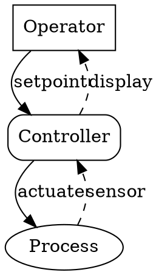
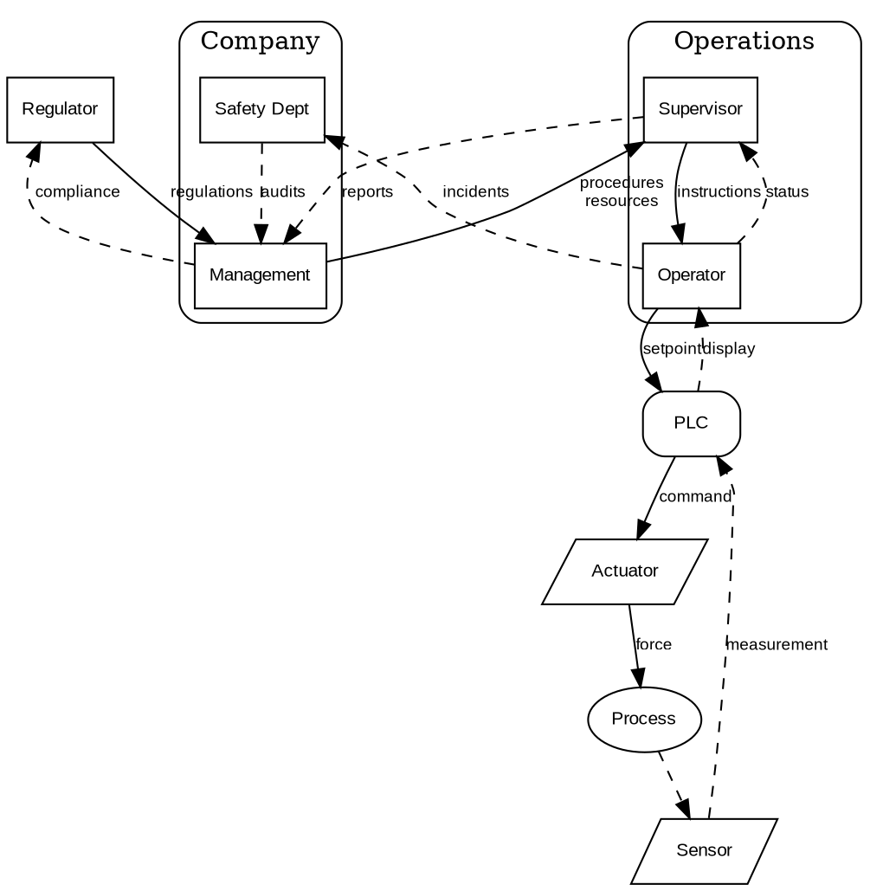
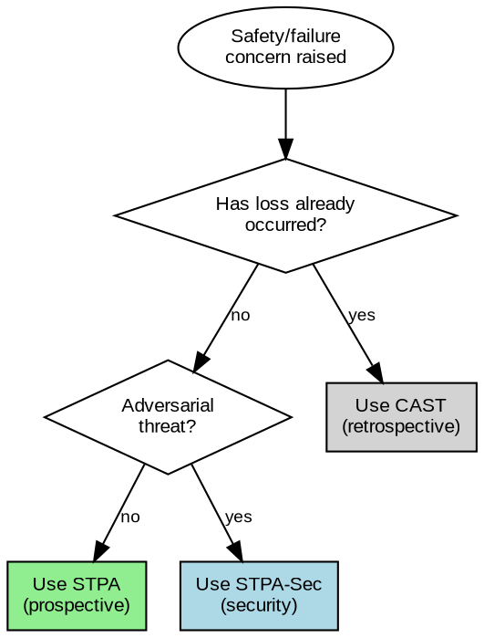
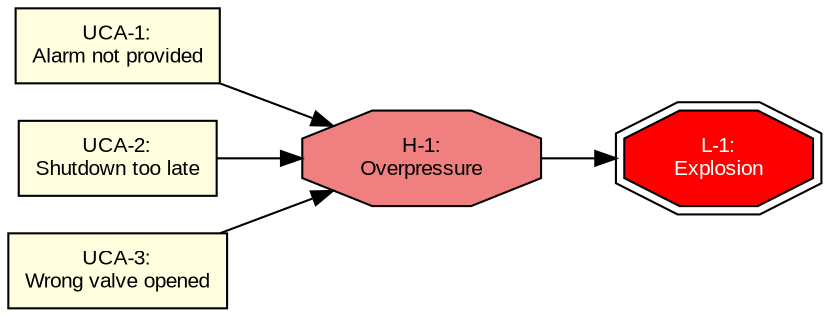
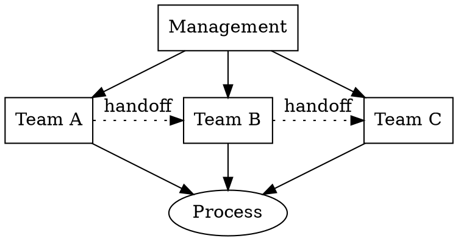
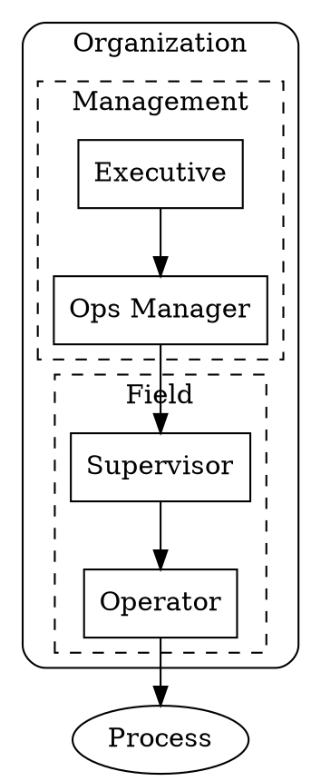
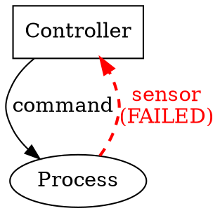
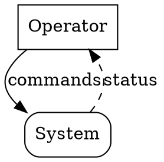

# STAMP Diagramming Guide Implementation Plan

> **For Claude:** REQUIRED SUB-SKILL: Use executing-plans to implement this plan task-by-task.

**Goal:** Add STAMP-aware DOT/Graphviz generation to the diagramming skill.

**Architecture:** New guide file with STAMP-specific DOT conventions, integrated via router update. Three diagram types: control structures, routing decisions, causal scenarios.

**Tech Stack:** Markdown, DOT/Graphviz syntax

---

## Task 1: Create Guide Skeleton

**Files:**
- Create: `.claude/skills/diagramming/20-STAMP-CONTROL-STRUCTURE-GUIDE.md`

**Step 1: Create the guide with header and structure**

```markdown
# STAMP Control Structure Diagrams

Generate DOT/Graphviz diagrams for STAMP (Systems-Theoretic Accident Model and Processes) analysis.

## When to Use

This guide applies when creating diagrams for:
- STPA (System-Theoretic Process Analysis) - prospective hazard analysis
- CAST (Causal Analysis based on System Theory) - retrospective incident analysis
- STPA-Sec - security-focused control analysis
- Any control structure, feedback loop, or causal scenario diagram

## Quick Reference

| Diagram Type | Layout | Key Convention |
|--------------|--------|----------------|
| Control structure | `rankdir=TB` | Solid=control, dashed=feedback |
| Routing/decision | `rankdir=TB` | Diamond=decision, colored boxes=outcomes |
| Causal scenario | `rankdir=LR` | Octagon=hazard, red=loss |

---

## Control Structure Diagrams

[Content in Task 2]

## Routing/Decision Diagrams

[Content in Task 3]

## Causal Scenario Diagrams

[Content in Task 4]

## Common Patterns

[Content in Task 5]

## Validation Checklist

[Content in Task 6]
```

**Step 2: Verify file created**

Run: `ls -la .claude/skills/diagramming/20-STAMP-CONTROL-STRUCTURE-GUIDE.md`
Expected: File exists with size > 0

**Step 3: Commit skeleton**

```bash
git add .claude/skills/diagramming/20-STAMP-CONTROL-STRUCTURE-GUIDE.md
git commit -m "feat(diagramming): add STAMP guide skeleton"
```

---

## Task 2: Control Structure Diagrams Section

**Files:**
- Modify: `.claude/skills/diagramming/20-STAMP-CONTROL-STRUCTURE-GUIDE.md`

**Step 1: Replace `[Content in Task 2]` with full section**

```markdown
## Control Structure Diagrams

The core STAMP visual. Shows hierarchical controllers, controlled processes, control actions, and feedback paths.

### Conventions

**Layout:**
- `rankdir=TB` — Top-to-bottom hierarchy (higher = more authority)
- `rank=same` — Force horizontal alignment for peer controllers

**Node Shapes:**

| STAMP Concept | DOT Shape | Attributes |
|---------------|-----------|------------|
| Controller (human) | `box` | `shape=box` |
| Controller (automated) | `box, rounded` | `shape=box style=rounded` |
| Controlled process | `ellipse` | `shape=ellipse` |
| Sensor/actuator | `parallelogram` | `shape=parallelogram` |

**Edge Styles:**

| STAMP Concept | DOT Style | Attributes |
|---------------|-----------|------------|
| Control action (↓) | Solid arrow | default |
| Feedback (↑) | Dashed arrow | `style=dashed` |
| Flawed/failed path | Red highlight | `color=red penwidth=2` |

### Minimal Example



### Full Example with Nested Subsystems


```

**Step 2: Verify markdown renders (visual check)**

Run: `head -100 .claude/skills/diagramming/20-STAMP-CONTROL-STRUCTURE-GUIDE.md`
Expected: Markdown structure visible, code blocks properly fenced

**Step 3: Commit**

```bash
git add .claude/skills/diagramming/20-STAMP-CONTROL-STRUCTURE-GUIDE.md
git commit -m "feat(diagramming): add control structure diagram conventions"
```

---

## Task 3: Routing/Decision Diagrams Section

**Files:**
- Modify: `.claude/skills/diagramming/20-STAMP-CONTROL-STRUCTURE-GUIDE.md`

**Step 1: Replace `[Content in Task 3]` with full section**

```markdown
## Routing/Decision Diagrams

Methodology selection flowcharts for choosing between STPA, CAST, and STPA-Sec.

### Conventions

**Layout:** `rankdir=TB` (top-to-bottom flow)

**Node Shapes:**

| Concept | DOT Shape | Attributes |
|---------|-----------|------------|
| Entry point | `ellipse` | `shape=ellipse` |
| Decision | `diamond` | `shape=diamond` |
| Outcome | `box` | `shape=box style=filled fillcolor=<color>` |

**Outcome Colors:**

| Route | Fill Color | Meaning |
|-------|------------|---------|
| STPA | `lightgreen` | Prospective analysis |
| CAST | `lightgray` | Retrospective analysis |
| STPA-Sec | `lightblue` | Security analysis |

### Example: Methodology Router


```

**Step 2: Verify structure**

Run: `grep -c "## Routing" .claude/skills/diagramming/20-STAMP-CONTROL-STRUCTURE-GUIDE.md`
Expected: 1

**Step 3: Commit**

```bash
git add .claude/skills/diagramming/20-STAMP-CONTROL-STRUCTURE-GUIDE.md
git commit -m "feat(diagramming): add routing/decision diagram conventions"
```

---

## Task 4: Causal Scenario Diagrams Section

**Files:**
- Modify: `.claude/skills/diagramming/20-STAMP-CONTROL-STRUCTURE-GUIDE.md`

**Step 1: Replace `[Content in Task 4]` with full section**

```markdown
## Causal Scenario Diagrams

Show how unsafe control actions lead to hazards through causal paths.

### Conventions

**Layout:** `rankdir=LR` (left-to-right causal flow: cause → effect)

**Node Shapes:**

| Concept | DOT Shape | Attributes |
|---------|-----------|------------|
| UCA (unsafe control action) | `box` | `shape=box style=filled fillcolor=lightyellow` |
| Causal factor | `box, rounded` | `shape=box style=rounded` |
| Hazard | `octagon` | `shape=octagon style=filled fillcolor=lightcoral` |
| Loss | `doubleoctagon` | `shape=doubleoctagon style=filled fillcolor=red fontcolor=white` |

**Subgraphs:** Use `cluster_` prefix to group related causal factors by category.

### Example: Causal Scenario Chain

```dot
digraph causal_scenario {
    rankdir=LR;
    node [fontname="Arial" fontsize=10];
    edge [fontname="Arial" fontsize=9];

    // Unsafe Control Action
    uca1 [shape=box style=filled fillcolor=lightyellow
          label="UCA-1:\nBrake not applied\nwhen obstacle detected"];

    // Causal factors (grouped)
    subgraph cluster_feedback {
        label="Feedback Failures";
        style=dashed;
        cf1 [shape=box style=rounded label="Sensor\noccluded"];
        cf2 [shape=box style=rounded label="Detection\ndelayed"];
    }

    subgraph cluster_model {
        label="Process Model Flaws";
        style=dashed;
        cf3 [shape=box style=rounded label="Obstacle not\nin model"];
    }

    // Hazard
    h1 [shape=octagon style=filled fillcolor=lightcoral
        label="H-1:\nVehicle enters\noccupied space"];

    // Loss
    l1 [shape=doubleoctagon style=filled fillcolor=red fontcolor=white
        label="L-1:\nCollision"];

    // Causal flow
    cf1 -> cf2 [label="causes"];
    cf2 -> cf3 [label="leads to"];
    cf3 -> uca1 [label="results in"];
    uca1 -> h1 [label="creates"];
    h1 -> l1 [label="leads to"];
}
```



### Example: Multiple UCAs to Single Hazard


```

**Step 2: Verify structure**

Run: `grep -c "## Causal" .claude/skills/diagramming/20-STAMP-CONTROL-STRUCTURE-GUIDE.md`
Expected: 1

**Step 3: Commit**

```bash
git add .claude/skills/diagramming/20-STAMP-CONTROL-STRUCTURE-GUIDE.md
git commit -m "feat(diagramming): add causal scenario diagram conventions"
```

---

## Task 5: Common Patterns Section

**Files:**
- Modify: `.claude/skills/diagramming/20-STAMP-CONTROL-STRUCTURE-GUIDE.md`

**Step 1: Replace `[Content in Task 5]` with full section**

```markdown
## Common Patterns

### Horizontal Peers

Use `rank=same` for parallel controllers at the same authority level:



### Nested Subsystems

Use `subgraph cluster_` for organizational boundaries:



### Highlighting Failures

Use red color and increased pen width for failed control paths:



### Bidirectional Control/Feedback

Show both directions on separate edges for clarity:



Avoid using `dir=both` — separate edges are clearer for STAMP analysis.
```

**Step 2: Verify patterns added**

Run: `grep -c "### " .claude/skills/diagramming/20-STAMP-CONTROL-STRUCTURE-GUIDE.md`
Expected: At least 10 (multiple subsections)

**Step 3: Commit**

```bash
git add .claude/skills/diagramming/20-STAMP-CONTROL-STRUCTURE-GUIDE.md
git commit -m "feat(diagramming): add common STAMP diagram patterns"
```

---

## Task 6: Validation Checklist Section

**Files:**
- Modify: `.claude/skills/diagramming/20-STAMP-CONTROL-STRUCTURE-GUIDE.md`

**Step 1: Replace `[Content in Task 6]` with full section**

```markdown
## Validation Checklist

Before returning a STAMP diagram, verify:

### Syntax
- [ ] Valid DOT syntax (no unclosed braces, quotes, brackets)
- [ ] All node IDs are valid (alphanumeric, underscores)
- [ ] All attributes use correct DOT syntax (`key=value` or `key="value"`)

### Layout
- [ ] `rankdir` matches diagram type (TB for control/routing, LR for causal)
- [ ] `rank=same` used for horizontal peers
- [ ] `cluster_` prefix on all subgraphs that need borders

### Semantic Styling
- [ ] Controllers use `box` (human) or `box style=rounded` (automated)
- [ ] Processes use `ellipse`
- [ ] Control actions are solid arrows (downward in TB layout)
- [ ] Feedback paths use `style=dashed` (upward in TB layout)
- [ ] Failed/flawed paths use `color=red penwidth=2`
- [ ] Hazards use `octagon` with `lightcoral` fill
- [ ] Losses use `doubleoctagon` with `red` fill and `white` text

### STAMP Semantics
- [ ] Hierarchy reflects authority (higher = more control authority)
- [ ] All feedback paths shown (even if missing/failed — mark with red)
- [ ] Control actions labeled with what is controlled
- [ ] Feedback labeled with what information flows back
```

**Step 2: Verify checklist added**

Run: `grep -c "\[ \]" .claude/skills/diagramming/20-STAMP-CONTROL-STRUCTURE-GUIDE.md`
Expected: At least 10 (checklist items)

**Step 3: Commit**

```bash
git add .claude/skills/diagramming/20-STAMP-CONTROL-STRUCTURE-GUIDE.md
git commit -m "feat(diagramming): add validation checklist"
```

---

## Task 7: Update Router in SKILL.md

**Files:**
- Modify: `.claude/skills/diagramming/SKILL.md`

**Step 1: Read current router table**

Run: `grep -A 20 "Guide Router" .claude/skills/diagramming/SKILL.md`

**Step 2: Add STAMP entry at priority 1**

Find the line:
```markdown
| 1 | DOT, Graphviz, digraph, "pure network" | 19-DOT-GRAPHVIZ-GUIDE.md |
```

Insert BEFORE it (making it the new priority 1):
```markdown
| 1 | STAMP, STPA, CAST, control structure, safety control, hazard analysis | 20-STAMP-CONTROL-STRUCTURE-GUIDE.md |
```

And increment all other priorities by 1.

**Step 3: Verify router updated**

Run: `grep "STAMP" .claude/skills/diagramming/SKILL.md`
Expected: Line with STAMP keywords and 20-STAMP-CONTROL-STRUCTURE-GUIDE.md

**Step 4: Commit**

```bash
git add .claude/skills/diagramming/SKILL.md
git commit -m "feat(diagramming): add STAMP to router at priority 1"
```

---

## Task 8: Final Verification

**Step 1: Verify all files exist**

Run: `ls -la .claude/skills/diagramming/*.md`
Expected: 20-STAMP-CONTROL-STRUCTURE-GUIDE.md in list

**Step 2: Verify guide completeness**

Run: `wc -l .claude/skills/diagramming/20-STAMP-CONTROL-STRUCTURE-GUIDE.md`
Expected: 300-400 lines

**Step 3: Verify no placeholder text remains**

Run: `grep -c "\[Content in Task" .claude/skills/diagramming/20-STAMP-CONTROL-STRUCTURE-GUIDE.md`
Expected: 0

**Step 4: Review git log**

Run: `git log --oneline -10`
Expected: 7 commits for this feature

---

## Summary

| Task | Description | Commit Message |
|------|-------------|----------------|
| 1 | Create guide skeleton | `feat(diagramming): add STAMP guide skeleton` |
| 2 | Control structure section | `feat(diagramming): add control structure diagram conventions` |
| 3 | Routing diagrams section | `feat(diagramming): add routing/decision diagram conventions` |
| 4 | Causal scenario section | `feat(diagramming): add causal scenario diagram conventions` |
| 5 | Common patterns section | `feat(diagramming): add common STAMP diagram patterns` |
| 6 | Validation checklist | `feat(diagramming): add validation checklist` |
| 7 | Router update | `feat(diagramming): add STAMP to router at priority 1` |
| 8 | Final verification | (no commit) |
